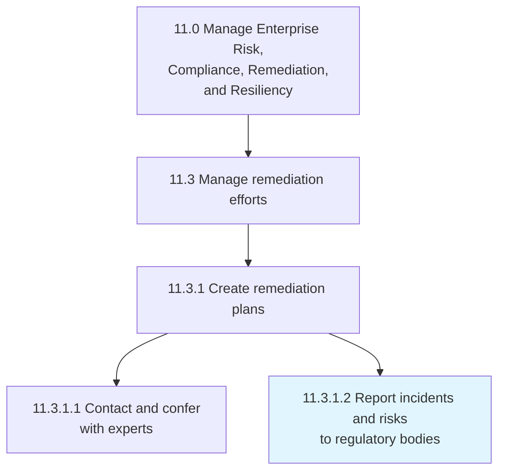
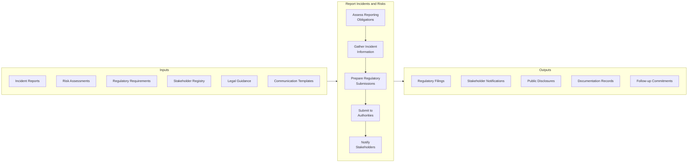
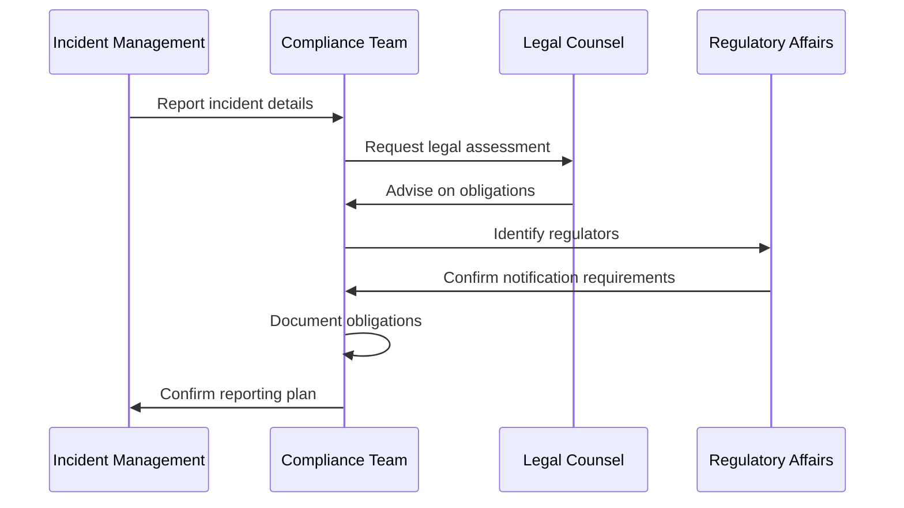
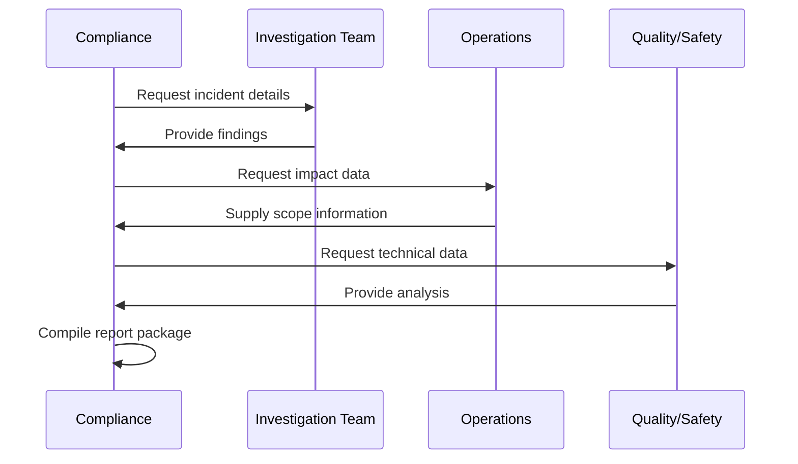
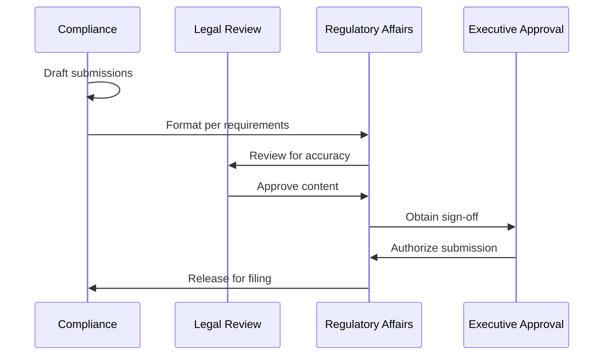
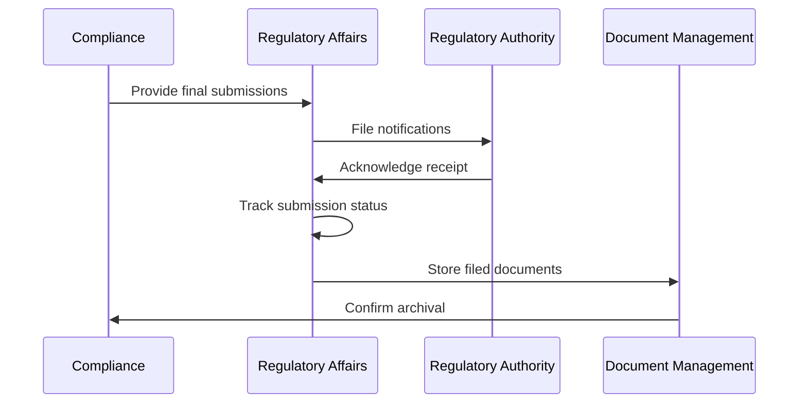
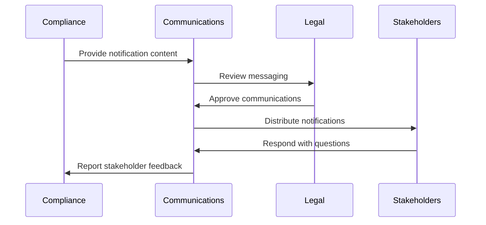
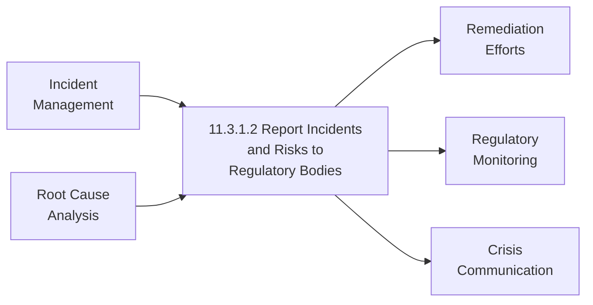

# Report incidents and risks to regulatory bodies

> Notifying all stakeholders, legal, and industry regulatory bodies of the incidents and risks related to a return or recall, if needed.

## Overview

Report incidents and risks to regulatory bodies (APQC 11.3.1.2) is a critical compliance activity that ensures organizations fulfill their legal obligations to notify regulators, stakeholders, and affected parties when significant incidents, risks, or product issues occur. This process encompasses the timely, accurate, and complete reporting of safety issues, data breaches, financial irregularities, environmental incidents, and product recalls to appropriate authorities.

Effective incident reporting protects public safety, maintains regulatory trust, limits organizational liability, and demonstrates corporate responsibility. The process requires well-defined escalation protocols, clear communication channels, and robust documentation to ensure compliance with often stringent regulatory timelines and content requirements.

## Process Hierarchy



## Key Statistics

| Metric | Value |
|--------|-------|
| APQC Code | 12840 |
| Hierarchy ID | 11.3.1.2 |
| Level | Activity |
| Category | [Manage Enterprise Risk, Compliance, Remediation, and Resiliency](/processes/11-Risk) |
| Parent Process | [Manage remediation efforts](./index.mdx) |

## Process Flow



## GraphDL Semantic Structure

```
report.IncidentsAndRisks.to.RegulatoryBodies
```

| Component | Value | Description |
|-----------|-------|-------------|
| Verb | `report` | Primary action of notifying and disclosing |
| Object | `IncidentsAndRisks` | Events requiring regulatory notification |
| Preposition | `to` | Direction of communication |
| PrepObject | `RegulatoryBodies` | Regulatory authorities and stakeholders |

## Activities

### Assess Reporting Obligations

Determining which regulatory bodies must be notified, what information must be provided, and within what timeframes based on the nature of the incident.



**Tasks:**
- `identify.ApplicableRegulations` - Determine which regulations require notification
- `assess.MaterialityThresholds` - Evaluate if incident meets reporting criteria
- `determine.NotificationTimelines` - Establish regulatory deadlines
- `identify.RecipientAuthorities` - List all required notification recipients

### Gather Incident Information

Collecting complete, accurate information about the incident including root cause, scope, impact, and remediation actions.



**Tasks:**
- `document.IncidentDetails` - Record what happened, when, and where
- `assess.ImpactScope` - Determine affected products, customers, or systems
- `analyze.RootCause` - Identify underlying causes
- `document.RemediationActions` - Record corrective measures taken/planned

### Prepare Regulatory Submissions

Creating formal notifications and reports in the format required by each regulatory authority.



**Tasks:**
- `prepare.RegulatoryForms` - Complete required notification forms
- `draft.NarrativeReports` - Write detailed incident descriptions
- `compile.SupportingDocumentation` - Gather evidence and attachments
- `obtain.Approvals` - Secure legal and executive authorization

### Submit to Authorities

Filing notifications with regulatory bodies through appropriate channels within required timeframes.



**Tasks:**
- `file.InitialNotifications` - Submit required initial reports
- `track.SubmissionStatus` - Monitor receipt and processing
- `respond.RegulatoryQueries` - Address regulator questions
- `file.FollowUpReports` - Submit required updates

### Notify Stakeholders

Communicating with affected parties including customers, partners, investors, employees, and the public as required.



**Tasks:**
- `notify.AffectedCustomers` - Inform impacted customers
- `inform.BusinessPartners` - Alert supply chain partners
- `disclose.Investors` - Make required investor disclosures
- `issue.PublicStatements` - Release public communications if needed

## RACI Matrix

| Activity | Responsible | Accountable | Consulted | Informed |
|----------|-------------|-------------|-----------|----------|
| Assess reporting obligations | Compliance Team | Chief Compliance Officer | Legal, Regulatory Affairs | Executive Team |
| Gather incident information | Investigation Team | CCO | Operations, Quality | Risk Management |
| Prepare regulatory submissions | Regulatory Affairs | CCO | Legal | Executive Team |
| Submit to authorities | Regulatory Affairs | CCO | Legal | Board |
| Notify stakeholders | Communications | CCO | Legal, Marketing | All Affected Parties |

## Related Departments

- [Compliance](/departments/Compliance) - Reporting coordination and oversight
- [Legal](/departments/Legal/index) - Legal review and regulatory guidance
- [Regulatory Affairs](/departments/RegulatoryAffairs) - Regulator relationship management
- [Communications](/departments/Communications) - Stakeholder notification
- [Quality/Safety](/departments/Quality) - Technical incident information

## Related Occupations

- [Compliance Officers](/occupations/Business/Operations/ComplianceOfficers) - Reporting oversight
- [Regulatory Affairs Specialists](/occupations/RegulatorySpecialists) - Regulatory submissions
- [Corporate Counsel](/occupations/Legal/Lawyers) - Legal guidance
- [Communications Managers](/occupations/PRManagers) - Stakeholder communications
- [Risk Managers](/occupations/RiskManagers) - Incident assessment

## Industry Variations

### Aerospace and Defense

Aerospace incident reporting includes mandatory notifications to FAA/EASA for safety incidents, NTSB for accidents, and defense agencies for security incidents. Service Difficulty Reports (SDRs) and Malfunction or Defect Reports (MDRs) have specific formats and timelines.

**Industry-Specific Activities:**
- File FAA Service Difficulty Reports
- Submit NTSB accident notifications
- Report defense security incidents
- Notify airworthiness authorities

### Automotive

Automotive incident reporting centers on vehicle safety defects and recalls, with mandatory notifications to NHTSA including Early Warning Reports, defect reports, and recall notifications within strict timelines.

**Industry-Specific Activities:**
- Submit NHTSA defect notifications
- File Early Warning Reports
- Report foreign safety campaigns
- Notify state motor vehicle agencies

### Banking

Financial institutions must report various incidents including suspicious activity (SARs), data breaches, material events (8-K filings), and operational incidents to regulators like OCC, FDIC, Fed, SEC, and FinCEN.

**Industry-Specific Activities:**
- File Suspicious Activity Reports
- Report data breaches to regulators
- Submit material event disclosures
- Notify prudential regulators

### Healthcare Provider

Healthcare incident reporting includes patient safety events, data breaches (HIPAA), medication errors, and sentinel events to agencies like CMS, state health departments, and accreditation bodies.

**Industry-Specific Activities:**
- Report HIPAA breaches
- Submit patient safety events
- Notify state health departments
- File sentinel event reports

### Life Sciences

Pharmaceutical and medical device companies report adverse events, product defects, and recalls to FDA through MedWatch, FAERS, and recall notification systems with strict timeline requirements.

**Industry-Specific Activities:**
- Submit FDA adverse event reports
- File MedWatch notifications
- Report product recalls
- Submit pharmacovigilance reports

### Property and Casualty Insurance

Insurance companies report significant claims events, market conduct issues, and financial events to state insurance departments and NAIC.

**Industry-Specific Activities:**
- Report catastrophic loss events
- File market conduct notifications
- Submit financial impairment reports
- Notify state insurance departments

### Utilities

Utility companies report grid reliability incidents to NERC, environmental incidents to EPA, and safety incidents to OSHA and state regulators.

**Industry-Specific Activities:**
- Report NERC reliability incidents
- File environmental spill reports
- Submit OSHA safety notifications
- Notify state utility commissions

## Sub-Processes

| Process | Code | Description |
|---------|------|-------------|
| Assess reporting obligations | - | Determine notification requirements |
| Gather incident information | - | Collect complete incident data |
| Prepare regulatory submissions | - | Create formal notifications |
| Submit to authorities | - | File with regulatory bodies |
| Notify stakeholders | - | Communicate with affected parties |

## Related Processes



## Metrics & KPIs

| Metric | Description | Target |
|--------|-------------|--------|
| Reporting Timeliness | Submissions within regulatory deadlines | 100% |
| Completeness Rate | Reports with all required information | >98% |
| Regulator Response Time | Time to respond to regulator queries | <24 hours |
| Stakeholder Notification | Affected parties notified within SLA | 100% |
| Documentation Quality | Reports meeting quality standards | >95% |
| Follow-up Compliance | Required follow-up reports submitted | 100% |

---

*Source: APQC PCF 12840 (11.3.1.2) - Cross-Industry*
