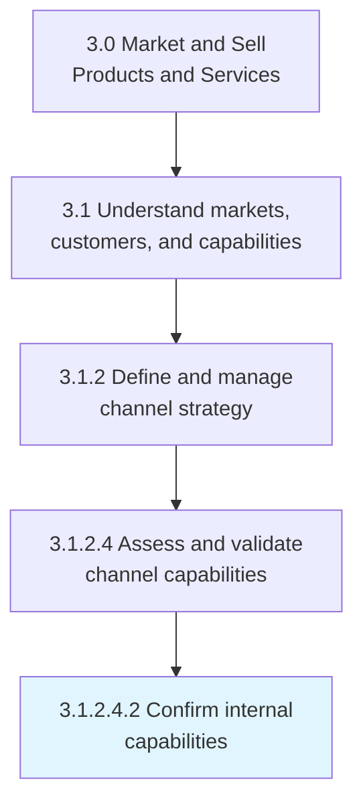
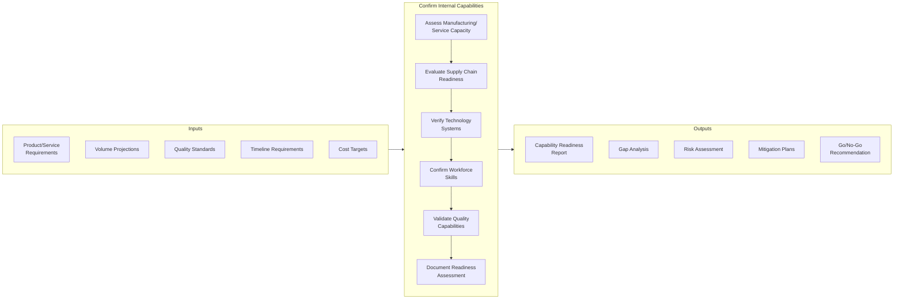
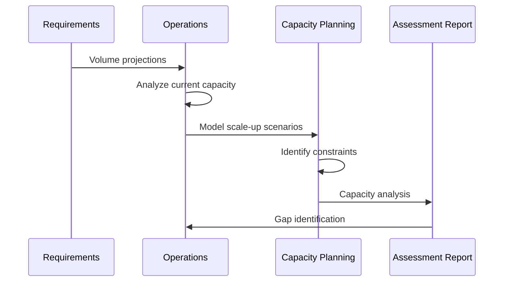
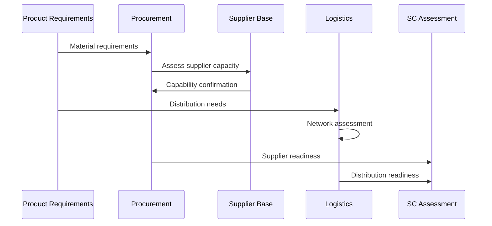
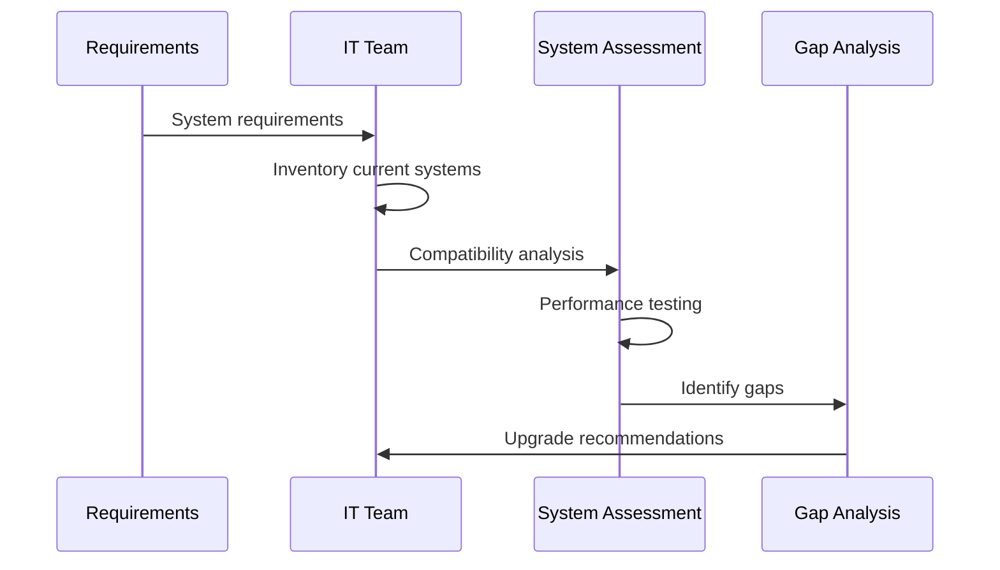
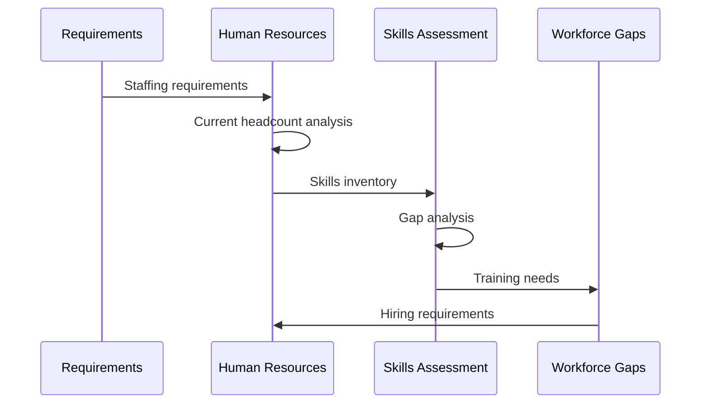
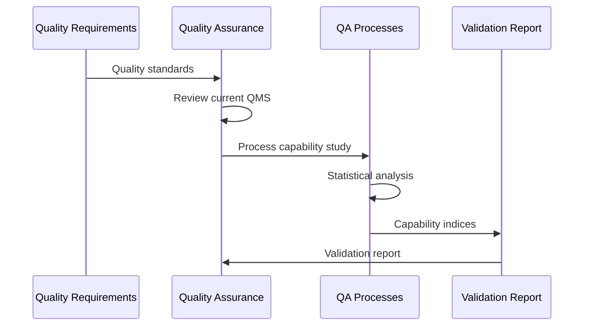
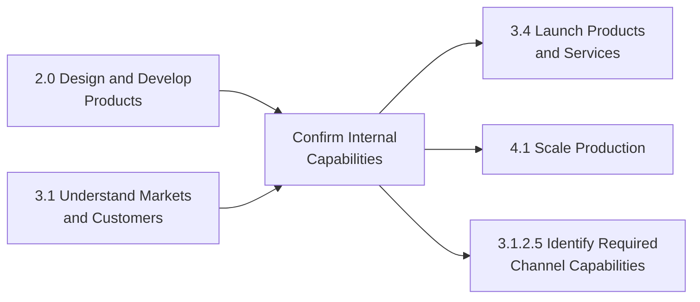

# Confirm Internal Capabilities

> Verifying that the company has sufficient infrastructure and resources to deliver their offerings in a timely and cost-effective manner, and that it is able to scale up from the small-scale market samples, used for consumer testing, to the entire identified market segment.

## Overview

Confirm Internal Capabilities is a critical process within product development (APQC 3.1.2) that validates an organization's readiness to deliver new products or services at scale. This process assesses whether the organization possesses the necessary infrastructure, resources, processes, and competencies to transition from development and testing phases to full commercial production and delivery.

The process addresses multiple capability dimensions including manufacturing capacity, supply chain readiness, workforce skills, technology systems, quality assurance capabilities, and customer support infrastructure. It serves as a critical gate in the product development lifecycle, ensuring that go-to-market decisions are based on validated operational readiness.

Effective internal capability confirmation prevents costly market launch failures by identifying gaps before commitment to full-scale production. It enables informed decisions about make-vs-buy strategies, partnership requirements, and infrastructure investments.

## Process Hierarchy



## Key Statistics

| Metric | Value |
|--------|-------|
| APQC Code | 10121 |
| Hierarchy ID | 3.1.2.4.2 |
| Level | Activity |
| Category | [Market and Sell Products and Services](/processes/03-Sales) |
| Parent Process | Assess and validate channel capabilities |

## Process Flow



## GraphDL Semantic Structure

```
confirm.InternalCapabilities
```

| Component | Value | Description |
|-----------|-------|-------------|
| Verb | `confirm` | Primary action of verifying and validating |
| Object | `InternalCapabilities` | Organizational infrastructure and resources |
| Preposition | - | Not applicable at this level |
| PrepObject | - | Not applicable at this level |

## Activities

### 3.1.2.4.2.1 - Assess Production/Service Delivery Capacity

Evaluating whether the organization can produce goods or deliver services at the required volume, quality, and cost levels.



**Tasks:**
- `analyze.CurrentCapacity` - Assess existing production/service delivery capacity
- `model.ScaleUpScenarios` - Project capacity under various demand scenarios
- `identify.CapacityConstraints` - Determine bottlenecks and limitations
- `calculate.CapacityGaps` - Quantify shortfall vs. requirements

### 3.1.2.4.2.2 - Evaluate Supply Chain Readiness

Assessing whether the supply chain can support product launch requirements for materials, components, and logistics.



**Tasks:**
- `assess.SupplierCapacity` - Evaluate supplier ability to meet demand
- `validate.MaterialAvailability` - Confirm component and material supply
- `evaluate.LogisticsCapability` - Assess distribution network readiness
- `identify.SupplyChainRisks` - Determine potential supply disruptions

### 3.1.2.4.2.3 - Verify Technology Systems Readiness

Confirming that IT systems, production technology, and digital infrastructure can support new product/service delivery.



**Tasks:**
- `inventory.CurrentSystems` - Document existing technology landscape
- `assess.SystemCompatibility` - Evaluate fit with new requirements
- `test.SystemPerformance` - Validate capacity and reliability
- `identify.TechnologyGaps` - Determine needed upgrades or additions

### 3.1.2.4.2.4 - Confirm Workforce Skills and Capacity

Validating that the organization has sufficient skilled workforce to support production and delivery requirements.



**Tasks:**
- `assess.WorkforceCapacity` - Evaluate current staffing levels
- `inventory.SkillsAndCompetencies` - Document workforce capabilities
- `identify.SkillsGaps` - Determine training or hiring needs
- `plan.WorkforceRampUp` - Develop staffing plan for launch

### 3.1.2.4.2.5 - Validate Quality Assurance Capabilities

Confirming that quality management systems and processes can ensure product/service quality at scale.



**Tasks:**
- `review.QualityManagementSystem` - Assess QMS adequacy
- `conduct.ProcessCapabilityStudy` - Analyze process performance
- `validate.TestingCapabilities` - Confirm inspection and testing readiness
- `assess.ComplianceReadiness` - Verify regulatory compliance capability

## RACI Matrix

| Activity | Responsible | Accountable | Consulted | Informed |
|----------|-------------|-------------|-----------|----------|
| Assess production capacity | Operations | COO | Manufacturing | Product team |
| Evaluate supply chain | Procurement | CPO | Suppliers | Operations |
| Verify technology systems | IT | CIO | Operations | Product team |
| Confirm workforce skills | HR | CHRO | Operations | Training |
| Validate quality capabilities | Quality | CQO | Operations | Regulatory |
| Document readiness assessment | Product Team | Product Owner | All functions | Executive team |

## Related Departments

- [Operations](/departments/Operations/index) - Primary capacity assessment
- [Supply Chain](/departments/SupplyChain/index) - Supplier and logistics evaluation
- [Information Technology](/departments/Technology) - Systems readiness assessment
- [Human Resources](/departments/HR/index) - Workforce capability validation
- [Quality Assurance](/departments/Quality) - Quality capability confirmation
- Product Development - Requirements definition

## Related Occupations

- [General and Operations Managers](/occupations/GeneralManagers) - Overall readiness assessment
- [Industrial Production Managers](/occupations/ProductionManagers) - Manufacturing capability
- [Logisticians](/occupations/Business/Logisticians) - Supply chain assessment
- [Computer and Information Systems Managers](/occupations/ITManagers) - Technology readiness
- [Quality Control Managers](/occupations/QualityManagers) - Quality capability validation
- [Human Resources Managers](/occupations/HRManagers) - Workforce planning

## Industry Variations

### Aerospace and Defense

Aerospace capability confirmation emphasizes AS9100 compliance, special process certifications, and security clearance requirements. Assessment includes long-lead-time component availability and government approval timelines.

**Industry-Specific Focus:**
- AS9100 quality system readiness
- Special process certifications (NADCAP)
- Security clearance capacity
- Long-lead material availability

### Automotive

Automotive capability confirmation focuses on IATF 16949 compliance, production part approval process (PPAP), and just-in-time delivery capabilities. Assessment includes tier supplier readiness.

**Industry-Specific Focus:**
- IATF 16949 compliance
- PPAP documentation readiness
- Launch containment capability
- JIT delivery capacity

### Consumer Products

Consumer products capability confirmation emphasizes seasonal production capacity, retail distribution readiness, and packaging capabilities. Assessment includes promotional volume surge capacity.

**Industry-Specific Focus:**
- Seasonal capacity flexibility
- Retail fulfillment readiness
- Packaging and labeling capability
- Promotional surge capacity

### Life Sciences

Life sciences capability confirmation focuses on FDA compliance, validated systems, and controlled environment manufacturing. Assessment includes regulatory submission readiness.

**Industry-Specific Focus:**
- GMP compliance validation
- Equipment qualification status
- Cleanroom capacity
- Regulatory submission readiness

## Sub-Processes

| Process | Code | Description |
|---------|------|-------------|
| Assess production capacity | 3.1.2.4.2.1 | Evaluate manufacturing/service delivery capacity |
| Evaluate supply chain | 3.1.2.4.2.2 | Assess supplier and logistics readiness |
| Verify technology systems | 3.1.2.4.2.3 | Confirm IT and production technology readiness |
| Confirm workforce skills | 3.1.2.4.2.4 | Validate staffing levels and competencies |
| Validate quality capabilities | 3.1.2.4.2.5 | Ensure quality assurance readiness |

## Related Processes



## Metrics & KPIs

| Metric | Description | Target |
|--------|-------------|--------|
| Capacity Utilization | Current vs. required capacity percentage | >80% available |
| Supply Chain Readiness | Supplier qualification completion rate | 100% |
| System Readiness | IT systems validated for launch | 100% |
| Workforce Readiness | Staff trained and available | 100% |
| Quality Capability Index | Process capability (Cpk) | >1.33 |
| Overall Readiness Score | Weighted assessment across all dimensions | >90% |

---

*Source: APQC PCF 10121 (3.1.2.4.2) - Cross-Industry*
