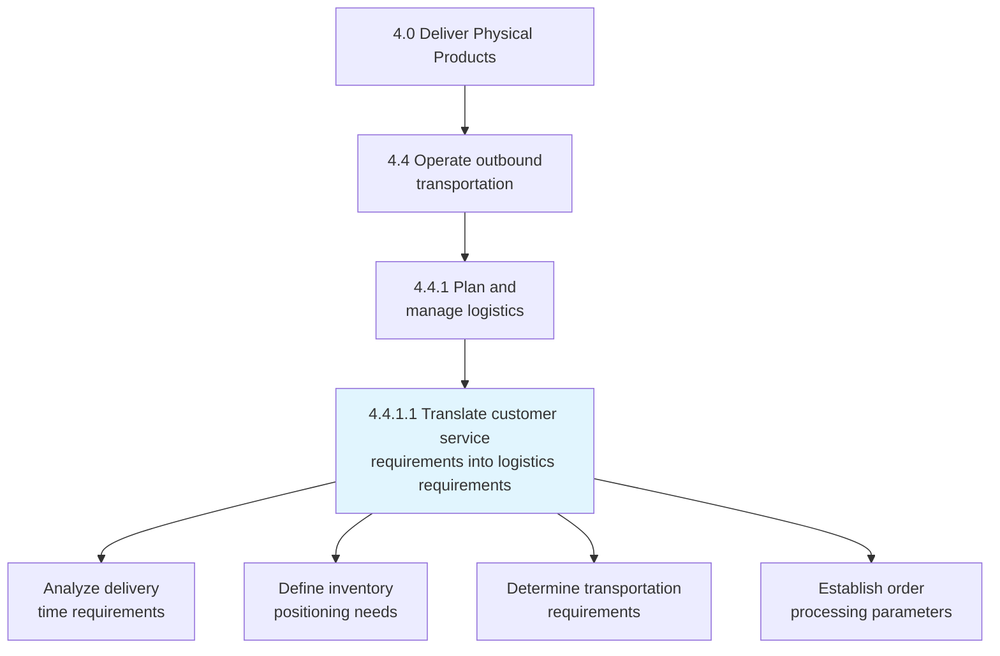
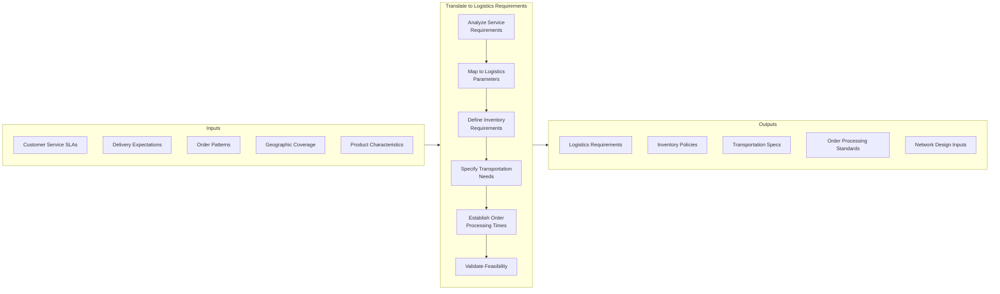
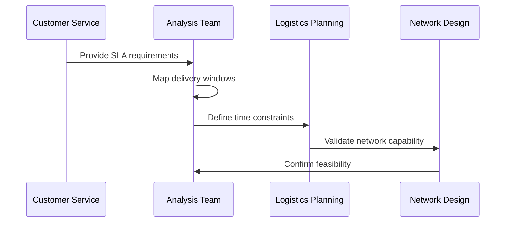
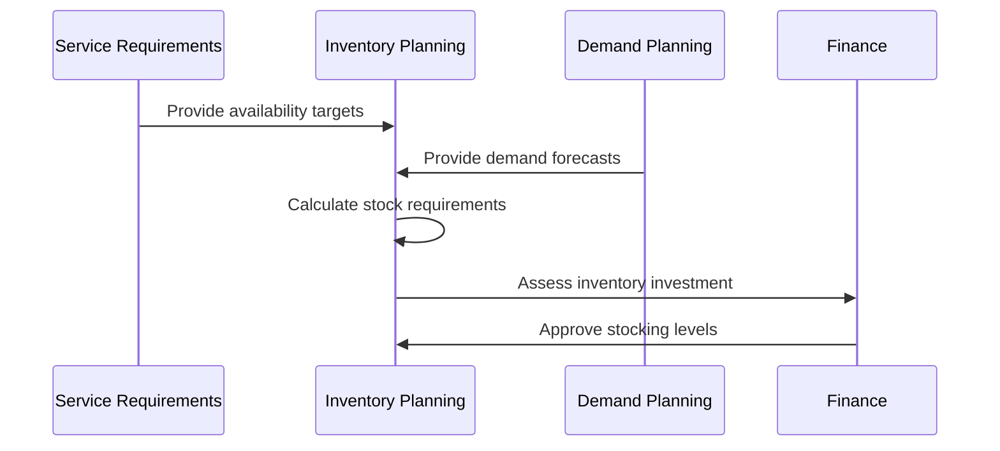
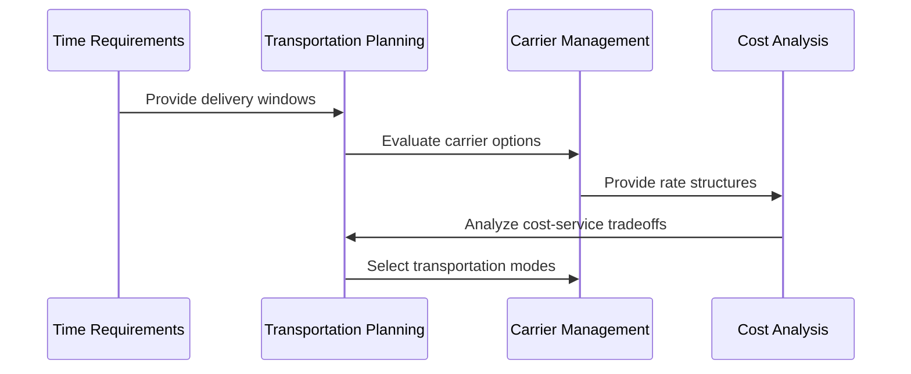
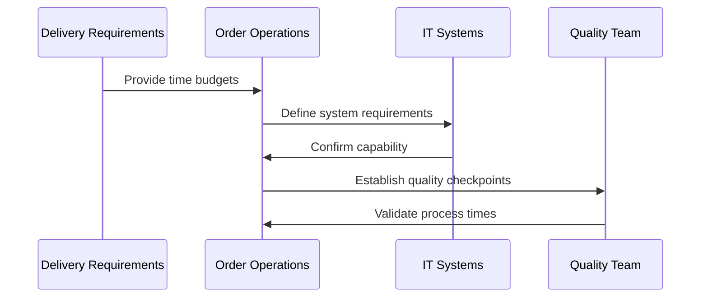
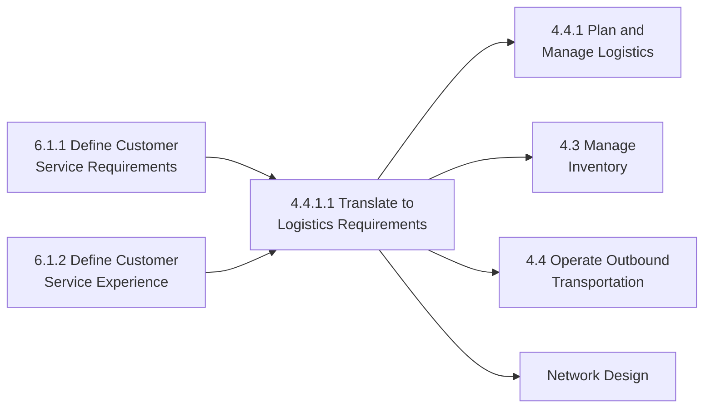

# Translate customer service requirements into logistics requirements

> Determining the requirements for managing the flow of things between the point of origin and the point of consumption by assessing the service requirements of the customers.

## Overview

Translate customer service requirements into logistics requirements is a critical bridge process (4.4.1.1) that connects customer service expectations with supply chain and logistics operations. This process ensures that the physical fulfillment capabilities align with the service promises made to customers, translating abstract service level agreements into concrete logistics specifications.

This process analyzes customer service requirements such as delivery speed, availability, and flexibility, then converts them into actionable logistics parameters including inventory levels, transportation modes, warehouse locations, and order processing times. The resulting logistics requirements enable the organization to consistently meet customer expectations while optimizing operational costs.

## Process Hierarchy



## Key Statistics

| Metric | Value |
|--------|-------|
| APQC Code | 10343 |
| Hierarchy ID | 4.4.1.1 |
| Level | Activity |
| Category | [Deliver Physical Products](/processes/04-Delivery) |
| Related Category | [Manage Customer Service](/processes/06-CustomerService) |

## Process Flow



## GraphDL Semantic Structure

```
translate.CustomerServiceRequirements.into.LogisticsRequirements
```

| Component | Value | Description |
|-----------|-------|-------------|
| Verb | `translate` | Converting from one form to another |
| Object | `CustomerServiceRequirements` | Service expectations and SLAs |
| Preposition | `into` | Transformation direction |
| PrepObject | `LogisticsRequirements` | Supply chain specifications |

## Activities

### Analyze delivery time requirements

Examining customer expectations for delivery speed and converting them into time-based logistics constraints.



**Tasks:**
- `analyze.DeliveryExpectations` - Understand customer timing needs
- `map.ServiceLevels` - Document SLA requirements
- `define.TimeConstraints` - Establish logistics deadlines
- `validate.NetworkCapability` - Confirm delivery feasibility

### Define inventory positioning needs

Determining inventory location and stock level requirements to support customer service commitments.



**Tasks:**
- `define.AvailabilityTargets` - Set stock availability goals
- `calculate.SafetyStock` - Determine buffer requirements
- `determine.StockingLocations` - Identify optimal positions
- `assess.InventoryInvestment` - Evaluate financial implications

### Determine transportation requirements

Specifying transportation modes, carriers, and service levels needed to meet delivery commitments.



**Tasks:**
- `evaluate.TransportationModes` - Assess delivery options
- `select.CarrierServices` - Choose appropriate carriers
- `define.ServiceLevels` - Specify transport SLAs
- `optimize.CostServiceBalance` - Balance speed and cost

### Establish order processing parameters

Setting order handling time requirements to support end-to-end delivery commitments.



**Tasks:**
- `define.OrderCycleTime` - Set processing time targets
- `allocate.ProcessingBudgets` - Distribute time across steps
- `establish.CutoffTimes` - Define order submission deadlines
- `create.ExceptionProcedures` - Handle rush and special orders

## RACI Matrix

| Activity | Responsible | Accountable | Consulted | Informed |
|----------|-------------|-------------|-----------|----------|
| Analyze delivery requirements | Logistics Analyst | Supply Chain Director | Customer Service | Operations |
| Define inventory positioning | Inventory Planner | Supply Chain Director | Finance, Sales | Warehousing |
| Determine transportation needs | Transportation Manager | Supply Chain Director | Procurement | Finance |
| Establish order processing | Operations Manager | Supply Chain Director | IT, Quality | Customer Service |
| Validate feasibility | Supply Chain Planning | Supply Chain Director | Finance | Leadership |
| Monitor performance | Logistics Analyst | Operations Manager | Customer Service | Leadership |

## Related Departments

- [Supply Chain](/departments/SupplyChain/index) - Primary process ownership
- Customer Service - Service requirement input
- [Logistics](/departments/SupplyChain) - Operational execution
- Warehousing - Inventory management
- Transportation - Carrier management
- [Finance](/departments/Finance/index) - Investment decisions

## Related Occupations

- [Logistics Managers](/occupations/LogisticsManagers) - Process leadership
- [Supply Chain Analysts](/occupations/SupplyChainAnalysts) - Requirements analysis
- [Transportation Planners](/occupations/Science/TransportationPlanners) - Mode selection
- [Inventory Managers](/occupations/InventoryManagers) - Stock positioning
- [Operations Research Analysts](/occupations/Technology/OperationsResearchAnalysts) - Optimization

## Industry Variations

### Aerospace and Defense

Aerospace logistics requirements address long lead times, specialized handling, and global distribution networks. Emphasis on reliability and regulatory compliance for defense contracts.

**Industry-Specific Activities:**
- Define AOG (Aircraft on Ground) service levels
- Establish hazardous materials handling requirements
- Create government contract logistics specifications
- Determine rotable and repairable item logistics

### Banking

Banking applies this process to cash/currency logistics, translating customer requirements for ATM availability and branch cash needs into armored transport and vault inventory specifications.

**Industry-Specific Activities:**
- Translate ATM availability into cash logistics
- Define vault inventory requirements
- Establish armored transport schedules
- Create currency denomination mix specifications

### Healthcare Provider

Healthcare translates patient service requirements into medical supply and equipment logistics, emphasizing availability, sterility, and regulatory compliance.

**Industry-Specific Activities:**
- Define medical supply availability requirements
- Establish cold chain specifications
- Create emergency supply positioning
- Determine equipment servicing logistics

### Consumer Electronics

Consumer electronics logistics emphasize speed, omnichannel fulfillment, and reverse logistics for returns and warranty service.

**Industry-Specific Activities:**
- Define same-day/next-day delivery requirements
- Establish e-commerce fulfillment specifications
- Create store replenishment logistics
- Determine returns processing requirements

### City Government

City government translates constituent service requirements into logistics for public services, equipment, and supplies.

**Industry-Specific Activities:**
- Define emergency response logistics
- Establish public works equipment positioning
- Create constituent service fulfillment specs
- Determine seasonal service logistics

### Retail

Retail logistics requirements span store replenishment and direct-to-consumer fulfillment, with emphasis on seasonal demand and omnichannel capabilities.

**Industry-Specific Activities:**
- Define store replenishment logistics
- Establish e-commerce fulfillment requirements
- Create seasonal inventory positioning
- Determine last-mile delivery specifications

### Petroleum Downstream

Petroleum downstream translates fuel demand patterns into refinery output, terminal inventory, and distribution logistics requirements.

**Industry-Specific Activities:**
- Define fuel terminal inventory requirements
- Establish bulk transport logistics
- Create station replenishment specifications
- Determine hazmat transportation requirements

### Education

Educational institutions translate student and stakeholder requirements into logistics for materials, equipment, and supplies.

**Industry-Specific Activities:**
- Define district material distribution requirements
- Establish food service logistics
- Create textbook and supply distribution specs
- Determine facilities maintenance logistics

## Sub-Processes

| Process | Code | Description |
|---------|------|-------------|
| Analyze delivery time requirements | 4.4.1.1.1 | Converting SLAs to time constraints |
| Define inventory positioning needs | 4.4.1.1.2 | Determining stock locations and levels |
| Determine transportation requirements | 4.4.1.1.3 | Specifying modes and carriers |
| Establish order processing parameters | 4.4.1.1.4 | Setting processing time targets |

## Related Processes



## Metrics & KPIs

| Metric | Description | Target |
|--------|-------------|--------|
| Requirements Translation Accuracy | Logistics specs meeting service needs | >95% |
| On-Time Delivery | Orders meeting committed delivery date | >98% |
| Inventory Availability | In-stock rate for promised items | >99% |
| Order Cycle Time | Total time from order to delivery | Meet SLA |
| Transportation Cost per Unit | Shipping cost efficiency | Industry benchmark |
| Perfect Order Rate | Orders delivered complete, on-time, undamaged | >95% |
| Logistics Cost to Serve | Total logistics cost vs service level | Optimized |
| Network Utilization | Efficient use of logistics network | >85% |

---

*Source: APQC PCF 10343 (4.4.1.1) - Cross-Industry*
