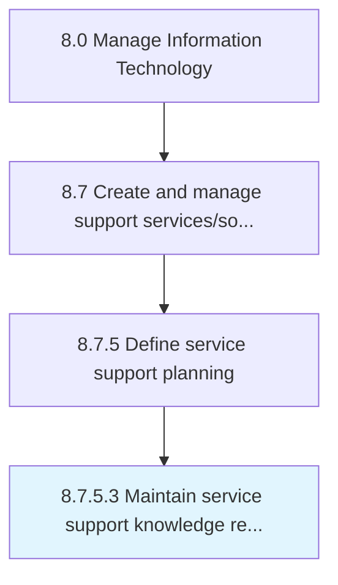

# Maintain service support knowledge repository

> Create and maintain service support knowledge repository.

## Overview

Activity 8.7.5.3 is an activity within the Manage Information Technology framework. 

Create and maintain service support knowledge repository. Store, maintain, access, revise, and use knowledge for IT services. Review knowledge trends and implement knowledge transfer methodologies for competitive advantage.

## Process Hierarchy



## Key Statistics

| Metric | Value |
|--------|-------|
| APQC Code | 20898 |
| Hierarchy ID | 8.7.5.3 |
| Level | Activity |
| Parent | [8.7.5](../) |
| Sub-Processes | 0 |


## GraphDL Semantic Structure

```
maintain.ServiceSupportKnowledgeRepository
```

| Component | Value | Description |
|-----------|-------|-------------|
| Verb | `maintain` | Primary action |
| Object | `service support knowledge repository` | Direct object |


## Related Concepts

- ServiceSupportKnowledgeRepository


---

*Source: APQC PCF 20898 (8.7.5.3) - APQC*

## Related Occupations

- [Computer and Information Systems Managers](/occupations/Management/ComputerAndInformationSystemsManagers)
- [Computer Support Specialists](/occupations/Technology/ComputerUserSupportSpecialists)
- [Technical Writers](/occupations/MediaCommunications/TechnicalWriters)
- [Database Administrators](/occupations/Technology/DatabaseAdministrators)
- [Computer Systems Analysts](/occupations/Technology/ComputerSystemsAnalysts)

## Related Departments

- [Information Technology](/departments/IT)
- [IT Service Management](/departments/ITServiceManagement)
- [Knowledge Management](/departments/KnowledgeManagement)
- [Technical Support](/departments/TechnicalSupport)
- [IT Operations](/departments/ITOperations)

## Industry Variations

This process applies universally across all industries, with the following common best practices:

### Universal Applicability

Service support knowledge management is essential for any organization providing IT services. A well-maintained knowledge base improves first-call resolution and reduces support costs.

### Cross-Industry Best Practices

| Practice | Description |
|----------|-------------|
| Knowledge-Centered Service | Integrate knowledge capture into the support workflow |
| Content Governance | Establish ownership and review cycles for knowledge articles |
| Search Optimization | Ensure articles are easily discoverable with good metadata |
| Usage Analytics | Track article effectiveness and identify content gaps |
| Self-Service Enablement | Publish relevant knowledge for end-user self-help |

### Common Metrics

- Knowledge article utilization rate
- First-call resolution with knowledge
- Knowledge article creation rate
- Article accuracy and currency
- Self-service deflection rate
- Time to publish new knowledge
