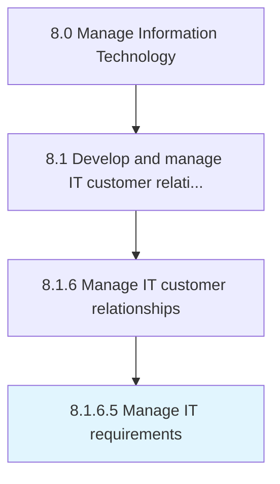

# Manage IT requirements

> Managing the IT requirements for business objectives.

## Overview

Activity 8.1.6.5 is an activity within the Manage Information Technology framework. 

Managing the IT requirements for business objectives. Identify the requirements of hardware and software equipment to store, retrieve, transmit, and manipulate data related to business operations. Consider factors such as functional, design, growth phases, and delivery schedule while managing IT requirements.

## Process Hierarchy



## Key Statistics

| Metric | Value |
|--------|-------|
| APQC Code | 20646 |
| Hierarchy ID | 8.1.6.5 |
| Level | Activity |
| Parent | [8.1.6](../) |
| Sub-Processes | 0 |


## GraphDL Semantic Structure

```
manage.ITRequirements
```

| Component | Value | Description |
|-----------|-------|-------------|
| Verb | `manage` | Primary action |
| Object | `IT requirements` | Direct object |


## Related Concepts

- ITRequirements


---

*Source: APQC PCF 20646 (8.1.6.5) - APQC*

## Related Occupations

- [Computer and Information Systems Managers](/occupations/Management/ComputerAndInformationSystemsManagers)
- [Computer Systems Analysts](/occupations/Technology/ComputerSystemsAnalysts)
- [Software Developers](/occupations/Technology/SoftwareDevelopers)
- [Project Management Specialists](/occupations/Business/ProjectManagementSpecialists)
- [Management Analysts](/occupations/Business/ManagementAnalysts)

## Related Departments

- [Information Technology](/departments/IT)
- [Enterprise Architecture](/departments/EnterpriseArchitecture)
- [Project Management Office](/departments/PMO)
- [Business Analysis](/departments/BusinessAnalysis)

## Industry Variations

This process applies universally across all industries, with the following common best practices:

### Universal Applicability

IT requirements management is critical for every organization relying on technology to support business operations. Effective requirements management ensures technology investments align with business needs and deliver expected value.

### Cross-Industry Best Practices

| Practice | Description |
|----------|-------------|
| Business Alignment | Link all IT requirements to specific business objectives |
| Stakeholder Engagement | Involve business users throughout requirements gathering |
| Prioritization Framework | Use consistent criteria to prioritize competing requirements |
| Traceability | Maintain clear links from requirements to solutions and outcomes |
| Change Management | Establish formal processes for requirement changes |

### Common Metrics

- Requirements completion rate
- Time from requirement to delivery
- Requirement defect rate (misunderstood or incomplete)
- Stakeholder satisfaction with delivered solutions
- Requirements backlog age and volume
