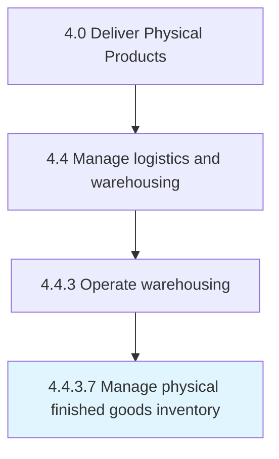

# Manage physical finished goods inventory

> Administering the movement of the finished products that are processed by the organization through its warehouses.

## Overview

Activity 4.4.3.7 is an activity within the Deliver Physical Products framework. 

Administering the movement of the finished products that are processed by the organization through its warehouses. Track goods through the use of systems such as barcodes in order to monitor the volumes available, quantity of out-flowing goods, remaining shelf life of the product, etc.--ultimately, to best manage the warehouse capacity.

## Process Hierarchy



## Key Statistics

| Metric | Value |
|--------|-------|
| APQC Code | 10359 |
| Hierarchy ID | 4.4.3.7 |
| Level | Activity |
| Parent | [4.4.3](../) |
| Sub-Processes | 0 |


## GraphDL Semantic Structure

```
manage.PhysicalFinishedGoodsInventory
```

| Component | Value | Description |
|-----------|-------|-------------|
| Verb | `manage` | Primary action |
| Object | `physical finished goods inventory` | Direct object |


## Related Concepts

- PhysicalFinishedGoodsInventory


---

*Source: APQC PCF 10359 (4.4.3.7) - APQC*

## Related Occupations

- [Transportation, Storage, and Distribution Managers](/occupations/Management/TransportationStorageAndDistributionManagers)
- [Supply Chain Managers](/occupations/Management/SupplyChainManagers)
- [Logisticians](/occupations/Business/Logisticians)
- [Industrial Production Managers](/occupations/Management/IndustrialProductionManagers)
- [Purchasing Managers](/occupations/Management/PurchasingManagers)

## Related Departments

- [Inventory Management](/departments/InventoryManagement)
- [Warehouse Operations](/departments/WarehouseOperations)
- [Supply Chain](/departments/SupplyChain)
- [Operations](/departments/Operations)
- [Finance](/departments/Finance)

## Industry Variations

This process applies universally across all industries, with the following common best practices:

### Universal Applicability

Finished goods inventory management is critical for any organization producing or distributing physical products. Effective inventory management balances service levels against carrying costs.

### Cross-Industry Best Practices

| Practice | Description |
|----------|-------------|
| Demand-Driven Planning | Align inventory levels with actual demand signals |
| ABC Classification | Prioritize management attention based on value and velocity |
| Cycle Counting | Maintain accuracy through regular partial counts |
| Safety Stock Optimization | Calculate buffer stock based on demand variability |
| Obsolescence Management | Identify and address slow-moving inventory proactively |

### Common Metrics

- Inventory turns
- Days of supply
- Inventory accuracy rate
- Fill rate / service level
- Obsolescence and write-off percentage
- Carrying cost as percentage of inventory value
