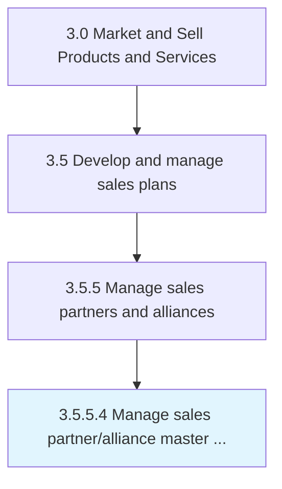

# Manage sales partner/alliance master data

> Managing the repository of data relating to the organization's partners/alliances over time.

## Overview

Activity 3.5.5.4 is an activity within the Market and Sell Products and Services framework. 

Managing the repository of data relating to the organization's partners/alliances over time. Store, maintain, access, revise, and use all data on partners/alliances. Manage data. Ensure its security. Determine legitimate use cases that are beneficial to the organization.

## Process Hierarchy



## Key Statistics

| Metric | Value |
|--------|-------|
| APQC Code | 14209 |
| Hierarchy ID | 3.5.5.4 |
| Level | Activity |
| Parent | [3.5.5](../) |
| Sub-Processes | 0 |


## GraphDL Semantic Structure

```
manage.SalesPartnerallianceMasterData
```

| Component | Value | Description |
|-----------|-------|-------------|
| Verb | `manage` | Primary action |
| Object | `sales partner/alliance master data` | Direct object |


## Related Concepts

- SalesPartnerMasterData
- SalesAllianceMasterData


---

*Source: APQC PCF 14209 (3.5.5.4) - APQC*

## Related Occupations

- [General and Operations Managers](/occupations/Management/GeneralAndOperationsManagers)
- [Management Analysts](/occupations/Business/ManagementAnalysts)
- [Chief Executives](/occupations/Management/ChiefExecutives)

## Related Departments

- [Executive](/departments/Executive)
- [Operations](/departments/Operations)
- [Finance](/departments/Finance)
