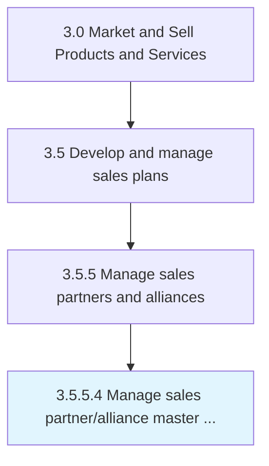

# Manage sales partner/alliance master data

> Managing the repository of data relating to the organization's partners/alliances over time.

## Overview

Activity 3.5.5.4 is an activity within the Market and Sell Products and Services framework. 

Managing the repository of data relating to the organization's partners/alliances over time. Store, maintain, access, revise, and use all data on partners/alliances. Manage data. Ensure its security. Determine legitimate use cases that are beneficial to the organization.

## Process Hierarchy



## Key Statistics

| Metric | Value |
|--------|-------|
| APQC Code | 14209 |
| Hierarchy ID | 3.5.5.4 |
| Level | Activity |
| Parent | [3.5.5](../) |
| Sub-Processes | 0 |


## GraphDL Semantic Structure

```
manage.SalesPartnerallianceMasterData
```

| Component | Value | Description |
|-----------|-------|-------------|
| Verb | `manage` | Primary action |
| Object | `sales partner/alliance master data` | Direct object |


## Related Concepts

- SalesPartnerMasterData
- SalesAllianceMasterData


---

*Source: APQC PCF 14209 (3.5.5.4) - APQC*

## Related Occupations

- [Sales Managers](/occupations/Management/SalesManagers)
- [Marketing Managers](/occupations/Management/MarketingManagers)
- [Business Development Managers](/occupations/Business/ManagementAnalysts)
- [Database Administrators](/occupations/Technology/DatabaseAdministrators)
- [Data Quality Analysts](/occupations/Business/ManagementAnalysts)

## Related Departments

- [Sales Operations](/departments/SalesOperations)
- [Channel Management](/departments/ChannelManagement)
- [Partner Management](/departments/PartnerManagement)
- [Master Data Management](/departments/MasterDataManagement)
- [Information Technology](/departments/IT)

## Industry Variations

This process applies universally across all industries, with the following common best practices:

### Universal Applicability

Sales partner and alliance master data management is essential for organizations selling through indirect channels or maintaining strategic partnerships. Accurate partner data enables effective channel management and performance tracking.

### Cross-Industry Best Practices

| Practice | Description |
|----------|-------------|
| Single Source of Truth | Maintain one authoritative partner database |
| Data Governance | Define clear ownership and quality standards for partner data |
| Lifecycle Management | Track partner status from onboarding through offboarding |
| Integration | Connect partner data with CRM, ERP, and commission systems |
| Regular Validation | Verify partner information accuracy periodically |

### Common Metrics

- Partner data accuracy rate
- Partner record completeness
- Time to onboard new partners in systems
- Duplicate partner record rate
- Data update timeliness
