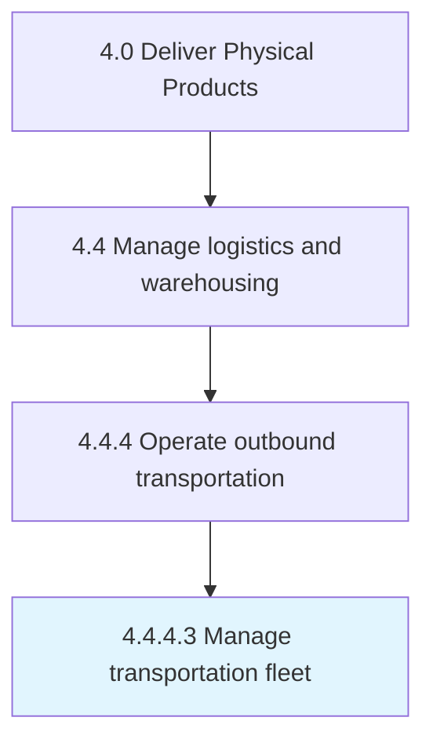

# Manage transportation fleet

> Taking care of a range of functions related to the means of transport used for delivering the end products.

## Overview

Activity 4.4.4.3 is an activity within the Deliver Physical Products framework. 

Taking care of a range of functions related to the means of transport used for delivering the end products. Manage vehicle financing, vehicle maintenance, vehicle telematics (tracking and diagnostics), driver management, speed management, fuel management, and health and safety management.

## Process Hierarchy



## Key Statistics

| Metric | Value |
|--------|-------|
| APQC Code | 10362 |
| Hierarchy ID | 4.4.4.3 |
| Level | Activity |
| Parent | [4.4.4](../) |
| Sub-Processes | 0 |


## GraphDL Semantic Structure

```
manage.TransportationFleet
```

| Component | Value | Description |
|-----------|-------|-------------|
| Verb | `manage` | Primary action |
| Object | `transportation fleet` | Direct object |


## Related Concepts

- TransportationFleet


---

*Source: APQC PCF 10362 (4.4.4.3) - APQC*

## Related Occupations

- [Transportation, Storage, and Distribution Managers](/occupations/Management/TransportationStorageAndDistributionManagers)
- [Logisticians](/occupations/Business/Logisticians)
- [Logistics Analysts](/occupations/Business/LogisticsAnalysts)
- [Fleet Managers](/occupations/Management/GeneralAndOperationsManagers)
- [Industrial Production Managers](/occupations/Management/IndustrialProductionManagers)

## Related Departments

- [Logistics](/departments/Logistics)
- [Fleet Management](/departments/FleetManagement)
- [Transportation](/departments/Transportation)
- [Operations](/departments/Operations)
- [Supply Chain](/departments/SupplyChain)

## Industry Variations

This process applies universally across all industries, with the following common best practices:

### Universal Applicability

Fleet management is essential for any organization operating vehicles for delivery, service, or operations. Effective fleet management optimizes costs, ensures safety, and maintains service levels.

### Cross-Industry Best Practices

| Practice | Description |
|----------|-------------|
| Preventive Maintenance | Schedule maintenance based on mileage and time to prevent breakdowns |
| Telematics Integration | Use GPS and diagnostics for real-time fleet visibility |
| Driver Management | Monitor driver behavior and provide safety training |
| Fuel Optimization | Track fuel consumption and implement efficiency measures |
| Right-Sizing | Match vehicle types and quantities to actual operational needs |

### Common Metrics

- Total cost of ownership per vehicle
- Fleet utilization rate
- Fuel efficiency (MPG or equivalent)
- Maintenance cost per mile
- Vehicle downtime percentage
- Safety incident rate
