# Set up and maintain service delivery governance and management system

> Providing a system for which to manage customer needs and a structure for which to facilitate service delivery to fulfill those needs.

## Overview

Set up and maintain service delivery governance and management system (APQC 5.1.1.1) is the activity-level process responsible for creating and operating the technological and procedural infrastructure that enables effective service delivery governance. This system serves as the backbone for managing customer interactions, tracking service delivery progress, measuring performance, and supporting decision-making throughout the service delivery lifecycle.

The management system integrates multiple functional capabilities: customer relationship management (tracking customer needs, preferences, and interactions), service delivery tracking (monitoring work progress, resource allocation, and milestone completion), performance measurement (collecting and analyzing KPIs), workflow management (routing work and approvals), and reporting (providing visibility to stakeholders at all levels).

A well-designed management system enables operational efficiency, data-driven decision-making, consistent service quality, and scalability. It provides the single source of truth for service delivery activities and supports both day-to-day operations and strategic planning.

## Process Hierarchy

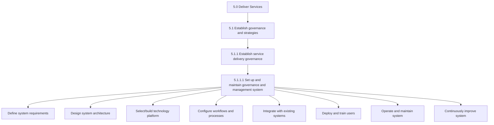

## Key Statistics

| Metric | Value |
|--------|-------|
| APQC Code | 20028 |
| Hierarchy ID | 5.1.1.1 |
| Level | Activity |
| Category | [Deliver Services](/processes/05-Services) |
| Parent Process | [Establish service delivery governance](/processes/05-Services/Governance.mdx) |
| Tasks | 8+ |

## Process Flow

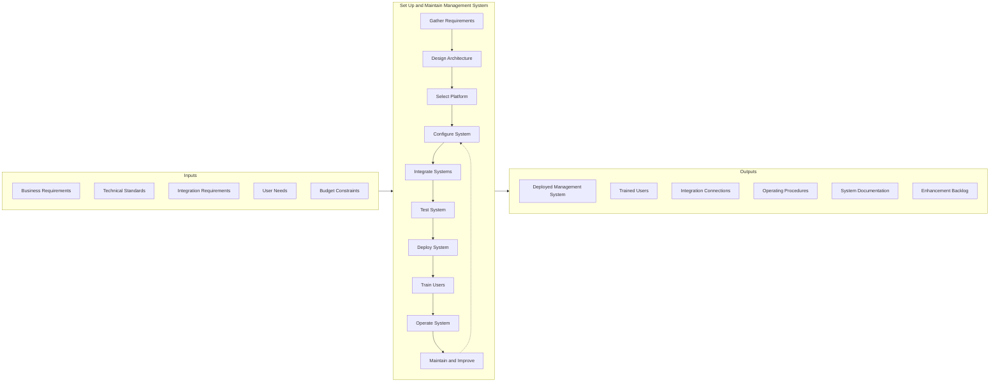

## GraphDL Semantic Structure

```
setUp.ServiceDeliveryGovernanceAndManagementSystem
```

| Component | Value | Description |
|-----------|-------|-------------|
| Verb | `setUp` | Primary action of establishing and configuring |
| Object | `ServiceDeliveryGovernanceAndManagementSystem` | Integrated technology and process platform |
| Preposition | - | Not applicable |
| PrepObject | - | Not applicable |

**Related Semantic Structures:**
- `maintain.ServiceDeliveryGovernanceAndManagementSystem` - Keep system operational
- `define.SystemRequirements` - Document system needs
- `configure.ManagementWorkflows` - Set up processes
- `integrate.WithExistingSystems` - Connect to other platforms
- `train.SystemUsers` - Enable user adoption

## Activities

### Define system requirements

Documenting the functional and technical requirements for the management system based on business needs, user requirements, and technical constraints.

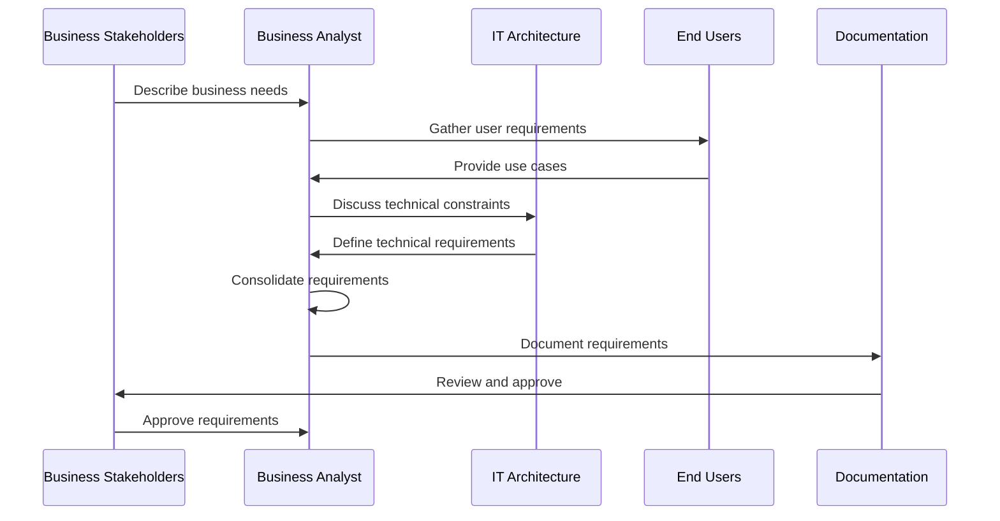

**Tasks:**
- `gather.BusinessRequirements` - Collect functional needs from stakeholders
- `gather.UserRequirements` - Document end-user needs and workflows
- `define.TechnicalRequirements` - Establish technical specifications
- `document.SystemRequirements` - Create requirements specification
- `validate.Requirements` - Confirm requirements with stakeholders

### Design system architecture

Creating the technical architecture and design for the management system, including data models, integration patterns, and user experience.

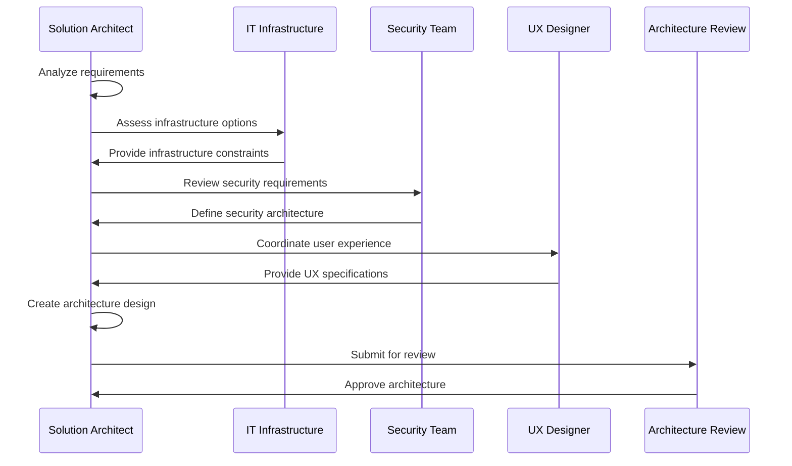

**Tasks:**
- `design.DataModel` - Create data structures and relationships
- `design.IntegrationArchitecture` - Define integration patterns
- `design.SecurityArchitecture` - Establish security controls
- `design.UserExperience` - Create user interface designs
- `document.Architecture` - Create architecture documentation
- `review.ArchitectureDesign` - Validate with architecture board

### Select or build technology platform

Evaluating and selecting vendor solutions or designing custom development approach based on requirements and architecture.

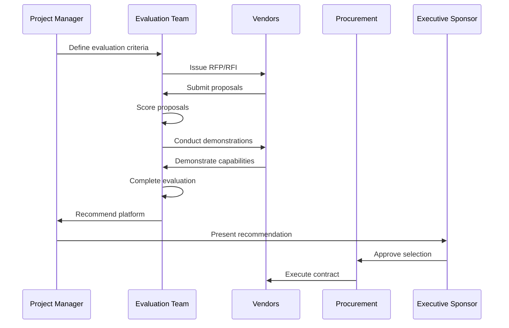

**Tasks:**
- `define.EvaluationCriteria` - Establish selection criteria
- `issue.RFP` - Request vendor proposals
- `evaluate.Proposals` - Score vendor submissions
- `conduct.Demonstrations` - Assess platform capabilities
- `negotiate.Contract` - Finalize vendor agreement
- `approve.PlatformSelection` - Obtain executive approval

### Configure workflows and processes

Setting up the management system workflows, processes, and business rules to support service delivery governance.

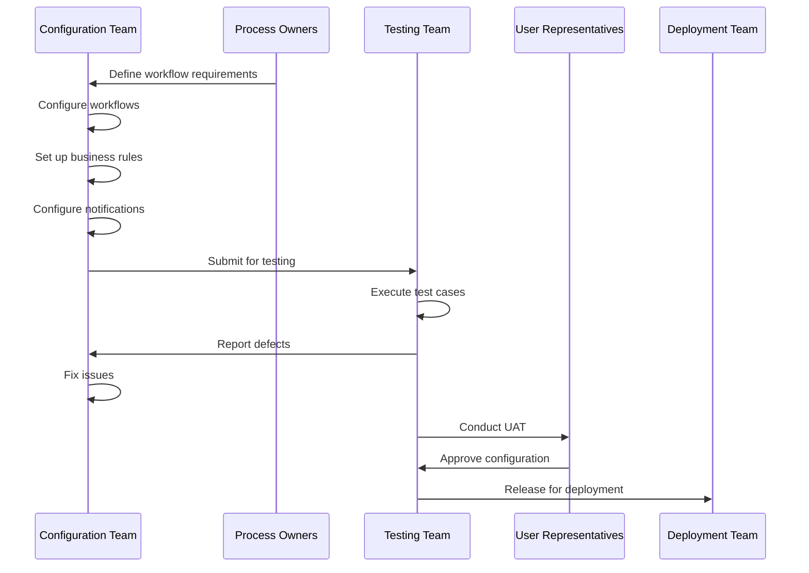

**Tasks:**
- `configure.Workflows` - Set up process flows
- `configure.BusinessRules` - Define automation rules
- `configure.Notifications` - Set up alerts and communications
- `configure.Dashboards` - Create reporting views
- `configure.SecurityRoles` - Define access permissions
- `test.Configuration` - Validate system setup

### Integrate with existing systems

Connecting the management system with other enterprise systems to enable data flow and process integration.

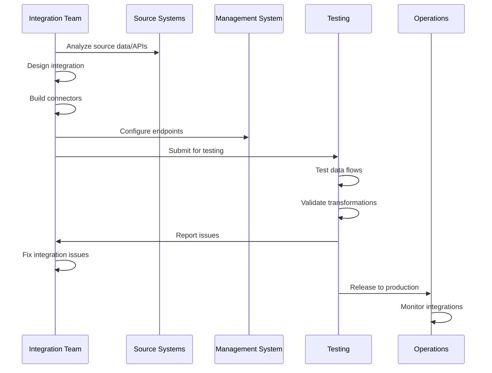

**Tasks:**
- `analyze.IntegrationRequirements` - Assess integration needs
- `design.IntegrationPatterns` - Create integration architecture
- `build.Connectors` - Develop integration components
- `configure.Endpoints` - Set up system connections
- `test.Integrations` - Validate data flows
- `deploy.Integrations` - Release to production

### Deploy and train users

Rolling out the management system to the organization and enabling users to effectively use the system.

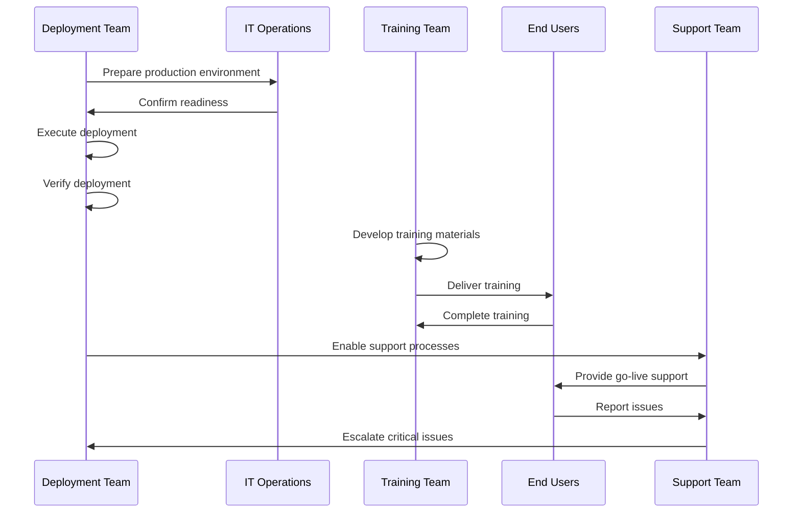

**Tasks:**
- `prepare.Environment` - Set up production infrastructure
- `execute.Deployment` - Deploy system to production
- `verify.Deployment` - Confirm successful deployment
- `develop.TrainingMaterials` - Create user documentation
- `deliver.Training` - Train end users
- `provide.GoLiveSupport` - Support initial operations

### Operate and maintain system

Running the management system on an ongoing basis, including monitoring, incident management, and routine maintenance.

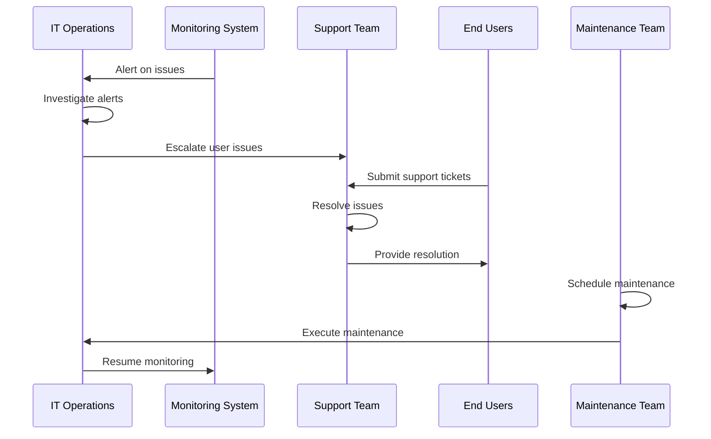

**Tasks:**
- `monitor.SystemHealth` - Track system performance
- `manage.Incidents` - Handle system issues
- `perform.Maintenance` - Execute routine maintenance
- `manage.Capacity` - Ensure adequate resources
- `maintain.Security` - Apply security updates
- `support.Users` - Provide user assistance

### Continuously improve system

Enhancing the management system based on user feedback, performance data, and evolving business needs.

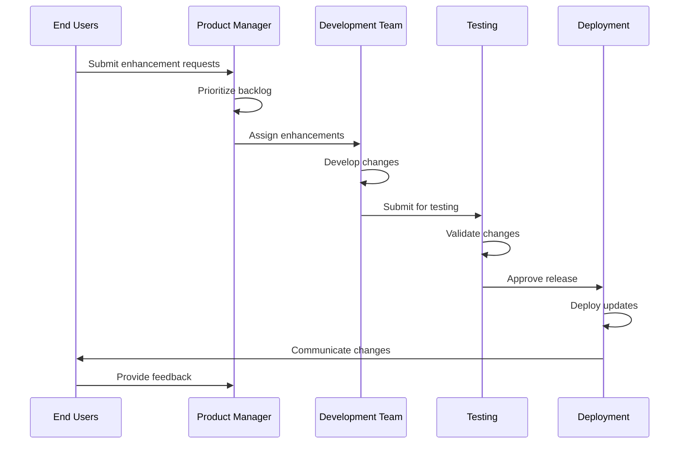

**Tasks:**
- `collect.EnhancementRequests` - Gather improvement ideas
- `prioritize.Backlog` - Rank enhancement priorities
- `develop.Enhancements` - Build system improvements
- `test.Changes` - Validate enhancements
- `deploy.Updates` - Release improvements
- `communicate.Changes` - Inform users of updates

## RACI Matrix

| Activity | Responsible | Accountable | Consulted | Informed |
|----------|-------------|-------------|-----------|----------|
| Define system requirements | Business Analyst | Project Manager | Business stakeholders, Users | IT, Vendors |
| Design system architecture | Solution Architect | CIO | IT Infrastructure, Security | Project team |
| Select technology platform | Evaluation Team | Executive Sponsor | IT, Procurement | All stakeholders |
| Configure workflows | Configuration Team | Project Manager | Process owners | Users |
| Integrate with existing systems | Integration Team | IT Manager | Source system owners | Operations |
| Deploy system | Deployment Team | Project Manager | IT Operations | All users |
| Train users | Training Team | Project Manager | HR | All users |
| Operate system | IT Operations | IT Manager | Support team | Users |
| Maintain system | Maintenance Team | IT Manager | Development | Users |
| Improve system | Product Manager | Service Director | Users, Development | All stakeholders |

## Related Departments

- [Information Technology](/departments/Technology) - System development and operations
- [Operations](/departments/Operations/index) - Process requirements and usage
- [Project Management Office](/departments/Operations) - Project oversight
- Training - User enablement
- Customer Success - Customer-facing requirements
- [Finance](/departments/Finance/index) - Budget and vendor management
- [Security](/departments/Security) - Security architecture and compliance

## Related Occupations

- [Computer Systems Analysts](/occupations/SystemsAnalysts) - Requirements and design
- [Software Developers](/occupations/Technology/SoftwareDevelopers) - System development
- [Database Administrators](/occupations/Technology/DatabaseAdministrators) - Data management
- [Network Administrators](/occupations/NetworkAdministrators) - Infrastructure support
- [Information Security Analysts](/occupations/SecurityAnalysts) - Security implementation
- [Computer User Support Specialists](/occupations/SupportSpecialists) - User support
- [Training and Development Specialists](/occupations/TrainingSpecialists) - User training
- [Project Management Specialists](/occupations/ProjectManagers) - Implementation oversight

## Industry Variations

### Healthcare Provider

Healthcare management systems must integrate with Electronic Health Records (EHR), practice management systems, and patient portals. Systems must comply with HIPAA requirements and support clinical workflow requirements.

**Industry-Specific Activities:**
- Integrate with EHR systems (Epic, Cerner)
- Comply with HIPAA security requirements
- Support clinical decision support
- Enable patient portal connectivity
- Integrate with billing and claims systems
- Support care coordination workflows

### Banking

Banking management systems must integrate with core banking platforms, regulatory reporting systems, and customer relationship management. Systems must support regulatory compliance and audit requirements.

**Industry-Specific Activities:**
- Integrate with core banking systems
- Support regulatory reporting (FFIEC, SEC)
- Enable BSA/AML monitoring integration
- Comply with data privacy regulations
- Support audit trail requirements
- Enable omnichannel integration

### Aerospace and Defense

Defense management systems must operate in classified environments and integrate with government contract management systems. Systems must support security clearance workflows and ITAR compliance tracking.

**Industry-Specific Activities:**
- Deploy in classified environments
- Integrate with government systems (DCMA, DCAA)
- Support security clearance management
- Enable ITAR compliance tracking
- Integrate with program management tools
- Support earned value management (EVM)

### Professional Services

Professional services management systems must integrate with time tracking, project management, and financial systems. Systems must support engagement management, resource scheduling, and knowledge management.

**Industry-Specific Activities:**
- Integrate with time and billing systems
- Support resource scheduling and utilization
- Enable engagement risk management
- Integrate with knowledge management
- Support methodology libraries
- Enable client collaboration portals

### Airline

Airline management systems must integrate with reservation systems, operations control, and crew management. Systems must support real-time operational decision-making and regulatory compliance.

**Industry-Specific Activities:**
- Integrate with reservation systems (Sabre, Amadeus)
- Connect with operations control centers
- Support crew management integration
- Enable flight operations tracking
- Integrate with maintenance systems
- Support irregular operations management

### Retail

Retail management systems must integrate with point-of-sale, inventory management, and e-commerce platforms. Systems must support omnichannel customer experience and real-time inventory visibility.

**Industry-Specific Activities:**
- Integrate with POS systems
- Enable inventory visibility across channels
- Support order management integration
- Connect with e-commerce platforms
- Enable customer data platform integration
- Support store operations systems

## Technology Components

| Component | Purpose | Examples |
|-----------|---------|----------|
| CRM Platform | Customer relationship management | Salesforce, Microsoft Dynamics, HubSpot |
| Workflow Engine | Process automation | ServiceNow, Pega, Camunda |
| Business Intelligence | Reporting and analytics | Tableau, Power BI, Looker |
| Integration Platform | System connectivity | MuleSoft, Dell Boomi, Workato |
| Document Management | Content and documents | SharePoint, Box, Confluence |
| Communication Tools | Notifications and alerts | Slack, Teams, Email systems |
| Master Data Management | Data governance | Informatica, Talend |

## Related Processes

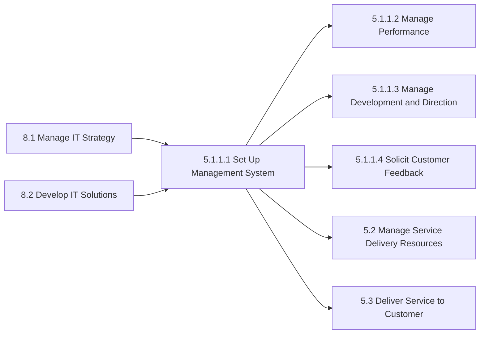

## Metrics & KPIs

| Metric | Description | Target |
|--------|-------------|--------|
| System Availability | Uptime percentage | >99.5% |
| System Response Time | Average page load time | <2 seconds |
| User Adoption Rate | Active users vs licensed users | >90% |
| Data Accuracy | Clean data percentage | >98% |
| Integration Success Rate | Successful data transfers | >99% |
| User Satisfaction Score | User survey results | >4.0/5.0 |
| Time to Resolution | Average support ticket resolution | <4 hours |
| Enhancement Delivery | Planned features delivered | >85% |
| Security Compliance | Security audit findings | 0 critical |
| Training Completion | Users trained percentage | >95% |

---

*Source: APQC PCF 20028 (5.1.1.1) - Cross-Industry*
