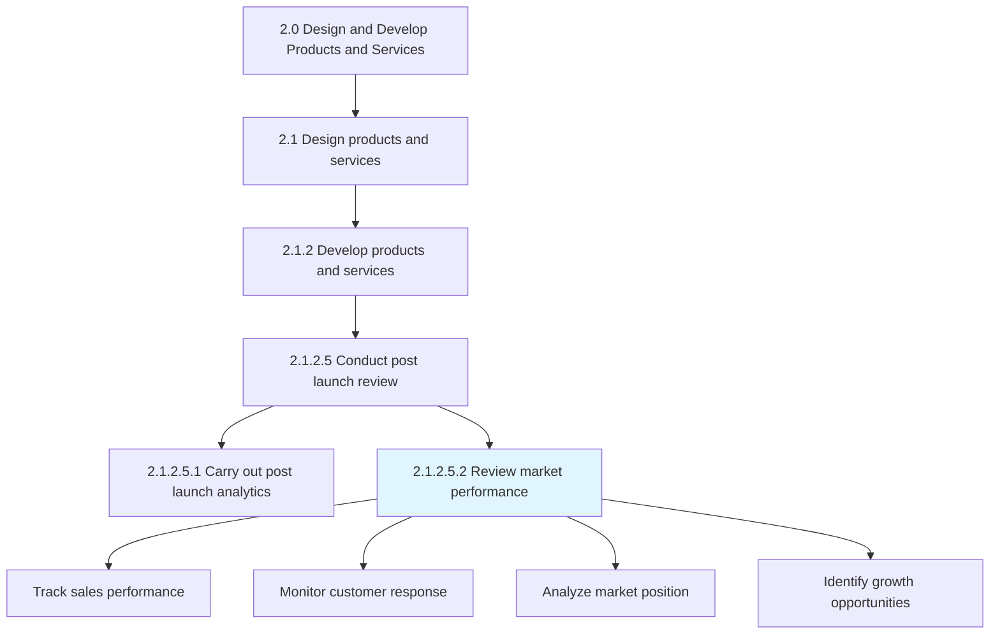
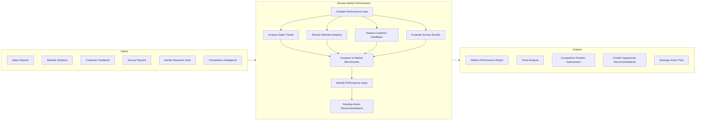
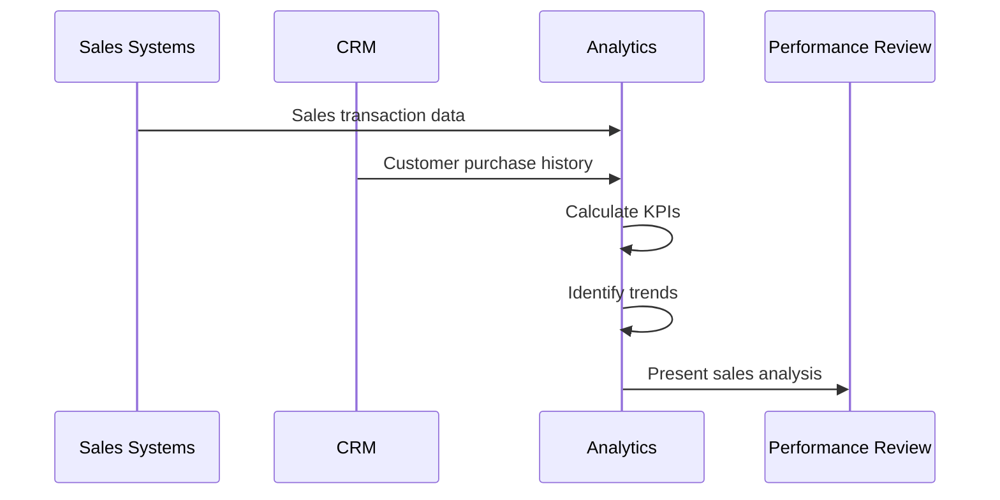
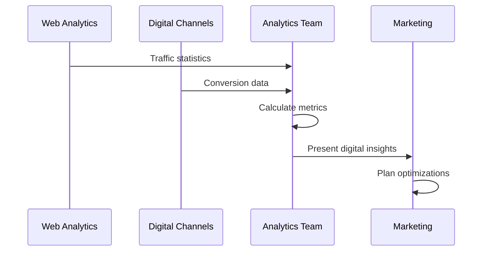
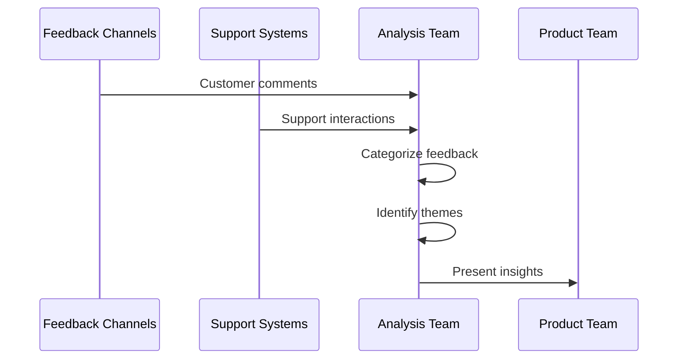
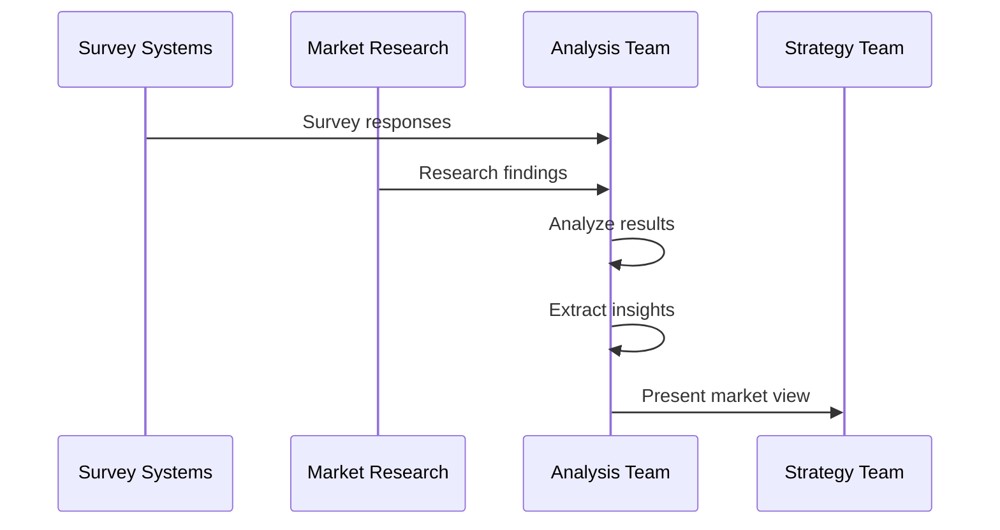
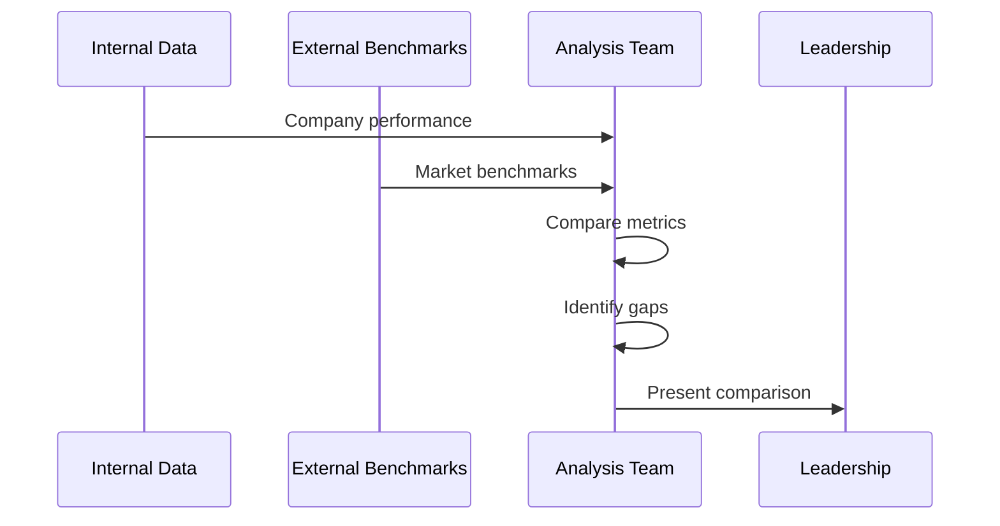
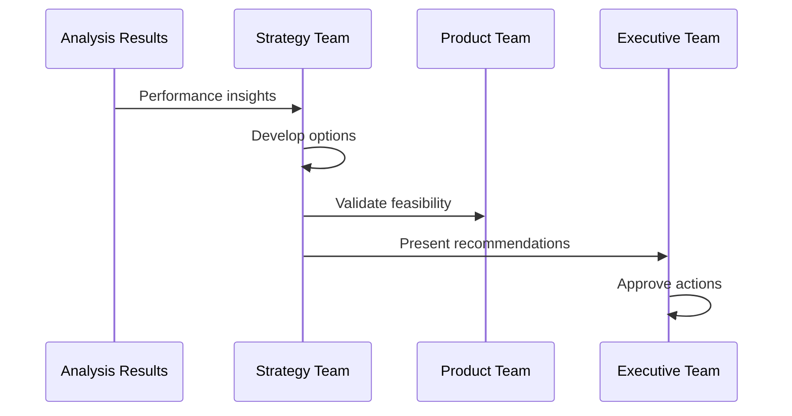
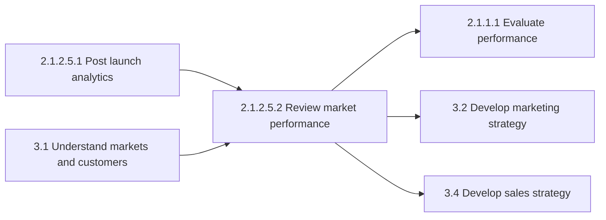

# Review market performance

> Conducting customer and market analysis to review progress and identify opportunities for increasing market position. Track and review product/service response through sales reports, website statistics, direct response from customers, and survey reports.

## Overview

Review market performance is a Sub-Activity within the Conduct Post Launch Review process (2.1.2.5). This process provides ongoing assessment of how products and services perform in the marketplace, enabling organizations to track progress against objectives and identify opportunities for growth.

Unlike post-launch analytics which focuses on initial market acceptance, market performance review is an ongoing process that monitors long-term market position, competitive dynamics, and customer response patterns. It informs strategic decisions about product optimization, market expansion, and resource allocation.

## Process Hierarchy



## Key Statistics

| Metric | Value |
|--------|-------|
| APQC Code | 11424 |
| Hierarchy ID | 2.1.2.5.2 |
| Level | Sub-Activity |
| Parent Process | [Conduct post launch review](/processes/02-Products/PostLaunchReview) |
| Sibling Process | [Carry out post launch analytics](./PostLaunchAnalytics.mdx) |
| Category | [Design and Develop Products and Services](/processes/02-Products) |

## Process Flow



## GraphDL Semantic Structure

```
review.MarketPerformance
```

| Component | Value | Description |
|-----------|-------|-------------|
| Verb | `review` | Primary action of assessment and evaluation |
| Object | `MarketPerformance` | The market performance being reviewed |
| Preposition | (none) | Direct verb-object relationship |
| PrepObject | (none) | No indirect object in this statement |

## Activities

### Compile and Analyze Sales Performance Data

Gathering sales data from multiple sources and analyzing performance trends.



**Tasks:**
- `compile.SalesData` - Aggregate sales from all channels
- `analyze.SalesTrends` - Identify patterns and trajectories
- `compare.ToForecast` - Measure actual vs projected
- `segment.Performance` - Break down by product/region/channel

### Review Website and Digital Performance

Analyzing digital channel performance including website traffic, conversion, and engagement.



**Tasks:**
- `analyze.WebsiteTraffic` - Review visitor patterns
- `measure.Conversion` - Track conversion rates
- `assess.Engagement` - Evaluate user engagement
- `identify.DropOffPoints` - Find conversion barriers

### Assess Customer Feedback and Response

Evaluating direct customer feedback and response patterns.



**Tasks:**
- `collect.CustomerFeedback` - Gather feedback from all channels
- `categorize.Feedback` - Organize by theme and sentiment
- `identify.Patterns` - Find recurring issues/requests
- `prioritize.Actions` - Rank improvement opportunities

### Evaluate Survey Results and Market Research

Analyzing formal research and survey data for market insights.



**Tasks:**
- `analyze.SurveyResults` - Process survey response data
- `interpret.MarketResearch` - Extract actionable insights
- `compare.ToBenchmarks` - Measure against industry norms
- `synthesize.Findings` - Create comprehensive market view

### Compare Performance to Market Benchmarks

Evaluating performance relative to market and competitive benchmarks.



**Tasks:**
- `gather.Benchmarks` - Collect industry benchmarks
- `compare.Performance` - Measure against benchmarks
- `identify.Gaps` - Find performance shortfalls
- `assess.CompetitivePosition` - Evaluate market standing

### Develop Action Recommendations

Creating strategic recommendations based on performance analysis.



**Tasks:**
- `develop.Recommendations` - Create strategic options
- `prioritize.Actions` - Rank by impact and feasibility
- `create.ActionPlan` - Develop implementation plan
- `define.Metrics` - Set success measures

## RACI Matrix

| Activity | Responsible | Accountable | Consulted | Informed |
|----------|-------------|-------------|-----------|----------|
| Compile sales data | Sales Operations | VP Sales | Finance | Product |
| Analyze sales trends | Sales Analytics | VP Sales | Marketing | Executive team |
| Review digital performance | Digital Marketing | CMO | Product | Sales |
| Assess customer feedback | Customer Experience | VP Product | Support | Marketing |
| Evaluate survey results | Market Research | CMO | Product, Sales | Strategy |
| Compare to benchmarks | Strategy Team | Chief Strategy Officer | Finance | Executive team |
| Develop recommendations | Strategy Team | Chief Strategy Officer | Product, Marketing | Executive team |
| Approve action plan | Executive Team | CEO | Strategy | All stakeholders |

## Related Departments

- [Sales](/departments/Sales/index) - Sales performance data and channel insights
- [Marketing](/departments/Marketing/index) - Market research and digital analytics
- [Product Management](/departments/Product) - Product performance and roadmap impact
- Customer Experience - Customer feedback and satisfaction
- [Strategy](/departments/Strategy/index) - Strategic recommendations and planning

## Related Occupations

- [Market Research Analysts](/occupations/MarketResearchAnalysts) - Market performance analysis
- [Sales Managers](/occupations/Management/SalesManagers) - Sales performance tracking
- [Marketing Managers](/occupations/Management/MarketingManagers) - Marketing effectiveness assessment
- [Business Intelligence Analysts](/occupations/Technology/BusinessIntelligenceAnalysts) - Performance analytics
- [Product Managers](/occupations/ProductManagers) - Product performance review

## Industry Variations

### Aerospace and Defense

Market performance review focuses on contract performance, backlog health, and customer (government) satisfaction. Includes analysis by program and defense segment.

**Industry-Specific Activities:**
- Review contract performance by program
- Analyze backlog and pipeline health
- Assess government customer satisfaction
- Monitor defense budget impact

### Banking

Performance review emphasizes product profitability, customer segment economics, and regulatory compliance metrics. Includes geographic and channel analysis.

**Industry-Specific Activities:**
- Analyze product profitability by segment
- Review geographic performance
- Assess regulatory compliance metrics
- Monitor digital adoption rates

### Consumer Products

Heavy focus on retail sell-through, brand health metrics, and promotional effectiveness. Includes category and shelf performance analysis.

**Industry-Specific Activities:**
- Monitor retail sell-through rates
- Track brand health metrics
- Analyze promotional effectiveness
- Review category performance

### Healthcare Provider

Performance review focuses on service line economics, patient volumes, and quality metrics within value-based care models.

**Industry-Specific Activities:**
- Analyze service line performance
- Review patient volume trends
- Assess quality and outcome metrics
- Monitor payer mix changes

### Retail

Emphasis on same-store sales, omnichannel metrics, and customer loyalty program effectiveness. Includes location-level analysis.

**Industry-Specific Activities:**
- Track same-store sales growth
- Analyze omnichannel conversion
- Review loyalty program performance
- Assess inventory performance

### Airline

Market performance review focuses on load factors, revenue per available seat mile, and route profitability.

**Industry-Specific Activities:**
- Monitor load factors by route
- Analyze RASM trends
- Assess route profitability
- Review ancillary revenue performance

### City Government

Performance review for municipal services focuses on citizen satisfaction, service utilization, and cost effectiveness.

**Industry-Specific Activities:**
- Track citizen satisfaction scores
- Monitor service utilization rates
- Assess cost per service unit
- Review program effectiveness

## Sub-Processes

| Process | Code | Description |
|---------|------|-------------|
| Review market performance by country | 11424 | Geographic market analysis |
| Analyze sales channel performance | - | Channel-specific performance review |
| Assess customer segment performance | - | Segment-level market review |
| Monitor competitive position | - | Competitive market standing |

## Related Processes



## Metrics & KPIs

| Metric | Description | Target |
|--------|-------------|--------|
| Market Share | Percentage of total addressable market | Growth YoY |
| Revenue Growth | Year-over-year revenue change | >10% |
| Customer Satisfaction | CSAT or NPS score | >80% CSAT |
| Sales Velocity | Rate of sales transactions | Increasing trend |
| Conversion Rate | Visitors to customers ratio | >3% |
| Customer Retention | Percentage of customers retained | >85% |
| Competitive Win Rate | Percentage of competitive deals won | >40% |
| Time to Revenue | Time from lead to closed sale | Decreasing trend |

---

*Source: APQC PCF 11424 (2.1.2.5.2) - Cross-Industry*
