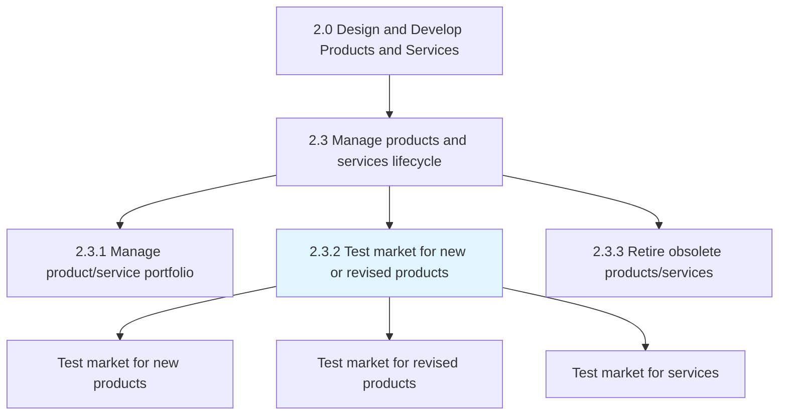
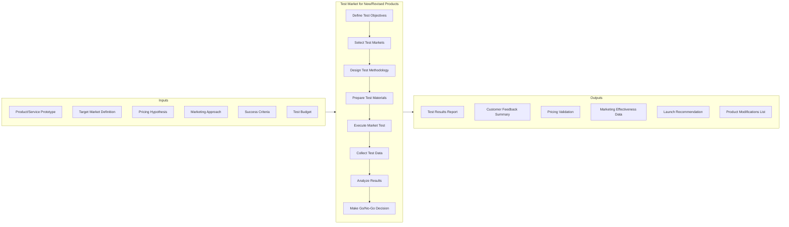
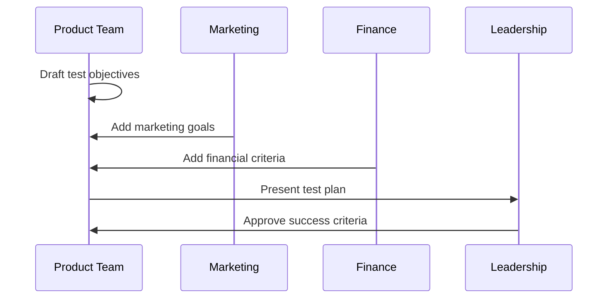
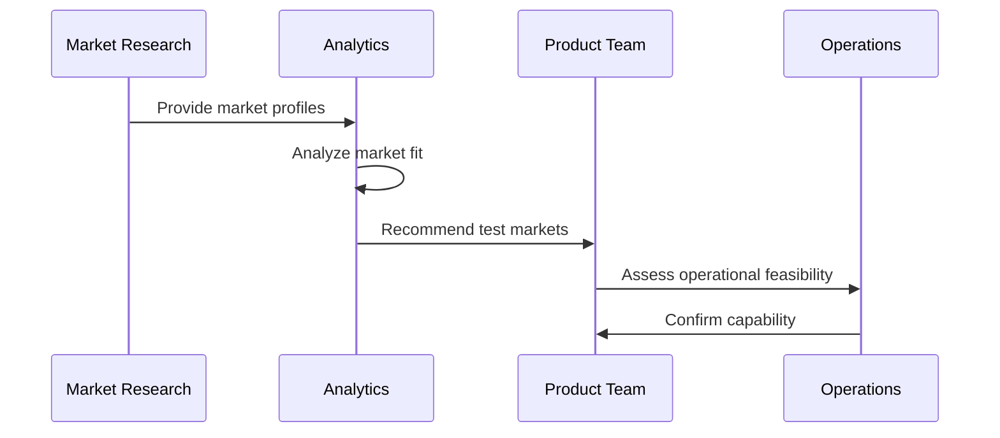
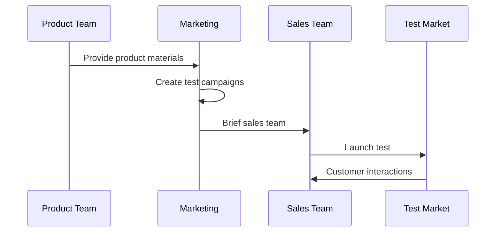
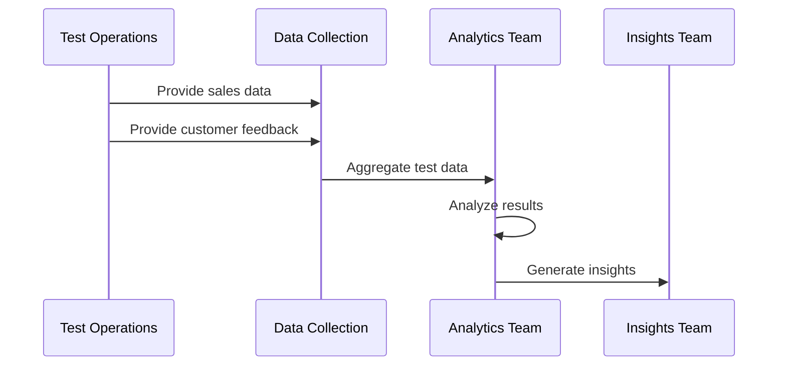
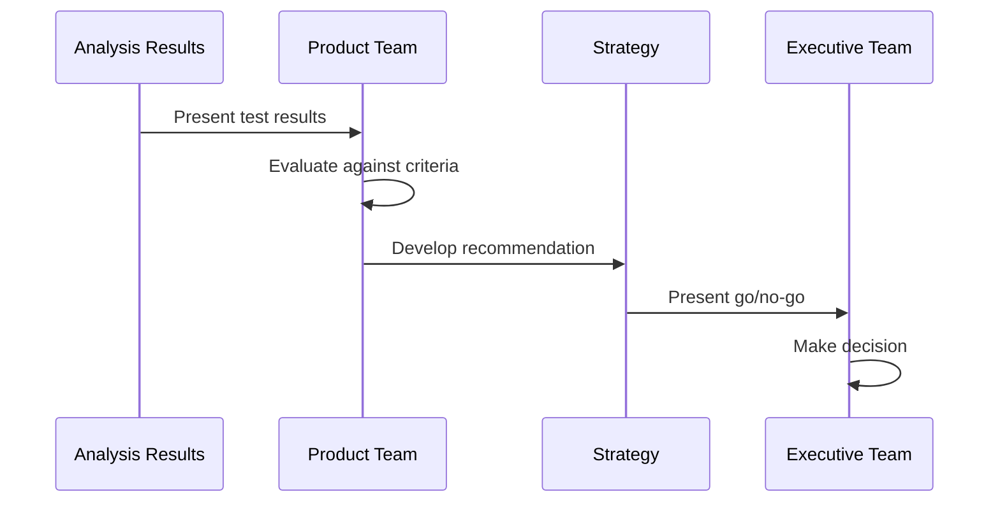
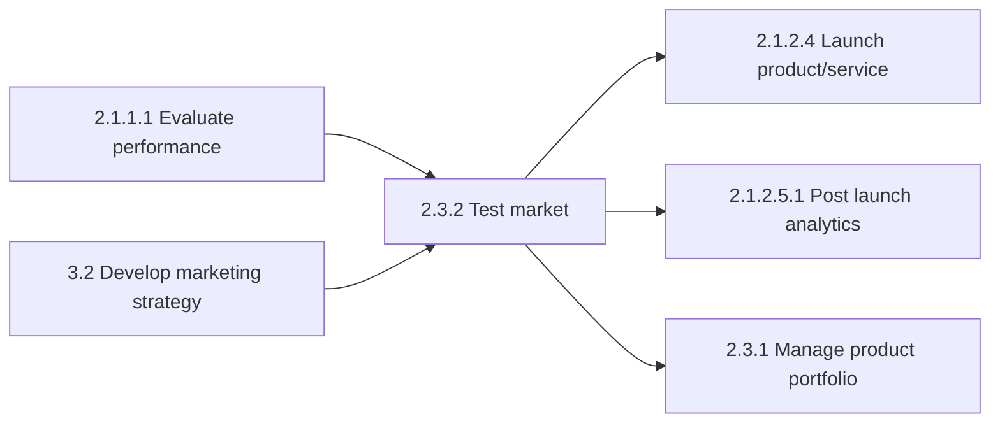

# Test market for new or revised products and services

> Expanding on the marketplace analysis that took place earlier in the product development lifecycle by testing the market against offerings. The results from this in-depth analysis will help the organization determine whether to proceed, modify, or abandon a product/service concept before full-scale launch.

## Overview

Test market for new or revised products and services is a Process within the Manage Products and Services Lifecycle process group (2.3). This process validates product-market fit through controlled testing before committing to full market launch.

Market testing bridges the gap between product development and commercialization by providing real-world validation of customer acceptance, pricing assumptions, and marketing approaches. It reduces launch risk by enabling data-driven go/no-go decisions.

## Process Hierarchy



## Key Statistics

| Metric | Value |
|--------|-------|
| APQC Code | 19996 |
| Hierarchy ID | 2.3.2 |
| Level | Process |
| Parent Group | [Manage products and services lifecycle](/processes/02-Products/ManageProductLifecycle) |
| Category | [Design and Develop Products and Services](/processes/02-Products) |

## Process Flow



## GraphDL Semantic Structure

```
test.Market.for.New
test.Market.for.RevisedProducts
test.Market.for.Services
```

| Component | Value | Description |
|-----------|-------|-------------|
| Verb | `test` | Primary action of validating through testing |
| Object | `Market` | The market being tested |
| Preposition | `for` | Indicating the purpose/subject of testing |
| PrepObject | `New` / `RevisedProducts` / `Services` | The offerings being tested |

## Activities

### Define Test Objectives and Success Criteria

Establishing clear objectives and measurable criteria for market test success.



**Tasks:**
- `define.TestObjectives` - Establish what the test will measure
- `set.SuccessCriteria` - Define metrics for go/no-go decision
- `determine.SampleSize` - Calculate required test scale
- `establish.Timeline` - Set test duration and milestones

### Select Test Markets and Methodology

Choosing appropriate markets and designing the test approach.



**Tasks:**
- `identify.TestMarkets` - Select representative test locations
- `design.TestMethodology` - Choose A/B, pilot, or phased approach
- `plan.ControlGroups` - Establish baseline comparison
- `assess.Feasibility` - Evaluate operational requirements

### Prepare and Execute Market Test

Developing test materials and conducting the market test.



**Tasks:**
- `prepare.TestMaterials` - Create marketing and sales materials
- `train.TestTeam` - Brief sales and support staff
- `launch.Test` - Execute market test
- `monitor.Execution` - Track test implementation

### Collect and Analyze Test Data

Gathering data from the market test and analyzing results.



**Tasks:**
- `collect.SalesData` - Gather transaction data
- `gather.CustomerFeedback` - Collect qualitative feedback
- `analyze.Results` - Process quantitative metrics
- `assess.PricingAcceptance` - Evaluate price point response

### Make Go/No-Go Decision

Evaluating results and recommending launch approach.



**Tasks:**
- `compare.ToSuccessCriteria` - Measure results against targets
- `identify.Modifications` - Document needed changes
- `develop.Recommendation` - Create launch recommendation
- `plan.NextSteps` - Define path forward

## RACI Matrix

| Activity | Responsible | Accountable | Consulted | Informed |
|----------|-------------|-------------|-----------|----------|
| Define test objectives | Product Manager | VP Product | Marketing, Finance | Executive team |
| Select test markets | Market Research | CMO | Sales, Operations | Product |
| Design methodology | Market Research | VP Product | Analytics | Marketing |
| Prepare test materials | Marketing | CMO | Product | Sales |
| Execute market test | Sales Team | VP Sales | Marketing | Product |
| Collect test data | Analytics Team | Analytics Lead | Market Research | Product |
| Analyze results | Analytics Team | VP Product | Finance | Executive team |
| Make go/no-go decision | VP Product | CEO | Strategy, Finance | All stakeholders |

## Related Departments

- [Product Management](/departments/Product) - Test planning and decision ownership
- [Marketing](/departments/Marketing/index) - Test market selection and campaign execution
- [Sales](/departments/Sales/index) - Field test execution and feedback collection
- Market Research - Test design and analysis
- [Operations](/departments/Operations/index) - Test logistics and fulfillment

## Related Occupations

- [Product Managers](/occupations/ProductManagers) - Test planning and recommendations
- [Market Research Analysts](/occupations/MarketResearchAnalysts) - Test design and analysis
- [Marketing Managers](/occupations/Management/MarketingManagers) - Test marketing campaigns
- [Sales Representatives](/occupations/SalesRepresentatives) - Field test execution
- [Business Intelligence Analysts](/occupations/Technology/BusinessIntelligenceAnalysts) - Data analysis

## Industry Variations

### Aerospace and Defense

Market testing in aerospace focuses on technology demonstrations, customer trials, and compliance validation. Tests often involve government customers with formal evaluation criteria.

**Industry-Specific Activities:**
- Conduct technology demonstrations
- Perform customer acceptance trials
- Validate regulatory compliance
- Assess integration requirements

### Banking

Financial services market testing emphasizes regulatory compliance, risk assessment, and pilot programs within controlled customer segments.

**Industry-Specific Activities:**
- Conduct pilot programs
- Test regulatory compliance
- Assess operational risk
- Evaluate customer acceptance

### Consumer Products

Heavy emphasis on test marketing in controlled retail environments, consumer panel testing, and simulated market tests.

**Industry-Specific Activities:**
- Conduct in-store test marketing
- Perform consumer panel testing
- Execute simulated test markets
- Test packaging and merchandising

### Healthcare Provider

Service testing focuses on clinical trials, patient experience pilots, and regulatory approval processes.

**Industry-Specific Activities:**
- Conduct clinical trials
- Pilot patient experience programs
- Validate clinical protocols
- Test operational workflows

### Retail

Emphasis on store-level pilots, regional test markets, and omnichannel integration testing.

**Industry-Specific Activities:**
- Execute store pilots
- Test regional market response
- Validate inventory systems
- Assess omnichannel experience

### Automotive

Market testing includes dealer network pilots, customer clinics, and vehicle testing programs.

**Industry-Specific Activities:**
- Conduct customer clinics
- Test dealer acceptance
- Validate service capabilities
- Assess competitive positioning

### City Government

Service testing emphasizes citizen pilots, community engagement, and policy compliance evaluation.

**Industry-Specific Activities:**
- Conduct citizen pilot programs
- Test service delivery models
- Validate policy compliance
- Assess community response

## Sub-Processes

| Process | Code | Description |
|---------|------|-------------|
| Test market for new products | 19996 | Testing new product offerings |
| Test market for revised products | 19996 | Testing product enhancements |
| Test market for services | 19996 | Testing service offerings |
| Conduct pricing tests | - | Validating price point acceptance |

## Related Processes



## Test Types

### Standard Test Market

Full-scale test in representative geographic markets with complete marketing support.

| Aspect | Description |
|--------|-------------|
| Duration | 6-12 months |
| Scale | 2-4 markets |
| Investment | High |
| Data Quality | High |

### Controlled Test Market

Testing in controlled retail or service environments with managed variables.

| Aspect | Description |
|--------|-------------|
| Duration | 3-6 months |
| Scale | Selected stores/locations |
| Investment | Medium |
| Data Quality | High |

### Simulated Test Market

Research-based testing using consumer panels and modeling.

| Aspect | Description |
|--------|-------------|
| Duration | 4-8 weeks |
| Scale | Consumer panel |
| Investment | Low |
| Data Quality | Medium |

### Mini-Market Test

Rapid testing in limited markets for quick validation.

| Aspect | Description |
|--------|-------------|
| Duration | 4-12 weeks |
| Scale | 1-2 markets |
| Investment | Low-Medium |
| Data Quality | Medium |

## Metrics & KPIs

| Metric | Description | Target |
|--------|-------------|--------|
| Trial Rate | Percentage of target trying product | >15% |
| Repeat Purchase | Percentage of trial customers repeating | >30% |
| Price Acceptance | Percentage accepting target price | >70% |
| Market Share | Share in test market | >5% |
| Customer Satisfaction | CSAT from test customers | >80% |
| Marketing Efficiency | Cost per trial customer | Within budget |
| Forecast Accuracy | Actual vs projected test results | >85% accuracy |
| Time to Results | Time to achieve statistically valid results | <12 weeks |

---

*Source: APQC PCF 19996 (2.3.2) - Cross-Industry*
