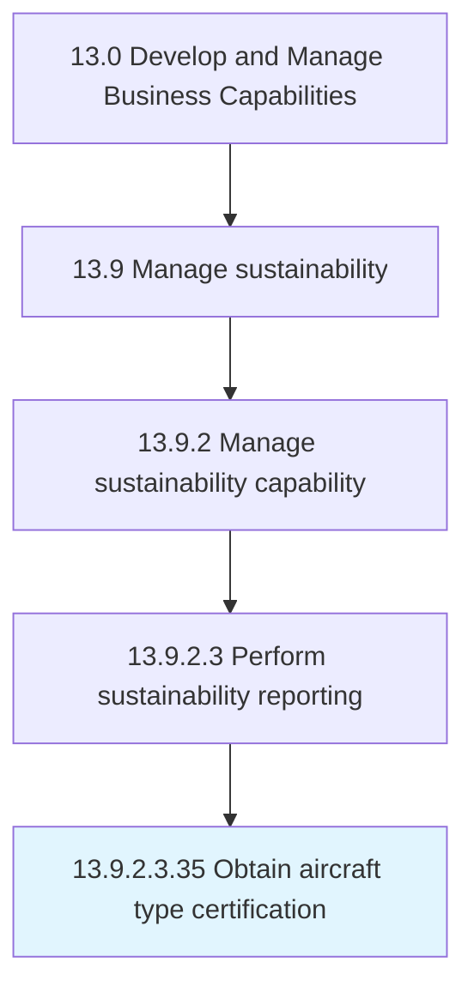

# Obtain aircraft type certification

> Obtaining aircraft regulatory certification in country of origin.

## Overview

Sub-Activity 13.9.2.3.35 is an activity within the Develop and Manage Business Capabilities framework. 

Obtaining aircraft regulatory certification in country of origin. Obtain regulatory authority in the country where first-time aircraft builds will take place. Ensure the design work that has been completed complies with the regulatory requirements for the aircraft type being built.

## Process Hierarchy



## Key Statistics

| Metric | Value |
|--------|-------|
| APQC Code | 19702 |
| Hierarchy ID | 13.9.2.3.35 |
| Level | Sub-Activity |
| Parent | [13.9.2.3](../) |
| Sub-Processes | 0 |


## GraphDL Semantic Structure

```
obtain.AircraftTypeCertification
```

| Component | Value | Description |
|-----------|-------|-------------|
| Verb | `obtain` | Primary action |
| Object | `aircraft type certification` | Direct object |


---

*Source: APQC PCF 19702 (13.9.2.3.35) - APQC*

## Related Occupations

- [General and Operations Managers](/occupations/Management/GeneralAndOperationsManagers)
- [Management Analysts](/occupations/Business/ManagementAnalysts)
- [Chief Executives](/occupations/Management/ChiefExecutives)

## Related Departments

- [Executive](/departments/Executive)
- [Operations](/departments/Operations)
- [Finance](/departments/Finance)
