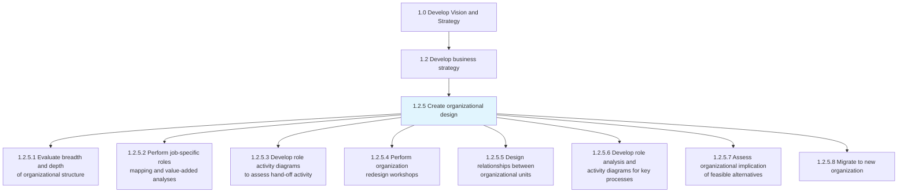
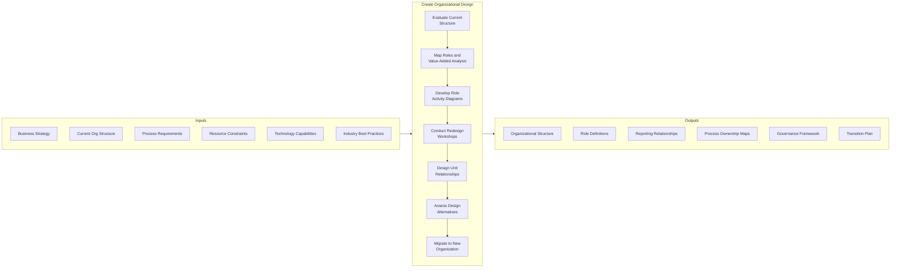
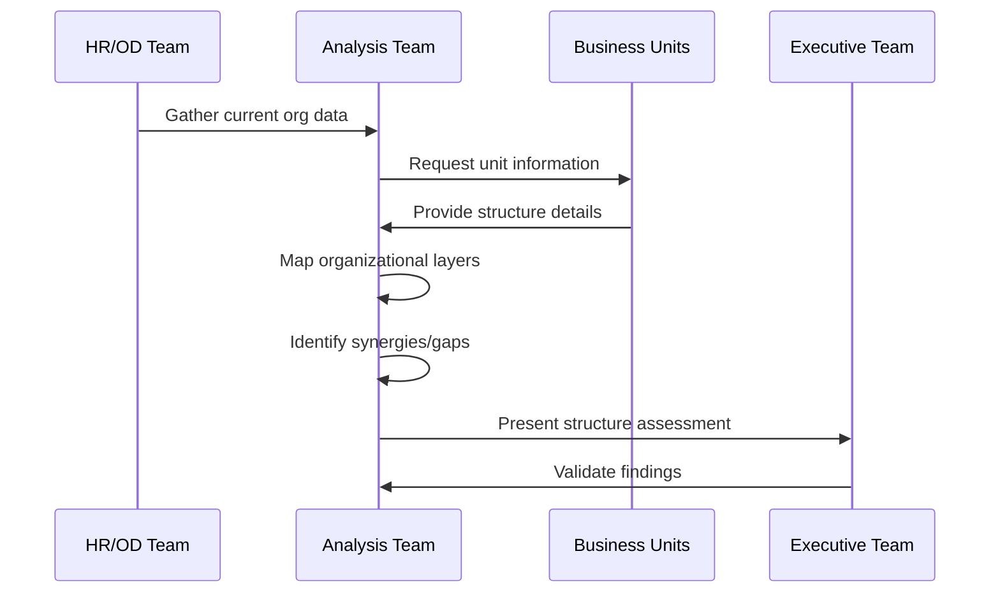
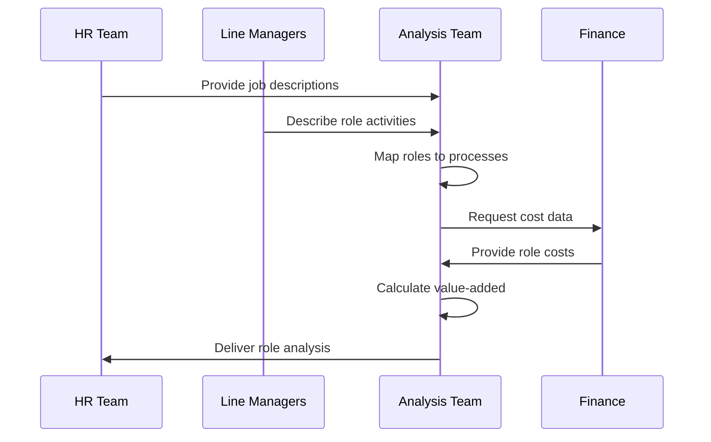
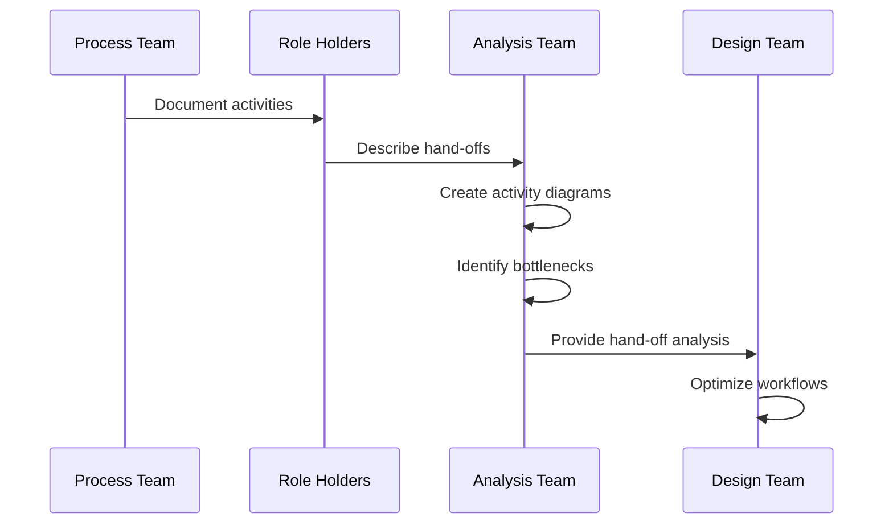
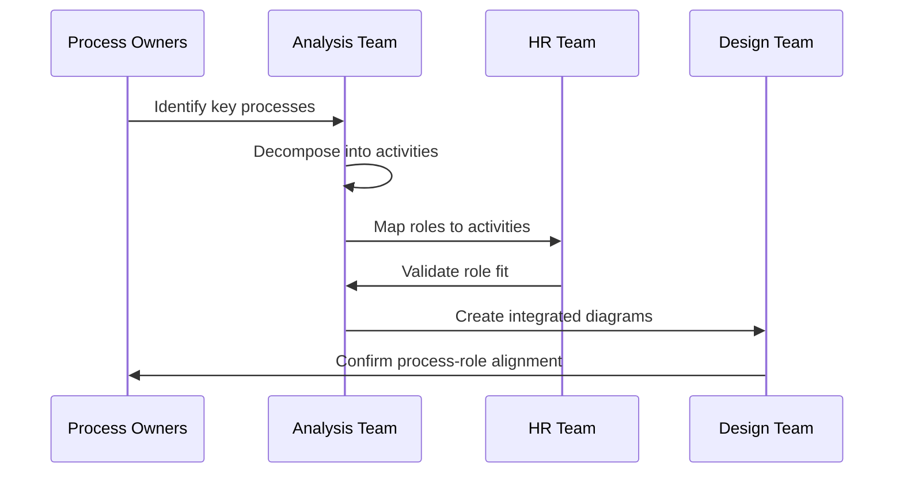
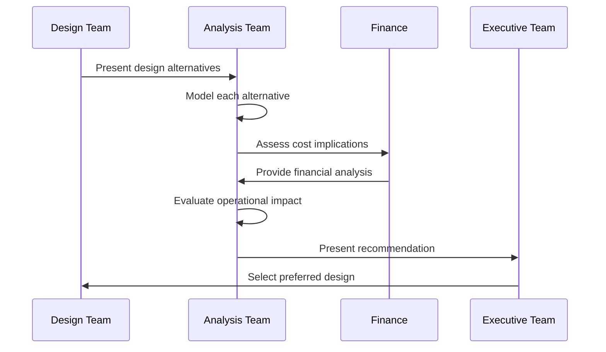
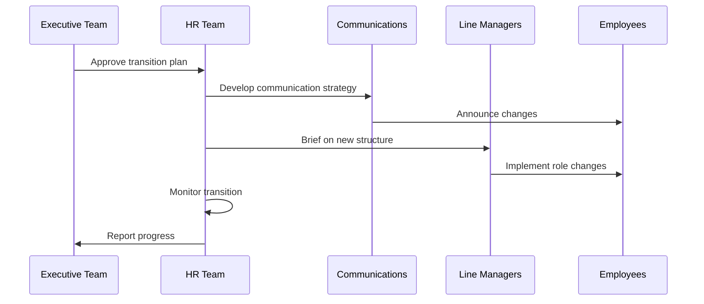
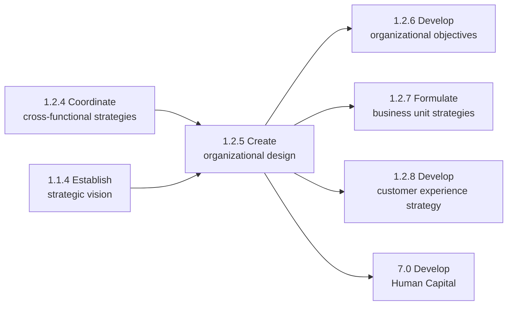

# Create organizational design

> Formulating a design for the organization's resources that allow it to meet its objectives. Develop a new framework for molding the organization's various processes into a coherent and seamless whole.

## Overview

Create organizational design (APQC 1.2.5/10041) is a critical process within the Develop Business Strategy process group. This process focuses on designing the structural framework that enables an organization to effectively execute its strategy and achieve its objectives. It encompasses evaluating existing structures, mapping roles and responsibilities, designing inter-unit relationships, and implementing organizational changes.

Organizational design goes beyond simple org charts to consider how work flows through the organization, how decisions are made, how resources are allocated, and how people collaborate across boundaries. The goal is to create a structure that is aligned with strategy, efficient in operations, and adaptable to change.

## Process Hierarchy



## Key Statistics

| Metric | Value |
|--------|-------|
| APQC Code | 10041 |
| Hierarchy ID | 1.2.5 |
| Level | Process |
| Category | [Develop Vision and Strategy](/processes/01-Strategy) |
| Sub-Activities | 8 |
| Related Processes | 15+ |

## Process Flow



## GraphDL Semantic Structure

```
create.OrganizationalDesign
```

| Component | Value | Description |
|-----------|-------|-------------|
| Verb | `create` | Primary action of formulating and establishing |
| Object | `OrganizationalDesign` | The structural framework for the organization |
| Preposition | - | Not applicable |
| PrepObject | - | Not applicable |

## Activities

### 1.2.5.1 - Evaluate breadth and depth of organizational structure

Evaluating the structural makeup of the organization, including pertinent features of and associated synergies among constituent elements. Examine the organization's architectural framework, paying close attention to the individual elements, the relations among them, and the conjoint and co-acting forces therein.



**Tasks:**
- `evaluate.OrganizationalStructure` - Assess current structural makeup
- `analyze.OrganizationalLayers` - Examine hierarchy depth and span of control
- `identify.StructuralSynergies` - Find collaborative efficiencies
- `assess.StructuralGaps` - Identify missing or redundant elements

### 1.2.5.2 - Perform job-specific roles mapping and value-added analyses

Appraising job-specific roles within the organizational chart and their hierarchical architecture. Analyze a map of work-related roles within the organizational structure. Examine the value added by the positions associated with jobs to be performed.



**Tasks:**
- `map.JobRoles` - Create comprehensive role inventory
- `analyze.RoleActivities` - Document activities for each role
- `calculate.ValueAdded` - Assess contribution of each role
- `identify.RoleRedundancies` - Find overlapping responsibilities

### 1.2.5.3 - Develop role activity diagrams to assess hand-off activity

Examining the constituent exercises and undertakings within a work-related position for the purpose of effective delegation. Deconstruct job-specific roles into activities and visualize the relations among them.



**Tasks:**
- `develop.ActivityDiagrams` - Create visual role-activity maps
- `analyze.HandOffs` - Examine work transitions between roles
- `identify.Bottlenecks` - Find process constraints
- `optimize.Delegation` - Improve activity assignments

### 1.2.5.4 - Perform organization redesign workshops

Organizing workshop sessions to adopt organizational redesign. Communicate the organizational structure and mapping of responsibilities against job roles in order to facilitate an effective understanding among personnel.

See: [Perform organization redesign workshops](./RedesignWorkshops.mdx)

**Tasks:**
- `facilitate.RedesignWorkshops` - Conduct collaborative sessions
- `communicate.StructureChanges` - Present new organizational design
- `gather.StakeholderFeedback` - Collect input from participants
- `build.ChangeConsensus` - Develop agreement on changes

### 1.2.5.5 - Design relationships between organizational units

Fleshing out the connections and dependencies among the various units of the organization. Delineate the relationship among business units or process frameworks within the organization.

See: [Design relationships between organizational units](./UnitRelationships.mdx)

**Tasks:**
- `design.UnitRelationships` - Define inter-unit connections
- `establish.SharedResources` - Identify common capabilities
- `define.Accountabilities` - Clarify unit responsibilities
- `formalize.Collaborations` - Document working relationships

### 1.2.5.6 - Develop role analysis and activity diagrams for key processes

Creating an understanding of the fit between job roles and organizational processes in order to properly place personnel. Deconstruct key processes into constituent activities, and examine job-related roles.



**Tasks:**
- `identify.KeyProcesses` - Determine critical organizational processes
- `decompose.ProcessActivities` - Break down process into tasks
- `map.RolesToProcesses` - Align positions with process needs
- `validate.RoleFit` - Confirm appropriate role assignments

### 1.2.5.7 - Assess organizational implication of feasible alternatives

Probing the repercussions of all practicable organizational design options. Analyze the significance and impact of workable organizational structure options.



**Tasks:**
- `model.DesignAlternatives` - Create organizational design options
- `assess.FinancialImpact` - Evaluate cost implications
- `evaluate.OperationalImpact` - Analyze efficiency changes
- `recommend.OptimalDesign` - Present best alternative

### 1.2.5.8 - Migrate to new organization

Embracing and ratifying a new organizational structure. Implement the selected design through a structured transition process.



**Tasks:**
- `develop.TransitionPlan` - Create migration roadmap
- `communicate.Changes` - Inform all stakeholders
- `implement.NewStructure` - Execute organizational changes
- `monitor.Transition` - Track migration progress

## RACI Matrix

| Activity | Responsible | Accountable | Consulted | Informed |
|----------|-------------|-------------|-----------|----------|
| Evaluate organizational structure | OD Team | CHRO | All Departments | Executive Team |
| Perform roles mapping | HR Analysts | CHRO | Line Managers | Employees |
| Develop activity diagrams | Process Team | COO | Role Holders | HR |
| Conduct redesign workshops | OD Facilitators | CHRO | All Participants | Board |
| Design unit relationships | Strategy Team | COO | Business Units | All Departments |
| Assess design alternatives | Analysis Team | CEO | Finance, HR, Ops | Executive Team |
| Migrate to new organization | HR Team | CEO | All Managers | All Employees |

## Related Departments

- [Human Resources](/departments/HR/index) - Primary owner of organizational design
- [Strategy & Planning](/departments/Strategy/index) - Strategic alignment
- [Operations](/departments/Operations/index) - Process integration
- [Finance](/departments/Finance/index) - Cost and resource analysis
- [Information Technology](/departments/IT) - Systems and technology alignment

## Related Occupations

- [Organizational Development Specialists](/occupations/OrgDevelopment) - Design and implementation
- [Human Resources Managers](/occupations/HRManagers) - HR leadership and coordination
- [Management Analysts](/occupations/Business/Operations/ManagementAnalysts) - Analysis and consulting
- [Industrial-Organizational Psychologists](/occupations/IOPsychologists) - Behavioral considerations
- [Change Management Specialists](/occupations/ChangeManagement) - Transition support

## Industry Variations

### Banking

Banking organizational design emphasizes regulatory compliance structures, risk management functions, and clear lines of accountability for financial controls. Designs must accommodate three lines of defense model.

**Industry-Specific Activities:**
- Design compliance and risk management structures
- Create audit committee relationships
- Establish regulatory reporting lines
- Define front/middle/back office structures

### Healthcare Provider

Healthcare organizations design around clinical service lines, patient care pathways, and quality/safety functions. Organizational structures must support both clinical excellence and operational efficiency.

**Industry-Specific Activities:**
- Design clinical department structures
- Create care team organizational models
- Establish quality and safety reporting lines
- Define medical staff organization relationships

### Aerospace and Defense

Aerospace and defense companies design matrix organizations that balance functional expertise with program management. Structures must support long development cycles and government contracting requirements.

**Industry-Specific Activities:**
- Design program management structures
- Create engineering center of excellence models
- Establish government relations functions
- Define security and compliance organizations

### Retail

Retail organizational design balances centralized functions with distributed store operations. Structures must enable rapid response to market trends while maintaining brand consistency.

**Industry-Specific Activities:**
- Design field organization structures
- Create merchandising and buying organizations
- Establish omnichannel coordination functions
- Define store operations hierarchies

## Sub-Processes

| Process | Code | Description |
|---------|------|-------------|
| [Evaluate organizational structure](./EvaluateStructure) | 10049 | Assess structural makeup and synergies |
| [Perform roles mapping](./RolesMapping) | 10050 | Map job-specific roles and value-added |
| [Develop activity diagrams](./ActivityDiagrams) | 10051 | Create role-activity visualizations |
| [Perform redesign workshops](./RedesignWorkshops.mdx) | 10052 | Conduct collaborative redesign sessions |
| [Design unit relationships](./UnitRelationships.mdx) | 10053 | Define inter-unit connections |
| [Assess design alternatives](./AssessAlternatives) | 10055 | Evaluate organizational options |
| [Migrate to new organization](./Migration) | 10056 | Implement new structure |

## Related Processes



## Metrics & KPIs

| Metric | Description | Target |
|--------|-------------|--------|
| Span of Control | Average direct reports per manager | 6-8 optimal |
| Organizational Layers | Number of hierarchical levels | Minimize appropriately |
| Role Clarity Score | Employee understanding of responsibilities | >90% |
| Cross-functional Collaboration | Effectiveness of inter-unit work | >85% |
| Transition Success Rate | Percentage of successful role transitions | >95% |
| Time to Full Productivity | Time for reorganized teams to perform | <90 days |

---

*Source: APQC PCF 10041 (1.2.5) - Cross-Industry*
