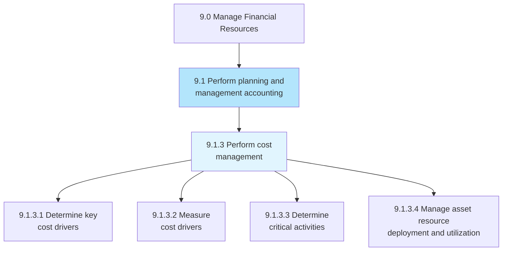
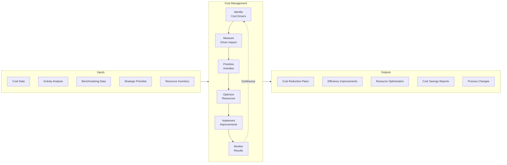
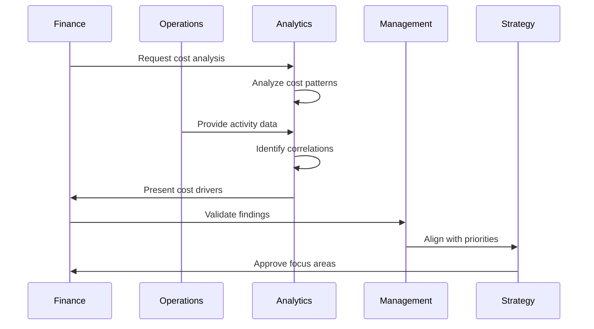
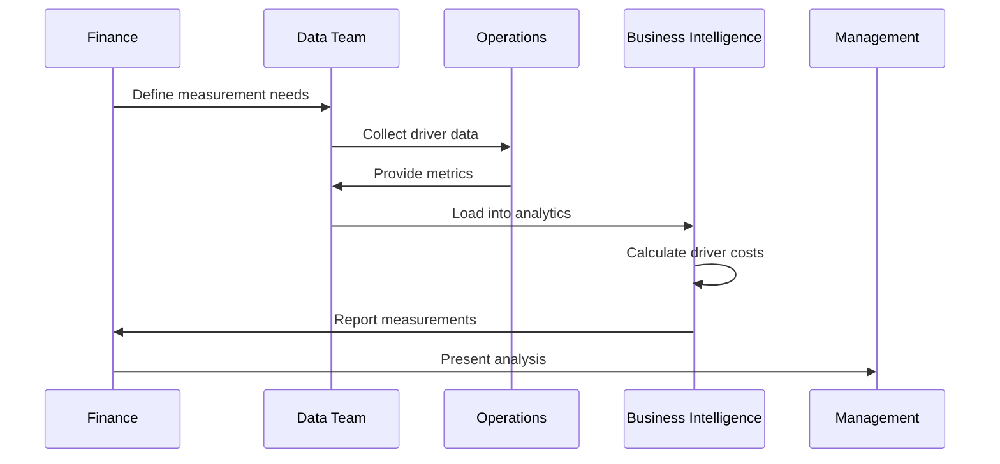
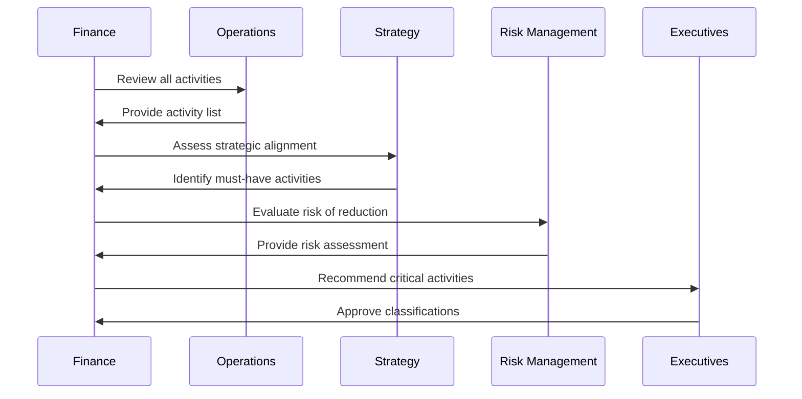
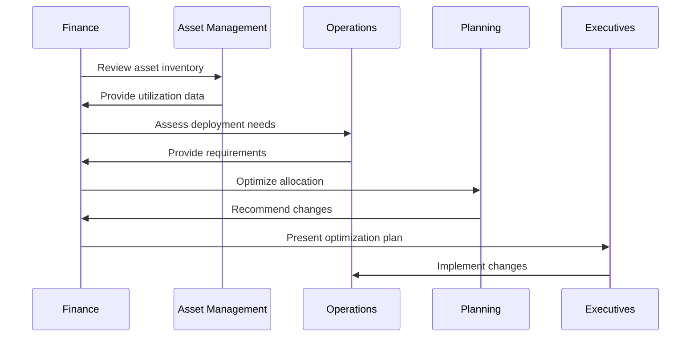
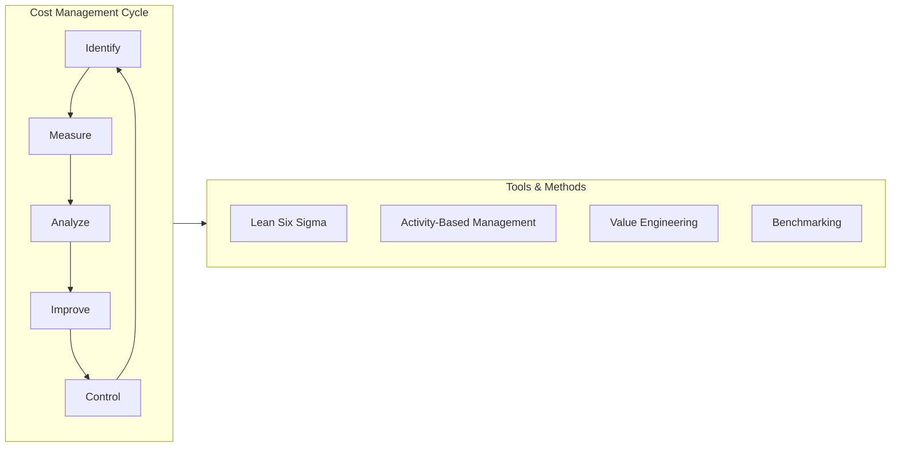

# Perform Cost Management

*APQC Process 9.1.3*

> Deciding which expenses can be avoided to reduce some costs and increase revenues. Plan and control the organization's budget to forecast future expenditures.

## Overview

Perform Cost Management is an active process focused on optimizing costs across the organization. Unlike cost accounting which tracks and reports costs, cost management actively seeks to reduce costs while maintaining value. This process encompasses identifying cost drivers, measuring their impact, determining critical activities, and managing asset utilization.

## Process Hierarchy



## Key Statistics

| Metric | Value |
|--------|-------|
| APQC Code | 10740 |
| Hierarchy ID | 9.1.3 |
| Level | Process |
| Category | [Manage Financial Resources](/processes/09-Finance) |
| Process Group | [Perform Planning and Management Accounting](./index) |
| Activities | 4 |

## Process Flow



## GraphDL Semantic Structure

```
perform.CostManagement
```

| Component | Value | Description |
|-----------|-------|-------------|
| Verb | `perform` | Execute or carry out |
| Object | `CostManagement` | Active cost optimization |
| Preposition | - | Not applicable |
| PrepObject | - | Not applicable |

### Semantic Decomposition

| Sub-Task | GraphDL Notation |
|----------|------------------|
| Determine cost drivers | `determine.KeyCostDrivers` |
| Measure cost drivers | `measure.CostDrivers` |
| Determine critical activities | `determine.CriticalActivities` |
| Manage asset deployment | `manage.AssetResourceDeployment.and.Utilization` |

## Activities

### 9.1.3.1 - Determine key cost drivers

Defining cost drivers for a particular activity. Identify the factors that cause costs to increase or decrease.



**Tasks:**
- `analyze.CostPatterns` - Study cost behavior
- `identify.CostDrivers.for.Activities` - Link costs to causes
- `validate.DriverRelationships` - Confirm correlations
- `prioritize.CostDrivers.by.Impact` - Rank by significance

### 9.1.3.2 - Measure cost drivers

Calculating cost drivers and quantifying their impact on organizational costs.



**Tasks:**
- `establish.DriverMetrics` - Define measurement approach
- `collect.DriverData` - Gather operational data
- `calculate.DriverCosts` - Quantify cost impact
- `report.DriverMeasurements` - Communicate results

### 9.1.3.3 - Determine critical activities

Determine the activities that hinder the progress of finance activities. Identify business activities which are indispensable and where costs cannot be slashed.



**Tasks:**
- `catalog.BusinessActivities` - List all activities
- `assess.ActivityCriticality` - Evaluate importance
- `classify.ActivitiesByPriority` - Rank by necessity
- `identify.NonEssentialActivities` - Find reduction candidates

### 9.1.3.4 - Manage asset resource deployment and utilization

Distributing or allocating asset resources in different processes for optimal utilization.



**Tasks:**
- `analyze.AssetUtilization` - Measure usage rates
- `identify.UnderutilizedAssets` - Find optimization opportunities
- `recommend.Redeployment` - Propose reallocation
- `track.UtilizationImprovements` - Monitor progress

## RACI Matrix

| Activity | Responsible | Accountable | Consulted | Informed |
|----------|-------------|-------------|-----------|----------|
| Determine cost drivers | FP&A Analysts | FP&A Director | Operations, Cost Accounting | CFO |
| Measure cost drivers | Data Analysts | FP&A Director | IT, Operations | Management |
| Determine critical activities | FP&A Team | CFO | Strategy, Risk | Executive Team |
| Manage asset utilization | Asset Management | Controller | Operations | Finance |

## Related Departments

- [FP&A](/departments/FPA) - Cost analysis and recommendations
- [Operations](/departments/Operations/index) - Activity execution and improvement
- [Asset Management](/departments/AssetManagement) - Resource optimization
- [Strategy](/departments/Strategy/index) - Priority alignment

## Related Occupations

- [Management Analysts](/occupations/Business/Operations/ManagementAnalysts) - Process improvement
- [Financial Analysts](/occupations/Business/Financial/FinancialAnalysts) - Cost analysis
- [Operations Research Analysts](/occupations/Technology/OperationsResearchAnalysts) - Optimization
- [Industrial Engineers](/occupations/Architecture/IndustrialEngineers) - Efficiency improvement

## Industry Variations

### Airline

Airline cost management focuses on fuel efficiency, route optimization, and labor productivity. Load factors and yield management are critical drivers.

**Industry-Specific Activities:**
- Optimize fuel consumption
- Manage fleet utilization
- Control labor costs per ASM
- Reduce turnaround times

### Telecommunications

Telecom cost management emphasizes network utilization, customer acquisition costs, and subscriber economics.

**Industry-Specific Activities:**
- Optimize network capacity
- Reduce customer acquisition cost
- Manage spectrum efficiency
- Control subscriber churn costs

### Hospitality

Hospitality cost management focuses on occupancy optimization, labor scheduling, and food cost control.

**Industry-Specific Activities:**
- Optimize room yield
- Manage food and beverage costs
- Control labor scheduling
- Reduce utility costs

## Continuous Improvement Framework



## Sub-Activities

| Activity | Code | Description |
|----------|------|-------------|
| [Determine key cost drivers](./DetermineKeyCostDrivers) | 9.1.3.1 | Cost driver identification |
| [Measure cost drivers](./MeasureCostDrivers) | 9.1.3.2 | Driver quantification |
| [Determine critical activities](./DetermineCriticalActivities) | 9.1.3.3 | Activity prioritization |
| [Manage asset deployment](./ManageAssetDeployment) | 9.1.3.4 | Resource optimization |

## Metrics & KPIs

| Metric | Description | Target |
|--------|-------------|--------|
| Cost Savings | Annual savings achieved | >3% of costs |
| Asset Utilization | % of capacity used | >85% |
| Cost per Unit | Total cost / output | Year-over-year reduction |
| Process Efficiency | Output / input ratio | Continuous improvement |
| Waste Reduction | Non-value-add elimination | >20% reduction |
| Benchmarking Gap | vs. industry best practice | Closing trend |

---

*Source: APQC PCF 10740 (9.1.3) - Cross-Industry*
