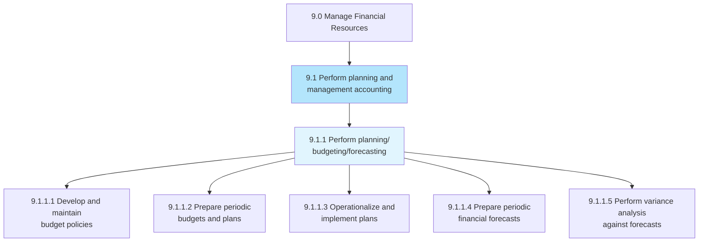
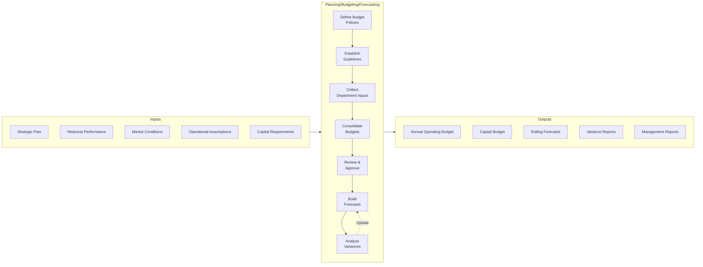
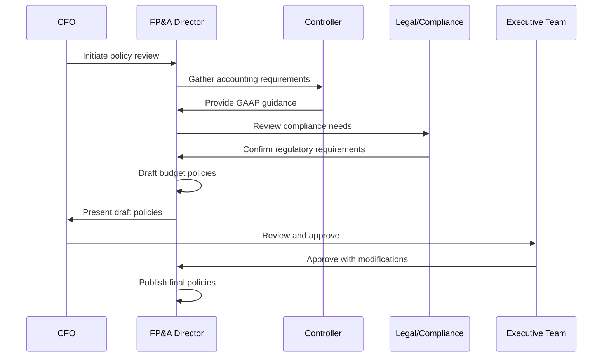
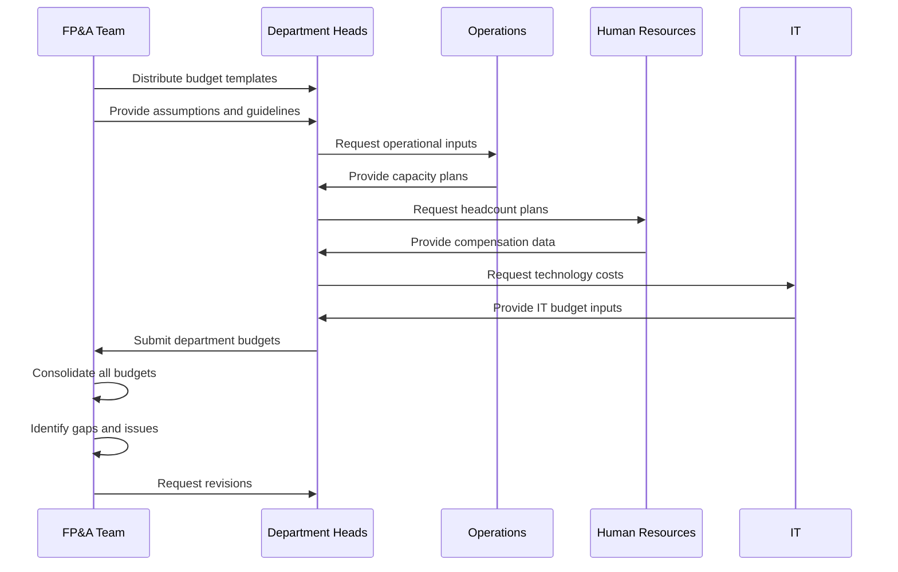
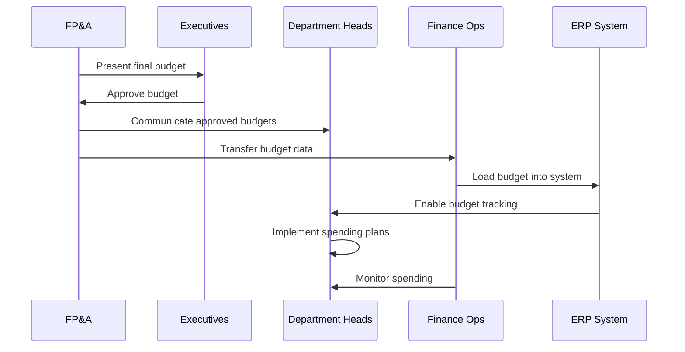
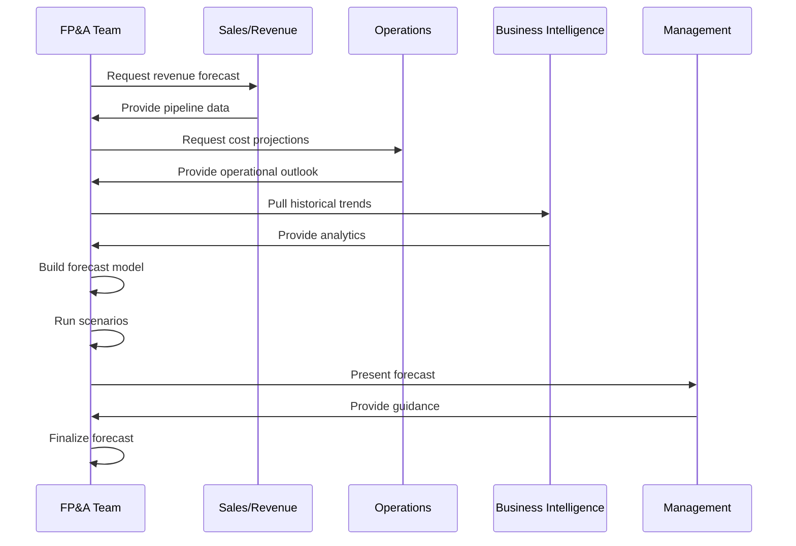
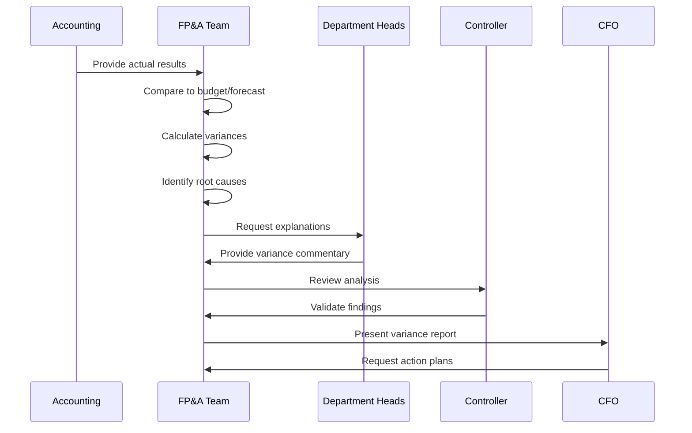

# Perform Planning/Budgeting/Forecasting

*APQC Process 9.1.1*

> Allocating funds to meet future and current financial goals. Led by the chief financial officer, have the finance function plan, budget, and forecast in order to determine and describe long and short-term financial goals.

## Overview

Perform Planning/Budgeting/Forecasting is the foundational process for financial resource management. This process establishes the framework for allocating organizational resources, setting financial targets, and predicting future performance. Modern organizations are moving from annual static budgets to rolling forecasts and driver-based planning models that adapt to changing business conditions.

## Process Hierarchy



## Key Statistics

| Metric | Value |
|--------|-------|
| APQC Code | 10738 |
| Hierarchy ID | 9.1.1 |
| Level | Process |
| Category | [Manage Financial Resources](/processes/09-Finance) |
| Process Group | [Perform Planning and Management Accounting](./index) |
| Activities | 5 |

## Process Flow



## GraphDL Semantic Structure

```
perform.PlanningBudgetingForecasting
```

| Component | Value | Description |
|-----------|-------|-------------|
| Verb | `perform` | Execute or carry out |
| Object | `PlanningBudgetingForecasting` | Financial planning activities |
| Preposition | - | Not applicable |
| PrepObject | - | Not applicable |

### Semantic Decomposition

| Sub-Task | GraphDL Notation |
|----------|------------------|
| Develop budget policies | `develop.BudgetPolicies` |
| Prepare periodic budgets | `prepare.PeriodicBudgets` |
| Prepare financial forecasts | `prepare.FinancialForecasts` |
| Perform variance analysis | `perform.VarianceAnalysis.against.Budgets` |

## Activities

### 9.1.1.1 - Develop and maintain budget policies and procedures

Formulating financial budgetary guidelines and strategies. Develop a framework for rules and regulations regarding budgets.



**Tasks:**
- `define.BudgetCalendar` - Establish annual budget timeline
- `establish.ApprovalHierarchy` - Define authorization levels
- `create.BudgetTemplates` - Develop standard budget forms
- `document.BudgetingMethodology` - Define zero-based vs incremental approach

### 9.1.1.2 - Prepare periodic budgets and plans

Creating reports on a quarterly or annual basis for fund allocation. Create a financial statement that estimates revenues and expenses over a specific period of time.



**Tasks:**
- `distribute.BudgetTemplates.to.Departments` - Send standardized forms
- `collect.RevenueProjections` - Gather sales forecasts
- `consolidate.DepartmentBudgets` - Combine all inputs
- `prepare.ConsolidatedBudget` - Create master budget

### 9.1.1.3 - Operationalize and implement plans to achieve budget

Putting budgeting plans into practical use keeping within designated forecasting parameters.



**Tasks:**
- `communicate.ApprovedBudgets.to.Stakeholders` - Distribute final budgets
- `load.BudgetData.into.Systems` - Enter into ERP/EPM
- `establish.BudgetControls` - Set spending limits
- `train.BudgetOwners` - Enable budget holders

### 9.1.1.4 - Prepare periodic financial forecasts

Creating estimates of the projected income and expenses required over a predetermined time frame.



**Tasks:**
- `gather.ForecastInputs.from.BusinessUnits` - Collect driver data
- `build.ForecastModel` - Create projection model
- `run.ScenarioAnalysis` - Develop best/worst/expected cases
- `publish.RollingForecast` - Distribute updated forecasts

### 9.1.1.5 - Perform variance analysis against forecasts and budgets

Conducting a quantitative analysis between what was forecasted and budgeted and actual financial behavior.



**Tasks:**
- `calculate.BudgetVariances` - Compute actual vs budget
- `analyze.VarianceDrivers` - Identify root causes
- `prepare.VarianceCommentary` - Document explanations
- `recommend.CorrectiveActions` - Propose adjustments

## RACI Matrix

| Activity | Responsible | Accountable | Consulted | Informed |
|----------|-------------|-------------|-----------|----------|
| Develop budget policies | FP&A Director | CFO | Controller, Legal | Executive Team |
| Prepare department budgets | Department Heads | Business Unit Leaders | FP&A | CFO |
| Consolidate budgets | FP&A Analysts | FP&A Director | Controller | Department Heads |
| Approve budgets | CFO | CEO | Board Finance Committee | All Employees |
| Prepare forecasts | FP&A Analysts | FP&A Director | Sales, Operations | Executive Team |
| Perform variance analysis | FP&A Analysts | FP&A Director | Department Heads | Controller |

## Related Departments

- FP&A - Primary process owner and executor
- [Finance](/departments/Finance/index) - Overall governance and oversight
- Accounting - Actual data provision
- [Operations](/departments/Operations/index) - Operational assumptions
- [Sales](/departments/Sales/index) - Revenue forecasting input

## Related Occupations

- [Budget Analysts](/occupations/Business/Financial/BudgetAnalysts) - Budget development specialists
- [Financial Analysts](/occupations/Business/Financial/FinancialAnalysts) - Forecasting and analysis
- [Financial Managers](/occupations/Management/FinancialManagers) - Process leadership
- [Chief Financial Officers](/occupations/CFO) - Ultimate accountability

## Industry Variations

### Technology/SaaS

SaaS companies focus on subscription metrics like ARR, MRR, churn, and customer acquisition costs. Rolling forecasts update monthly based on bookings data.

**Industry-Specific Activities:**
- Forecast ARR/MRR growth
- Model customer acquisition costs
- Project churn and retention
- Budget R&D capitalization

### Retail

Retail budgeting is highly seasonal with detailed store-level planning. Open-to-buy budgets control inventory investment.

**Industry-Specific Activities:**
- Plan by season and category
- Create open-to-buy budgets
- Forecast same-store sales growth
- Budget promotional markdown reserves

### Government/Public Sector

Government budgeting follows strict appropriation cycles with zero-based justification requirements.

**Industry-Specific Activities:**
- Prepare appropriation requests
- Justify program budgets
- Plan multi-year capital programs
- Budget for grant-funded programs

## Sub-Activities

| Activity | Code | Description |
|----------|------|-------------|
| [Develop and maintain budget policies](./DevelopBudgetPolicies) | 9.1.1.1 | Budget policy framework |
| [Prepare periodic budgets and plans](./PreparePeriodicBudgets) | 9.1.1.2 | Budget creation |
| [Operationalize plans](./OperationalizePlans) | 9.1.1.3 | Budget implementation |
| [Prepare financial forecasts](./PrepareFinancialForecasts) | 9.1.1.4 | Forecast development |
| [Perform variance analysis](./PerformVarianceAnalysis) | 9.1.1.5 | Variance reporting |

## Metrics & KPIs

| Metric | Description | Target |
|--------|-------------|--------|
| Forecast Accuracy | Revenue forecast vs actual | >95% |
| Budget Cycle Time | Days from kickoff to approval | <60 days |
| Rolling Forecast Currency | Days since last forecast update | <30 days |
| Variance Explanation Rate | % of variances explained | 100% |
| Budget Iteration Count | Number of revision cycles | <3 |
| Planning Cost | FP&A cost as % of revenue | <0.5% |

---

*Source: APQC PCF 10738 (9.1.1) - Cross-Industry*
