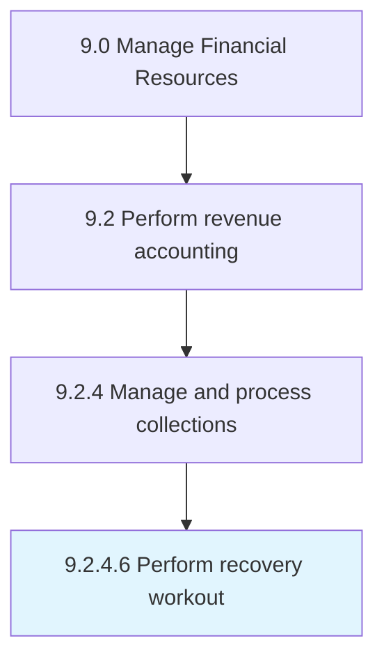

# Perform recovery workout

> Renegotiating the terms of a loan agreement in order to recoup money from a default account.

## Overview

Activity 9.2.4.6 is an activity within the Manage Financial Resources framework. 

Renegotiating the terms of a loan agreement in order to recoup money from a default account.

## Process Hierarchy



## Key Statistics

| Metric | Value |
|--------|-------|
| APQC Code | 14007 |
| Hierarchy ID | 9.2.4.6 |
| Level | Activity |
| Parent | [9.2.4](../) |
| Sub-Processes | 0 |


## GraphDL Semantic Structure

```
perform.RecoveryWorkout
```

| Component | Value | Description |
|-----------|-------|-------------|
| Verb | `perform` | Primary action |
| Object | `recovery workout` | Direct object |


## Related Concepts

- RecoveryWorkout


---

*Source: APQC PCF 14007 (9.2.4.6) - APQC*

## Related Occupations

- [General and Operations Managers](/occupations/Management/GeneralAndOperationsManagers)
- [Management Analysts](/occupations/Business/ManagementAnalysts)
- [Chief Executives](/occupations/Management/ChiefExecutives)

## Related Departments

- [Executive](/departments/Executive)
- [Operations](/departments/Operations)
- [Finance](/departments/Finance)
