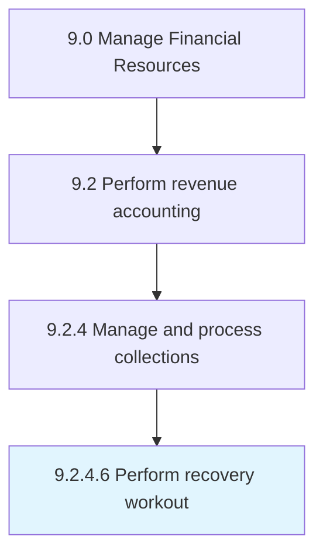

# Perform recovery workout

> Renegotiating the terms of a loan agreement in order to recoup money from a default account.

## Overview

Activity 9.2.4.6 is an activity within the Manage Financial Resources framework. 

Renegotiating the terms of a loan agreement in order to recoup money from a default account.

## Process Hierarchy



## Key Statistics

| Metric | Value |
|--------|-------|
| APQC Code | 14007 |
| Hierarchy ID | 9.2.4.6 |
| Level | Activity |
| Parent | [9.2.4](../) |
| Sub-Processes | 0 |


## GraphDL Semantic Structure

```
perform.RecoveryWorkout
```

| Component | Value | Description |
|-----------|-------|-------------|
| Verb | `perform` | Primary action |
| Object | `recovery workout` | Direct object |


## Related Concepts

- RecoveryWorkout


---

*Source: APQC PCF 14007 (9.2.4.6) - APQC*

## Related Occupations

- [Credit Analysts](/occupations/Finance/CreditAnalysts)
- [Financial Managers](/occupations/Management/FinancialManagers)
- [Loan Officers](/occupations/Finance/LoanOfficers)
- [Claims Adjusters, Examiners, and Investigators](/occupations/Business/ClaimsAdjustersExaminersAndInvestigators)
- [Collections Specialists](/occupations/Finance/BillAndAccountCollectors)

## Related Departments

- [Credit and Collections](/departments/CreditCollections)
- [Finance](/departments/Finance)
- [Risk Management](/departments/RiskManagement)
- [Treasury](/departments/Treasury)
- [Legal](/departments/Legal)

## Industry Variations

This process applies universally across all industries, with the following common best practices:

### Universal Applicability

Recovery workout processes are essential for any organization extending credit or managing receivables. Effective workout strategies minimize losses while preserving customer relationships where possible.

### Cross-Industry Best Practices

| Practice | Description |
|----------|-------------|
| Early Intervention | Engage defaulting accounts quickly before problems compound |
| Documentation | Maintain thorough records of all workout negotiations |
| Flexible Solutions | Offer multiple restructuring options based on customer situation |
| Legal Readiness | Prepare for escalation while pursuing negotiated solutions |
| Portfolio Segmentation | Tailor workout approaches based on account characteristics |

### Common Metrics

- Recovery rate (amount recovered vs. outstanding balance)
- Time to resolution for workout cases
- Cost of recovery per dollar collected
- Customer retention post-workout
- Charge-off rate after workout attempts
