# Pick, pack, and ship product for delivery

> Packing and shipping the product to deliver to the customer. Take care of the internal and external packaging of the products in order to ensure safe transportation of the products from the warehouse to delivery locations. Notify the ERP system and/or Accounts Receivable Dept. This process encompasses all warehouse fulfillment activities from order receipt through carrier handoff.

## Overview

Pick, pack, and ship product for delivery (APQC 4.4.3) encompasses all warehouse operations required to fulfill customer orders, from receiving the order through handing off packages to carriers for delivery. This process is critical for customer satisfaction, as it directly impacts order accuracy, delivery speed, and product condition upon receipt.

The process involves retrieving products from warehouse storage (picking), preparing them for shipment with appropriate packaging and documentation (packing), and coordinating with carriers for delivery (shipping). Efficient execution requires optimization of warehouse layout, picking routes, packing materials, and carrier selection to balance cost and service requirements.

## Process Hierarchy

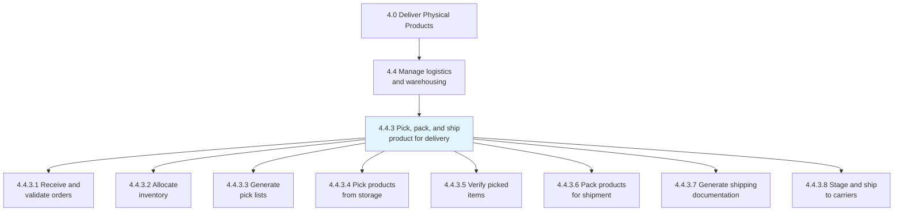

## Key Statistics

| Metric | Value |
|--------|-------|
| APQC Code | 10356 |
| Hierarchy ID | 4.4.3 |
| Level | Process |
| Category | [Deliver Physical Products](/processes/04-Delivery) |
| Parent Process | Manage logistics and warehousing |
| Activities | 8 |

## Process Flow

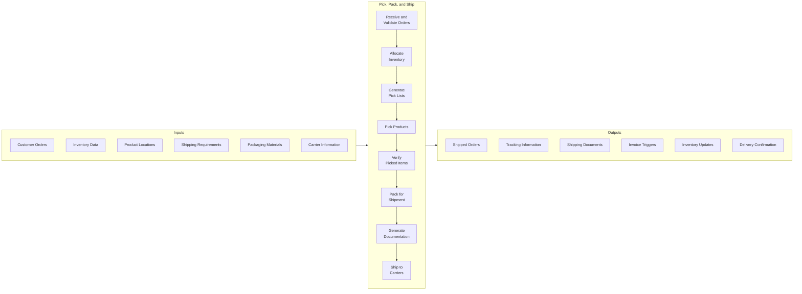

## GraphDL Semantic Structure

```
pick.Product.and.pack.Product.and.ship.Product.for.Delivery
```

| Component | Value | Description |
|-----------|-------|-------------|
| Verb | `pick` | Action of retrieving from storage |
| Object | `Product` | Items to be fulfilled |
| Preposition | `for` | Purpose relationship |
| PrepObject | `Delivery` | Final customer delivery |

## Activities

### 4.4.3.1 - Receive and validate orders

Receiving customer orders and validating they contain complete and accurate information for fulfillment.

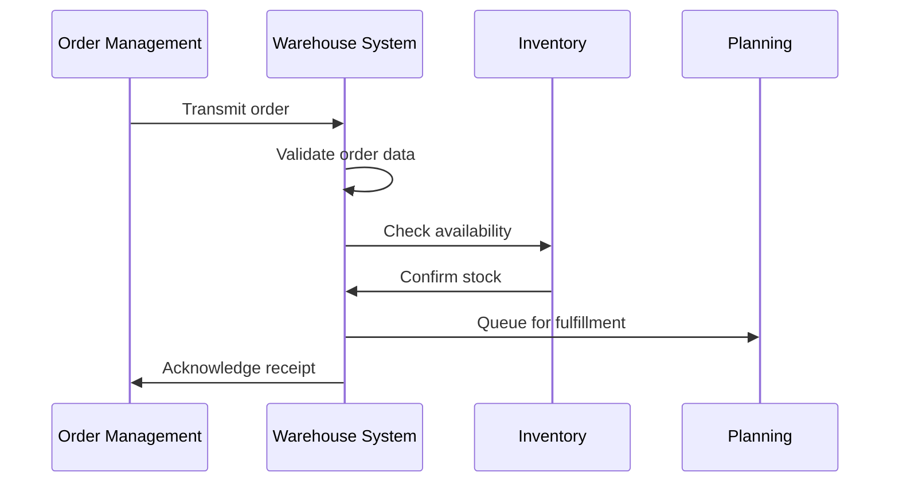

**Tasks:**
- `receive.CustomerOrders` - Accept orders from order management
- `validate.OrderData` - Verify completeness and accuracy
- `check.InventoryAvailability` - Confirm stock availability
- `prioritize.Orders` - Sequence by priority/cutoff
- `queue.ForFulfillment` - Add to fulfillment queue

### 4.4.3.2 - Allocate inventory

Reserving inventory for specific orders to ensure availability and prevent overselling.

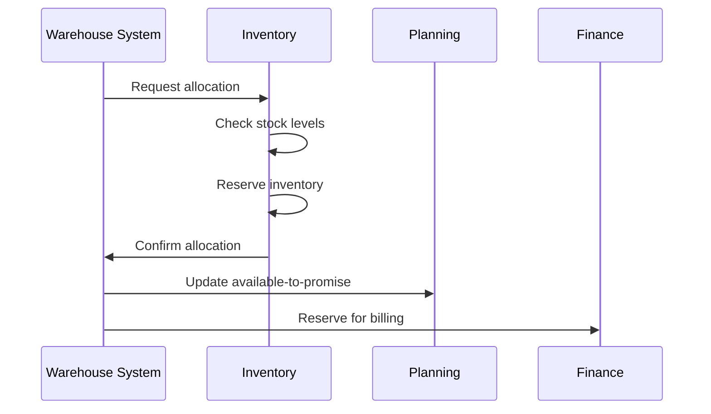

**Tasks:**
- `reserve.Inventory` - Allocate stock to orders
- `apply.AllocationRules` - Follow FIFO/FEFO policies
- `manage.Backorders` - Handle stock shortages
- `update.AvailableToPromise` - Adjust ATP levels
- `resolve.AllocationConflicts` - Handle competing demands

### 4.4.3.3 - Generate pick lists

Creating optimized pick lists that guide warehouse workers to efficiently retrieve products.

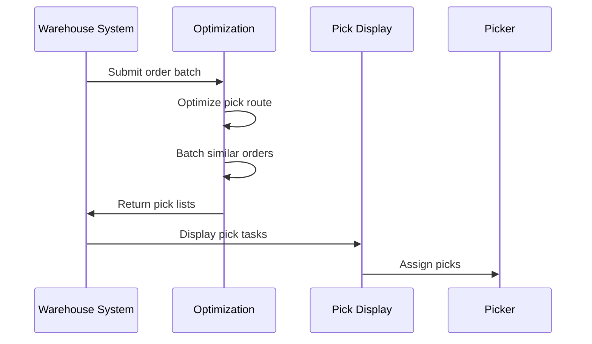

**Tasks:**
- `batch.Orders` - Group orders for efficiency
- `optimize.PickRoutes` - Calculate efficient paths
- `generate.PickLists` - Create picking instructions
- `assign.PickTasks` - Distribute to workers
- `release.PickWaves` - Trigger picking activity

### 4.4.3.4 - Pick products from storage

Physically retrieving products from warehouse storage locations according to pick lists.

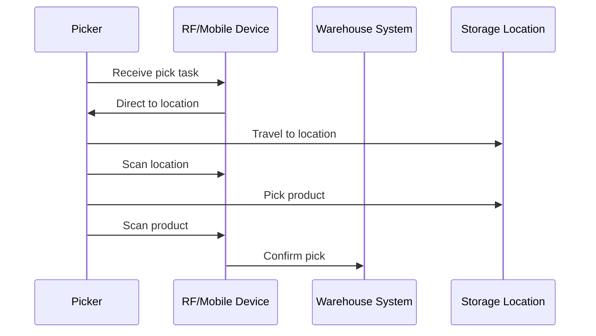

**Tasks:**
- `travel.ToLocation` - Navigate to storage bin
- `verify.Location` - Confirm correct position
- `pick.Product` - Retrieve item from storage
- `scan.Product` - Confirm correct item
- `record.PickQuantity` - Log picked amount

### 4.4.3.5 - Verify picked items

Confirming that picked items match the order requirements before packing.

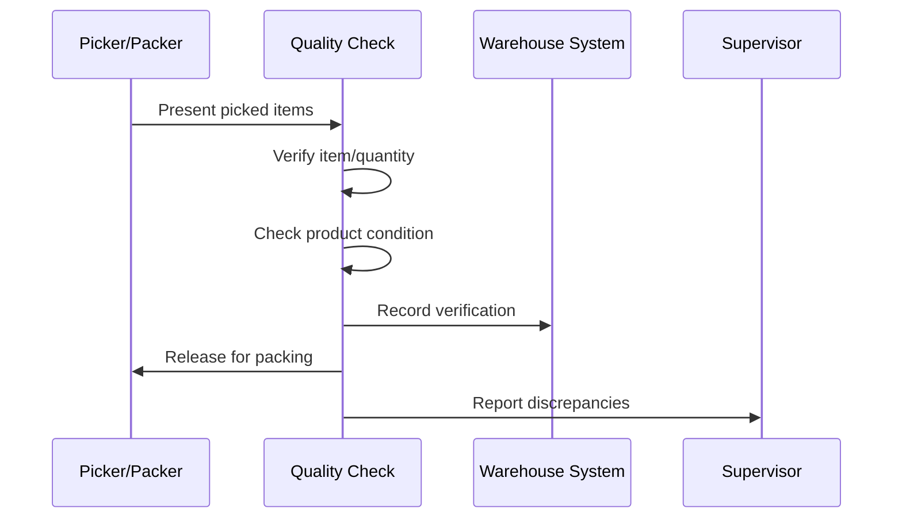

**Tasks:**
- `verify.ProductIdentity` - Confirm correct items
- `verify.Quantity` - Count picked items
- `inspect.ProductCondition` - Check for damage
- `resolve.Discrepancies` - Handle pick errors
- `record.VerificationResults` - Document checks

### 4.4.3.6 - Pack products for shipment

Packaging products appropriately for safe transit, including selecting packaging materials and adding documentation.

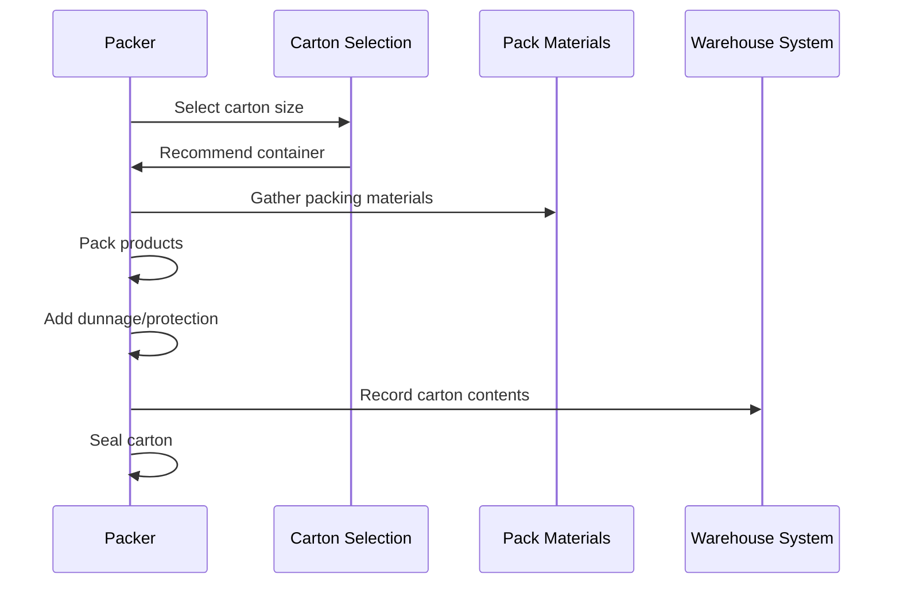

**Tasks:**
- `select.PackagingType` - Choose appropriate container
- `pack.Products` - Place items in packaging
- `add.ProtectiveMaterials` - Include dunnage/void fill
- `include.Documentation` - Add packing slip/inserts
- `seal.Package` - Close and secure package

### 4.4.3.7 - Generate shipping documentation

Creating all required shipping documents including labels, manifests, and customs documentation.

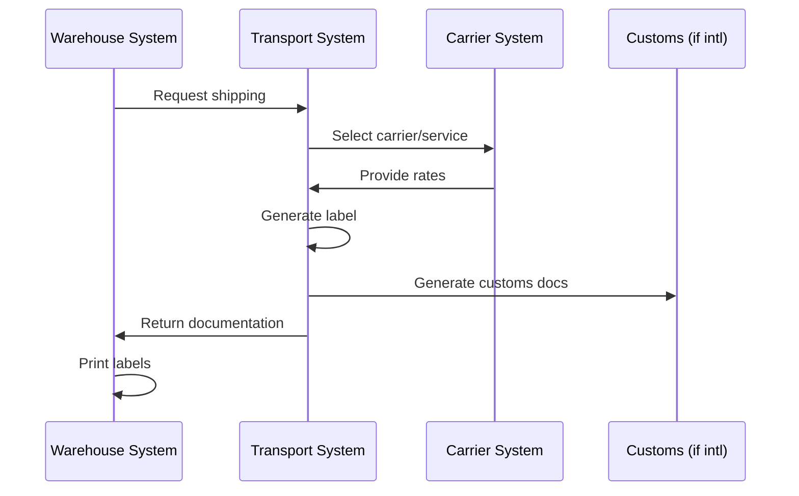

**Tasks:**
- `select.Carrier` - Choose shipping carrier/service
- `calculate.ShippingCost` - Determine shipping charge
- `generate.ShippingLabel` - Create carrier label
- `create.PackingSlip` - Produce packing documents
- `prepare.CustomsDocuments` - Generate international docs

### 4.4.3.8 - Stage and ship to carriers

Preparing shipments for carrier pickup and completing the handoff process.

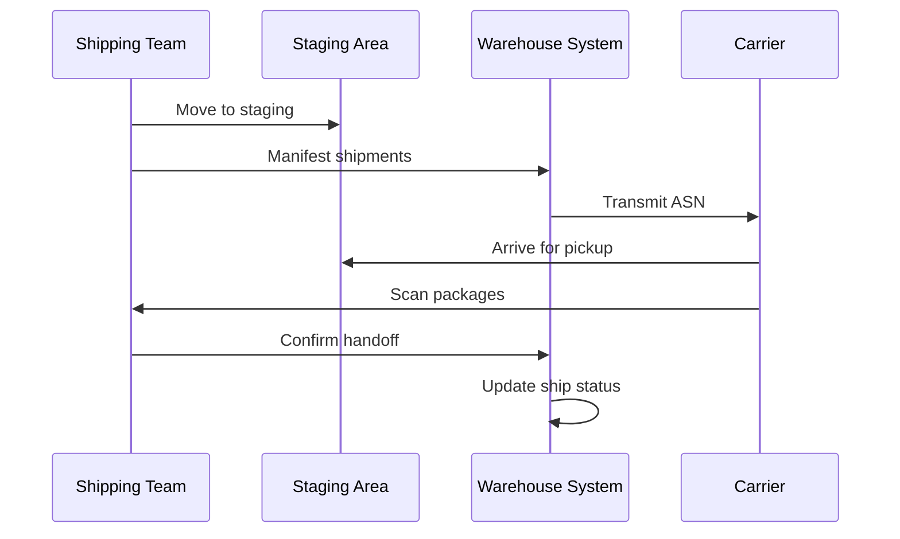

**Tasks:**
- `stage.Shipments` - Move to dock/staging area
- `create.Manifest` - Compile shipment manifest
- `load.Carrier` - Transfer to carrier vehicle
- `confirm.Handoff` - Record carrier receipt
- `transmit.ASN` - Send advance ship notice

## RACI Matrix

| Activity | Responsible | Accountable | Consulted | Informed |
|----------|-------------|-------------|-----------|----------|
| Receive orders | WMS Team | Warehouse Manager | Order Management | Sales |
| Allocate inventory | Inventory Team | Warehouse Manager | Planning, Finance | Production |
| Generate pick lists | WMS/Planning | Warehouse Manager | Operations, IT | Pickers |
| Pick products | Pickers | Shift Supervisor | WMS Team | Packing |
| Verify picks | QC/Packers | Quality Manager | Supervisors | Management |
| Pack products | Packers | Pack Supervisor | Quality, Shipping | Customers |
| Generate documentation | Shipping | Logistics Manager | Carriers, Customs | Finance |
| Ship to carriers | Shipping | Logistics Manager | Carriers | Sales, Customers |

## Related Departments

- [Warehousing](/departments/Warehousing) - Storage and fulfillment operations
- [Logistics](/departments/Logistics) - Transportation coordination
- [Order Management](/departments/OrderManagement) - Order processing
- [Quality Control](/departments/QualityControl) - Verification and inspection
- [Customer Service](/departments/CustomerService) - Order status updates
- [Finance](/departments/Finance/index) - Billing and revenue recognition

## Related Occupations

- [Warehouse Workers](/occupations/WarehouseWorkers) - Picking and packing
- [Shipping Clerks](/occupations/ShippingClerks) - Documentation and shipping
- [Forklift Operators](/occupations/ForkliftOperators) - Material movement
- [Warehouse Supervisors](/occupations/WarehouseSupervisors) - Operations oversight
- [Inventory Specialists](/occupations/InventorySpecialists) - Stock management
- [Logistics Coordinators](/occupations/LogisticsCoordinators) - Carrier coordination

## Industry Variations

### E-Commerce / Direct-to-Consumer

E-commerce fulfillment emphasizes single-unit picking, high order volumes, rapid turnaround, and individual consumer packaging. Each-pick and zone picking strategies are common. Returns processing is integrated.

**Industry-Specific Activities:**
- Execute each-pick fulfillment
- Implement wave planning for cutoff times
- Integrate gift wrapping and messaging
- Manage same-day/next-day shipping requirements
- Process return-to-stock efficiently

### Retail Distribution

Retail distribution centers focus on case and pallet picking for store replenishment, cross-docking, and flow-through operations. Store-friendly packaging and labeling are important.

**Industry-Specific Activities:**
- Execute case picking for store orders
- Implement store-friendly palletizing
- Manage pre-ticketing and labeling
- Coordinate vendor drop-ship programs
- Execute cross-dock operations

### Manufacturing

Manufacturing shipping emphasizes batch shipments, pallet loads, and just-in-time delivery to customers. Integration with production scheduling and quality release is critical.

**Industry-Specific Activities:**
- Coordinate production-to-ship timing
- Manage quality hold releases
- Execute batch and lot tracking
- Handle hazmat shipping requirements
- Implement customer-specific packaging

### Consumer Products

Consumer products shipping involves high-volume case picking, retailer compliance requirements, and complex promotional packaging. EDI integration with retailers is standard.

**Industry-Specific Activities:**
- Meet retailer compliance requirements
- Execute promotional packaging configurations
- Manage floor-ready merchandise
- Implement ASN requirements per customer
- Handle seasonal volume fluctuations

### Life Sciences / Pharmaceutical

Life sciences shipping requires temperature-controlled packaging, chain of custody documentation, serialization, and regulatory compliance. Cold chain monitoring is essential.

**Industry-Specific Activities:**
- Maintain cold chain integrity
- Execute serialization and track-and-trace
- Document chain of custody
- Manage controlled substance shipping
- Meet regulatory documentation requirements

### Food and Beverage

Food distribution requires temperature control, FIFO/FEFO rotation, lot tracking, and food safety compliance. Date code management and short shelf-life handling are critical.

**Industry-Specific Activities:**
- Maintain temperature zones
- Execute FEFO picking
- Manage date code compliance
- Handle food safety documentation
- Implement allergen separation

### Third-Party Logistics (3PL)

3PL operations manage multiple clients with different requirements, billing complexity, and varied system integrations. Client-specific SLAs and reporting are standard.

**Industry-Specific Activities:**
- Manage multi-client operations
- Execute client-specific requirements
- Calculate billable activities
- Provide client reporting and visibility
- Handle value-added services

## Sub-Processes

| Process | Code | Description |
|---------|------|-------------|
| Receive and validate orders | 4.4.3.1 | Order receipt and validation |
| Allocate inventory | 4.4.3.2 | Stock reservation for orders |
| Generate pick lists | 4.4.3.3 | Picking instruction creation |
| Pick products | 4.4.3.4 | Physical product retrieval |
| Pack for shipment | 4.4.3.6 | Packaging for transit |

## Related Processes

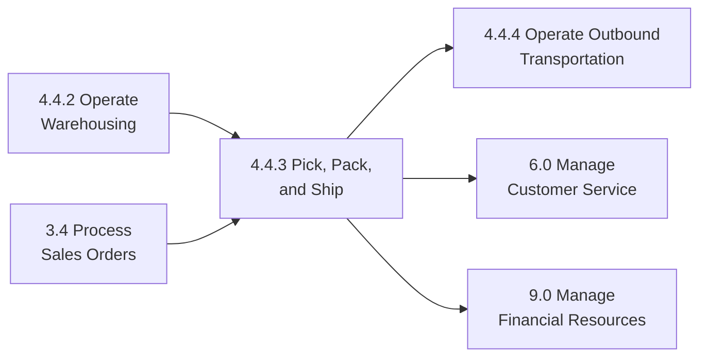

## Metrics & KPIs

| Metric | Description | Target |
|--------|-------------|--------|
| Order Accuracy | Orders shipped without errors | >99.5% |
| On-Time Shipment | Orders shipped by cutoff time | >98% |
| Units Per Hour | Picking productivity rate | Benchmark |
| Lines Per Hour | Packing productivity rate | Benchmark |
| Dock-to-Stock | Time from receipt to ship-ready | <24 hours |
| Cost Per Order | Total fulfillment cost per order | Minimize |
| Damage Rate | Products damaged during fulfillment | <0.1% |
| Cycle Time | Order receipt to carrier handoff | <4 hours |
| Pick Accuracy | Correct items picked rate | >99.9% |
| Pack Accuracy | Correct packaging rate | >99.8% |

---

*Source: APQC PCF 10356 (4.4.3) - Cross-Industry*
