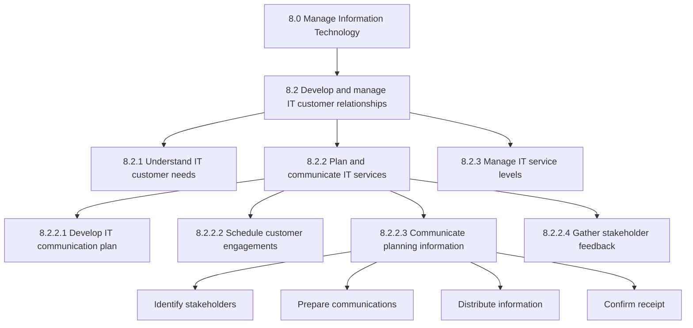
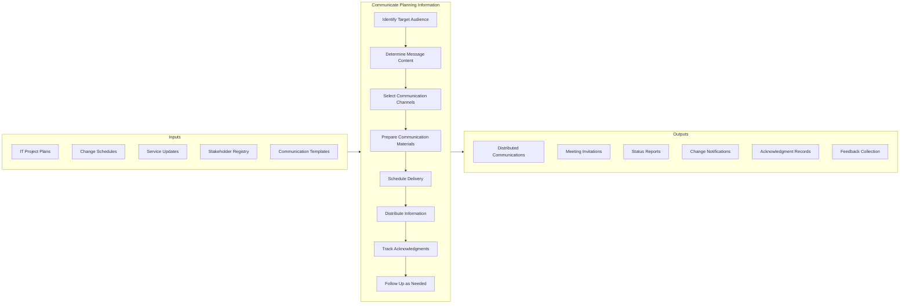
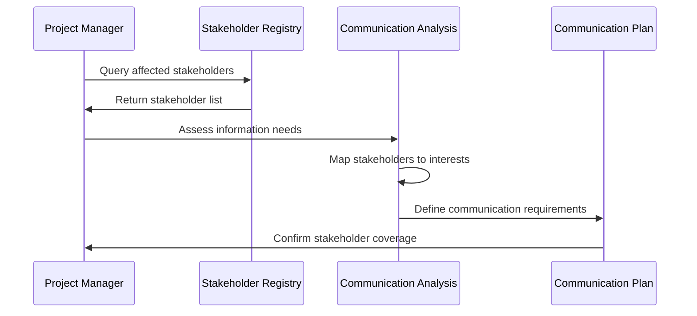
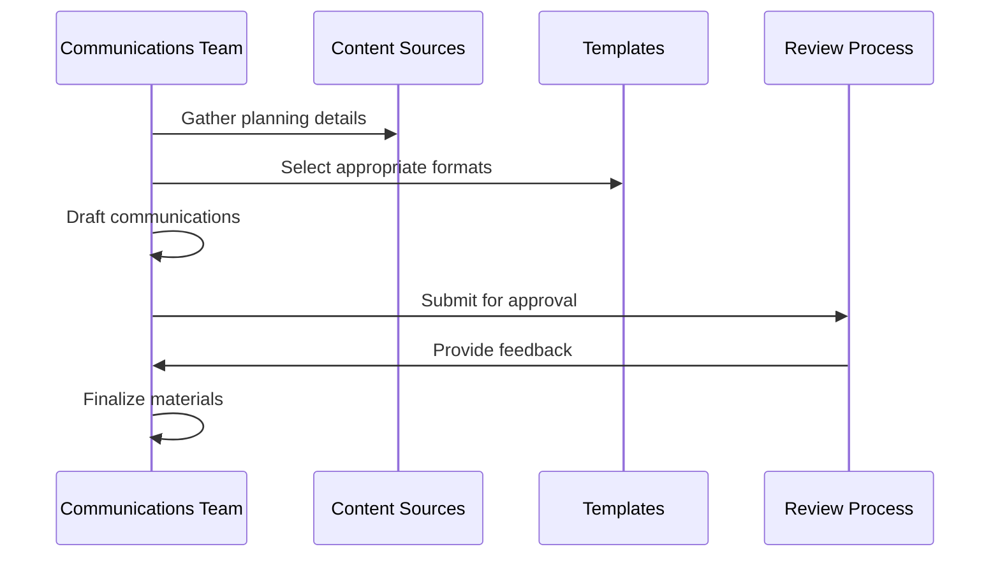
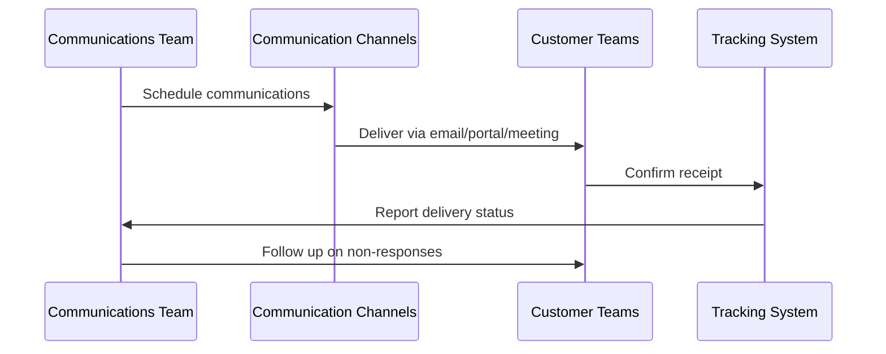
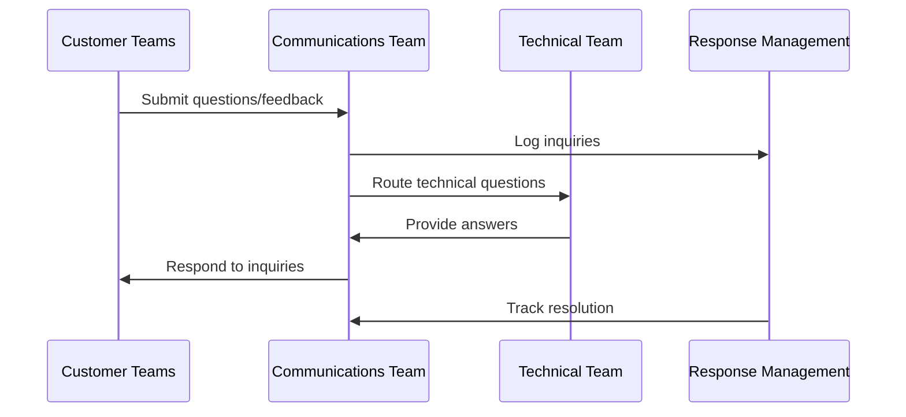
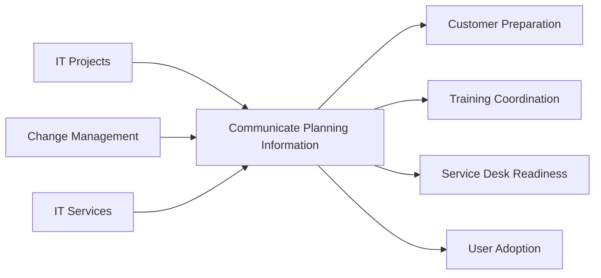

# Communicate planning information to customer teams

> Sending invitations and distributing information about upcoming events, projects, changes, and initiatives to customer teams and other involved entities. Ensuring all stakeholders are informed of IT plans, timelines, and impacts to enable coordination and preparation.

## Overview

Communicate planning information to customer teams is an IT customer relationship management process (APQC 11468) that ensures effective dissemination of IT-related information to business stakeholders. This process encompasses all communication activities that keep customer teams informed about IT plans, upcoming changes, project timelines, and service impacts.

Effective IT communication is essential for successful project delivery, change management, and service transitions. Organizations use this process to build trust with business stakeholders, manage expectations, minimize disruption from IT changes, and ensure that customer teams can adequately prepare for and participate in IT initiatives.

## Process Hierarchy



## Key Statistics

| Metric | Value |
|--------|-------|
| APQC Code | 11468 |
| Hierarchy ID | 8.2.2.3 |
| Level | Activity |
| Category | [Manage Information Technology](/processes/08-IT) |
| Process Group | Develop and manage IT customer relationships |
| Parent Process | Plan and communicate IT services |

## Process Flow



## GraphDL Semantic Structure

```
communicate.PlanningInformation.to.CustomerTeams
```

| Component | Value | Description |
|-----------|-------|-------------|
| Verb | `communicate` | Primary action of conveying information |
| Object | `PlanningInformation` | IT plans, schedules, and project details |
| Preposition | `to` | Direction of communication |
| PrepObject | `CustomerTeams` | Business stakeholders and users |

## Activities

### 8.2.2.3.1 - Identify stakeholders and communication needs

Determining who needs to receive IT planning information and what information is relevant to each stakeholder group.



**Tasks:**
- `identify.AffectedStakeholders` - Determine who is impacted by IT plans
- `assess.InformationNeeds` - Understand what each group needs to know
- `map.StakeholderInterests` - Align communications with stakeholder concerns
- `prioritize.CommunicationTargets` - Rank by impact and influence

### 8.2.2.3.2 - Prepare communication materials

Creating clear, relevant, and actionable communication content tailored to different stakeholder audiences.



**Tasks:**
- `gather.PlanningDetails` - Collect relevant information from project teams
- `draft.Communications` - Create tailored messages for each audience
- `format.Materials` - Apply appropriate templates and branding
- `review.Content` - Ensure accuracy and clarity before distribution

### 8.2.2.3.3 - Distribute planning information

Delivering communications through appropriate channels to ensure timely and effective receipt by target audiences.



**Tasks:**
- `schedule.Communications` - Time delivery for maximum effectiveness
- `distribute.ViaChannels` - Send through email, portals, meetings
- `track.Delivery` - Monitor receipt and acknowledgment
- `escalate.NonResponses` - Follow up with unacknowledged recipients

### 8.2.2.3.4 - Manage feedback and questions

Handling responses, questions, and concerns from customer teams to ensure two-way communication.



**Tasks:**
- `receive.Feedback` - Collect questions and concerns from stakeholders
- `route.Inquiries` - Direct questions to appropriate responders
- `track.Responses` - Monitor response time and quality
- `update.FAQs` - Incorporate common questions into future communications

## RACI Matrix

| Activity | Responsible | Accountable | Consulted | Informed |
|----------|-------------|-------------|-----------|----------|
| Identify stakeholders | IT Project Manager | IT Director | Business Unit Leads | Executive Team |
| Prepare materials | Communications Specialist | IT Communications Lead | Project Teams | IT Leadership |
| Review content | IT Communications Lead | CIO | Legal, Compliance | Project Managers |
| Distribute communications | Communications Specialist | IT Communications Lead | IT Service Desk | All Recipients |
| Track acknowledgments | IT Service Desk | IT Communications Lead | Project Managers | IT Management |
| Manage feedback | IT Service Desk | IT Director | Technical Teams | Communications Team |

## Related Departments

- [Information Technology](/departments/Technology) - Primary ownership and execution
- Corporate Communications - Communication standards and support
- [Project Management Office](/departments/Operations) - Project communication coordination
- Change Management - Change communication alignment
- Training - Training communication coordination

## Related Occupations

- [Computer and Information Systems Managers](/occupations/ComputerInformationSystemsManagers) - Communication oversight
- [Project Managers](/occupations/ProjectManagers) - Project communication responsibility
- [Technical Writers](/occupations/ArtsMedia/TechnicalWriters) - Content development
- [Training and Development Specialists](/occupations/TrainingSpecialists) - Training communications
- [Customer Service Representatives](/occupations/CustomerServiceReps) - Stakeholder interaction

## Industry Variations

### Banking

Banking IT communications require special attention to regulatory change notifications, security awareness, and system availability for trading hours. Communications must be precise about timing due to real-time processing requirements.

**Industry-Specific Activities:**
- Communicate trading system maintenance windows to traders
- Notify compliance teams of regulatory system changes
- Coordinate communications for branch system updates
- Distribute security awareness and fraud prevention updates

### Healthcare Provider

Healthcare IT communications must account for clinical workflow impacts, patient care considerations, and HIPAA training requirements. Communications about EHR changes require careful coordination with clinical leadership.

**Industry-Specific Activities:**
- Communicate EHR updates to clinical staff with adequate lead time
- Notify nursing stations of system maintenance during off-peak hours
- Distribute HIPAA compliance updates and training reminders
- Coordinate communications for medical device system changes

### Retail

Retail IT communications must consider store operations, peak shopping seasons, and omnichannel impacts. Communications about POS or inventory systems require coordination with store management.

**Industry-Specific Activities:**
- Avoid major system changes during holiday shopping seasons
- Communicate POS updates to store managers with training materials
- Notify distribution centers of inventory system changes
- Coordinate e-commerce system updates with marketing promotions

### Aerospace and Defense

Aerospace IT communications must address security classification levels, need-to-know requirements, and program-specific distribution. Communications about classified systems have additional handling requirements.

**Industry-Specific Activities:**
- Distribute classified system updates through secure channels
- Coordinate communications across multiple program security officers
- Notify engineering teams of PLM system changes
- Communicate export control system updates to compliance teams

### Utilities

Utilities IT communications must consider 24/7 operations, NERC CIP compliance, and critical infrastructure protection requirements. Communications about SCADA or grid management systems require careful coordination.

**Industry-Specific Activities:**
- Communicate SCADA system changes to operations centers
- Notify control room operators of critical system maintenance
- Distribute NERC CIP compliance training and updates
- Coordinate outage management system communications

## Sub-Processes

| Process | Code | Description |
|---------|------|-------------|
| [Develop IT communication plan](./CommunicationPlan) | 8.2.2.1 | Create communication strategy |
| [Schedule customer engagements](./CustomerEngagements) | 8.2.2.2 | Plan stakeholder meetings |
| [Gather stakeholder feedback](./StakeholderFeedback) | 8.2.2.4 | Collect and process feedback |

## Related Processes



## Metrics & KPIs

| Metric | Description | Target |
|--------|-------------|--------|
| Communication Timeliness | Percentage of communications sent on schedule | >95% |
| Acknowledgment Rate | Percentage of recipients confirming receipt | >90% |
| Stakeholder Coverage | Percentage of affected stakeholders reached | 100% |
| Communication Satisfaction | Stakeholder satisfaction with IT communications | >85% |
| Question Response Time | Average time to respond to inquiries | <24 hours |

---

*Source: APQC PCF 11468 (8.2.2.3) - Cross-Industry*
