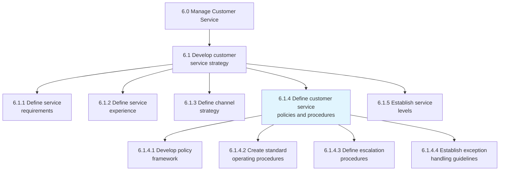
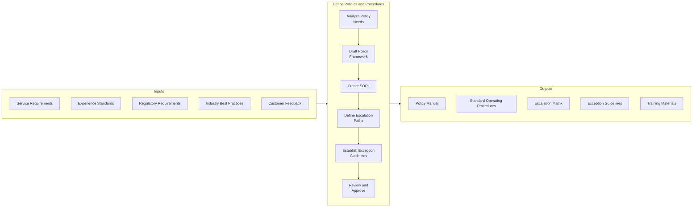
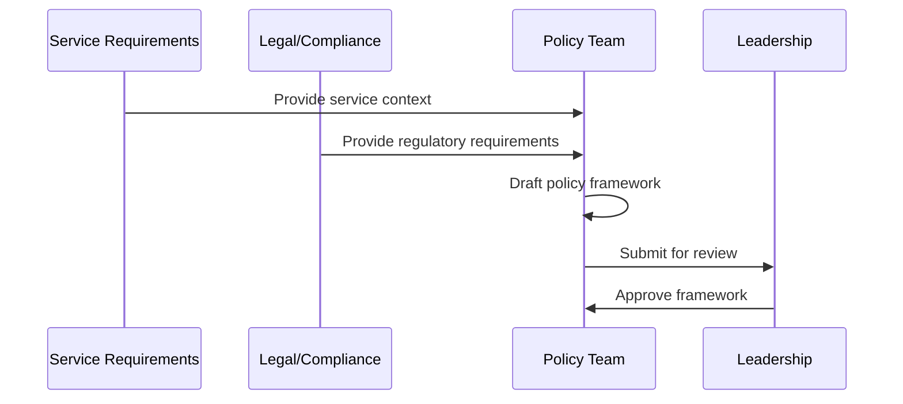
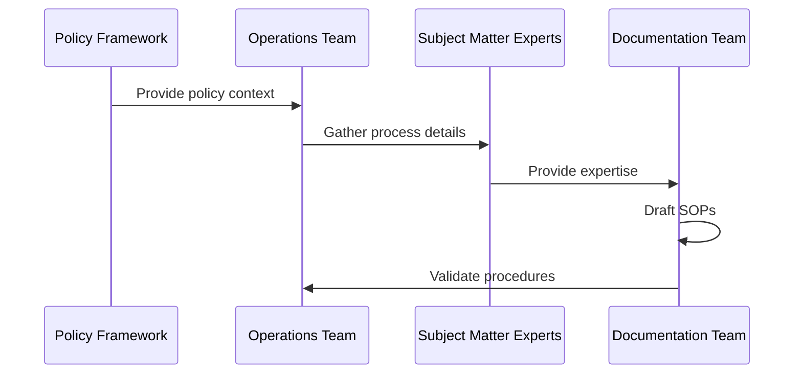
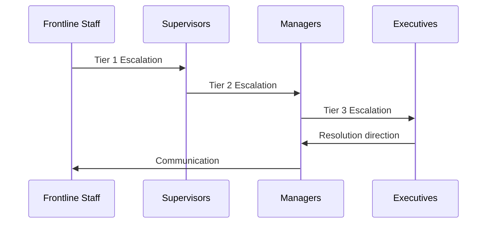
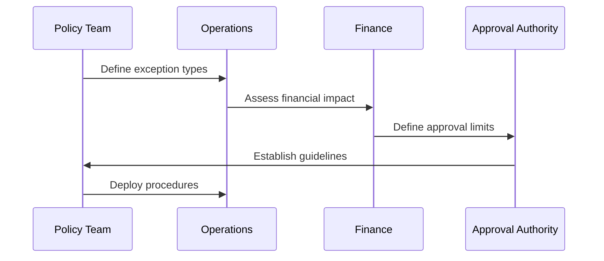
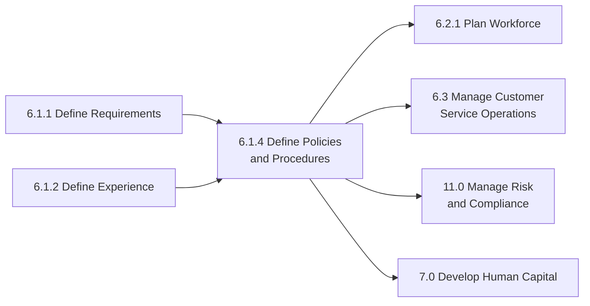

# Define customer service policies and procedures

> Outlining the framework of policies and methods for developing customer service strategy. Establish the rules and regulations that serve as a guideline for the customer service strategy. Take into account customer needs and behavior.

## Overview

Define customer service policies and procedures is a governance process (6.1.4) that establishes the rules, guidelines, and standard operating procedures for customer service operations. This process creates the policy framework that ensures consistent, compliant, and effective service delivery across all channels and touchpoints.

This process translates service requirements and experience standards into actionable policies that guide daily operations. It addresses escalation procedures, resolution authorities, exception handling, and compliance requirements. The resulting policy framework provides frontline staff with clear guidance while enabling appropriate flexibility for exceptional situations.

## Process Hierarchy



## Key Statistics

| Metric | Value |
|--------|-------|
| APQC Code | 10382 |
| Hierarchy ID | 6.1.4 |
| Level | Process |
| Category | [Manage Customer Service](/processes/06-CustomerService) |
| Parent Group | 6.1 Develop customer service strategy |

## Process Flow



## GraphDL Semantic Structure

```
define.CustomerServicePoliciesAndProcedures
```

| Component | Value | Description |
|-----------|-------|-------------|
| Verb | `define` | Establishing and documenting |
| Object | `CustomerServicePoliciesAndProcedures` | Governance rules and methods |
| Preposition | - | Not specified in base form |
| PrepObject | - | Not specified in base form |

## Activities

### 6.1.4.1 - Develop policy framework

Creating the overarching policy structure that governs customer service operations, including guiding principles, scope, and governance mechanisms.



**Tasks:**
- `analyze.PolicyRequirements` - Identify governance needs
- `draft.PolicyFramework` - Create structure and principles
- `align.WithRegulations` - Ensure compliance
- `obtain.LeadershipApproval` - Secure executive sign-off

### 6.1.4.2 - Create standard operating procedures

Developing detailed procedures that guide day-to-day customer service activities across all channels and scenarios.



**Tasks:**
- `identify.ProcessAreas` - Map procedure requirements
- `document.StandardProcedures` - Write detailed SOPs
- `validate.WithOperations` - Confirm feasibility
- `create.QuickReferenceGuides` - Develop job aids

### 6.1.4.3 - Define escalation procedures

Establishing clear paths for escalating customer issues based on complexity, severity, or required authority levels.



**Tasks:**
- `define.EscalationCriteria` - Establish trigger conditions
- `map.EscalationPaths` - Create routing logic
- `assign.AuthorityLevels` - Define decision rights
- `document.EscalationProcedures` - Create reference materials

### 6.1.4.4 - Establish exception handling guidelines

Creating guidelines for handling situations that fall outside standard procedures while maintaining appropriate controls.



**Tasks:**
- `identify.ExceptionTypes` - Categorize non-standard situations
- `define.ApprovalAuthorities` - Set decision-making levels
- `establish.CompensationLimits` - Define financial boundaries
- `create.DocumentationRequirements` - Ensure audit trail

## RACI Matrix

| Activity | Responsible | Accountable | Consulted | Informed |
|----------|-------------|-------------|-----------|----------|
| Develop policy framework | Policy Team | Customer Service Director | Legal, Compliance | All departments |
| Create SOPs | Operations Manager | Customer Service Director | Frontline Staff | All agents |
| Define escalation procedures | Operations Manager | Customer Service Director | All levels | All agents |
| Establish exception guidelines | Policy Team | Finance Director | Operations, Legal | All agents |
| Review and approve policies | Legal/Compliance | Chief Customer Officer | Executive Team | All stakeholders |
| Maintain policy documentation | Documentation Team | Policy Manager | Operations | All stakeholders |

## Related Departments

- Customer Service - Policy execution and feedback
- [Legal](/departments/Legal/index) - Regulatory compliance review
- Compliance - Policy governance
- [Finance](/departments/Finance/index) - Financial authority limits
- [Human Resources](/departments/HR/index) - Employment-related policies
- [Operations](/departments/Operations/index) - Operational feasibility

## Related Occupations

- [Customer Service Managers](/occupations/CustomerServiceManagers) - Policy development lead
- [Compliance Officers](/occupations/Business/Operations/ComplianceOfficers) - Regulatory alignment
- [Legal Counsel](/occupations/Legal/Lawyers) - Legal review
- [Operations Managers](/occupations/Management/OperationsManagers) - Procedure development
- [Technical Writers](/occupations/ArtsMedia/TechnicalWriters) - Documentation creation

## Industry Variations

### Aerospace and Defense

Aerospace policies address export controls, government contract requirements, and safety regulations. Procedures must accommodate classified information handling and security protocols.

**Industry-Specific Activities:**
- Develop ITAR/EAR compliance procedures
- Create government contract service policies
- Establish safety and quality documentation
- Define classified information handling

### Banking

Banking policies focus on consumer protection, fraud prevention, and regulatory compliance. Procedures must address dispute resolution, privacy, and anti-money laundering requirements.

**Industry-Specific Activities:**
- Develop Regulation E dispute procedures
- Create privacy and data protection policies
- Establish BSA/AML compliance procedures
- Define fraud investigation protocols

### Healthcare Provider

Healthcare policies emphasize patient privacy, clinical protocols, and care quality. Procedures must address HIPAA compliance, patient rights, and clinical documentation.

**Industry-Specific Activities:**
- Develop HIPAA-compliant communication policies
- Create patient grievance procedures
- Establish clinical documentation requirements
- Define informed consent protocols

### Retail

Retail policies address returns, exchanges, and customer satisfaction guarantees. Procedures span in-store and e-commerce operations with emphasis on consistency.

**Industry-Specific Activities:**
- Develop returns and exchange policies
- Create price-matching procedures
- Establish warranty claim processes
- Define loyalty program rules

### City Government

Government policies focus on transparency, equity, and legal compliance. Procedures must address public records requests, constituent rights, and due process.

**Industry-Specific Activities:**
- Develop public records request procedures
- Create constituent grievance policies
- Establish accessibility compliance protocols
- Define emergency response procedures

### Airline

Airline policies address Department of Transportation regulations, passenger rights, and irregular operations. Procedures must handle rebooking, compensation, and safety communications.

**Industry-Specific Activities:**
- Develop DOT compliance procedures
- Create irregular operations policies
- Establish denied boarding compensation rules
- Define baggage claim procedures

## Sub-Processes

| Process | Code | Description |
|---------|------|-------------|
| Develop policy framework | 6.1.4.1 | Creating governance structure |
| Create standard operating procedures | 6.1.4.2 | Documenting operational procedures |
| Define escalation procedures | 6.1.4.3 | Establishing escalation paths |
| Establish exception handling guidelines | 6.1.4.4 | Defining non-standard situation handling |

## Related Processes



## Metrics & KPIs

| Metric | Description | Target |
|--------|-------------|--------|
| Policy Compliance Rate | Adherence to documented policies | >95% |
| SOP Coverage | Processes covered by documented procedures | 100% |
| Escalation Resolution Time | Average time to resolve escalated issues | <24 hours |
| Exception Approval Rate | Exceptions within authority limits | >90% |
| Policy Currency | Age of policy documentation | <12 months |
| Audit Findings | Policy-related compliance issues | 0 critical |
| Training Completion | Staff trained on policies | 100% |
| Policy Accessibility | Staff able to access policies | 100% |

---

*Source: APQC PCF 10382 (6.1.4) - Cross-Industry*
