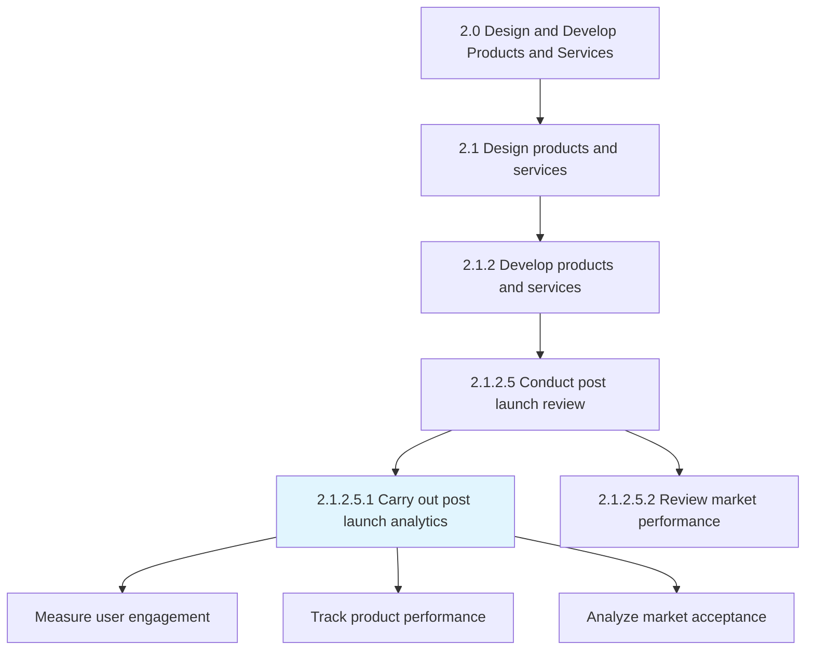
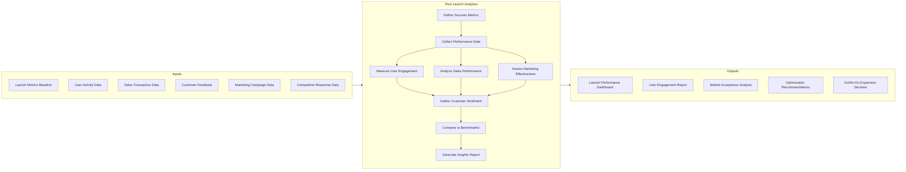
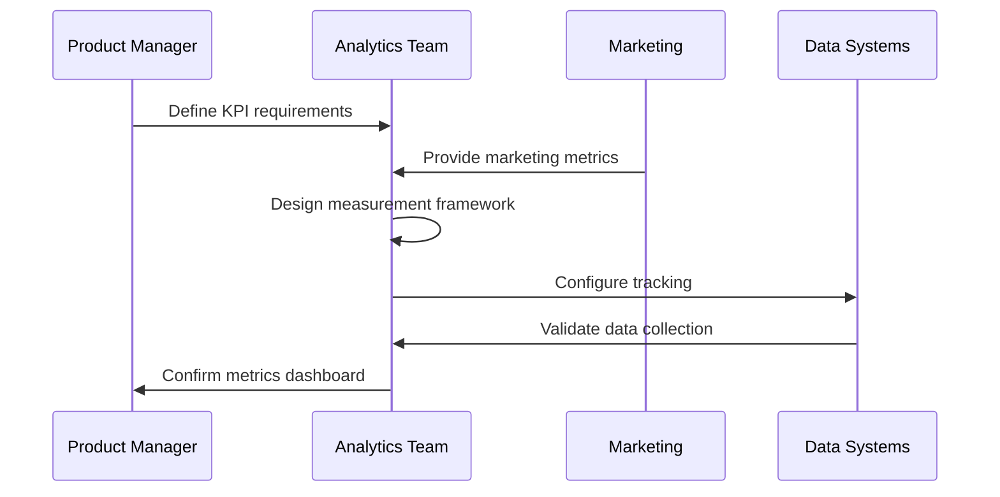
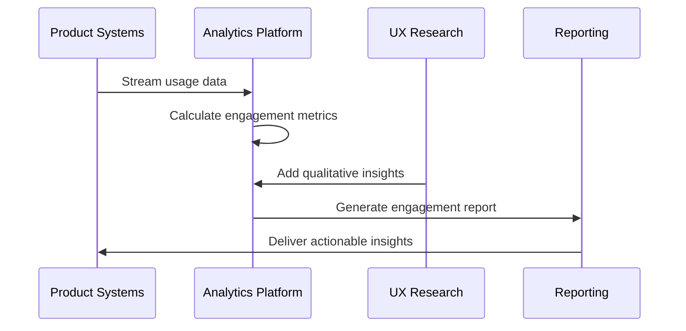
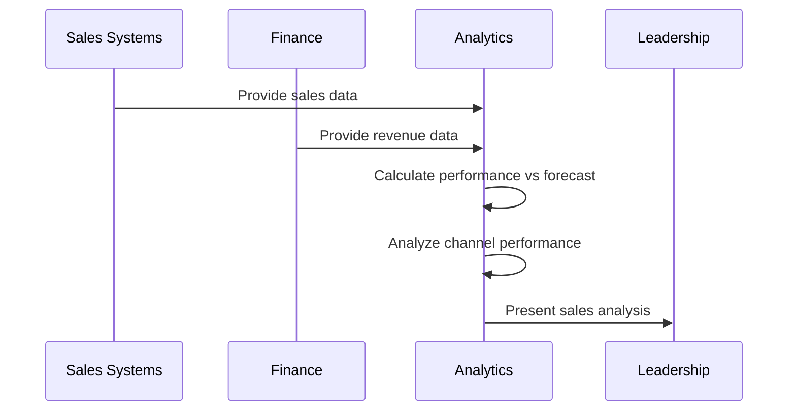
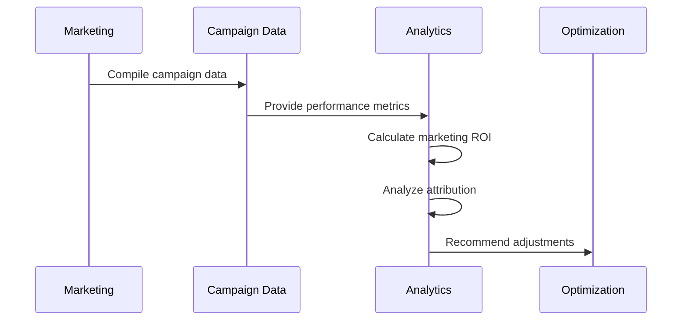
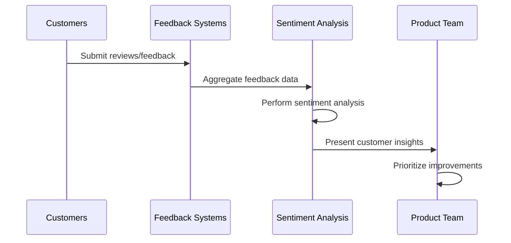
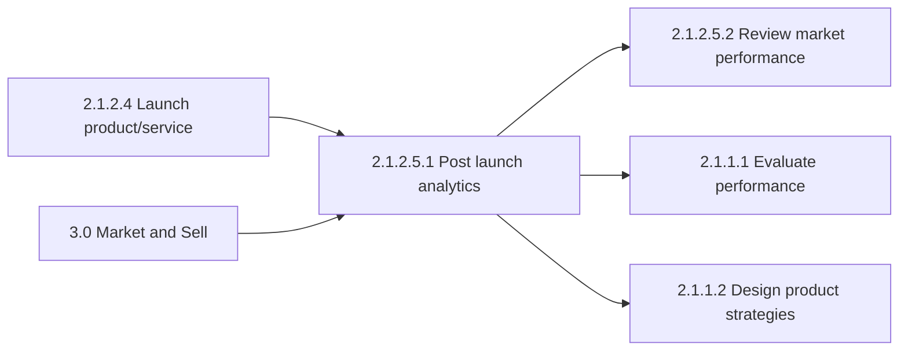

# Carry out post launch analytics to test the acceptability in the market

> Measuring the performance of marketing once the product/services are launched. This broadly covers measuring user engagement and product's/service's performance in the market.

## Overview

Carry out post launch analytics to test the acceptability in the market is a Sub-Activity within the Conduct Post Launch Review process (2.1.2.5). This process focuses on systematic measurement and analysis of how newly launched products or services are received by the market.

Post-launch analytics provides critical feedback on product-market fit, enabling organizations to make data-driven decisions about product adjustments, marketing refinements, and future development investments. It bridges the gap between launch execution and long-term market success.

## Process Hierarchy



## Key Statistics

| Metric | Value |
|--------|-------|
| APQC Code | 19646 |
| Hierarchy ID | 2.1.2.5.1 |
| Level | Sub-Activity |
| Parent Process | [Conduct post launch review](/processes/02-Products/PostLaunchReview) |
| Sibling Process | [Review market performance](./MarketPerformance.mdx) |
| Category | [Design and Develop Products and Services](/processes/02-Products) |

## Process Flow



## GraphDL Semantic Structure

```
carry.out.PostLaunchAnalyticsToTestAcceptabilityInMarket
```

| Component | Value | Description |
|-----------|-------|-------------|
| Verb | `carry` | Primary action verb (phrasal verb: carry out) |
| Object | (empty) | Part of phrasal verb construction |
| Preposition | `out` | Completes phrasal verb "carry out" |
| PrepObject | `PostLaunchAnalyticsToTestAcceptabilityInMarket` | The analytical activities being performed |

## Activities

### Define and Track Success Metrics

Establishing key performance indicators and tracking mechanisms for post-launch measurement.



**Tasks:**
- `define.SuccessMetrics` - Establish KPIs for launch success
- `configure.Tracking` - Set up data collection systems
- `create.Baselines` - Establish pre-launch benchmarks
- `validate.DataQuality` - Ensure measurement accuracy

### Measure User Engagement

Tracking how users interact with and adopt the new product/service.



**Tasks:**
- `track.UserAdoption` - Monitor new user acquisition
- `measure.Engagement` - Analyze usage patterns and depth
- `calculate.Retention` - Track user retention rates
- `analyze.FeatureUsage` - Identify popular/unused features

### Analyze Sales and Revenue Performance

Evaluating commercial success of the launched product/service.



**Tasks:**
- `compare.SalesToForecast` - Measure actual vs projected sales
- `analyze.RevenueGrowth` - Track revenue trajectory
- `evaluate.ChannelPerformance` - Assess sales channel effectiveness
- `calculate.CustomerAcquisition` - Measure acquisition metrics

### Assess Marketing Effectiveness

Evaluating how well marketing activities supported the launch.



**Tasks:**
- `measure.CampaignPerformance` - Track marketing campaign results
- `calculate.MarketingROI` - Determine return on marketing spend
- `analyze.Attribution` - Identify effective channels
- `evaluate.BrandImpact` - Assess brand awareness changes

### Gather and Analyze Customer Sentiment

Collecting customer feedback and sentiment about the new offering.



**Tasks:**
- `collect.CustomerFeedback` - Gather reviews and ratings
- `analyze.Sentiment` - Assess positive/negative sentiment
- `identify.Issues` - Discover product problems
- `track.NPS` - Monitor Net Promoter Score

## RACI Matrix

| Activity | Responsible | Accountable | Consulted | Informed |
|----------|-------------|-------------|-----------|----------|
| Define success metrics | Product Manager | VP Product | Marketing, Sales | Executive team |
| Configure data tracking | Analytics Team | Analytics Lead | IT, Product | Product team |
| Measure user engagement | Analytics Team | Product Manager | UX Research | Marketing |
| Analyze sales performance | Finance Analyst | VP Sales | Product | Executive team |
| Assess marketing effectiveness | Marketing Analytics | CMO | Product | Sales |
| Gather customer sentiment | Customer Experience | VP Product | Support | Marketing |
| Generate insights report | Product Manager | VP Product | All teams | Executive team |
| Make optimization decisions | Product Team | VP Product | Marketing, Sales | Executive team |

## Related Departments

- [Product Management](/departments/Product) - Owns launch success and product optimization
- [Marketing](/departments/Marketing/index) - Campaign performance and market positioning
- Analytics - Data collection and analysis
- [Sales](/departments/Sales/index) - Commercial performance tracking
- Customer Experience - Customer feedback and sentiment

## Related Occupations

- [Product Managers](/occupations/ProductManagers) - Launch ownership and optimization
- [Marketing Research Analysts](/occupations/MarketResearchAnalysts) - Market acceptance analysis
- [Business Intelligence Analysts](/occupations/Technology/BusinessIntelligenceAnalysts) - Performance analytics
- [Data Scientists](/occupations/Technology/DataScientists) - Advanced analytics and modeling
- [Marketing Managers](/occupations/Management/MarketingManagers) - Marketing effectiveness assessment

## Industry Variations

### Aerospace and Defense

Post-launch analytics focuses on program milestones, contract deliverables, and customer (government/military) acceptance. Timeline extends over longer periods with formal acceptance testing.

**Industry-Specific Activities:**
- Track program milestone achievement
- Monitor contract deliverable acceptance
- Assess technical performance metrics
- Review certification status

### Banking

Launch analytics for financial products emphasizes regulatory compliance, risk metrics, and customer adoption patterns. Includes monitoring for fraud and operational issues.

**Industry-Specific Activities:**
- Monitor product adoption rates
- Track default/risk metrics
- Assess regulatory compliance
- Analyze profitability by segment

### Consumer Products

Heavy focus on retail sell-through data, consumer awareness, and competitive response. Includes rapid iteration based on market feedback.

**Industry-Specific Activities:**
- Track retail velocity
- Monitor promotional lift
- Analyze consumer awareness
- Assess competitive response

### Healthcare Provider

Post-launch analytics for healthcare services focuses on patient outcomes, utilization rates, and clinical effectiveness within regulatory constraints.

**Industry-Specific Activities:**
- Measure patient outcomes
- Track service utilization
- Assess clinical effectiveness
- Monitor patient satisfaction

### Retail

Emphasis on store-level performance, inventory turnover, and omnichannel metrics. Includes rapid response to performance data.

**Industry-Specific Activities:**
- Analyze store performance
- Track inventory velocity
- Measure online/offline conversion
- Assess category impact

### City Government

Launch analytics for municipal services emphasizes citizen satisfaction, service utilization, and policy compliance.

**Industry-Specific Activities:**
- Measure citizen adoption
- Track service utilization
- Assess policy compliance
- Evaluate cost effectiveness

## Sub-Processes

| Process | Code | Description |
|---------|------|-------------|
| Configure analytics tracking | - | Setting up data collection systems |
| Measure engagement metrics | - | Tracking user interaction patterns |
| Analyze sales performance | - | Evaluating commercial success |
| Assess marketing effectiveness | - | Measuring marketing ROI |
| Gather customer sentiment | - | Collecting and analyzing feedback |

## Related Processes



## Metrics & KPIs

| Metric | Description | Target |
|--------|-------------|--------|
| User Adoption Rate | Percentage of target users adopting | >15% in 30 days |
| Engagement Score | Composite user engagement metric | >70/100 |
| Sales vs Forecast | Actual sales as % of forecast | >90% |
| Marketing ROI | Return on launch marketing spend | >200% |
| Customer Satisfaction | CSAT score for new product | >80% |
| Net Promoter Score | NPS for launched product | >30 |
| Feature Adoption | % of users using key features | >60% |
| Time to Value | Time for users to achieve value | <7 days |

---

*Source: APQC PCF 19646 (2.1.2.5.1) - Cross-Industry*
