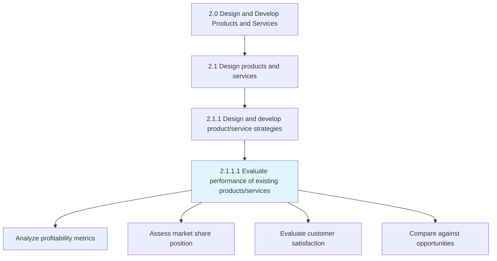
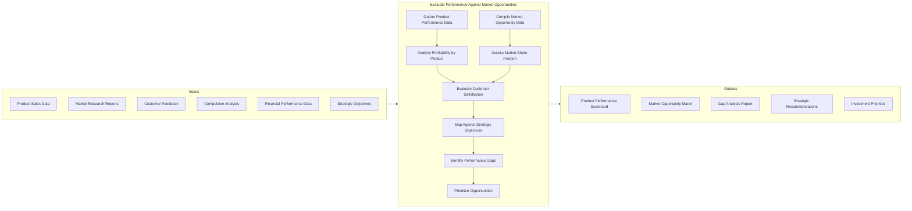
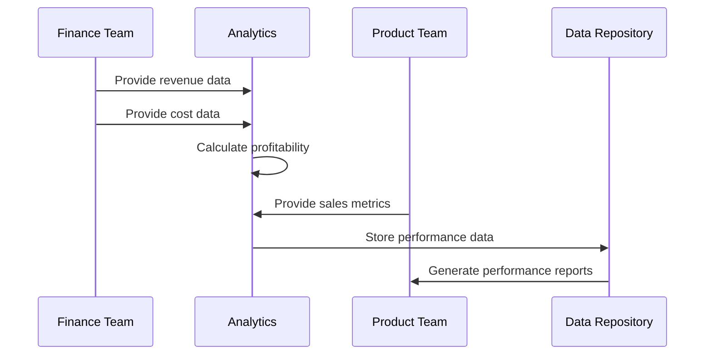
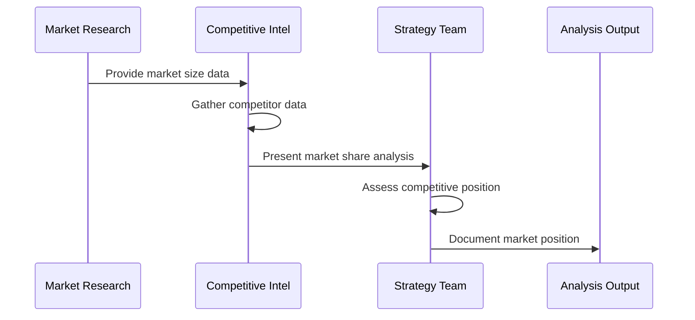
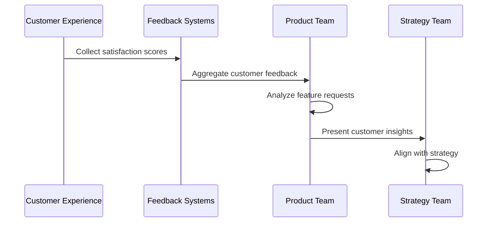
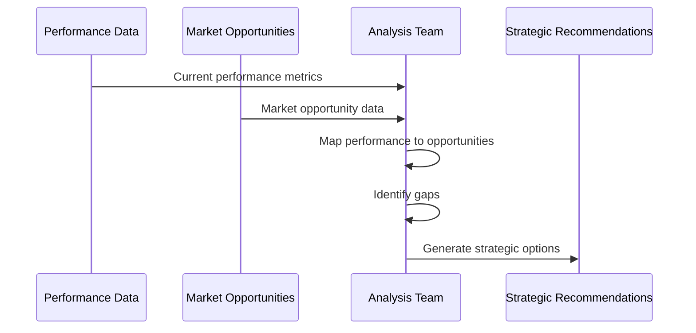
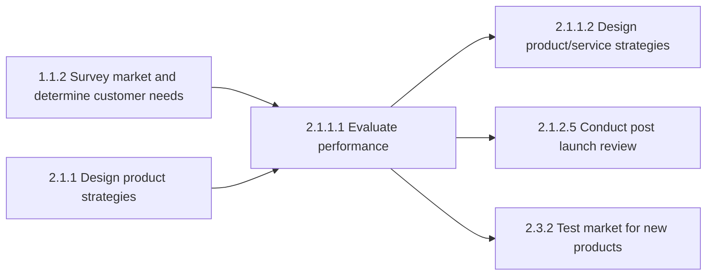

# Evaluate performance of existing products/services against market opportunities

> Assessing the capabilities and performance of existing products/services, in light of market opportunities. Examine performance of the existing line of products/services, including measures of profitability, market share, customer satisfaction, and alignment with strategic objectives.

## Overview

Evaluate performance of existing products/services against market opportunities is a critical Activity within the Design and Develop Products and Services category (2.0). This process ensures organizations continuously assess how well their current offerings meet market demands and where gaps or opportunities exist.

The process involves systematic evaluation of product/service metrics against market potential, competitive positioning, and customer expectations. It feeds directly into product strategy decisions including enhancements, retirements, and new development priorities.

## Process Hierarchy



## Key Statistics

| Metric | Value |
|--------|-------|
| APQC Code | 10063 |
| Hierarchy ID | 2.1.1.1 |
| Level | Activity |
| Parent Process | [Design and develop product/service strategies](/processes/02-Products/DesignProductStrategies) |
| Category | [Design and Develop Products and Services](/processes/02-Products) |

## Process Flow



## GraphDL Semantic Structure

```
evaluate.Performance.of.ExistingProductsAgainstMarketOpportunities
evaluate.Performance.of.ExistingServicesAgainstMarketOpportunities
```

| Component | Value | Description |
|-----------|-------|-------------|
| Verb | `evaluate` | Primary action of assessment and analysis |
| Object | `Performance` | The performance metrics being evaluated |
| Preposition | `of` | Relating performance to specific subjects |
| PrepObject | `ExistingProductsAgainstMarketOpportunities` | Products/services compared to market potential |

## Activities

### Gather and Analyze Product Performance Data

Collecting comprehensive data on current product/service performance across multiple dimensions including sales, profitability, and customer metrics.



**Tasks:**
- `gather.SalesData` - Collect product sales volumes and trends
- `calculate.Profitability` - Determine margins and contribution
- `analyze.CostStructure` - Examine product cost components
- `track.RevenueGrowth` - Monitor revenue trajectory

### Assess Market Share and Competitive Position

Evaluating current market position relative to competitors and total addressable market.



**Tasks:**
- `calculate.MarketShare` - Determine percentage of total market
- `benchmark.Competitors` - Compare against competitive offerings
- `identify.MarketTrends` - Track market growth and shifts
- `assess.CompetitiveThreats` - Evaluate competitive dynamics

### Evaluate Customer Satisfaction and Alignment

Measuring customer satisfaction with existing offerings and alignment with their evolving needs.



**Tasks:**
- `measure.CustomerSatisfaction` - Track CSAT and NPS scores
- `analyze.CustomerFeedback` - Review qualitative feedback
- `identify.UnmetNeeds` - Discover gaps in current offerings
- `assess.CustomerRetention` - Monitor loyalty metrics

### Map Performance to Market Opportunities

Comparing current performance against identified market opportunities to determine strategic fit.



**Tasks:**
- `map.PerformanceToOpportunity` - Align metrics with market potential
- `identify.PerformanceGaps` - Find underperforming areas
- `prioritize.Opportunities` - Rank opportunities by fit
- `recommend.Actions` - Propose strategic responses

## RACI Matrix

| Activity | Responsible | Accountable | Consulted | Informed |
|----------|-------------|-------------|-----------|----------|
| Gather performance data | Finance Analyst | CFO | Product Managers | Executive team |
| Analyze profitability | Financial Planning | VP Finance | Sales | Product team |
| Assess market share | Market Research | CMO | Strategy | Executive team |
| Evaluate customer satisfaction | Customer Experience | VP Product | Support | All stakeholders |
| Map to opportunities | Strategy Team | Chief Strategy Officer | Product, Finance | Executive team |
| Prioritize investments | Product Management | CEO | Finance | Board |
| Generate recommendations | Strategy Team | Chief Strategy Officer | Product, Sales | Executive team |

## Related Departments

- [Finance](/departments/Finance/index) - Financial performance analysis and profitability assessment
- [Marketing](/departments/Marketing/index) - Market research and competitive intelligence
- [Product Management](/departments/Product) - Product strategy and roadmap ownership
- [Sales](/departments/Sales/index) - Revenue data and customer insights
- [Strategy](/departments/Strategy/index) - Strategic alignment and investment decisions

## Related Occupations

- [Financial Analysts](/occupations/Business/Financial/FinancialAnalysts) - Financial performance evaluation
- [Market Research Analysts](/occupations/MarketResearchAnalysts) - Market opportunity assessment
- [Product Managers](/occupations/ProductManagers) - Product performance ownership
- [Business Intelligence Analysts](/occupations/Technology/BusinessIntelligenceAnalysts) - Data analysis and reporting
- [Management Analysts](/occupations/Business/Operations/ManagementAnalysts) - Strategic recommendations

## Industry Variations

### Aerospace and Defense

Evaluation focuses on long-term contract performance, technology readiness levels, and alignment with government procurement cycles. Market opportunities are assessed against defense budget projections.

**Industry-Specific Activities:**
- Evaluate contract performance metrics
- Assess technology maturity levels
- Analyze government budget alignment
- Review certification compliance

### Banking

Financial services evaluation emphasizes regulatory compliance, risk-adjusted returns, and customer segment profitability. Market opportunities consider digital transformation trends.

**Industry-Specific Activities:**
- Analyze risk-adjusted profitability
- Evaluate regulatory compliance costs
- Assess digital channel performance
- Review customer segment economics

### Consumer Products

Emphasis on brand health, shelf performance, and consumer preference tracking. Market opportunities evaluated through retail analytics and consumer insights.

**Industry-Specific Activities:**
- Monitor brand health metrics
- Analyze retail sell-through data
- Track consumer preference shifts
- Evaluate promotional effectiveness

### Healthcare Provider

Service line performance evaluated against patient outcomes, payer mix, and community health needs. Market opportunities assessed through population health data.

**Industry-Specific Activities:**
- Analyze service line profitability
- Evaluate patient outcome metrics
- Assess payer reimbursement trends
- Review community health alignment

### Retail

Store and category performance analysis with focus on omnichannel metrics. Market opportunities identified through location analytics and demographic shifts.

**Industry-Specific Activities:**
- Evaluate store-level performance
- Analyze category contribution
- Assess omnichannel conversion
- Review location analytics

## Sub-Processes

| Process | Code | Description |
|---------|------|-------------|
| Analyze product profitability | - | Calculating margins and contribution by product |
| Assess market position | - | Determining competitive standing |
| Evaluate customer alignment | - | Measuring customer satisfaction with offerings |
| Identify opportunity gaps | - | Finding performance-to-opportunity mismatches |

## Related Processes



## Metrics & KPIs

| Metric | Description | Target |
|--------|-------------|--------|
| Product Profitability | Margin contribution by product | >30% gross margin |
| Market Share | Percentage of addressable market | Growth YoY |
| Customer Satisfaction | CSAT/NPS for product line | >80% satisfaction |
| Performance Gap Score | Distance from opportunity potential | <10% gap |
| Strategic Alignment | Fit with corporate objectives | >90% aligned |
| Investment Efficiency | ROI on product investments | >150% |

---

*Source: APQC PCF 10063 (2.1.1.1) - Cross-Industry*
