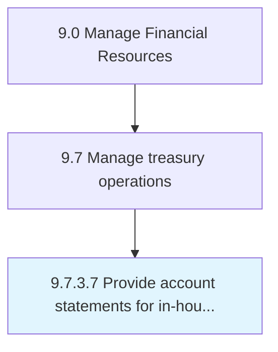

# Provide account statements for in-house bank accounts

> Facilitating account statements for all in-house banking activity.

## Overview

Activity 9.7.3.7 is an activity within the Manage Financial Resources framework. 

Facilitating account statements for all in-house banking activity.

## Process Hierarchy



## Key Statistics

| Metric | Value |
|--------|-------|
| APQC Code | 10907 |
| Hierarchy ID | 9.7.3.7 |
| Level | Activity |
| Parent | [9.7.3](../) |
| Sub-Processes | 0 |


## GraphDL Semantic Structure

```
provide.AccountStatements.for.InhouseBankAccounts
```

| Component | Value | Description |
|-----------|-------|-------------|
| Verb | `provide` | Primary action |
| Object | `account statements` | Direct object |
| Preposition | `for` | Relationship |
| PrepObject | `in-house bank accounts` | Indirect object |


---

*Source: APQC PCF 10907 (9.7.3.7) - APQC*

## Related Occupations

- [Treasurers and Controllers](/occupations/Management/TreasurersAndControllers)
- [Financial Managers](/occupations/Management/FinancialManagers)
- [Accountants and Auditors](/occupations/Finance/AccountantsAndAuditors)
- [Bookkeeping, Accounting, and Auditing Clerks](/occupations/Office/BookkeepingAccountingAuditingClerks)
- [Financial Clerks](/occupations/Office/FinancialClerks)

## Related Departments

- [Treasury](/departments/Treasury)
- [Finance](/departments/Finance)
- [Intercompany Accounting](/departments/IntercompanyAccounting)
- [Financial Reporting](/departments/FinancialReporting)

## Industry Variations

This process applies universally across all industries, with the following common best practices:

### Universal Applicability

Providing account statements for in-house bank accounts is essential for organizations operating centralized treasury and intercompany financing structures. Clear statements support subsidiary financial management and audit compliance.

### Cross-Industry Best Practices

| Practice | Description |
|----------|-------------|
| Standardized Format | Use consistent statement formats across all participating entities |
| Timely Delivery | Provide statements within agreed timeframes, typically monthly |
| Self-Service Access | Enable subsidiaries to access statements via treasury portal |
| Audit Trail | Maintain complete transaction history for compliance |
| Multi-Currency Support | Handle statements in local and functional currencies |

### Common Metrics

- Statement delivery timeliness
- Statement accuracy rate
- Subsidiary satisfaction with reporting
- Query resolution time
- Self-service portal adoption
