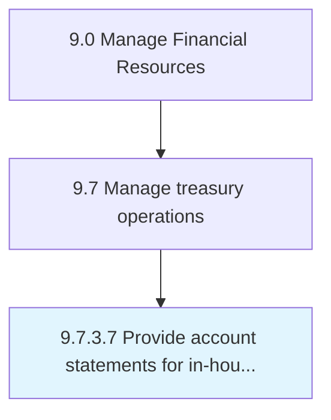

# Provide account statements for in-house bank accounts

> Facilitating account statements for all in-house banking activity.

## Overview

Activity 9.7.3.7 is an activity within the Manage Financial Resources framework. 

Facilitating account statements for all in-house banking activity.

## Process Hierarchy



## Key Statistics

| Metric | Value |
|--------|-------|
| APQC Code | 10907 |
| Hierarchy ID | 9.7.3.7 |
| Level | Activity |
| Parent | [9.7.3](../) |
| Sub-Processes | 0 |


## GraphDL Semantic Structure

```
provide.AccountStatements.for.InhouseBankAccounts
```

| Component | Value | Description |
|-----------|-------|-------------|
| Verb | `provide` | Primary action |
| Object | `account statements` | Direct object |
| Preposition | `for` | Relationship |
| PrepObject | `in-house bank accounts` | Indirect object |


---

*Source: APQC PCF 10907 (9.7.3.7) - APQC*

## Related Occupations

- [General and Operations Managers](/occupations/Management/GeneralAndOperationsManagers)
- [Management Analysts](/occupations/Business/ManagementAnalysts)
- [Chief Executives](/occupations/Management/ChiefExecutives)

## Related Departments

- [Executive](/departments/Executive)
- [Operations](/departments/Operations)
- [Finance](/departments/Finance)
