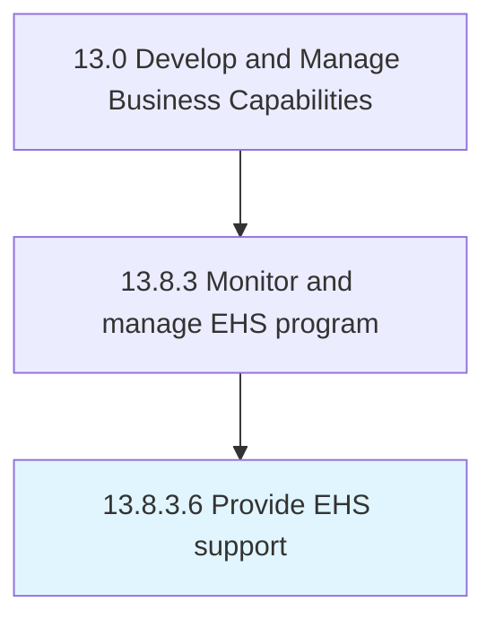

# Provide EHS support

> Supporting employees in light of the organization's environmental, health, and safety policies and standards.

## Overview

Activity 13.8.3.6 is an activity within the Develop and Manage Business Capabilities framework. 

Supporting employees in light of the organization's environmental, health, and safety policies and standards. Provide medical insurance, maternity leave, environmental education, training over safety, etc.

## Process Hierarchy



## Key Statistics

| Metric | Value |
|--------|-------|
| APQC Code | 11195 |
| Hierarchy ID | 13.8.3.6 |
| Level | Activity |
| Parent | [13.8.3](../) |
| Sub-Processes | 0 |


## GraphDL Semantic Structure

```
provide.EHSSupport
```

| Component | Value | Description |
|-----------|-------|-------------|
| Verb | `provide` | Primary action |
| Object | `EHS support` | Direct object |


## Related Concepts

- EHSSupport


---

*Source: APQC PCF 11195 (13.8.3.6) - APQC*

## Related Occupations

- [General and Operations Managers](/occupations/Management/GeneralAndOperationsManagers)
- [Management Analysts](/occupations/Business/ManagementAnalysts)
- [Chief Executives](/occupations/Management/ChiefExecutives)

## Related Departments

- [Executive](/departments/Executive)
- [Operations](/departments/Operations)
- [Finance](/departments/Finance)
