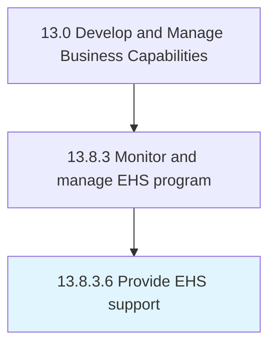

# Provide EHS support

> Supporting employees in light of the organization's environmental, health, and safety policies and standards.

## Overview

Activity 13.8.3.6 is an activity within the Develop and Manage Business Capabilities framework. 

Supporting employees in light of the organization's environmental, health, and safety policies and standards. Provide medical insurance, maternity leave, environmental education, training over safety, etc.

## Process Hierarchy



## Key Statistics

| Metric | Value |
|--------|-------|
| APQC Code | 11195 |
| Hierarchy ID | 13.8.3.6 |
| Level | Activity |
| Parent | [13.8.3](../) |
| Sub-Processes | 0 |


## GraphDL Semantic Structure

```
provide.EHSSupport
```

| Component | Value | Description |
|-----------|-------|-------------|
| Verb | `provide` | Primary action |
| Object | `EHS support` | Direct object |


## Related Concepts

- EHSSupport


---

*Source: APQC PCF 11195 (13.8.3.6) - APQC*

## Related Occupations

- [Occupational Health and Safety Specialists](/occupations/LifeScience/OccupationalHealthAndSafetySpecialists)
- [Environmental Scientists and Specialists](/occupations/LifeScience/EnvironmentalScientistsAndSpecialists)
- [Health and Safety Engineers](/occupations/Engineering/HealthAndSafetyEngineers)
- [Training and Development Specialists](/occupations/Business/TrainingAndDevelopmentSpecialists)
- [Human Resources Specialists](/occupations/Business/HumanResourcesSpecialists)

## Related Departments

- [Environmental Health and Safety](/departments/EHS)
- [Human Resources](/departments/HR)
- [Operations](/departments/Operations)
- [Training](/departments/Training)
- [Facilities](/departments/Facilities)

## Industry Variations

This process applies universally across all industries, with the following common best practices:

### Universal Applicability

EHS support is essential for every organization with employees and physical operations. Effective support protects workers, ensures compliance, and promotes organizational sustainability.

### Cross-Industry Best Practices

| Practice | Description |
|----------|-------------|
| Accessible Resources | Make EHS information and support easily accessible to all employees |
| Proactive Communication | Regularly communicate EHS updates and reminders |
| Training Programs | Provide role-appropriate EHS training and certifications |
| Incident Response | Maintain clear processes for reporting and responding to EHS issues |
| Wellness Integration | Connect EHS with broader employee wellness initiatives |

### Common Metrics

- EHS training completion rate
- Workplace injury and illness rate (OSHA recordable)
- Near-miss reporting rate
- EHS support request response time
- Employee EHS awareness scores
- Regulatory inspection outcomes
