# Monitor quality of product delivered

> Track the performance of the suppliers on product quality. Use this information to further improve sourcing and supplier performance. Monitor incoming materials, in-process production, and finished goods to ensure quality standards are consistently met throughout the supply chain.

## Overview

Monitor quality of product delivered (APQC 4.2.4) encompasses all activities related to tracking, measuring, and improving the quality of products as they move through the supply chain from suppliers to customers. This process is essential for maintaining customer satisfaction, reducing defect-related costs, and driving continuous improvement across the extended supply chain.

Quality monitoring spans incoming material inspection, supplier performance tracking, in-process quality checks, finished goods inspection, and customer feedback analysis. Effective quality monitoring enables organizations to identify issues early, hold suppliers accountable, and prevent defective products from reaching customers.

## Process Hierarchy

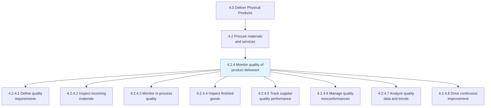

## Key Statistics

| Metric | Value |
|--------|-------|
| APQC Code | 10302 |
| Hierarchy ID | 4.2.4 |
| Level | Process |
| Category | [Deliver Physical Products](/processes/04-Delivery) |
| Parent Process | Procure materials and services |
| Activities | 8 |

## Process Flow

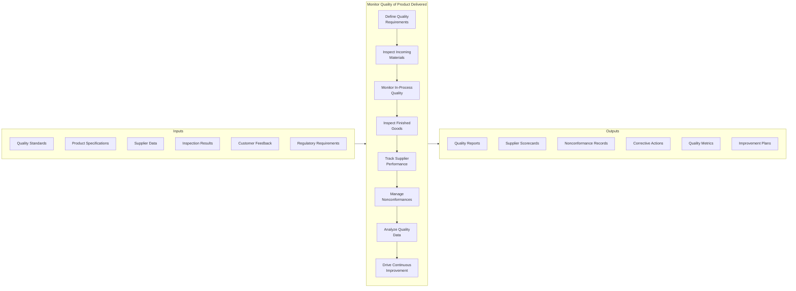

## GraphDL Semantic Structure

```
monitor.QualityOfProductDelivered
```

| Component | Value | Description |
|-----------|-------|-------------|
| Verb | `monitor` | Action of tracking and measuring |
| Object | `QualityOfProductDelivered` | Product quality throughout supply chain |
| Preposition | - | Not applicable |
| PrepObject | - | Not applicable |

## Activities

### 4.2.4.1 - Define quality requirements

Establishing quality standards, specifications, and acceptance criteria for incoming materials, in-process work, and finished products.

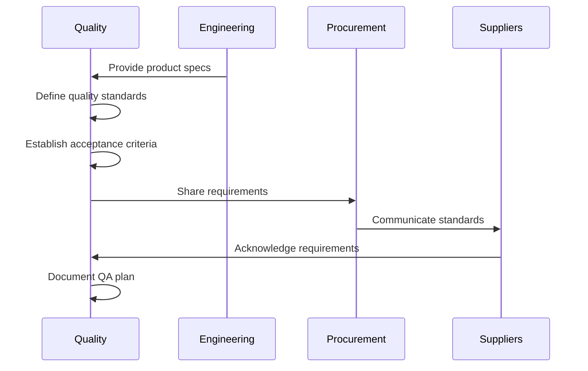

**Tasks:**
- `define.QualityStandards` - Establish quality criteria
- `establish.AcceptanceCriteria` - Set pass/fail thresholds
- `document.InspectionProcedures` - Create inspection methods
- `communicate.Requirements` - Share with stakeholders
- `create.QualityAgreements` - Formalize with suppliers

### 4.2.4.2 - Inspect incoming materials

Receiving and inspecting materials from suppliers to verify they meet quality specifications before acceptance into inventory.

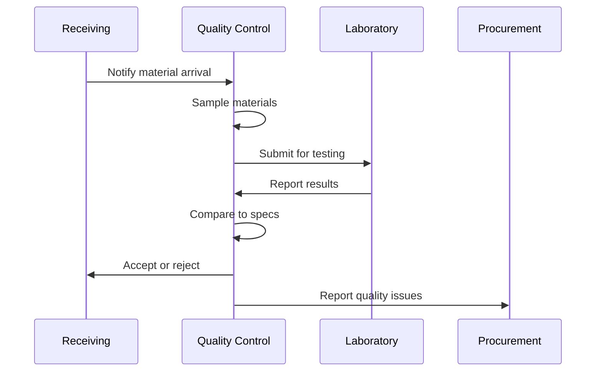

**Tasks:**
- `receive.InboundMaterials` - Accept deliveries
- `sample.Materials` - Select representative samples
- `inspect.Materials` - Perform quality checks
- `test.MaterialProperties` - Verify specifications
- `disposition.Materials` - Accept, reject, or quarantine

### 4.2.4.3 - Monitor in-process quality

Tracking quality during production through statistical process control, inspections, and testing to detect and correct issues early.

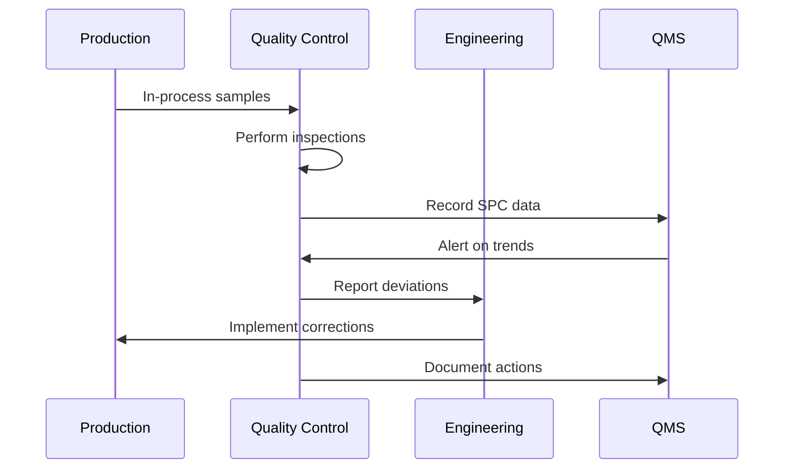

**Tasks:**
- `collect.ProcessSamples` - Gather in-process samples
- `perform.SPCMonitoring` - Track statistical measures
- `conduct.FirstArticleInspection` - Verify setup quality
- `inspect.WIPQuality` - Check work-in-progress
- `document.InProcessResults` - Record findings

### 4.2.4.4 - Inspect finished goods

Performing final quality inspections on completed products before release to inventory or shipment to customers.

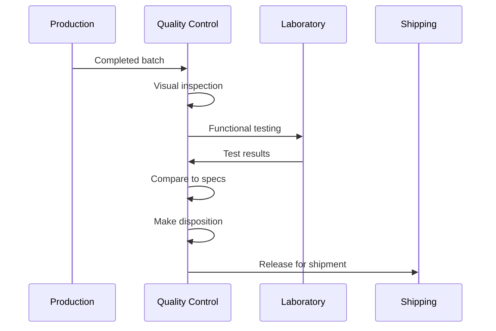

**Tasks:**
- `inspect.FinishedGoods` - Examine completed products
- `test.ProductFunctionality` - Verify performance
- `verify.Packaging` - Check packaging quality
- `review.Documentation` - Confirm records complete
- `release.Product` - Approve for shipment

### 4.2.4.5 - Track supplier quality performance

Monitoring and measuring supplier quality performance using metrics, scorecards, and regular reviews.

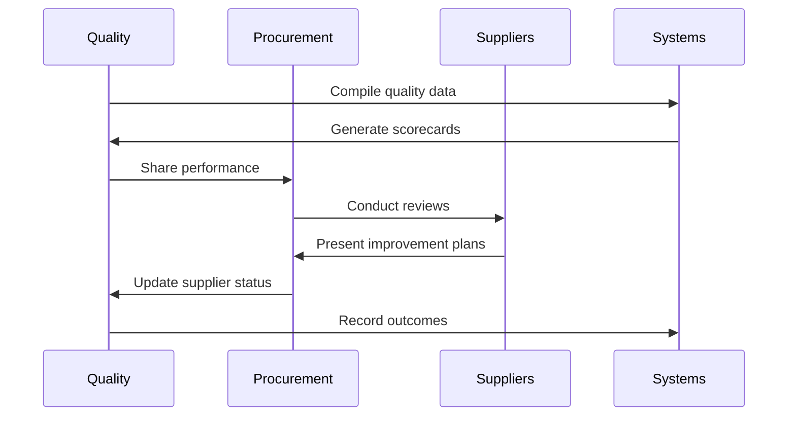

**Tasks:**
- `calculate.SupplierMetrics` - Compute quality KPIs
- `generate.SupplierScorecards` - Create performance reports
- `conduct.SupplierReviews` - Hold review meetings
- `classify.SupplierStatus` - Rate supplier performance
- `manage.SupplierDevelopment` - Drive improvements

### 4.2.4.6 - Manage quality nonconformances

Handling quality issues, defects, and nonconforming materials through investigation, disposition, and corrective action.

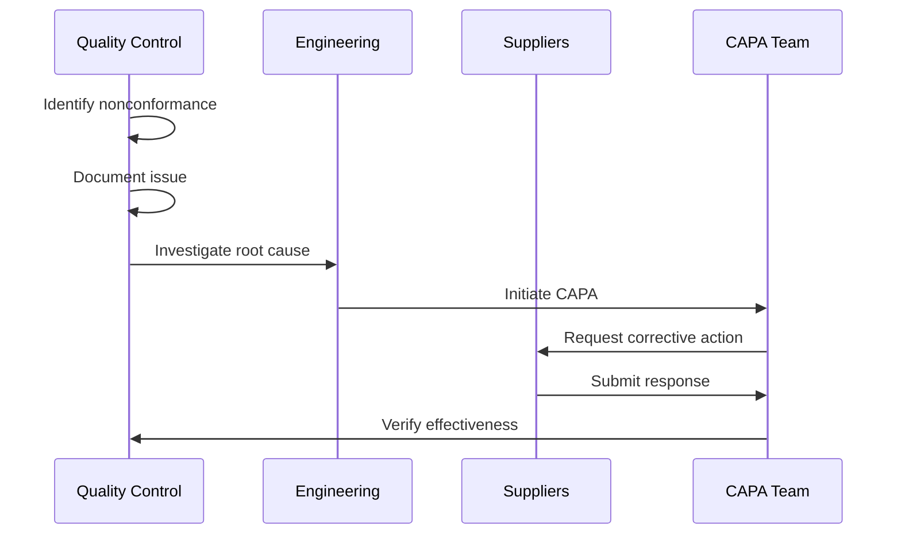

**Tasks:**
- `identify.Nonconformances` - Detect quality issues
- `document.QualityIssues` - Record nonconformances
- `investigate.RootCause` - Determine causes
- `disposition.NonconformingProduct` - Decide on disposition
- `implement.CorrectiveAction` - Execute fixes

### 4.2.4.7 - Analyze quality data and trends

Reviewing quality metrics, trend data, and analytics to identify patterns, risks, and improvement opportunities.

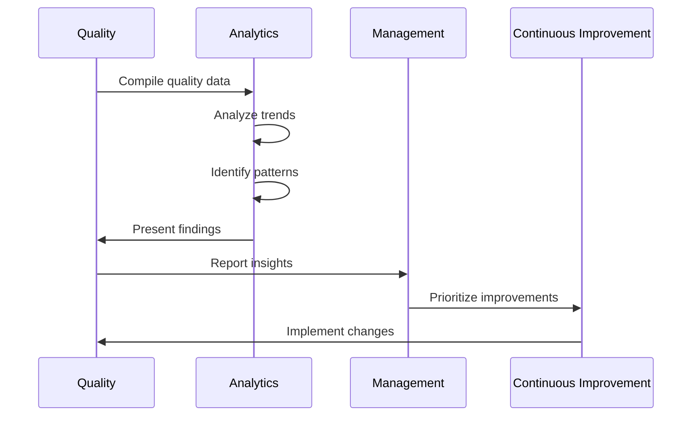

**Tasks:**
- `compile.QualityData` - Aggregate metrics
- `analyze.QualityTrends` - Identify patterns
- `calculate.QualityCosts` - Measure cost of quality
- `benchmark.Performance` - Compare to standards
- `report.QualityStatus` - Communicate findings

### 4.2.4.8 - Drive continuous improvement

Using quality data and analysis to identify and implement improvements in products, processes, and supplier performance.

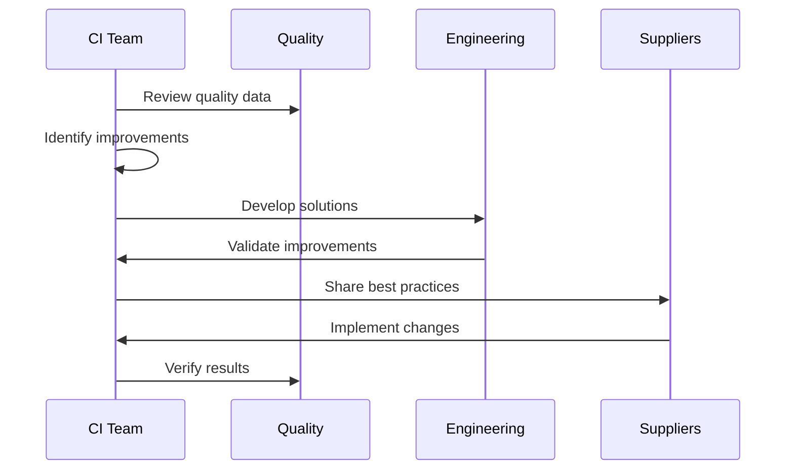

**Tasks:**
- `identify.ImprovementOpportunities` - Find improvement areas
- `prioritize.Improvements` - Rank by impact
- `implement.ProcessChanges` - Execute improvements
- `share.BestPractices` - Spread learnings
- `measure.ImprovementResults` - Track outcomes

## RACI Matrix

| Activity | Responsible | Accountable | Consulted | Informed |
|----------|-------------|-------------|-----------|----------|
| Define quality requirements | Quality Engineering | Quality Director | Engineering, Procurement | Suppliers |
| Inspect incoming materials | QC Inspectors | Quality Manager | Receiving, Procurement | Production |
| Monitor in-process quality | QC Team | Production Manager | Engineering, Quality | Management |
| Inspect finished goods | QC Inspectors | Quality Manager | Production, Shipping | Sales |
| Track supplier performance | Supplier Quality | Quality Director | Procurement, Suppliers | Management |
| Manage nonconformances | CAPA Team | Quality Director | Engineering, Suppliers | Production |
| Analyze quality data | Quality Analytics | Quality Director | Operations, Engineering | Executive Team |
| Drive improvement | CI Team | VP Operations | Quality, Engineering | All Departments |

## Related Departments

- [Quality Assurance](/departments/Quality) - Quality standards and oversight
- Quality Control - Inspection and testing
- [Procurement](/departments/Procurement) - Supplier management
- [Manufacturing](/departments/Operations) - Production quality
- Receiving - Incoming inspection
- [Engineering](/departments/Technology) - Technical support

## Related Occupations

- [Quality Control Inspectors](/occupations/QualityControlInspectors) - Inspection and testing
- [Quality Engineers](/occupations/QualityEngineers) - Quality systems and analysis
- [Supplier Quality Engineers](/occupations/SupplierQualityEngineers) - Supplier quality management
- [Quality Managers](/occupations/QualityManagers) - Quality leadership
- [Statistical Analysts](/occupations/StatisticalAnalysts) - SPC and data analysis
- [CAPA Specialists](/occupations/CAPASpecialists) - Corrective action management

## Industry Variations

### Automotive

Automotive quality monitoring follows IATF 16949 standards with emphasis on PPAP, statistical process control, and zero-defect targets. Supplier quality management includes tier-2 and tier-3 oversight.

**Industry-Specific Activities:**
- Implement Advanced Product Quality Planning (APQP)
- Monitor supplier PPAP compliance
- Execute run-at-rate audits
- Track PPM (parts per million) defect rates
- Manage 8D problem solving process

### Aerospace and Defense

Aerospace quality requires AS9100 compliance, NADCAP accreditation for special processes, and extensive documentation. First article inspection (FAI) and material traceability are mandatory.

**Industry-Specific Activities:**
- Execute AS9102 First Article Inspection
- Maintain material certificates of conformance
- Monitor special process compliance
- Conduct flight safety reviews
- Track age-controlled materials

### Life Sciences / Pharmaceutical

Life sciences quality follows FDA 21 CFR Part 211 (GMP) with emphasis on batch records, stability testing, and regulatory reporting. Quality events require thorough investigation and documentation.

**Industry-Specific Activities:**
- Execute GMP batch release
- Perform stability testing programs
- Conduct annual product quality reviews
- Manage regulatory deviation reporting
- Monitor environmental conditions

### Food and Beverage

Food quality emphasizes HACCP critical control points, food safety monitoring, and pathogen testing. Regulatory compliance (FSMA, GFSI) drives quality programs.

**Industry-Specific Activities:**
- Monitor HACCP critical control points
- Conduct pathogen testing
- Track allergen controls
- Manage food safety incidents
- Execute supplier food safety audits

### Electronics

Electronics quality focuses on soldering defects, ESD controls, and reliability testing. IPC standards define acceptance criteria. Automated optical inspection (AOI) is common.

**Industry-Specific Activities:**
- Perform automated optical inspection
- Monitor solder joint quality per IPC
- Conduct environmental stress screening
- Track ESD compliance
- Execute reliability testing

### Consumer Products

Consumer products quality emphasizes aesthetic quality, packaging integrity, and safety compliance. Customer complaint analysis drives improvement priorities.

**Industry-Specific Activities:**
- Monitor cosmetic quality standards
- Track packaging defect rates
- Manage product safety testing
- Analyze customer complaint trends
- Execute retail audit programs

## Sub-Processes

| Process | Code | Description |
|---------|------|-------------|
| Define quality requirements | 4.2.4.1 | Establishing standards and criteria |
| Inspect incoming materials | 4.2.4.2 | Receiving inspection activities |
| Monitor in-process quality | 4.2.4.3 | Production quality tracking |
| Inspect finished goods | 4.2.4.4 | Final product inspection |
| Track supplier performance | 4.2.4.5 | Supplier quality management |

## Related Processes

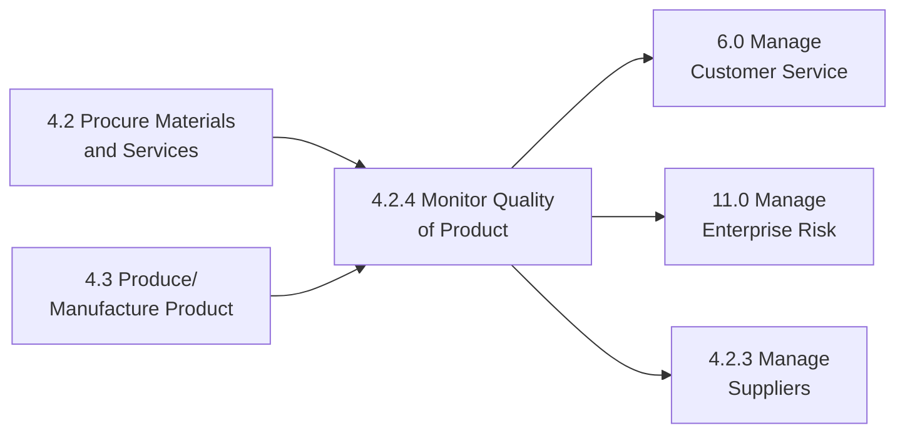

## Metrics & KPIs

| Metric | Description | Target |
|--------|-------------|--------|
| Incoming Defect Rate | Defective materials from suppliers | <1% |
| First Pass Yield | Products passing inspection first time | >98% |
| Supplier PPM | Parts per million defective from suppliers | <100 |
| Customer Complaint Rate | Complaints per million units shipped | <50 |
| Cost of Quality | Total quality costs as % of revenue | <3% |
| CAPA Effectiveness | Corrective actions preventing recurrence | >90% |
| On-Time Quality Release | Products released on schedule | >95% |
| Supplier Audit Compliance | Suppliers meeting audit standards | >95% |

---

*Source: APQC PCF 10302 (4.2.4) - Cross-Industry*
