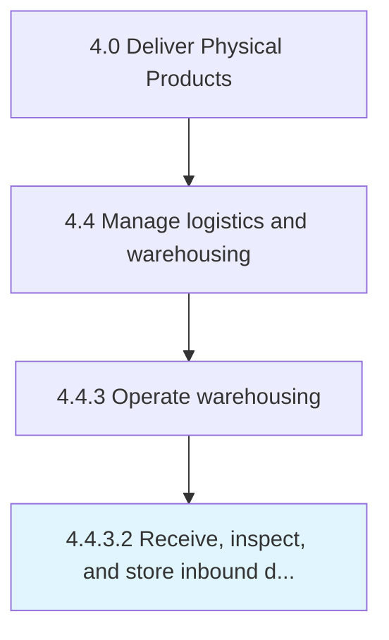

# Receive, inspect, and store inbound deliveries

> Coordinating the incoming inbound materials/products.

## Overview

Activity 4.4.3.2 is an activity within the Deliver Physical Products framework. 

Coordinating the incoming inbound materials/products. Accept the delivery of these materials and the subsequent storage. Track them at the warehouse/distribution center.

## Process Hierarchy



## Key Statistics

| Metric | Value |
|--------|-------|
| APQC Code | 10354 |
| Hierarchy ID | 4.4.3.2 |
| Level | Activity |
| Parent | [4.4.3](../) |
| Sub-Processes | 0 |


## GraphDL Semantic Structure

```
receive,.InspectAndStoreInboundDeliveries
```

| Component | Value | Description |
|-----------|-------|-------------|
| Verb | `receive,` | Primary action |
| Object | `inspect, and store inbound deliveries` | Direct object |


## Related Concepts

- InspectStoreInboundDeliveries


---

*Source: APQC PCF 10354 (4.4.3.2) - APQC*

## Related Occupations

- [General and Operations Managers](/occupations/Management/GeneralAndOperationsManagers)
- [Management Analysts](/occupations/Business/ManagementAnalysts)
- [Chief Executives](/occupations/Management/ChiefExecutives)

## Related Departments

- [Executive](/departments/Executive)
- [Operations](/departments/Operations)
- [Finance](/departments/Finance)
