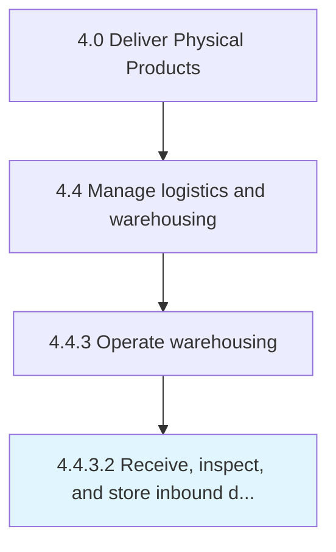

# Receive, inspect, and store inbound deliveries

> Coordinating the incoming inbound materials/products.

## Overview

Activity 4.4.3.2 is an activity within the Deliver Physical Products framework. 

Coordinating the incoming inbound materials/products. Accept the delivery of these materials and the subsequent storage. Track them at the warehouse/distribution center.

## Process Hierarchy



## Key Statistics

| Metric | Value |
|--------|-------|
| APQC Code | 10354 |
| Hierarchy ID | 4.4.3.2 |
| Level | Activity |
| Parent | [4.4.3](../) |
| Sub-Processes | 0 |


## GraphDL Semantic Structure

```
receive,.InspectAndStoreInboundDeliveries
```

| Component | Value | Description |
|-----------|-------|-------------|
| Verb | `receive,` | Primary action |
| Object | `inspect, and store inbound deliveries` | Direct object |


## Related Concepts

- InspectStoreInboundDeliveries


---

*Source: APQC PCF 10354 (4.4.3.2) - APQC*

## Related Occupations

- [Transportation, Storage, and Distribution Managers](/occupations/Management/TransportationStorageAndDistributionManagers)
- [Logisticians](/occupations/Business/Logisticians)
- [Shipping, Receiving, and Inventory Clerks](/occupations/Production/ShippingReceivingAndInventoryClerks)
- [Industrial Production Managers](/occupations/Management/IndustrialProductionManagers)
- [Quality Control Inspectors](/occupations/Production/QualityControlInspectors)

## Related Departments

- [Warehouse Operations](/departments/WarehouseOperations)
- [Receiving](/departments/Receiving)
- [Quality Assurance](/departments/QualityAssurance)
- [Inventory Management](/departments/InventoryManagement)
- [Supply Chain](/departments/SupplyChain)

## Industry Variations

This process applies universally across all industries, with the following common best practices:

### Universal Applicability

Receiving and storing inbound deliveries is fundamental to supply chain operations across all sectors. Accurate, efficient receiving ensures inventory accuracy and production continuity.

### Cross-Industry Best Practices

| Practice | Description |
|----------|-------------|
| Advance Shipment Notification | Receive ASNs to prepare for incoming deliveries |
| Dock Scheduling | Coordinate delivery windows to optimize dock utilization |
| Inspection Protocols | Define quality inspection requirements by material type |
| Put-Away Optimization | Use WMS to direct efficient storage locations |
| Documentation | Capture receiving data for compliance and traceability |

### Common Metrics

- Receiving accuracy rate
- Time from dock to stock
- Dock door utilization
- Supplier delivery performance
- Inspection pass rate
- Receiving cost per line item
