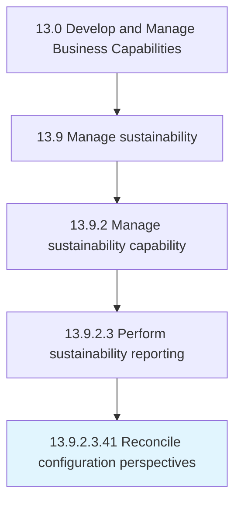

# Reconcile configuration perspectives

> Managing the transition of product configuration perspectives.

## Overview

Sub-Activity 13.9.2.3.41 is an activity within the Develop and Manage Business Capabilities framework. 

Managing the transition of product configuration perspectives. As designed - every conceivable version of an aircraft. As sold - specific to customer e.g.,. 10 toilets etc. - what customer has agreed to buy. As engineered = how the org will manufacture what has been sold. As built - what rolls off the production line. As delivered - specific to A&D. A customer may have their own equipment that they will install on the aircraft when they collect it. As maintained - responsibility for the documentation and configuration of an aircraft is the responsibility of the customer once it has been collected. It is extremely difficult to manage these transitions primarily because the design org, engineering, production orgs use different technologies and have different visions. Transitioning between them is very complex.

## Process Hierarchy



## Key Statistics

| Metric | Value |
|--------|-------|
| APQC Code | 19703 |
| Hierarchy ID | 13.9.2.3.41 |
| Level | Sub-Activity |
| Parent | [13.9.2.3](../) |
| Sub-Processes | 0 |


## GraphDL Semantic Structure

```
reconcile.ConfigurationPerspectives
```

| Component | Value | Description |
|-----------|-------|-------------|
| Verb | `reconcile` | Primary action |
| Object | `configuration perspectives` | Direct object |


---

*Source: APQC PCF 19703 (13.9.2.3.41) - APQC*

## Related Occupations

- [General and Operations Managers](/occupations/Management/GeneralAndOperationsManagers)
- [Management Analysts](/occupations/Business/ManagementAnalysts)
- [Chief Executives](/occupations/Management/ChiefExecutives)

## Related Departments

- [Executive](/departments/Executive)
- [Operations](/departments/Operations)
- [Finance](/departments/Finance)
