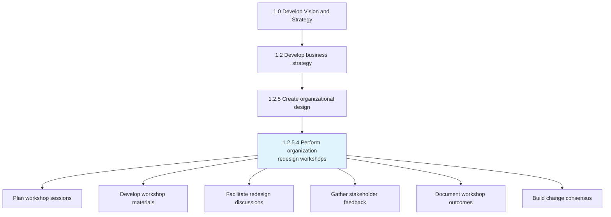
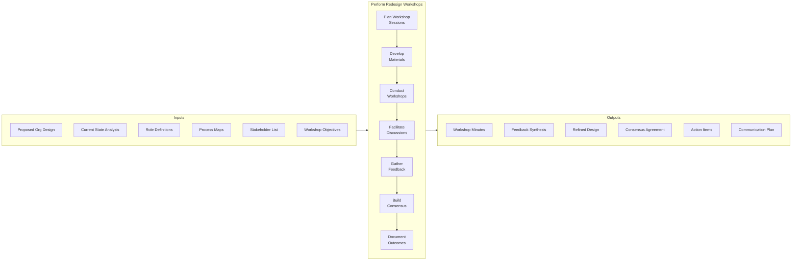
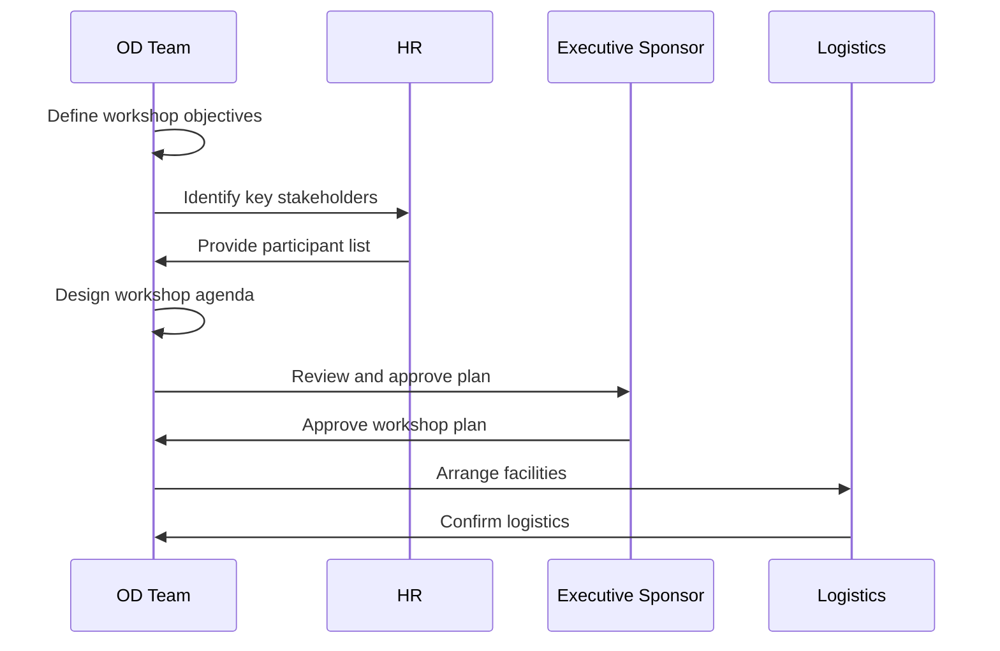
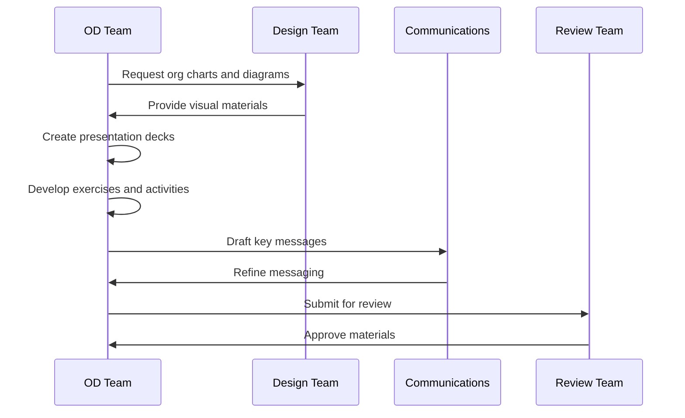
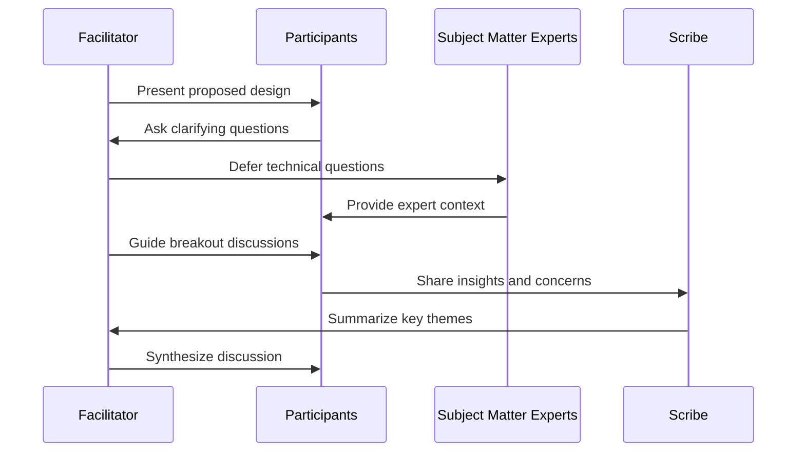
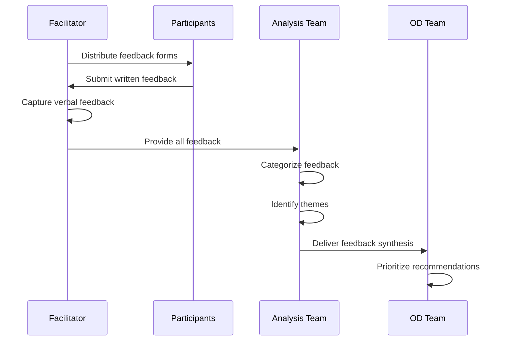
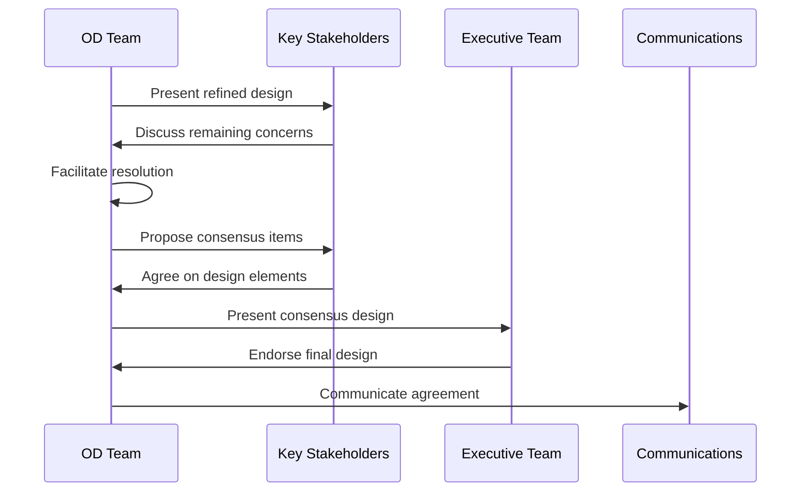
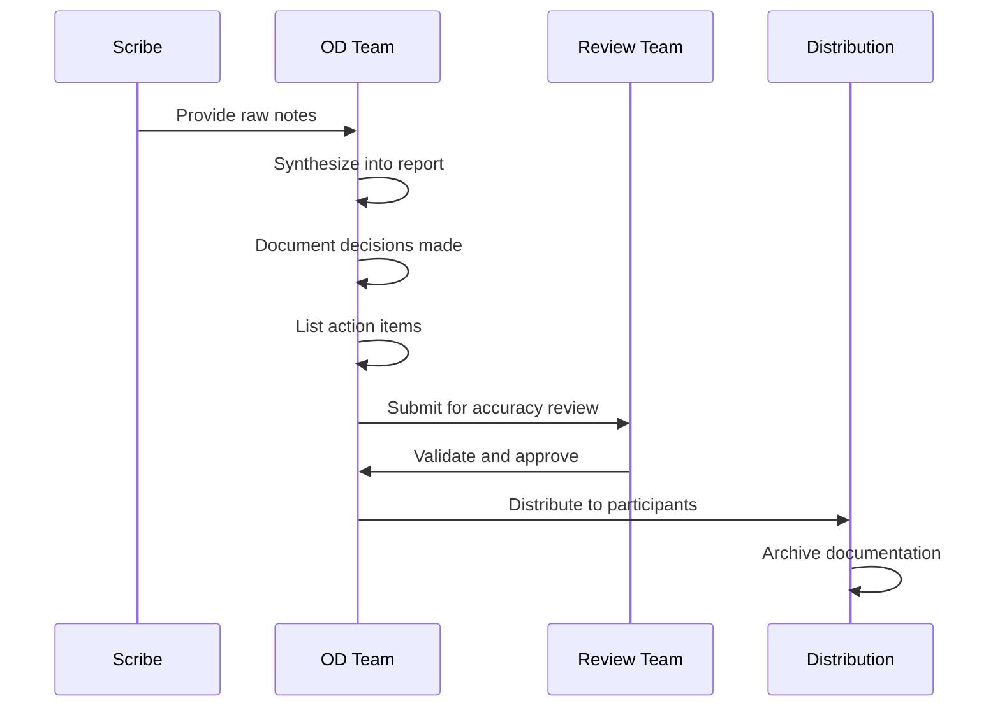
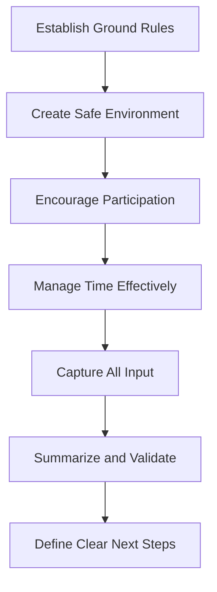
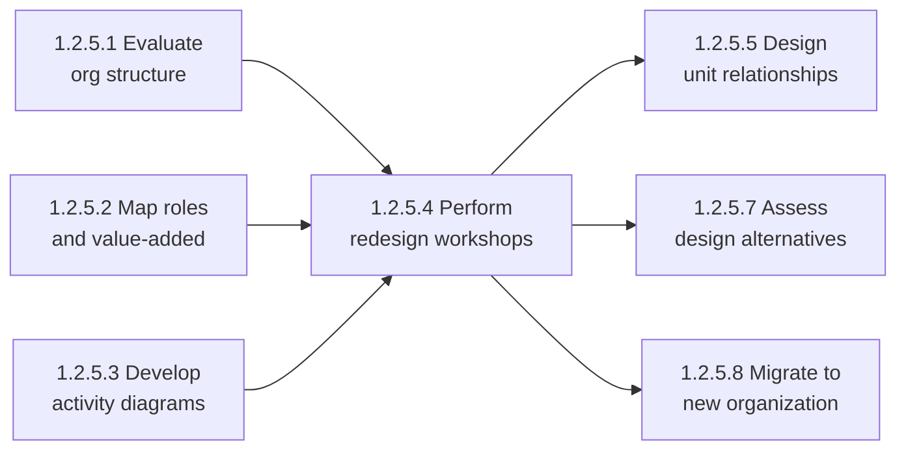

# Perform organization redesign workshops

> Organizing workshop sessions to adopt organizational redesign. Communicate the organizational structure and mapping of responsibilities against job roles in order to facilitate an effective understanding among personnel. Use a collaborative process that may include participative workshop sessions.

## Overview

Perform organization redesign workshops (APQC 1.2.5.4/10052) is a critical activity within the Create Organizational Design process. This activity focuses on facilitating collaborative sessions that engage stakeholders in the organizational redesign process. The workshops serve multiple purposes: communicating proposed changes, gathering feedback, building consensus, and ensuring personnel understand their roles within the new structure.

Effective redesign workshops transform organizational change from a top-down mandate into a participative process. By involving employees and managers in discussions about structure, responsibilities, and workflows, organizations can identify implementation challenges early, leverage frontline insights, and build the commitment necessary for successful transitions.

## Process Hierarchy



## Key Statistics

| Metric | Value |
|--------|-------|
| APQC Code | 10052 |
| Hierarchy ID | 1.2.5.4 |
| Level | Activity |
| Category | [Develop Vision and Strategy](/processes/01-Strategy) |
| Parent Process | [Create organizational design](./OrgDesign.mdx) |
| Typical Duration | 2-8 weeks |

## Process Flow



## GraphDL Semantic Structure

```
perform.OrganizationRedesignWorkshops
```

| Component | Value | Description |
|-----------|-------|-------------|
| Verb | `perform` | Primary action of executing and facilitating |
| Object | `OrganizationRedesignWorkshops` | Collaborative sessions for design adoption |
| Preposition | - | Not applicable |
| PrepObject | - | Not applicable |

## Activities

### Plan workshop sessions

Developing a comprehensive workshop plan that defines objectives, participants, schedule, and logistics for each redesign session.



**Tasks:**
- `define.WorkshopObjectives` - Establish clear goals for each session
- `identify.Participants` - Determine who should attend each workshop
- `design.WorkshopAgenda` - Create structured session flow
- `schedule.Sessions` - Coordinate timing across stakeholder groups
- `arrange.Logistics` - Secure facilities and resources

### Develop workshop materials

Creating the presentations, exercises, templates, and supporting materials needed to conduct effective redesign workshops.



**Tasks:**
- `create.Presentations` - Develop visual presentations of proposed design
- `design.Exercises` - Create interactive activities for engagement
- `prepare.Templates` - Build feedback collection tools
- `develop.KeyMessages` - Craft consistent communication points
- `compile.MaterialPackets` - Assemble participant materials

### Facilitate redesign discussions

Leading collaborative discussions that enable participants to understand, question, and contribute to the organizational redesign.



**Tasks:**
- `present.ProposedDesign` - Share organizational design proposal
- `facilitate.QandA` - Manage question and answer sessions
- `lead.BreakoutGroups` - Guide small group discussions
- `manage.GroupDynamics` - Handle conflicts and ensure participation
- `synthesize.Discussions` - Summarize key themes and insights

### Gather stakeholder feedback

Collecting, organizing, and analyzing input from workshop participants on the proposed organizational design.



**Tasks:**
- `collect.WrittenFeedback` - Gather formal feedback submissions
- `capture.VerbalInput` - Document discussion insights
- `categorize.Feedback` - Organize input by theme and impact
- `analyze.Patterns` - Identify common concerns and suggestions
- `prioritize.Recommendations` - Rank feedback for action

### Build change consensus

Working with stakeholders to develop agreement and commitment to the organizational redesign through collaborative decision-making.



**Tasks:**
- `address.Concerns` - Respond to stakeholder issues
- `negotiate.Compromises` - Find acceptable middle ground
- `document.Agreements` - Record consensus decisions
- `secure.Commitment` - Obtain stakeholder buy-in
- `communicate.Consensus` - Share agreed-upon design

### Document workshop outcomes

Recording and distributing the results, decisions, and action items from redesign workshops.



**Tasks:**
- `compile.WorkshopNotes` - Gather all session documentation
- `synthesize.Outcomes` - Create summary report
- `document.Decisions` - Record all decisions made
- `assign.ActionItems` - Define follow-up responsibilities
- `distribute.Documentation` - Share outcomes with stakeholders

## RACI Matrix

| Activity | Responsible | Accountable | Consulted | Informed |
|----------|-------------|-------------|-----------|----------|
| Plan workshop sessions | OD Team | CHRO | Executive Sponsor | Participants |
| Develop workshop materials | OD Team | OD Manager | Communications, Design | HR |
| Facilitate redesign discussions | OD Facilitators | OD Manager | SMEs | Executive Team |
| Gather stakeholder feedback | OD Team | OD Manager | Participants | Analysis Team |
| Build change consensus | OD Team | CHRO | Key Stakeholders | All Participants |
| Document workshop outcomes | OD Team | OD Manager | Review Team | All Stakeholders |

## Related Departments

- [Human Resources](/departments/HR/index) - Primary owner and facilitator
- Organizational Development - Workshop design and facilitation
- Communications - Messaging and materials
- [Strategy & Planning](/departments/Strategy/index) - Design context and rationale
- [All Business Units](/departments) - Participants and stakeholders

## Related Occupations

- [Organizational Development Specialists](/occupations/OrgDevelopment) - Workshop facilitation
- [Training and Development Managers](/occupations/TrainingManagers) - Session design
- [Human Resources Specialists](/occupations/HRSpecialists) - Coordination and support
- [Management Analysts](/occupations/Business/Operations/ManagementAnalysts) - Analysis and consulting
- [Change Management Specialists](/occupations/ChangeManagement) - Consensus building

## Industry Variations

### Banking

Banking redesign workshops must address regulatory implications, risk management considerations, and compliance requirements. Sessions often include compliance officers and risk managers as key participants.

**Industry-Specific Activities:**
- Include regulatory impact assessments in discussions
- Address segregation of duties requirements
- Review compliance with banking regulations
- Assess risk management structure implications

### Healthcare Provider

Healthcare workshops focus on clinical workflow impacts, patient safety considerations, and medical staff governance. Physician involvement is critical for clinical department restructuring.

**Industry-Specific Activities:**
- Include physician leaders in clinical restructuring
- Address patient care continuity implications
- Review quality and safety reporting impacts
- Consider medical staff bylaws requirements

### Aerospace and Defense

Aerospace workshops must consider program management structures, engineering disciplines, and security clearance requirements. Sessions often involve government relations considerations.

**Industry-Specific Activities:**
- Address program management authority changes
- Review engineering discipline organization
- Consider security clearance implications
- Assess government contract requirements

### Retail

Retail workshops balance headquarters and field perspectives, addressing store operations, merchandising, and omnichannel considerations.

**Industry-Specific Activities:**
- Include field leadership representation
- Address store-level operational impacts
- Review merchandising team structures
- Consider omnichannel integration implications

## Workshop Design Elements

### Typical Workshop Agenda

| Time | Activity | Purpose |
|------|----------|---------|
| 0:00-0:15 | Welcome and Objectives | Set context and expectations |
| 0:15-0:45 | Current State Overview | Review existing structure |
| 0:45-1:15 | Proposed Design Presentation | Present new organizational design |
| 1:15-1:30 | Break | - |
| 1:30-2:30 | Breakout Discussions | Small group analysis |
| 2:30-3:00 | Feedback Sharing | Report out from groups |
| 3:00-3:30 | Consensus Building | Address concerns and agreements |
| 3:30-4:00 | Action Items and Close | Summarize and next steps |

### Workshop Facilitation Best Practices



## Sub-Tasks

| Task | Description |
|------|-------------|
| Stakeholder Mapping | Identify all affected parties and their interests |
| Agenda Development | Create structured workshop flow |
| Material Preparation | Develop presentations and exercises |
| Facilitation | Lead workshop sessions |
| Feedback Collection | Gather and organize participant input |
| Consensus Building | Develop agreement on design elements |
| Documentation | Record outcomes and action items |

## Related Processes



## Metrics & KPIs

| Metric | Description | Target |
|--------|-------------|--------|
| Participation Rate | Percentage of invited stakeholders attending | >90% |
| Feedback Response Rate | Percentage of participants providing feedback | >85% |
| Consensus Achievement | Percentage of design elements with stakeholder agreement | >80% |
| Workshop Satisfaction | Participant satisfaction with workshop quality | >4.0/5.0 |
| Action Item Completion | Percentage of workshop action items completed | >95% |
| Time to Consensus | Duration from first workshop to design agreement | <6 weeks |

---

*Source: APQC PCF 10052 (1.2.5.4) - Cross-Industry*
