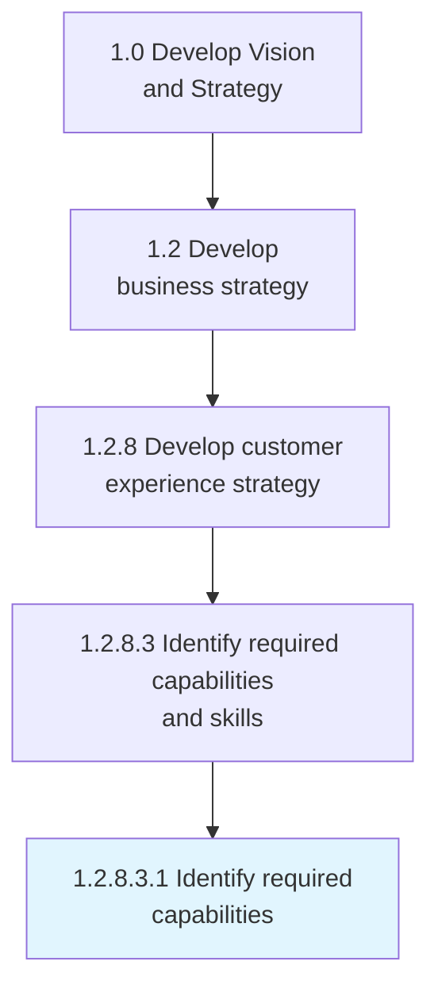
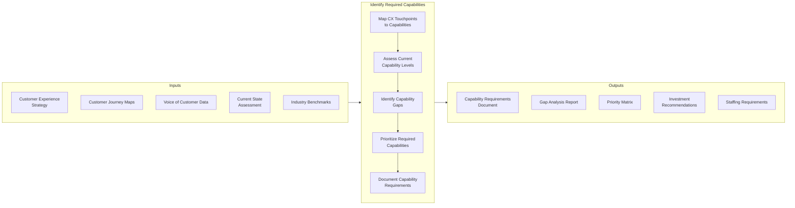
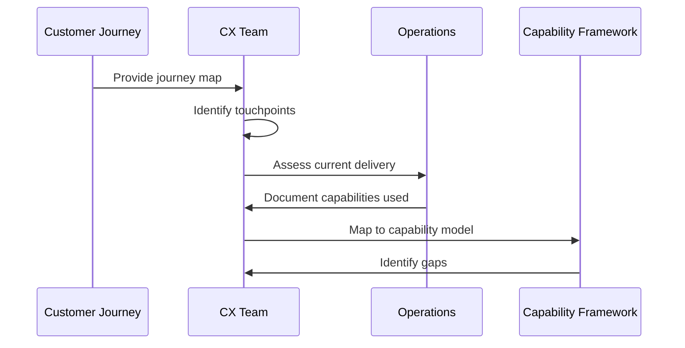
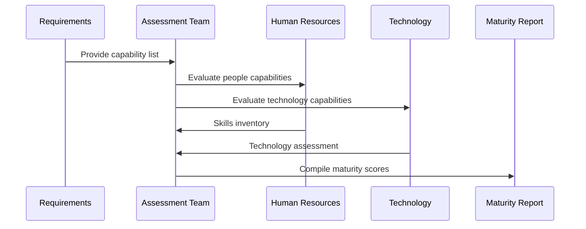
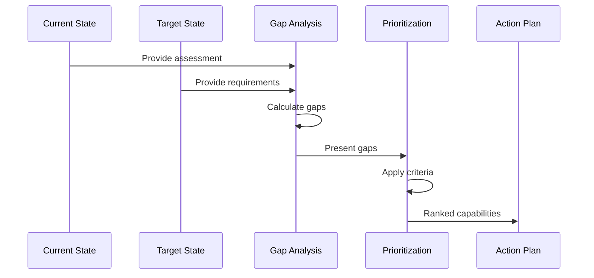
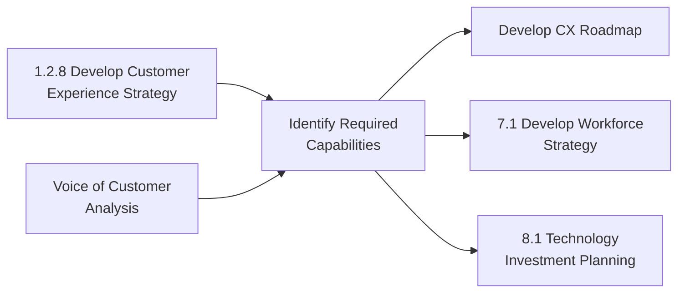

# Identify Required Capabilities

> Determining the necessary skills and competencies required to efficiently collect customer experiences through the support structure.

## Overview

Identify Required Capabilities is a critical process within customer experience strategy development (APQC 1.2.8) that focuses on determining the organizational competencies needed to deliver exceptional customer experiences. This process bridges strategic customer experience goals with operational capability requirements, ensuring the organization has the right people, processes, and technology to execute its CX vision.

The process involves systematic analysis of customer journey touchpoints, identification of skills gaps, assessment of technology requirements, and alignment of capabilities with customer expectations. It serves as a foundational input to workforce planning, technology investment decisions, and organizational design efforts.

Effective capability identification requires cross-functional collaboration between customer experience teams, human resources, IT, and operations to create a comprehensive view of what the organization must be able to do to meet customer needs.

## Process Hierarchy



## Key Statistics

| Metric | Value |
|--------|-------|
| APQC Code | 19972 |
| Hierarchy ID | 1.2.8.3.1 |
| Level | Activity |
| Category | [Develop Vision and Strategy](/processes/01-Strategy) |
| Parent Process | Develop customer experience strategy |

## Process Flow



## GraphDL Semantic Structure

```
identify.RequiredCapabilities
```

| Component | Value | Description |
|-----------|-------|-------------|
| Verb | `identify` | Primary action of recognizing and determining |
| Object | `RequiredCapabilities` | Skills and competencies needed for CX |
| Preposition | - | Not applicable at this level |
| PrepObject | - | Not applicable at this level |

## Activities

### 1.2.8.3.1.1 - Map CX Touchpoints to Capabilities

Analyzing each customer touchpoint to determine what organizational capabilities are required to deliver the desired experience at that interaction point.



**Tasks:**
- `analyze.CustomerTouchpoints` - Examine each customer interaction point
- `map.CapabilitiesToTouchpoints` - Connect capabilities to journey stages
- `identify.CriticalMoments` - Determine moments of truth requiring specific capabilities

### 1.2.8.3.1.2 - Assess Current Capability Maturity

Evaluating the organization's current capability levels against the requirements identified from customer experience analysis.



**Tasks:**
- `evaluate.CurrentCapabilities` - Assess existing organizational competencies
- `measure.CapabilityMaturity` - Score capabilities against maturity model
- `benchmark.AgainstIndustry` - Compare to industry standards

### 1.2.8.3.1.3 - Identify and Prioritize Capability Gaps

Determining where gaps exist between required and current capabilities, and prioritizing based on strategic importance and customer impact.



**Tasks:**
- `calculate.CapabilityGaps` - Determine delta between current and required
- `prioritize.GapClosure` - Rank gaps by business impact
- `recommend.Investments` - Propose capability development investments

## RACI Matrix

| Activity | Responsible | Accountable | Consulted | Informed |
|----------|-------------|-------------|-----------|----------|
| Map CX touchpoints | CX Team | Chief Customer Officer | Marketing, Sales | Operations |
| Assess current capabilities | HR, Operations | COO | IT, Finance | CX Team |
| Identify capability gaps | CX Team | CCO | Strategy, HR | Executive team |
| Prioritize capabilities | Strategy Team | CEO | All BU Heads | All departments |
| Document requirements | CX Team | CCO | HR, IT | PMO |

## Related Departments

- Customer Experience - Primary process owner and executor
- [Human Resources](/departments/HR/index) - Workforce capability assessment and development
- [Information Technology](/departments/Technology) - Technology capability evaluation
- [Operations](/departments/Operations/index) - Operational capability assessment
- [Strategy & Planning](/departments/Strategy/index) - Strategic alignment and prioritization

## Related Occupations

- [Customer Service Managers](/occupations/CustomerServiceManagers) - CX capability identification
- [Training and Development Managers](/occupations/TrainingManagers) - Skills gap assessment
- [Management Analysts](/occupations/Business/Operations/ManagementAnalysts) - Capability analysis and consulting
- [Market Research Analysts](/occupations/MarketResearchAnalysts) - Customer insight gathering
- [Human Resources Managers](/occupations/HRManagers) - Workforce capability planning

## Industry Variations

### Banking

Banking institutions focus on digital service capabilities, regulatory compliance skills, and financial advisory competencies. Capability identification emphasizes omnichannel support, fraud detection, and personalized financial guidance.

**Industry-Specific Activities:**
- Identify digital banking capabilities
- Assess regulatory compliance skills
- Evaluate financial advisory competencies
- Map cybersecurity requirements

### Healthcare Provider

Healthcare organizations emphasize clinical communication capabilities, patient engagement skills, and care coordination competencies. HIPAA compliance and empathetic communication are critical capability requirements.

**Industry-Specific Activities:**
- Assess clinical communication skills
- Identify patient engagement capabilities
- Evaluate care coordination competencies
- Map telehealth technology requirements

### Retail

Retail companies focus on omnichannel service capabilities, product knowledge competencies, and personalization skills. Capability identification addresses both in-store and digital touchpoints.

**Industry-Specific Activities:**
- Identify omnichannel service capabilities
- Assess product knowledge levels
- Evaluate personalization technology skills
- Map fulfillment capabilities

### Telecommunications

Telecom providers emphasize technical support capabilities, network knowledge, and self-service enablement. Capability identification addresses complex product portfolios and technical troubleshooting requirements.

**Industry-Specific Activities:**
- Assess technical troubleshooting skills
- Identify network operations capabilities
- Evaluate digital self-service competencies
- Map service activation capabilities

## Sub-Processes

| Process | Code | Description |
|---------|------|-------------|
| Map touchpoint capabilities | 1.2.8.3.1.1 | Connect customer touchpoints to required capabilities |
| Assess capability maturity | 1.2.8.3.1.2 | Evaluate current organizational capability levels |
| Identify capability gaps | 1.2.8.3.1.3 | Determine gaps between required and current state |
| Prioritize capability development | 1.2.8.3.1.4 | Rank capabilities by strategic importance |

## Related Processes



## Metrics & KPIs

| Metric | Description | Target |
|--------|-------------|--------|
| Capability Coverage | Percentage of CX touchpoints with defined capability requirements | 100% |
| Gap Identification Rate | Percentage of capabilities with documented gaps | 100% |
| Assessment Accuracy | Correlation between assessment and actual performance | >90% |
| Stakeholder Alignment | Agreement on capability priorities across stakeholders | >85% |
| Time to Complete | Duration of capability identification process | <30 days |

---

*Source: APQC PCF 19972 (1.2.8.3.1) - Cross-Industry*
