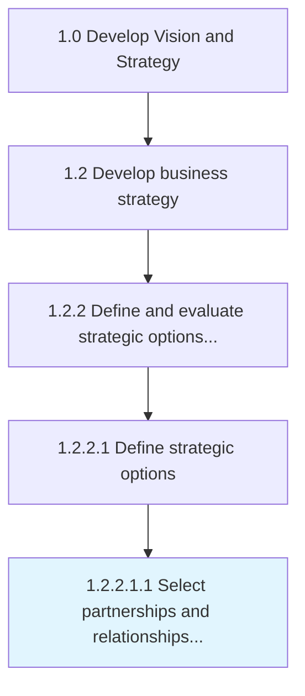

# Select partnerships and relationships to support the extended enterprise

> Supporting the design, manufacture and distribution of product and services through the extended enterprise model.

## Overview

Sub-Activity 1.2.2.1.1 is an activity within the Develop Vision and Strategy framework. 

Supporting the design, manufacture and distribution of product and services through the extended enterprise model. This is concerned with the strategic decisions on make vs buy, in house or out sourced. Senior Executives map out how they want to run their business. Make strategic choices as to whether to buy in components / sub-assemblies, run their own distribution fleet or contract out, own their dealerships or franchise out, etc. Strategize with partnerships. Collaborate design consideration at strategy level for automotive and procurement act within the Target Operating Model set at strategy level.

## Process Hierarchy



## Key Statistics

| Metric | Value |
|--------|-------|
| APQC Code | 18083 |
| Hierarchy ID | 1.2.2.1.1 |
| Level | Sub-Activity |
| Parent | [1.2.2.1](../) |
| Sub-Processes | 0 |


## GraphDL Semantic Structure

```
select.PartnershipsAndRelationships.to.SupportTheExtendedEnterprise
```

| Component | Value | Description |
|-----------|-------|-------------|
| Verb | `select` | Primary action |
| Object | `partnerships and relationships` | Direct object |
| Preposition | `to` | Relationship |
| PrepObject | `support the extended enterprise` | Indirect object |


## Related Concepts

- Partnerships
- SupportExtendedEnterprise
- Relationships
- SupportExtendedEnterprise


---

*Source: APQC PCF 18083 (1.2.2.1.1) - APQC*

## Related Occupations

- [General and Operations Managers](/occupations/Management/GeneralAndOperationsManagers)
- [Management Analysts](/occupations/Business/ManagementAnalysts)
- [Chief Executives](/occupations/Management/ChiefExecutives)

## Related Departments

- [Executive](/departments/Executive)
- [Operations](/departments/Operations)
- [Finance](/departments/Finance)
