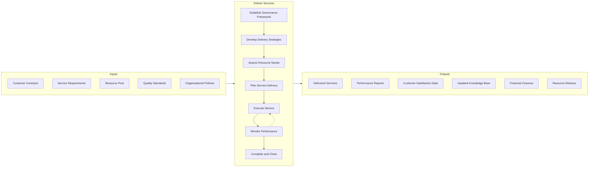
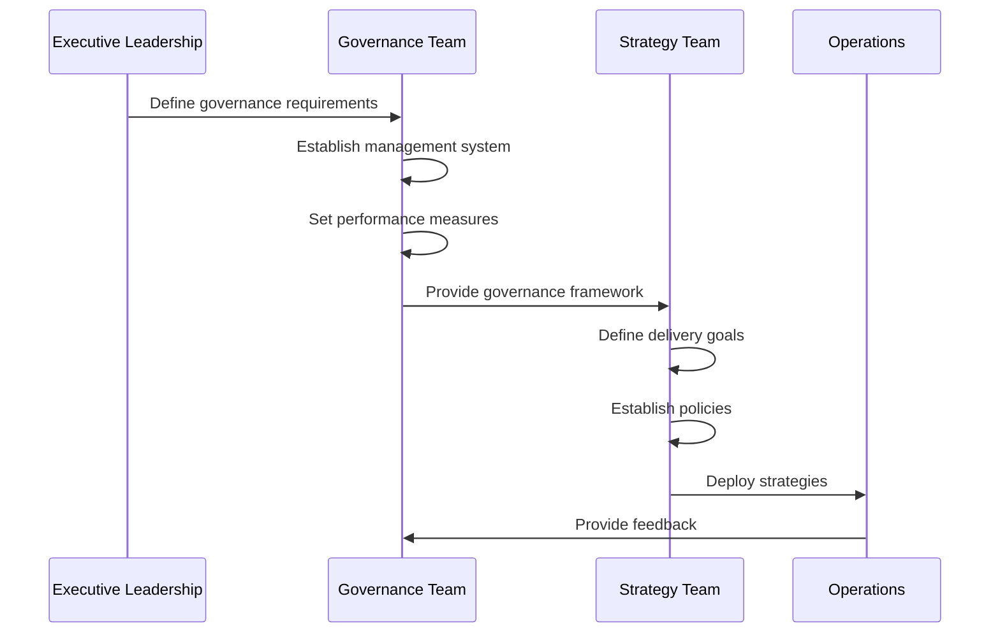
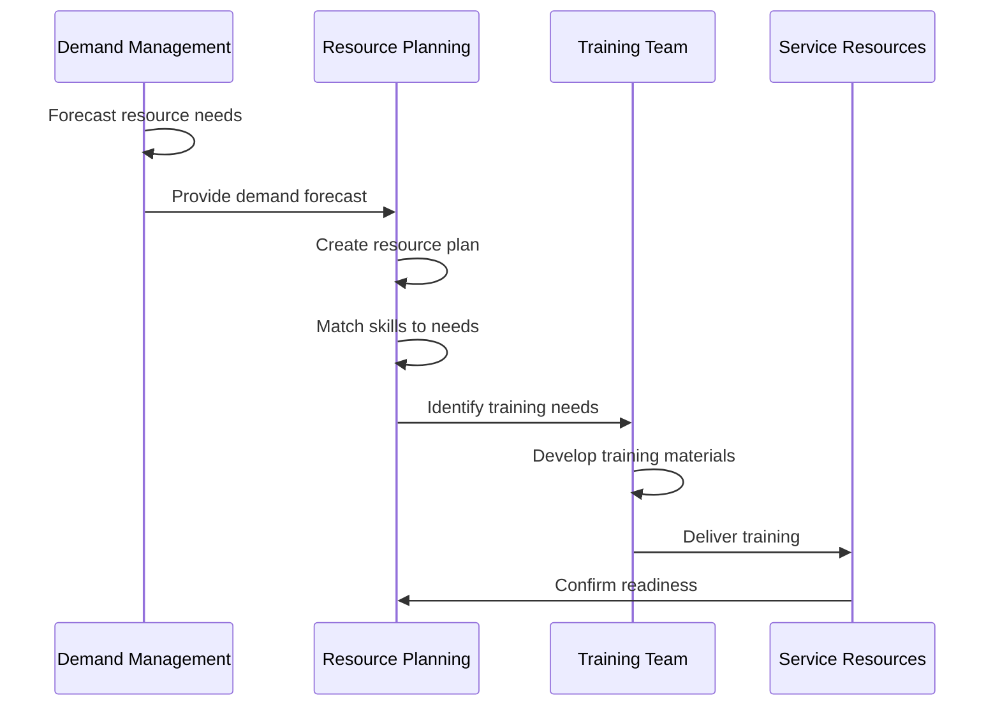
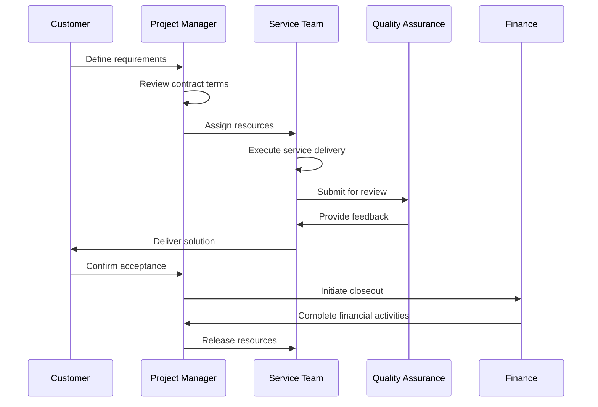
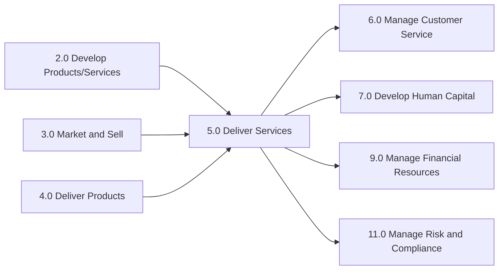

# Deliver Services

> Offering services to customers. This is the act of providing service delivery as a core business practice and covers identifying strategies for performing service delivery, managing resources, and delivering services to the customer.

## Overview

Deliver Services is the primary category-level process (APQC 5.0) encompassing all activities involved in providing services to customers. This process represents the core operating model for service-based organizations and the service delivery function within product companies. It provides the overarching framework for establishing governance, developing strategies, managing resources, and executing service delivery operations.

The process integrates three major functional areas: governance and strategy establishment (ensuring consistent quality and alignment with organizational objectives), resource management (acquiring, developing, and deploying the people and assets needed for service delivery), and operational execution (the actual delivery of services from initiation through completion).

Organizations across all industries rely on this process to transform customer requirements and service contracts into delivered outcomes that meet or exceed expectations while maintaining profitability and building long-term relationships.

## Process Hierarchy

```mermaid
graph TD
    C5["5.0 Deliver Services"] --> G51["5.1 Establish service delivery governance and strategies"]
    C5 --> G52["5.2 Manage service delivery resources"]
    C5 --> G53["5.3 Deliver service to customer"]

    G51 --> P511["5.1.1 Establish service delivery governance"]
    G51 --> P512["5.1.2 Develop service delivery strategies"]

    P511 --> A5111["5.1.1.1 Set up governance and management system"]
    P511 --> A5112["5.1.1.2 Manage service delivery performance"]
    P511 --> A5113["5.1.1.3 Manage development and direction"]
    P511 --> A5114["5.1.1.4 Solicit customer feedback"]

    P512 --> A5121["5.1.2.1 Define service delivery goals"]
    P512 --> A5122["5.1.2.2 Define labor policies"]
    P512 --> A5123["5.1.2.3 Evaluate resource availability"]
    P512 --> A5124["5.1.2.4 Define network and supply constraints"]
    P512 --> A5125["5.1.2.5 Define service delivery process"]
    P512 --> A5126["5.1.2.6 Review and validate procedures"]
    P512 --> A5127["5.1.2.7 Define workplace layout and infrastructure"]

    G52 --> P521["5.2.1 Manage resource demand"]
    G52 --> P522["5.2.2 Create and manage resource plan"]
    G52 --> P523["5.2.3 Enable service delivery resources"]

    G53 --> P531["5.3.1 Initiate service delivery"]
    G53 --> P532["5.3.2 Execute service delivery"]
    G53 --> P533["5.3.3 Complete service delivery"]

    P531 --> A5311["5.3.1.1 Review contract and terms"]
    P531 --> A5312["5.3.1.2 Understand customer requirements"]
    P531 --> A5313["5.3.1.3 Modify/approve project plan"]
    P531 --> A5314["5.3.1.4 Confirm environmental readiness"]
    P531 --> A5315["5.3.1.5 Identify and assign resources"]
    P531 --> A5316["5.3.1.6 Establish engagement rules"]
    P531 --> A5317["5.3.1.7 Plan for service delivery"]

    P532 --> A5321["5.3.2.1 Analyze environment and needs"]
    P532 --> A5322["5.3.2.2 Define solution"]
    P532 --> A5323["5.3.2.3 Validate solution"]
    P532 --> A5324["5.3.2.4 Identify changes"]
    P532 --> A5325["5.3.2.5 Obtain approval to proceed"]
    P532 --> A5326["5.3.2.6 Make/build/buy solution"]
    P532 --> A5327["5.3.2.7 Deploy solution"]

    P533 --> A5331["5.3.3.1 Conduct project review"]
    P533 --> A5332["5.3.3.2 Complete financial activities"]
    P533 --> A5333["5.3.3.3 Confirm delivery per contract"]
    P533 --> A5334["5.3.3.4 Release resources"]
    P533 --> A5335["5.3.3.5 Manage completion"]
```



## Key Statistics

| Metric | Value |
|--------|-------|
| APQC Code | 20025 |
| Hierarchy ID | 5.0 |
| Level | Category |
| Category | [Deliver Services](/processes/05-Services) |
| Process Groups | 3 |
| Processes | 6 |
| Activities | 25+ |

## Process Flow



## GraphDL Semantic Structure

```
deliver.Services
```

| Component | Value | Description |
|-----------|-------|-------------|
| Verb | `deliver` | Primary action of providing services |
| Object | `Services` | Intangible offerings to customers |
| Preposition | - | Not applicable at this level |
| PrepObject | - | Not applicable at this level |

**Related Semantic Structures:**
- `establish.ServiceDeliveryGovernance` (5.1.1)
- `develop.ServiceDeliveryStrategies` (5.1.2)
- `manage.ServiceDeliveryResources` (5.2)
- `deliver.Service.to.Customer` (5.3)

## Activities

### 5.1 - Establish service delivery governance and strategies

Creating rules and regulations for service delivery to the customer. Establish a system to manage performance, delivery, and direction of service delivery. Engage with the customer for satisfaction feedback. Define goals, policies, processes, and workplace layout and infrastructure as a part of the service delivery strategy.



**Tasks:**
- `establish.GovernanceFramework` - Create oversight structures and policies
- `define.PerformanceMeasures` - Establish KPIs and monitoring mechanisms
- `develop.DeliveryStrategies` - Create strategic delivery approaches
- `solicit.CustomerFeedback` - Gather satisfaction data from customers

### 5.2 - Manage service delivery resources

Understanding the demands on resources and creating a plan to enable the delivery of services via those resources.



**Tasks:**
- `manage.ResourceDemand` - Forecast and monitor resource requirements
- `create.ResourcePlan` - Develop resource allocation plans
- `match.SkillsToNeeds` - Align capabilities with service requirements
- `enable.Resources` - Train and prepare resources for delivery

### 5.3 - Deliver service to customer

Rendering service to the customer by initiating, executing, and completing tasks associated with service delivery.



**Tasks:**
- `initiate.ServiceDelivery` - Begin engagement and assign resources
- `execute.ServiceDelivery` - Perform service delivery activities
- `complete.ServiceDelivery` - Finalize and close engagement
- `harvest.Knowledge` - Capture lessons learned

## RACI Matrix

| Activity | Responsible | Accountable | Consulted | Informed |
|----------|-------------|-------------|-----------|----------|
| Establish governance framework | Service Delivery Director | COO | Legal, Compliance, HR | All service staff |
| Develop delivery strategies | Strategy Manager | VP Services | Operations, Finance, Sales | Executive team |
| Manage resource demand | Resource Manager | Service Director | HR, Finance | Project managers |
| Create resource plan | Resource Manager | Service Director | Department heads | Team leads |
| Enable resources (training) | Training Manager | HR Director | Operations | All resources |
| Initiate service delivery | Project Manager | Account Manager | Customer, Legal | Service team |
| Execute service delivery | Service Team Lead | Project Manager | Customer, QA | Management |
| Monitor performance | QA Manager | Service Director | Operations | Executive team |
| Complete service delivery | Project Manager | Account Manager | Finance, Customer | All stakeholders |

## Related Departments

- [Operations](/departments/Operations/index) - Core service delivery execution
- [Project Management Office](/departments/PMO) - Project oversight and methodology
- [Human Resources](/departments/HR/index) - Resource management and development
- [Quality Assurance](/departments/QA) - Quality oversight and standards
- [Finance](/departments/Finance/index) - Financial management and closeout
- [Customer Success](/departments/CustomerSuccess) - Customer relationship management
- [Legal](/departments/Legal/index) - Contract management and compliance

## Related Occupations

- [General and Operations Managers](/occupations/GeneralManagers) - Overall service delivery leadership
- [Project Management Specialists](/occupations/ProjectManagers) - Service project management
- [Management Analysts](/occupations/Business/Operations/ManagementAnalysts) - Process optimization
- [Training and Development Specialists](/occupations/TrainingSpecialists) - Resource enablement
- [Customer Service Managers](/occupations/CustomerServiceManagers) - Customer experience oversight
- [Quality Control Analysts](/occupations/QualityAnalysts) - Service quality assurance
- [Human Resources Specialists](/occupations/HRSpecialists) - Resource planning and development

## Industry Variations

### Healthcare Provider

Healthcare service delivery (patient care) requires stringent regulatory compliance, clinical protocols, and outcome tracking. The governance framework must integrate with clinical quality programs and patient safety initiatives.

**Industry-Specific Activities:**
- Establish clinical care protocols and pathways
- Manage patient scheduling and flow
- Coordinate multidisciplinary care teams
- Track clinical outcomes and quality measures
- Ensure HIPAA and Joint Commission compliance

### Banking

Banking service delivery spans branch operations, digital channels, and relationship management. Governance emphasizes regulatory compliance, risk management, and consistent customer experience across touchpoints.

**Industry-Specific Activities:**
- Deliver banking services across omnichannel platforms
- Manage branch and digital service operations
- Ensure regulatory compliance (SOX, BSA, PCI)
- Coordinate lending and credit services
- Implement fraud prevention in service delivery

### Aerospace and Defense

Defense service delivery involves long-term contracts, security clearances, and government compliance requirements. Resource management must account for specialized expertise and clearance requirements.

**Industry-Specific Activities:**
- Manage classified service delivery environments
- Coordinate with government contracting officers
- Ensure ITAR and security compliance
- Deliver maintenance, repair, and overhaul services
- Manage subcontractor service delivery

### Airline

Airline service delivery encompasses flight operations, passenger services, and ground operations with strict safety and regulatory requirements. Real-time operational management is critical.

**Industry-Specific Activities:**
- Manage flight operations and dispatch
- Deliver cabin services to passengers
- Coordinate ground and ramp operations
- Manage crew scheduling and assignments
- Handle irregular operations and recovery

### Professional Services

Consulting and professional services focus on knowledge-based delivery, client engagement, and intellectual capital leverage. Resource utilization and expertise matching drive profitability.

**Industry-Specific Activities:**
- Match expertise to client requirements
- Manage engagement profitability
- Deliver knowledge transfer to clients
- Maintain professional certifications
- Document methodologies and best practices

### Retail

Retail service delivery focuses on customer experience across physical and digital channels, with emphasis on convenience, speed, and personalization.

**Industry-Specific Activities:**
- Manage in-store customer service
- Enable omnichannel fulfillment (BOPIS, ship-from-store)
- Deliver personal shopping and styling services
- Coordinate installation and setup services
- Handle returns and exchanges

## Sub-Processes

| Process | Code | Description |
|---------|------|-------------|
| [Establish service delivery governance and strategies](./GovernanceStrategies.mdx) | 5.1 | Create governance frameworks and strategic approaches |
| [Establish service delivery governance](./Governance.mdx) | 5.1.1 | Set up governance system for performance management |
| [Set up and maintain service delivery governance and management system](./ManagementSystem.mdx) | 5.1.1.1 | Provide system for managing customer needs |
| Develop service delivery strategies | 5.1.2 | Construct strategic delivery approaches |
| Manage service delivery resources | 5.2 | Plan and enable delivery resources |
| Manage service delivery resource demand | 5.2.1 | Forecast and manage resource needs |
| Create and manage resource plan | 5.2.2 | Develop resource allocation plans |
| Enable service delivery resources | 5.2.3 | Train and prepare resources |
| Deliver service to customer | 5.3 | Execute service delivery lifecycle |
| Initiate service delivery | 5.3.1 | Begin engagement and plan delivery |
| Execute service delivery | 5.3.2 | Perform service delivery activities |
| Complete service delivery | 5.3.3 | Finalize and close engagement |

## Related Processes



## Metrics & KPIs

| Metric | Description | Target |
|--------|-------------|--------|
| On-Time Delivery Rate | Percentage of services delivered by committed date | >95% |
| Customer Satisfaction (CSAT) | Post-engagement satisfaction score | >4.5/5.0 |
| Net Promoter Score (NPS) | Customer likelihood to recommend | >50 |
| Resource Utilization | Billable/productive time percentage | >80% |
| First-Time Quality | Services completed without rework | >90% |
| Service Margin | Gross margin on service delivery | >30% |
| Contract Renewal Rate | Percentage of contracts renewed | >85% |
| Employee Engagement | Service delivery staff engagement score | >80% |
| Time to Value | Duration from contract to first value delivery | <30 days |
| Knowledge Capture Rate | Lessons learned documented per engagement | 100% |

---

*Source: APQC PCF 20025 (5.0) - Cross-Industry*
