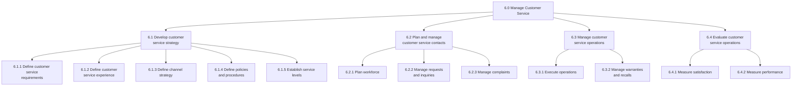
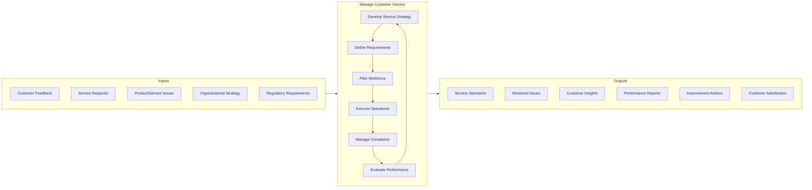
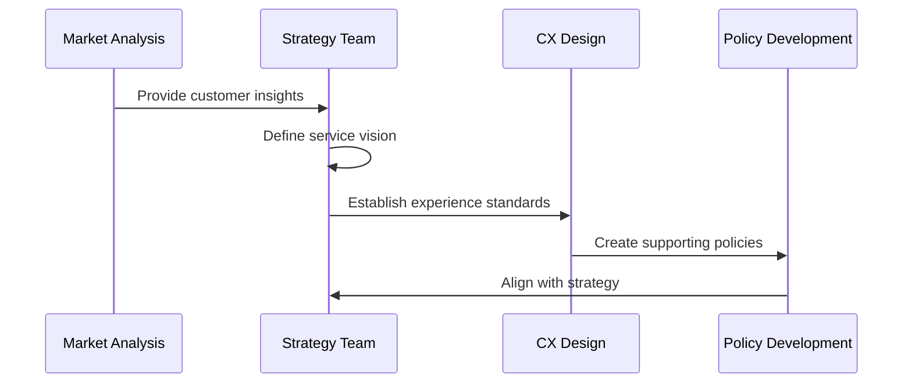
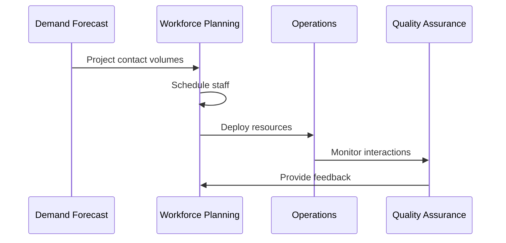
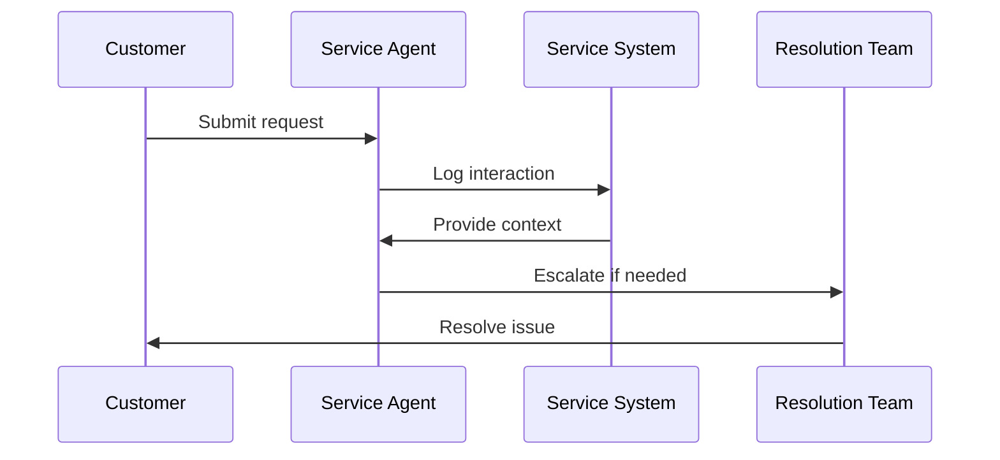
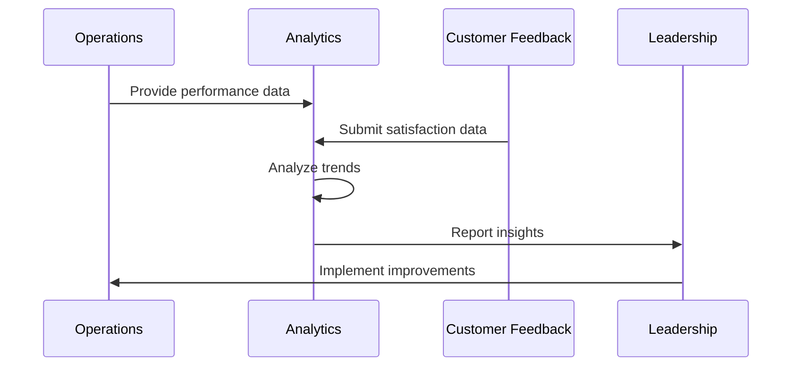
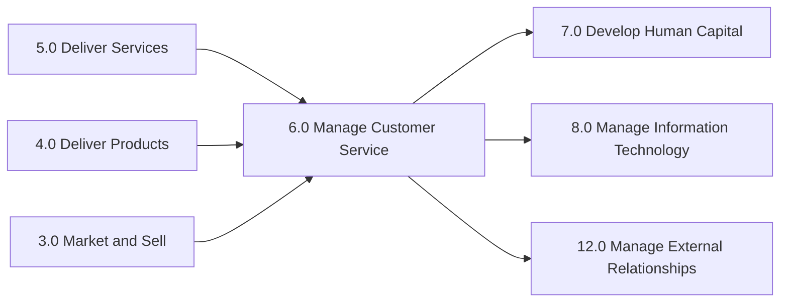

# Manage Customer Service

> Managing customers before and after the delivery of services. This includes developing and planning customer service practices with an eye on steering processes relating to inquiries after sales, feedback, warranties, and recalls.

## Overview

Manage Customer Service is the overarching APQC process category (6.0) that encompasses all customer-facing support operations. This process ensures organizations deliver consistent, high-quality service experiences across all customer touchpoints. It integrates strategy development, workforce planning, operations management, and performance evaluation into a cohesive customer service function.

Effective customer service management directly impacts customer retention, lifetime value, and brand advocacy. Organizations that excel in this area create competitive advantages through superior customer experiences, efficient issue resolution, and proactive engagement strategies.

## Process Hierarchy



## Key Statistics

| Metric | Value |
|--------|-------|
| APQC Code | 20085 |
| Hierarchy ID | 6.0 |
| Level | Category |
| Category | [Manage Customer Service](/processes/06-CustomerService) |
| Process Groups | 4 |
| Total Sub-Processes | 50+ |

## Process Flow



## GraphDL Semantic Structure

```
manage.CustomerService
```

| Component | Value | Description |
|-----------|-------|-------------|
| Verb | `manage` | Overseeing and coordinating all activities |
| Object | `CustomerService` | Complete customer support function |
| Preposition | - | Not applicable at category level |
| PrepObject | - | Not applicable at category level |

## Activities

### 6.1 - Develop customer service strategy

Defining a plan that removes customer obstacles by gathering operational insight and competitive insight, as well as improving soft skills and forward resolution for employees. Develop customer segmentation and establish service levels for customers.



**Tasks:**
- `define.CustomerServiceRequirements` - Establish enterprise-wide service requirements
- `design.CustomerServiceExperience` - Create experience standards and expectations
- `develop.ChannelStrategy` - Define multi-channel service approach
- `establish.ServiceLevels` - Set target service levels by customer segment

### 6.2 - Plan and manage customer service contacts

Planning and administering workforce operations for customer service provision by taking care of customer service requests/inquiries and complaints.



**Tasks:**
- `forecast.CustomerServiceDemand` - Predict contact volumes
- `schedule.CustomerServiceWorkforce` - Allocate staff to channels
- `monitor.InteractionQuality` - Track service quality metrics
- `manage.ServiceRequests` - Handle customer inquiries

### 6.3 - Manage customer service operations

Executing day-to-day customer service activities including handling service requests, managing warranties, and processing recalls.



**Tasks:**
- `execute.CustomerServiceOperations` - Deliver daily service activities
- `manage.Warranties` - Process warranty claims
- `process.Recalls` - Handle product recall communications
- `resolve.CustomerIssues` - Address customer problems

### 6.4 - Evaluate customer service operations

Calculating and assessing the operational activities of the customer service function through customer feedback, quality metrics, and satisfaction surveys.



**Tasks:**
- `measure.CustomerSatisfaction` - Assess satisfaction levels
- `analyze.ServicePerformance` - Review operational metrics
- `identify.ImprovementOpportunities` - Find enhancement areas
- `report.ServiceInsights` - Communicate findings

## RACI Matrix

| Activity | Responsible | Accountable | Consulted | Informed |
|----------|-------------|-------------|-----------|----------|
| Develop service strategy | Customer Service Director | Chief Customer Officer | Marketing, Sales | All departments |
| Define service requirements | CX Manager | Customer Service Director | Operations, IT | HR, Finance |
| Plan workforce | Workforce Manager | Customer Service Director | HR, Finance | Operations |
| Execute operations | Service Agents | Operations Manager | Quality Team | Leadership |
| Manage complaints | Escalation Team | Operations Manager | Legal, Product | Leadership |
| Evaluate performance | Quality Manager | Customer Service Director | Analytics | All stakeholders |

## Related Departments

- [Customer Service](/departments/CustomerService) - Primary ownership and execution
- [Operations](/departments/Operations/index) - Operational integration
- [Marketing](/departments/Marketing/index) - Customer insights and brand alignment
- [Product](/departments/Product) - Product feedback and improvements
- [Information Technology](/departments/IT) - Systems and technology support
- [Human Resources](/departments/HR/index) - Workforce development

## Related Occupations

- [Customer Service Representatives](/occupations/Administrative/CustomerServiceRepresentatives) - Frontline service delivery
- [Customer Service Managers](/occupations/CustomerServiceManagers) - Operational oversight
- [First-Line Supervisors](/occupations/FirstLineSupervisors) - Team leadership
- [Quality Control Analysts](/occupations/Science/QualityControlAnalysts) - Quality monitoring
- [Training Specialists](/occupations/TrainingSpecialists) - Agent development

## Industry Variations

### Aerospace and Defense

In aerospace and defense, customer service focuses on long-term relationships with government and commercial customers. Emphasis on technical support, spare parts logistics, and compliance with defense regulations. Service cycles may span decades.

**Industry-Specific Activities:**
- Manage aftermarket parts and services
- Provide technical publications and support
- Handle government contract compliance
- Support fleet maintenance programs

### Banking

Banking customer service emphasizes account management, dispute resolution, and regulatory compliance. Focus on security, fraud prevention, and multi-channel access (branch, phone, digital).

**Industry-Specific Activities:**
- Manage account inquiries and disputes
- Process fraud claims and chargebacks
- Handle regulatory complaints (CFPB, etc.)
- Provide digital banking support

### Healthcare Provider

Healthcare customer service centers on patient experience, billing inquiries, and appointment management. Emphasis on HIPAA compliance, empathy, and care coordination.

**Industry-Specific Activities:**
- Manage patient scheduling and referrals
- Handle billing and insurance inquiries
- Process patient complaints and grievances
- Coordinate care transitions

### Retail

Retail customer service spans in-store and e-commerce channels. Focus on returns, exchanges, order tracking, and loyalty program support.

**Industry-Specific Activities:**
- Process returns and exchanges
- Manage order fulfillment inquiries
- Operate in-store service desks
- Support loyalty and rewards programs

### City Government

Government customer service focuses on constituent engagement and public services. Emphasis on accessibility, transparency, and equitable service delivery.

**Industry-Specific Activities:**
- Manage 311 constituent requests
- Handle permit and license inquiries
- Process public records requests
- Support emergency communications

### Airline

Airline customer service addresses reservations, delays, baggage, and loyalty programs. High-stakes interactions during irregular operations require robust escalation processes.

**Industry-Specific Activities:**
- Manage reservations and changes
- Handle flight delay and cancellation support
- Process baggage claims
- Support frequent flyer programs

## Sub-Processes

| Process | Code | Description |
|---------|------|-------------|
| [Define customer service requirements](./Requirements.mdx) | 6.1.1 | Establishing enterprise-wide requirements |
| [Define customer service experience](./ServiceExperience.mdx) | 6.1.2 | Communicating experience expectations |
| [Define customer service policies and procedures](./Policies.mdx) | 6.1.4 | Outlining framework for service delivery |
| [Translate service requirements to logistics](./LogisticsRequirements.mdx) | 4.4.1.1 | Converting service needs to logistics |

## Related Processes



## Metrics & KPIs

| Metric | Description | Target |
|--------|-------------|--------|
| Customer Satisfaction (CSAT) | Post-interaction satisfaction rating | >85% |
| Net Promoter Score (NPS) | Customer loyalty and advocacy | >50 |
| First Contact Resolution (FCR) | Issues resolved without escalation | >75% |
| Average Handle Time (AHT) | Average interaction duration | Channel-specific |
| Customer Effort Score (CES) | Ease of issue resolution | <2.0 |
| Service Level Agreement (SLA) | Responses within target time | >90% |
| Agent Utilization | Productive agent time | 75-85% |
| Quality Score | Interaction quality rating | >90% |

---

*Source: APQC PCF 20085 (6.0) - Cross-Industry*
