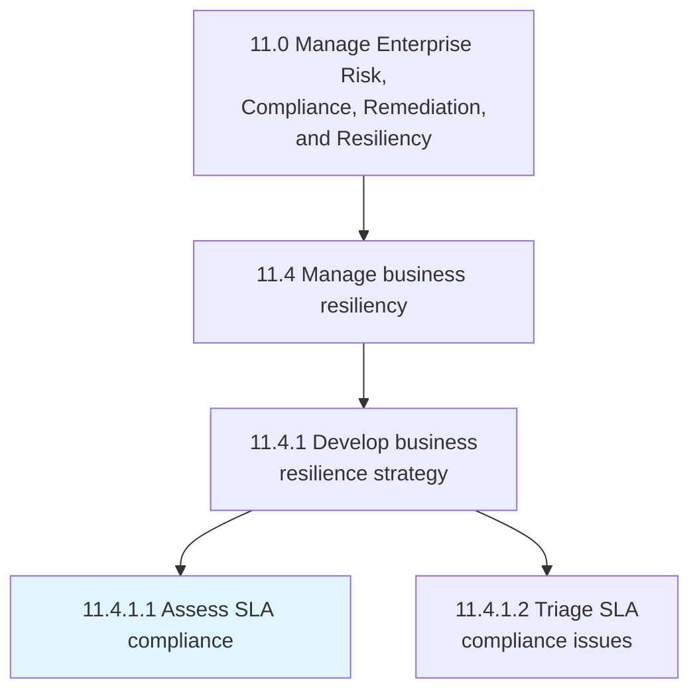
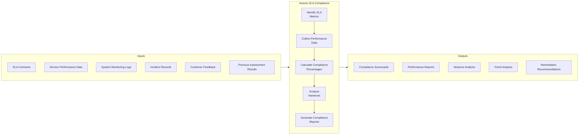
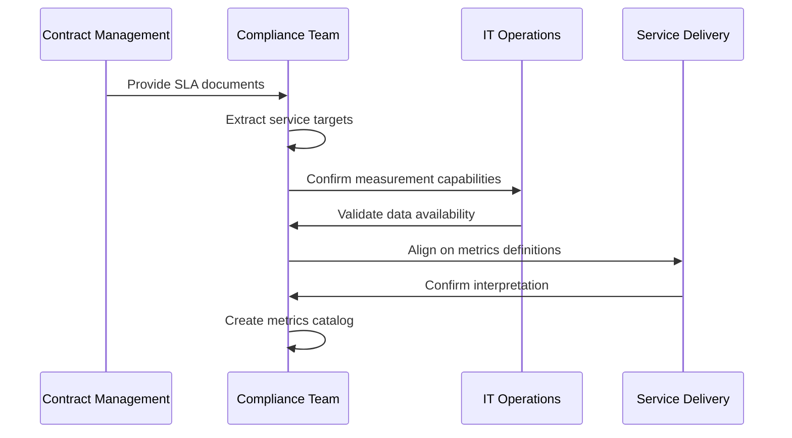
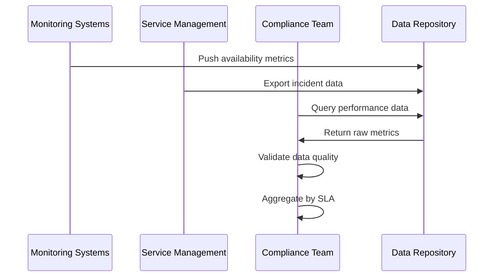
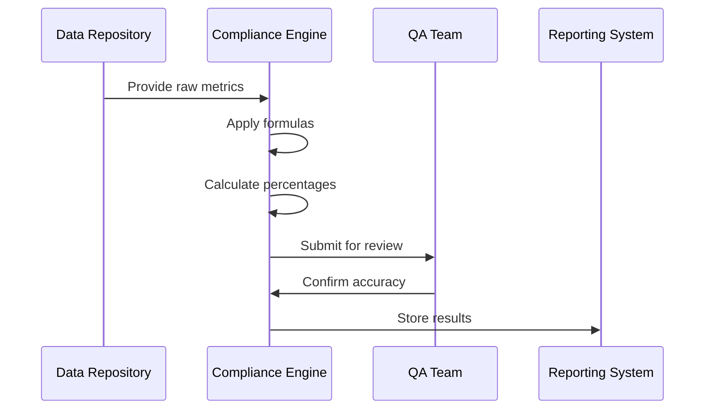
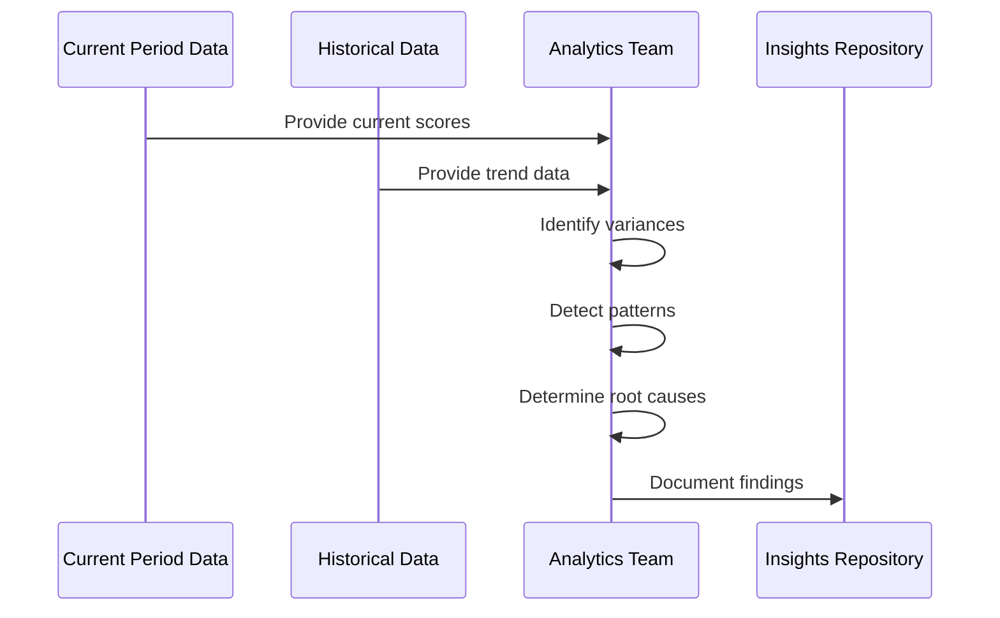
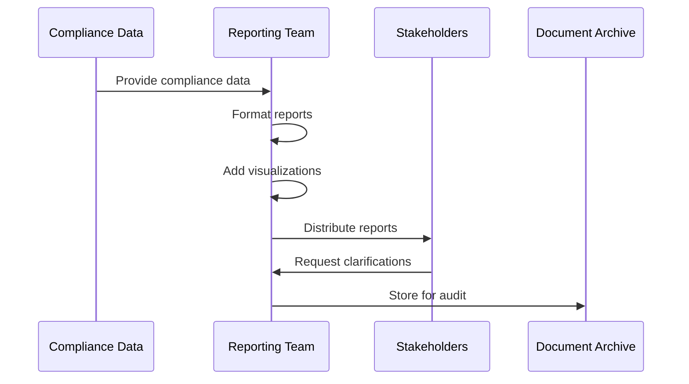
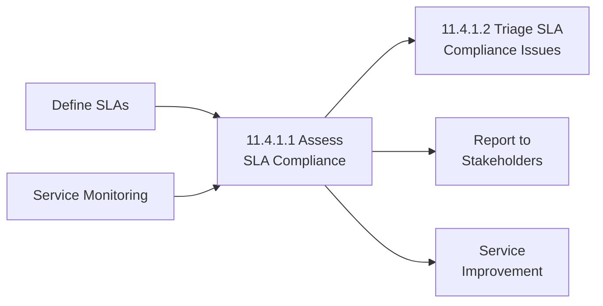

# Assess SLA compliance

> Gather data from each service target defined in an SLA for a time segment or review period to evaluate an overall performance percentage.

## Overview

Assess SLA compliance (APQC 11.4.1.1) is a critical activity within the business resiliency process group that ensures organizations meet their contractual service obligations. This process involves systematically collecting performance data against agreed-upon service level targets, calculating compliance percentages, and identifying areas where service delivery meets or falls short of commitments.

Effective SLA compliance assessment enables organizations to maintain customer trust, avoid contractual penalties, identify service improvement opportunities, and make data-driven decisions about resource allocation. The process requires robust data collection mechanisms, clear measurement methodologies, and timely reporting to stakeholders.

## Process Hierarchy



## Key Statistics

| Metric | Value |
|--------|-------|
| APQC Code | 20649 |
| Hierarchy ID | 11.4.1.1 |
| Level | Activity |
| Category | [Manage Enterprise Risk, Compliance, Remediation, and Resiliency](/processes/11-Risk) |
| Parent Process | [Manage business resiliency](./index.mdx) |

## Process Flow



## GraphDL Semantic Structure

```
assess.SlaCompliance
```

| Component | Value | Description |
|-----------|-------|-------------|
| Verb | `assess` | Primary action of evaluating and measuring |
| Object | `SlaCompliance` | Service level agreement conformance |
| Preposition | - | Not applicable |
| PrepObject | - | Not applicable |

## Activities

### Identify SLA Metrics and Targets

Reviewing SLA contracts to identify all measurable service targets and their associated thresholds, measurement periods, and calculation methodologies.



**Tasks:**
- `review.SlaContracts` - Examine all active service level agreements
- `extract.ServiceTargets` - Identify measurable performance targets
- `document.MeasurementMethodologies` - Define calculation approaches
- `validate.DataSources` - Confirm data availability for each metric

### Collect Performance Data

Gathering performance data from various systems, logs, and monitoring tools for the assessment period.



**Tasks:**
- `gather.AvailabilityMetrics` - Collect uptime and availability data
- `extract.ResponseTimeData` - Compile response time measurements
- `aggregate.IncidentMetrics` - Sum incident counts and durations
- `validate.DataCompleteness` - Ensure all required data is captured

### Calculate Compliance Percentages

Computing compliance scores for each SLA metric and overall agreement performance.



**Tasks:**
- `calculate.UptimePercentage` - Compute availability compliance
- `calculate.ResponseCompliance` - Determine response time adherence
- `calculate.ResolutionCompliance` - Measure resolution time performance
- `compute.OverallScore` - Aggregate weighted compliance score

### Analyze Variances and Trends

Examining deviations from targets and identifying patterns across assessment periods.



**Tasks:**
- `identify.PerformanceGaps` - Highlight areas below target
- `analyze.TrendPatterns` - Examine performance over time
- `determine.RootCauses` - Investigate reasons for non-compliance
- `project.FuturePerformance` - Forecast upcoming compliance risks

### Generate Compliance Reports

Creating comprehensive reports for stakeholders including customers, management, and operational teams.



**Tasks:**
- `create.ExecutiveSummary` - Prepare high-level compliance overview
- `generate.DetailedReports` - Produce metric-by-metric analysis
- `build.Dashboards` - Create visual compliance displays
- `distribute.Reports` - Share with appropriate stakeholders

## RACI Matrix

| Activity | Responsible | Accountable | Consulted | Informed |
|----------|-------------|-------------|-----------|----------|
| Identify SLA metrics | Service Delivery | Contract Manager | Legal, IT | Customers |
| Collect performance data | IT Operations | Service Manager | Monitoring Team | Compliance |
| Calculate compliance | Compliance Team | Quality Manager | IT Operations | Management |
| Analyze variances | Analytics Team | Service Director | Operations | Executive Team |
| Generate reports | Reporting Team | Compliance Manager | All Departments | Customers, Board |

## Related Departments

- IT Operations - Primary data source for service metrics
- Service Delivery - Service execution and monitoring
- Compliance - Compliance assessment coordination
- Contract Management - SLA documentation and interpretation
- [Quality Assurance](/departments/Quality) - Validation of measurements and calculations

## Related Occupations

- [Compliance Officers](/occupations/Business/Operations/ComplianceOfficers) - Overall compliance assessment oversight
- [IT Service Managers](/occupations/ITServiceManagers) - Service delivery management
- [Quality Assurance Analysts](/occupations/QAAnalysts) - Data validation and accuracy
- [Business Analysts](/occupations/BusinessAnalysts) - Metrics analysis and reporting
- [Contract Administrators](/occupations/ContractAdministrators) - SLA interpretation

## Industry Variations

### Aerospace and Defense

SLA compliance in aerospace focuses on mission-critical system availability, maintenance turnaround times, and logistics support metrics. Defense contracts often include complex availability requirements and performance-based logistics (PBL) arrangements.

**Industry-Specific Activities:**
- Assess aircraft availability metrics
- Monitor maintenance turnaround compliance
- Track spare parts delivery performance
- Evaluate mission-capable rates

### Banking

Financial services SLA compliance emphasizes transaction processing times, system availability during trading hours, and regulatory reporting timeliness. Payment processing SLAs often have penalty clauses for missed targets.

**Industry-Specific Activities:**
- Monitor transaction processing times
- Assess payment clearing compliance
- Evaluate ATM/channel availability
- Track regulatory submission timeliness

### Healthcare Provider

Healthcare SLA compliance focuses on system availability for clinical applications, response times for critical systems, and data backup/recovery capabilities. HIPAA requirements add compliance dimensions.

**Industry-Specific Activities:**
- Monitor EHR system availability
- Assess clinical system response times
- Evaluate data backup compliance
- Track patient portal uptime

### Retail

Retail SLA compliance centers on e-commerce platform availability, order processing times, and point-of-sale system performance, especially during peak shopping periods.

**Industry-Specific Activities:**
- Monitor e-commerce platform uptime
- Assess order fulfillment timelines
- Track POS system availability
- Evaluate inventory system performance

### Utilities

Utility companies assess SLA compliance for grid availability, outage response times, customer service levels, and billing system performance against regulatory requirements.

**Industry-Specific Activities:**
- Monitor grid availability metrics
- Assess outage response compliance
- Track meter reading accuracy
- Evaluate call center service levels

## Sub-Processes

| Process | Code | Description |
|---------|------|-------------|
| Identify SLA metrics | - | Extract and catalog service level targets |
| Collect performance data | - | Gather data from monitoring systems |
| Calculate compliance | - | Compute compliance percentages |
| Analyze variances | - | Examine deviations and trends |
| Generate reports | - | Create and distribute compliance reports |

## Related Processes



## Metrics & KPIs

| Metric | Description | Target |
|--------|-------------|--------|
| Assessment Timeliness | Time to complete compliance assessment | <5 days after period end |
| Data Accuracy | Accuracy of compliance calculations | >99% |
| Report Distribution | On-time delivery of compliance reports | 100% |
| Metric Coverage | Percentage of SLA metrics assessed | 100% |
| Stakeholder Satisfaction | Satisfaction with compliance reporting | >90% |
| Issue Detection Rate | Compliance issues identified proactively | >85% |

---

*Source: APQC PCF 20649 (11.4.1.1) - Cross-Industry*
