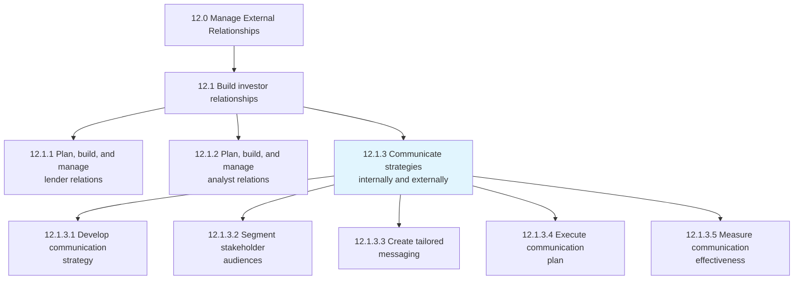
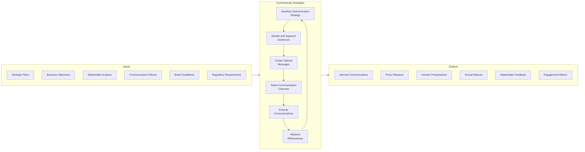
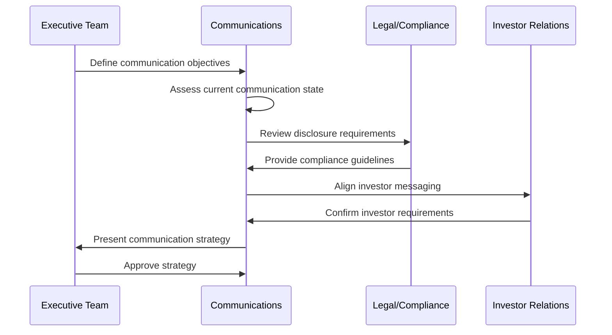
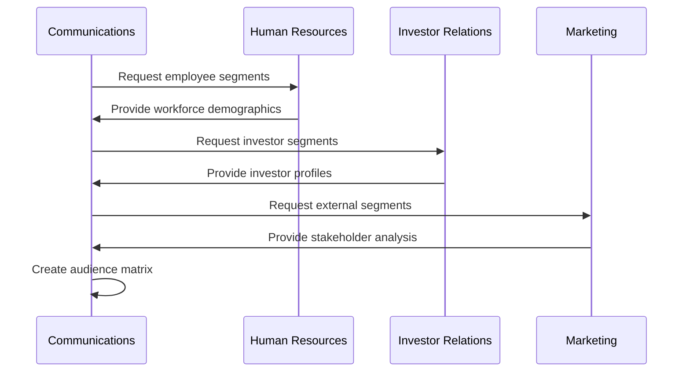
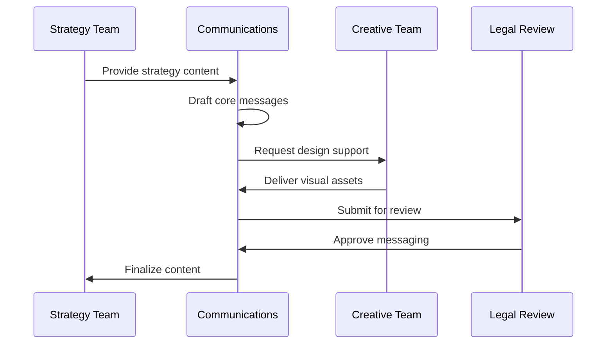
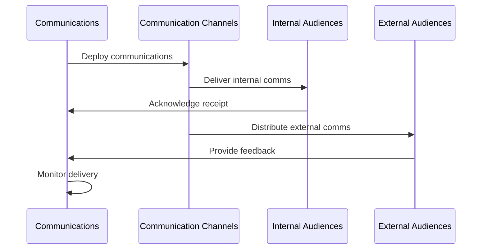
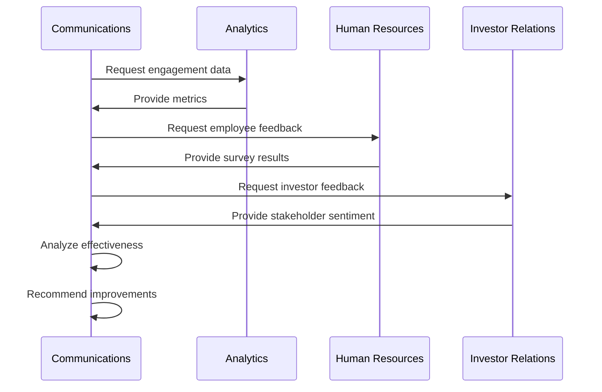
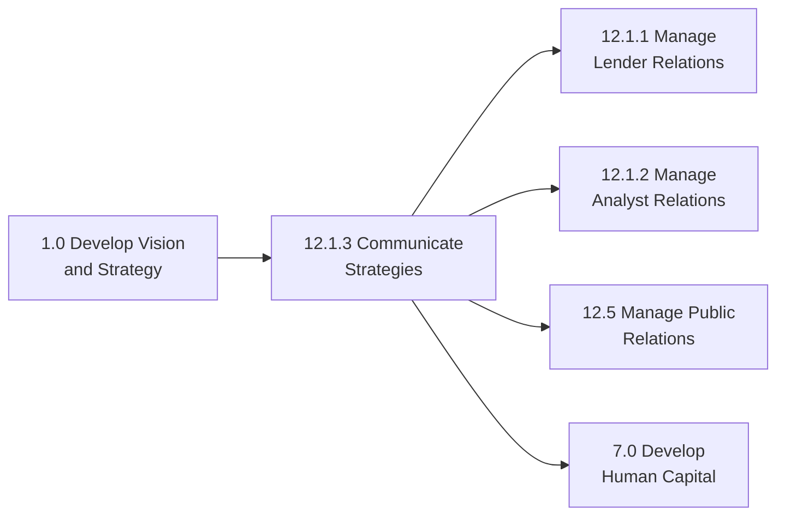

# Communicate strategies internally and externally

> Conveying planned procedures and methods to both internal departments and external stakeholders like customers, suppliers, etc., in an effective manner based on organizational objective.

## Overview

Communicate strategies internally and externally (APQC 12.1.3) is a process within the "Build investor relationships" process group. This process ensures that organizational strategies, goals, and initiatives are effectively communicated to all relevant stakeholders both within and outside the organization. Effective strategy communication is essential for alignment, engagement, and successful execution.

The process involves tailoring messages for different audiences, selecting appropriate communication channels, ensuring consistent messaging, and gathering feedback to verify understanding and alignment. Internal communications focus on employee engagement and operational alignment, while external communications address investors, partners, regulators, and the public.

## Process Hierarchy



## Key Statistics

| Metric | Value |
|--------|-------|
| APQC Code | 18916 |
| Hierarchy ID | 12.1.3 |
| Level | Process |
| Category | [Manage External Relationships](/processes/12-External) |
| Parent Process | [Build investor relationships](./index.mdx) |

## Process Flow



## GraphDL Semantic Structure

```
communicate.Strategies.to.Stakeholders
```

| Component | Value | Description |
|-----------|-------|-------------|
| Verb | `communicate` | Primary action of conveying information |
| Object | `Strategies` | Organizational plans and methods |
| Preposition | `to` | Direction of communication |
| PrepObject | `Stakeholders` | Internal and external audiences |

## Activities

### 12.1.3.1 - Develop communication strategy

Creating a comprehensive plan for how organizational strategies will be communicated to various stakeholder groups.



**Tasks:**
- `define.CommunicationObjectives` - Establish goals for strategy communication
- `assess.CurrentState` - Evaluate existing communication effectiveness
- `identify.ComplianceRequirements` - Determine regulatory disclosure needs
- `develop.MessagingFramework` - Create core messages and themes

### 12.1.3.2 - Segment stakeholder audiences

Identifying and categorizing different stakeholder groups based on their information needs and preferred communication methods.



**Tasks:**
- `identify.InternalAudiences` - Categorize employee groups
- `identify.ExternalAudiences` - Categorize external stakeholders
- `analyze.InformationNeeds` - Determine content requirements per segment
- `map.CommunicationPreferences` - Document preferred channels per audience

### 12.1.3.3 - Create tailored messaging

Developing audience-specific messages that convey strategy in relevant and accessible terms.



**Tasks:**
- `draft.CoreMessages` - Create foundational strategy narrative
- `adapt.MessagesForAudiences` - Customize content per stakeholder group
- `develop.SupportingMaterials` - Create presentations, documents, visuals
- `validate.Accuracy` - Ensure factual correctness and compliance

### 12.1.3.4 - Execute communication plan

Delivering communications through appropriate channels according to the planned schedule.



**Tasks:**
- `schedule.Communications` - Plan timing and sequencing
- `deliver.InternalCommunications` - Execute employee communications
- `distribute.ExternalCommunications` - Release public communications
- `monitor.Delivery` - Track communication distribution

### 12.1.3.5 - Measure communication effectiveness

Evaluating the impact and success of strategy communications through feedback and metrics.



**Tasks:**
- `collect.EngagementMetrics` - Gather quantitative data
- `survey.StakeholderUnderstanding` - Assess message comprehension
- `analyze.Feedback` - Evaluate qualitative responses
- `recommend.Improvements` - Identify optimization opportunities

## RACI Matrix

| Activity | Responsible | Accountable | Consulted | Informed |
|----------|-------------|-------------|-----------|----------|
| Develop communication strategy | Communications Team | Chief Communications Officer | Executive Team, Legal | All Departments |
| Segment stakeholder audiences | Communications Analyst | Communications Director | HR, IR, Marketing | Communications Team |
| Create tailored messaging | Content Team | Communications Director | Strategy, Legal | Executive Team |
| Execute communication plan | Communications Team | CCO | IT, HR | All Stakeholders |
| Measure effectiveness | Analytics Team | Communications Director | HR, IR | Executive Team |

## Related Departments

- [Communications](/departments/Communications) - Primary ownership of strategy communications
- [Investor Relations](/departments/InvestorRelations) - External financial communications
- [Human Resources](/departments/HR/index) - Internal employee communications
- [Marketing](/departments/Marketing/index) - Brand alignment and public messaging
- [Legal](/departments/Legal/index) - Compliance review and approval

## Related Occupations

- [Public Relations Specialists](/occupations/ArtsMedia/PublicRelationsSpecialists) - External communications
- [Communications Managers](/occupations/CommunicationsManagers) - Communication strategy leadership
- [Investor Relations Officers](/occupations/InvestorRelations) - Financial stakeholder communications
- [Technical Writers](/occupations/ArtsMedia/TechnicalWriters) - Content development
- [Marketing Managers](/occupations/Management/MarketingManagers) - Brand-aligned messaging

## Industry Variations

### Aerospace and Defense

Strategy communication in aerospace and defense requires careful handling of classified information, export control compliance, and coordination with government stakeholders on public disclosures.

**Industry-Specific Activities:**
- Navigate security classification requirements
- Coordinate disclosure with defense customers
- Communicate long-term program strategies
- Manage international partner communications

### Banking

Banking institutions must balance transparent investor communications with regulatory disclosure requirements while maintaining customer confidence during strategic changes.

**Industry-Specific Activities:**
- Coordinate with regulatory communications teams
- Manage rate and policy change announcements
- Communicate risk management strategies
- Address fintech competitive positioning

### Healthcare Provider

Healthcare organizations communicate strategies to diverse stakeholders including patients, physicians, payers, and regulators while maintaining HIPAA compliance.

**Industry-Specific Activities:**
- Communicate care model changes to patients
- Engage physician communities on strategy
- Coordinate payer communications
- Address community health initiatives

### City Government

City governments communicate strategies to citizens, businesses, and other governmental bodies while ensuring transparency and public engagement.

**Industry-Specific Activities:**
- Conduct public hearings and town halls
- Publish comprehensive plans
- Engage citizen advisory committees
- Coordinate intergovernmental communications

### Education

Educational institutions communicate strategies to students, parents, faculty, and board members with emphasis on academic mission and community impact.

**Industry-Specific Activities:**
- Engage faculty governance in strategy
- Communicate curriculum changes to parents
- Address student body on institutional direction
- Coordinate board communications

## Sub-Processes

| Process | Code | Description |
|---------|------|-------------|
| Develop communication strategy | 12.1.3.1 | Create comprehensive communication plan |
| Segment stakeholder audiences | 12.1.3.2 | Identify and categorize stakeholder groups |
| Create tailored messaging | 12.1.3.3 | Develop audience-specific content |
| Execute communication plan | 12.1.3.4 | Deliver communications per schedule |
| Measure effectiveness | 12.1.3.5 | Evaluate communication impact |

## Related Processes



## Metrics & KPIs

| Metric | Description | Target |
|--------|-------------|--------|
| Message Reach | Percentage of stakeholders receiving communications | >95% |
| Understanding Score | Stakeholder comprehension of strategy | >85% |
| Engagement Rate | Active engagement with communications | >40% |
| Consistency Score | Message alignment across channels | >90% |
| Feedback Response Rate | Stakeholders providing feedback | >25% |
| Time to Communication | Speed from strategy approval to communication | <5 days |

---

*Source: APQC PCF 18916 (12.1.3) - Cross-Industry*
