# Design customer experience support structure

> Creating a roadmap for customer experience support with an overall approach, process flow, and impact timeframe.

## Overview

Design customer experience support structure (APQC 19971) is a critical process within the Develop Customer Experience Strategy process group. This process focuses on creating the organizational infrastructure, capabilities, and processes needed to deliver and sustain exceptional customer experiences. It bridges the gap between CX strategy and operational execution by defining how the organization will support, measure, and continuously improve customer interactions.

The support structure encompasses people, processes, technology, and governance mechanisms that enable consistent delivery of the designed customer experience. It addresses the capabilities needed to capture customer feedback, analyze experience data, respond to customer needs, and drive continuous improvement across all touchpoints.

## Process Hierarchy

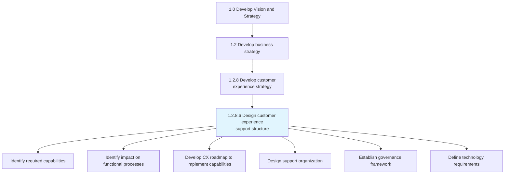

## Key Statistics

| Metric | Value |
|--------|-------|
| APQC Code | 19971 |
| Hierarchy ID | 1.2.8.6 |
| Level | Process |
| Category | [Develop Vision and Strategy](/processes/01-Strategy) |
| Sub-Activities | 6 |
| Implementation Horizon | 12-24 months typical |

## Process Flow

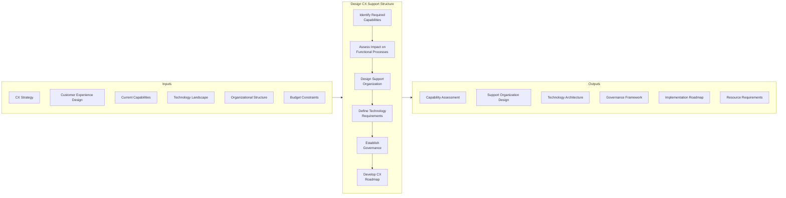

## GraphDL Semantic Structure

```
design.CustomerExperienceSupportStructure
```

| Component | Value | Description |
|-----------|-------|-------------|
| Verb | `design` | Primary action of creating and planning |
| Object | `CustomerExperienceSupportStructure` | The infrastructure for CX delivery |
| Preposition | - | Not applicable |
| PrepObject | - | Not applicable |

## Activities

### Identify required capabilities

Determining the necessary skills and competencies required to efficiently collect customer experiences through the support structure.

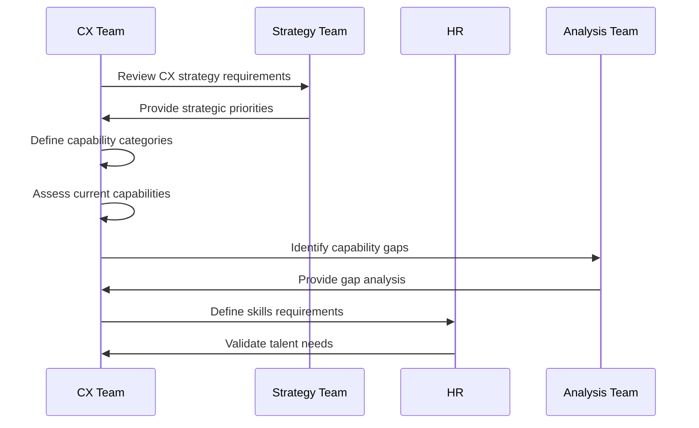

**Tasks:**
- `define.CapabilityCategories` - Establish capability framework
- `assess.CurrentCapabilities` - Evaluate existing capabilities
- `identify.CapabilityGaps` - Determine missing capabilities
- `prioritize.Capabilities` - Rank capabilities by importance
- `document.SkillRequirements` - Define specific skill needs

### Identify impact on functional processes

Identifying the effect of customer experience through customer experience support structure on other functions of customer services related to customer.

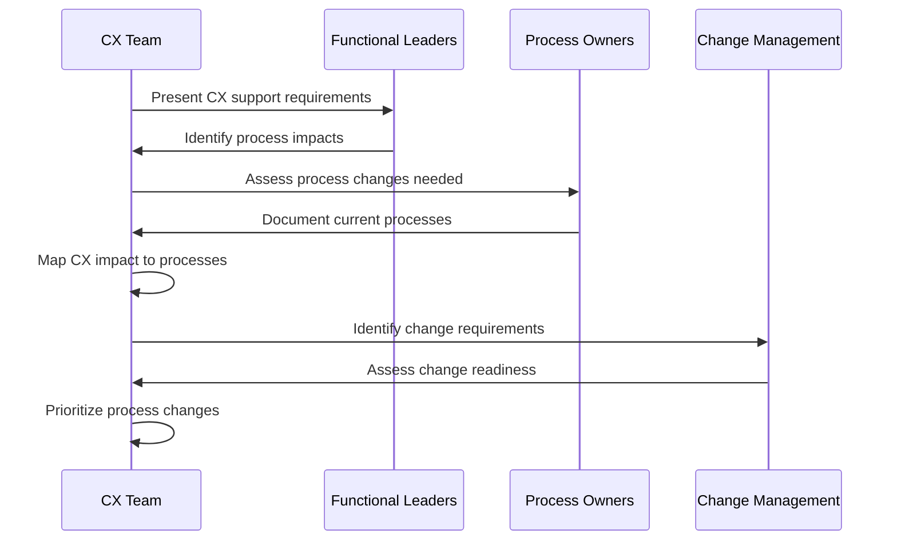

**Tasks:**
- `map.ProcessImpacts` - Identify affected functional processes
- `assess.ChangeRequirements` - Determine process change scope
- `evaluate.ChangeReadiness` - Assess organizational readiness
- `prioritize.ProcessChanges` - Rank changes by impact and feasibility
- `document.IntegrationPoints` - Define process touch points

### Design support organization

Creating the organizational structure, roles, and responsibilities needed to support customer experience delivery.

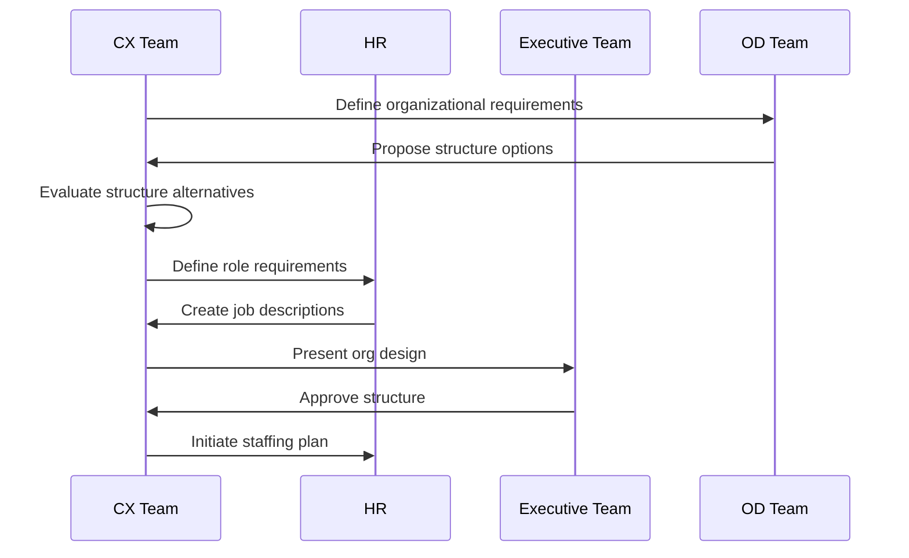

**Tasks:**
- `define.OrganizationalRequirements` - Establish structure needs
- `evaluate.StructureAlternatives` - Assess organizational options
- `design.RolesAndResponsibilities` - Create role definitions
- `establish.ReportingRelationships` - Define reporting lines
- `develop.StaffingPlan` - Plan resource acquisition

### Define technology requirements

Establishing the technology architecture, systems, and tools needed to enable customer experience support capabilities.

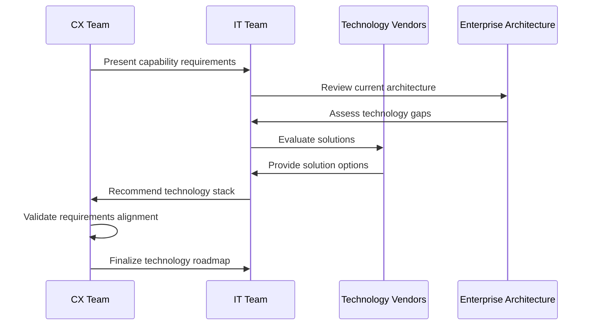

**Tasks:**
- `assess.TechnologyGaps` - Identify missing technology capabilities
- `evaluate.SolutionOptions` - Review available technologies
- `define.IntegrationRequirements` - Establish system connections
- `create.TechnologyRoadmap` - Plan technology implementation
- `estimate.TechnologyInvestment` - Define budget requirements

### Establish governance framework

Creating the governance structures, policies, and procedures that ensure consistent customer experience delivery and continuous improvement.

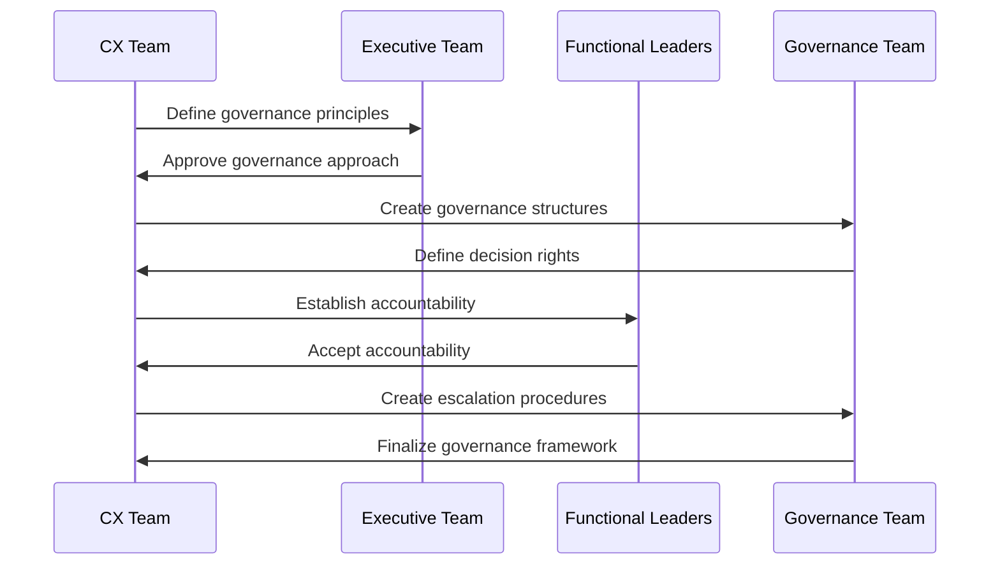

**Tasks:**
- `define.GovernancePrinciples` - Establish guiding principles
- `create.GovernanceStructures` - Design governance bodies
- `establish.DecisionRights` - Clarify decision authority
- `define.EscalationProcedures` - Create issue resolution paths
- `document.GovernanceCharter` - Formalize governance framework

### Develop CX roadmap to implement capabilities

Defining a standard guideline to create and execute the capacities of registering customer experiences in a timely manner. Create a common understanding of what behaviors are required to implement the strategy. Define what talent/skills your organization needs to reach customer experience goals.

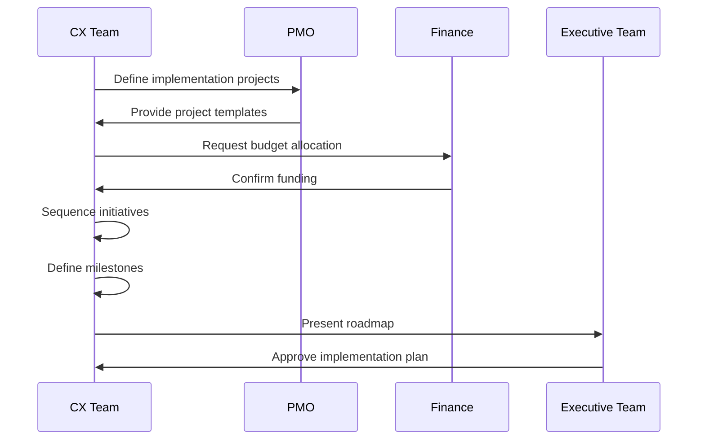

**Tasks:**
- `define.ImplementationProjects` - Identify specific initiatives
- `sequence.Initiatives` - Order projects logically
- `define.Milestones` - Establish key checkpoints
- `allocate.Resources` - Assign people and budget
- `create.CommunicationPlan` - Plan stakeholder engagement

## Support Structure Components

### Organizational Components

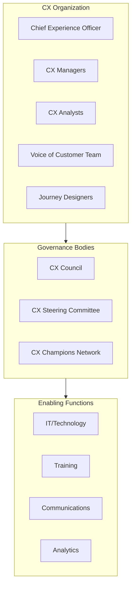

### Technology Architecture

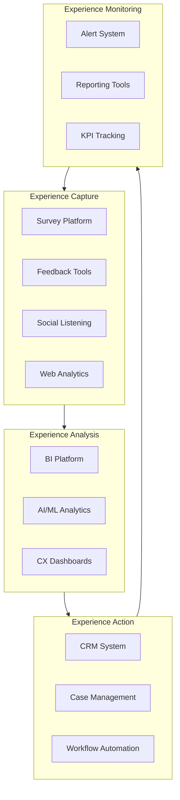

### Capability Framework

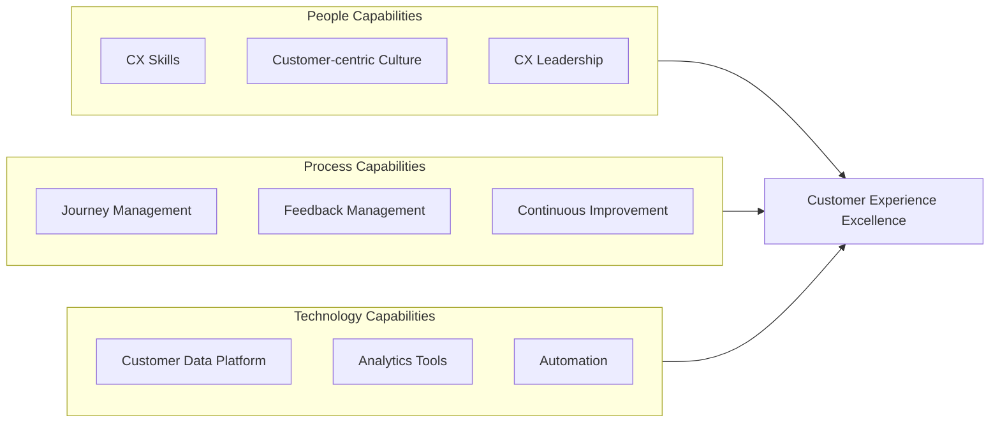

## RACI Matrix

| Activity | Responsible | Accountable | Consulted | Informed |
|----------|-------------|-------------|-----------|----------|
| Identify required capabilities | CX Team | CMO | HR, IT | Executive Team |
| Identify process impacts | CX Team | COO | Functional Leaders | Process Owners |
| Design support organization | CX Team, HR | CMO | OD, Finance | All Departments |
| Define technology requirements | CX Team, IT | CIO | Vendors, Security | Finance |
| Establish governance | CX Team | CEO | Executive Team | All Managers |
| Develop CX roadmap | CX Team | CMO | PMO, Finance | Board |

## Related Departments

- [Customer Experience](/departments/Support) - Primary owner of support structure
- [Human Resources](/departments/HR/index) - Organizational design and talent
- [Information Technology](/departments/Technology) - Technology enablement
- [Finance](/departments/Finance/index) - Budget and resource allocation
- [Operations](/departments/Operations/index) - Process integration
- [All Customer-facing Departments](/departments) - Support structure participants

## Related Occupations

- [Customer Experience Managers](/occupations/CXManagers) - Support structure leadership
- [Business Analysts](/occupations/BusinessAnalysts) - Capability and process analysis
- [IT Project Managers](/occupations/ITProjectManagers) - Technology implementation
- [Organizational Development Specialists](/occupations/OrgDevelopment) - Org design
- [Change Management Specialists](/occupations/ChangeManagement) - Implementation support

## Industry Variations

### Banking

Banking CX support structures emphasize regulatory compliance, fraud prevention, and digital channel support. Technology architecture must address security requirements and omnichannel integration.

**Industry-Specific Activities:**
- Design compliance-aware feedback systems
- Create fraud detection integration
- Build omnichannel support capabilities
- Establish regulatory reporting processes

### Healthcare Provider

Healthcare CX support structures focus on patient experience, HIPAA compliance, and care coordination support. Technology must integrate with clinical systems while protecting patient data.

**Industry-Specific Activities:**
- Design HIPAA-compliant feedback systems
- Create clinical system integration
- Build patient portal support capabilities
- Establish quality reporting processes

### Retail

Retail CX support structures address omnichannel shopping, returns processing, and personalization engines. Support must scale for seasonal demand variations.

**Industry-Specific Activities:**
- Design scalable support infrastructure
- Create omnichannel feedback integration
- Build personalization support capabilities
- Establish inventory-aware service processes

### Aerospace and Defense

Aerospace CX support structures emphasize B2B relationship management, complex program support, and long-term service partnerships. Support must address extended product lifecycles.

**Industry-Specific Activities:**
- Design enterprise account support structures
- Create program management integration
- Build aftermarket service capabilities
- Establish long-cycle relationship management

## Implementation Phases

### Phase 1: Foundation (Months 1-6)

| Initiative | Description | Outcome |
|------------|-------------|---------|
| Capability Assessment | Evaluate current state | Gap analysis |
| Governance Design | Create governance framework | Governance charter |
| Quick Wins | Implement immediate improvements | Early value delivery |
| Organization Design | Define support structure | Org design approved |

### Phase 2: Build (Months 7-12)

| Initiative | Description | Outcome |
|------------|-------------|---------|
| Technology Selection | Choose and implement platforms | Technology deployed |
| Process Integration | Connect CX processes | Processes integrated |
| Team Building | Hire and train CX team | Team operational |
| Pilot Programs | Test support capabilities | Validated approach |

### Phase 3: Scale (Months 13-24)

| Initiative | Description | Outcome |
|------------|-------------|---------|
| Enterprise Rollout | Expand across organization | Full deployment |
| Advanced Capabilities | Add AI/analytics | Enhanced capabilities |
| Continuous Improvement | Optimize performance | Improved outcomes |
| Maturity Assessment | Evaluate progress | Maturity milestone |

## Sub-Processes

| Process | Code | Description |
|---------|------|-------------|
| [Identify required capabilities](./RequiredCapabilities) | 19972 | Determine necessary skills and competencies |
| [Identify impact on processes](./ProcessImpact) | 19973 | Assess functional process impacts |
| [Develop CX roadmap](./CXRoadmap) | 19974 | Create implementation plan |

## Related Processes

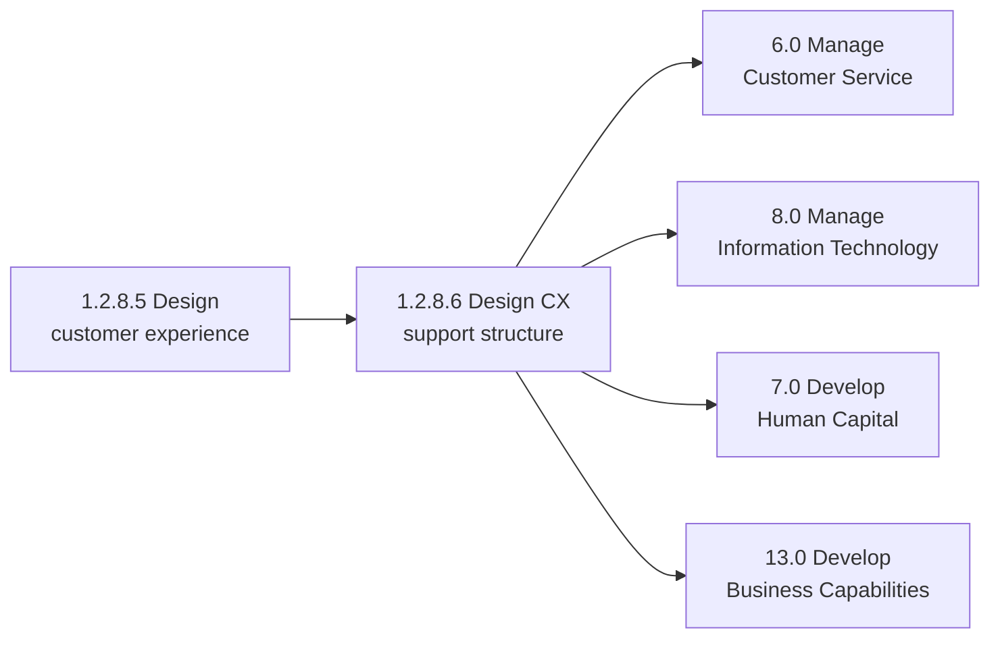

## Metrics & KPIs

| Metric | Description | Target |
|--------|-------------|--------|
| Capability Maturity Score | CX capability assessment | Level 4+ (5-scale) |
| Support Response Time | Time to respond to CX issues | <4 hours |
| Process Integration Rate | Percentage of processes integrated | >90% |
| Technology Uptime | System availability | >99.5% |
| Staff Competency Score | CX team skill assessment | >85% |
| Governance Compliance | Adherence to CX governance | >95% |
| Roadmap Delivery Rate | Implementation on schedule | >85% |
| ROI on CX Investments | Return on CX investment | >20% |

---

*Source: APQC PCF 19971 (1.2.8.6) - Cross-Industry*
