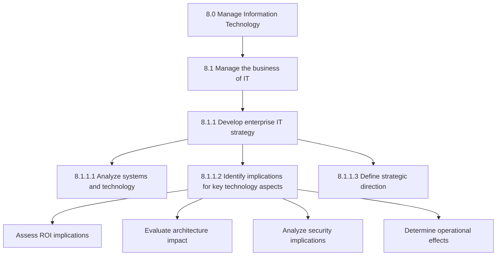
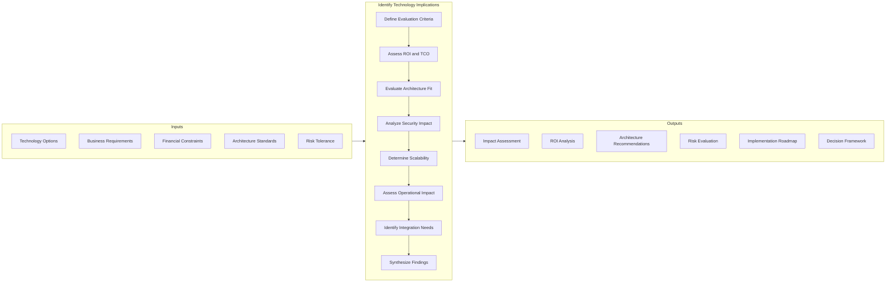
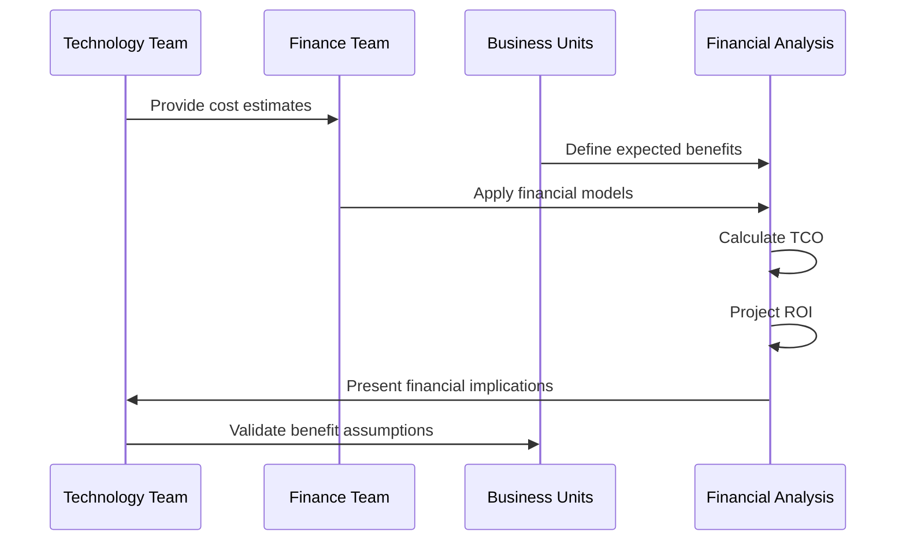
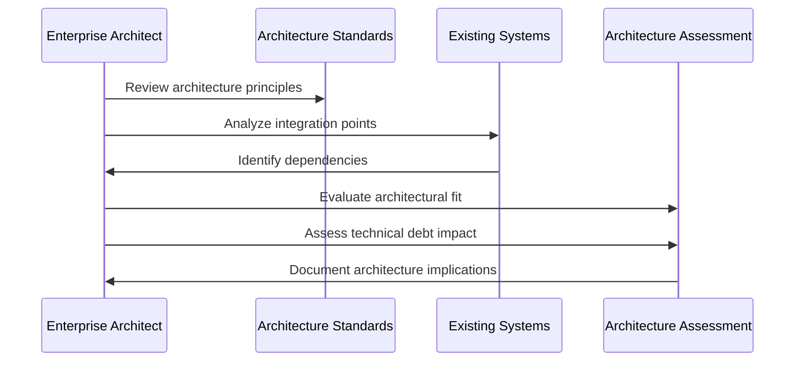
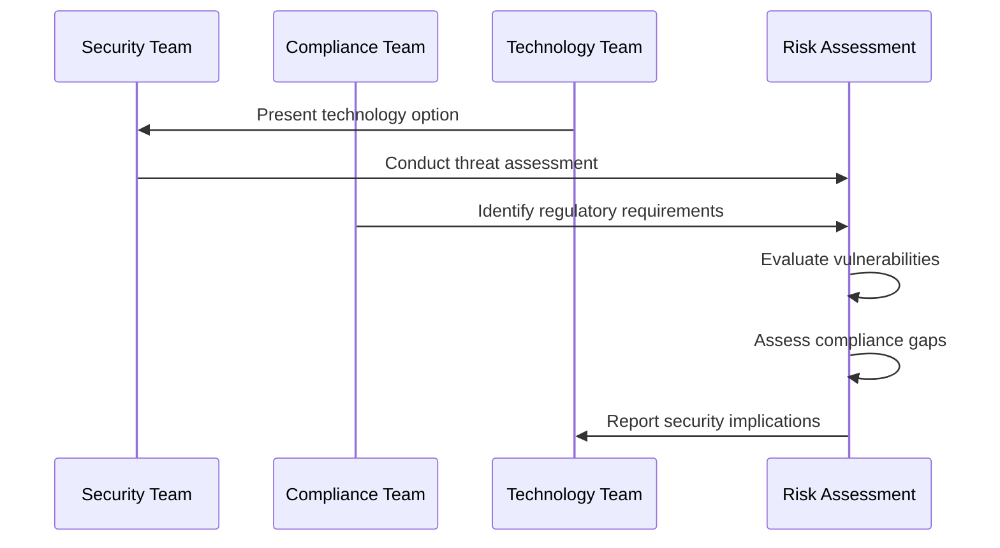
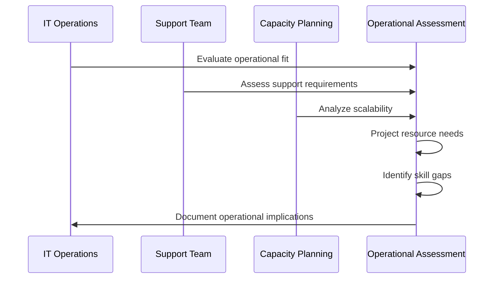
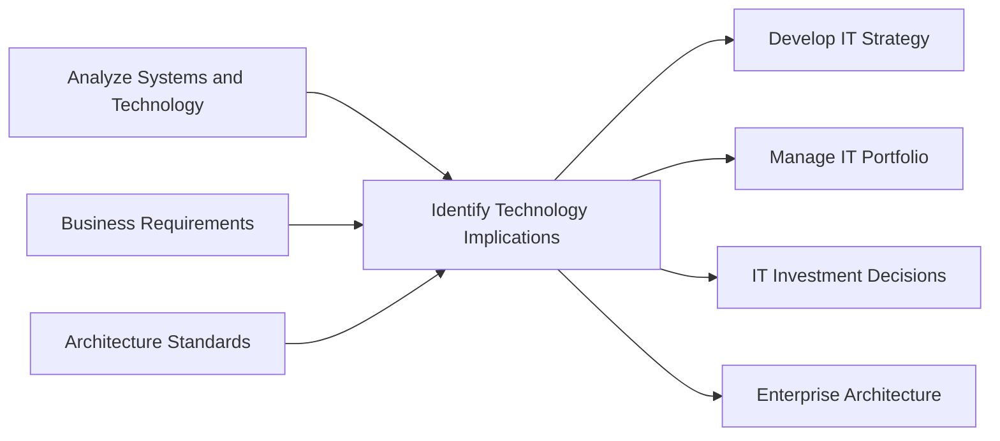

# Identify implications for key technology aspects

> Determining key factors for technology ROI, benefits, architecture, security, scalability, and operational considerations. Assess how technology decisions impact the organization's strategy, operations, and competitive positioning.

## Overview

Identify implications for key technology aspects is a strategic IT planning process (APQC 13290) that evaluates the broader organizational impact of technology decisions. This process examines how technology choices affect return on investment, enterprise architecture, operational efficiency, security posture, and business outcomes.

Organizations use this process to ensure technology investments align with business objectives and deliver measurable value. By systematically identifying implications across multiple dimensions, decision-makers can make informed choices that balance innovation with risk, cost with capability, and short-term needs with long-term strategic goals.

## Process Hierarchy



## Key Statistics

| Metric | Value |
|--------|-------|
| APQC Code | 13290 |
| Hierarchy ID | 8.1.1.2 |
| Level | Activity |
| Category | [Manage Information Technology](/processes/08-IT) |
| Process Group | Manage the business of IT |
| Parent Process | Develop enterprise IT strategy |

## Process Flow



## GraphDL Semantic Structure

```
identify.Implications.for.KeyTechnologyAspects
```

| Component | Value | Description |
|-----------|-------|-------------|
| Verb | `identify` | Primary action of determining and recognizing |
| Object | `Implications` | Effects, consequences, and impacts |
| Preposition | `for` | Specifying the domain |
| PrepObject | `KeyTechnologyAspects` | ROI, architecture, security, operations |

## Activities

### 8.1.1.2.1 - Assess ROI and financial implications

Evaluating the return on investment and total cost of ownership for technology decisions, including direct costs, indirect benefits, and opportunity costs.



**Tasks:**
- `calculate.TotalCostOfOwnership` - Determine full lifecycle costs
- `project.ReturnOnInvestment` - Estimate financial returns
- `assess.OpportunityCosts` - Evaluate alternatives foregone
- `model.FinancialScenarios` - Create best/worst/expected cases

### 8.1.1.2.2 - Evaluate architecture implications

Assessing how technology decisions fit within and affect the enterprise architecture, including integration requirements, standards compliance, and technical debt.



**Tasks:**
- `assess.ArchitecturalFit` - Determine alignment with EA principles
- `evaluate.IntegrationComplexity` - Assess integration requirements
- `analyze.TechnicalDebtImpact` - Understand debt implications
- `verify.StandardsCompliance` - Confirm adherence to standards

### 8.1.1.2.3 - Analyze security and compliance implications

Evaluating security risks, compliance requirements, and data protection implications of technology decisions.



**Tasks:**
- `assess.SecurityRisks` - Identify potential vulnerabilities
- `evaluate.ComplianceRequirements` - Determine regulatory obligations
- `analyze.DataProtectionNeeds` - Review privacy implications
- `determine.SecurityControls` - Specify required safeguards

### 8.1.1.2.4 - Determine operational and scalability implications

Assessing how technology choices affect day-to-day operations, support requirements, and ability to scale.



**Tasks:**
- `evaluate.OperationalRequirements` - Assess day-to-day needs
- `assess.SupportCapabilities` - Determine support readiness
- `analyze.ScalabilityLimits` - Understand growth constraints
- `identify.SkillRequirements` - Determine training needs

## RACI Matrix

| Activity | Responsible | Accountable | Consulted | Informed |
|----------|-------------|-------------|-----------|----------|
| Assess ROI | Finance Analyst | CFO | IT Leadership | Business Units |
| Evaluate architecture | Enterprise Architect | CTO | Solution Architects | Development Teams |
| Analyze security | Security Architect | CISO | Compliance, Legal | IT Staff |
| Determine operational impact | IT Operations Lead | CIO | Support Teams | Users |
| Synthesize findings | Strategy Analyst | CIO | All Stakeholders | Executive Team |
| Present recommendations | IT Strategy Lead | CIO | Finance, Business | Board |

## Related Departments

- [Information Technology](/departments/Technology) - Primary ownership and execution
- [Finance](/departments/Finance/index) - ROI and TCO analysis
- Enterprise Architecture - Architecture implications
- [Security](/departments/Security) - Security and compliance assessment
- [Operations](/departments/Operations/index) - Operational impact evaluation

## Related Occupations

- [Computer and Information Systems Managers](/occupations/ComputerInformationSystemsManagers) - Strategic oversight
- [Computer Systems Analysts](/occupations/Technology/ComputerSystemsAnalysts) - Impact analysis
- [Financial Analysts](/occupations/Business/Financial/FinancialAnalysts) - ROI calculations
- [Information Security Analysts](/occupations/Technology/InformationSecurityAnalysts) - Security assessment
- [Network Architects](/occupations/NetworkArchitects) - Architecture evaluation

## Industry Variations

### Banking

Banking technology implications must account for stringent regulatory requirements (Basel III, Dodd-Frank), real-time processing needs, and cyber threat landscape. ROI calculations must include compliance cost avoidance and risk reduction benefits.

**Industry-Specific Activities:**
- Assess regulatory compliance implications (SOX, PCI-DSS, GDPR)
- Evaluate real-time transaction processing capabilities
- Analyze fraud prevention and detection implications
- Determine core banking system integration requirements

### Healthcare Provider

Healthcare technology implications focus on patient safety, clinical workflow optimization, and HIPAA compliance. Interoperability and data exchange standards are critical considerations.

**Industry-Specific Activities:**
- Evaluate HIPAA compliance and patient privacy implications
- Assess clinical workflow impact and physician adoption
- Analyze interoperability requirements (HL7, FHIR)
- Determine medical device integration implications

### Retail

Retail technology implications center on customer experience, omnichannel integration, and supply chain optimization. Scalability for peak demand periods is a critical factor.

**Industry-Specific Activities:**
- Assess customer experience and conversion implications
- Evaluate omnichannel integration requirements
- Analyze inventory visibility and supply chain impact
- Determine peak season scalability requirements

### Aerospace and Defense

Aerospace technology implications require consideration of classified data handling, ITAR compliance, and long-term supportability. Government contracting requirements add complexity to ROI calculations.

**Industry-Specific Activities:**
- Evaluate ITAR and export control compliance implications
- Assess classified system handling requirements
- Analyze long-term maintainability and supportability
- Determine government contract compliance impact

### Life Sciences

Life sciences technology implications must address FDA 21 CFR Part 11 compliance, clinical trial data integrity, and research collaboration needs.

**Industry-Specific Activities:**
- Assess FDA compliance and validation requirements
- Evaluate clinical trial data integrity implications
- Analyze research collaboration and data sharing needs
- Determine laboratory system integration requirements

## Sub-Processes

| Process | Code | Description |
|---------|------|-------------|
| [Analyze systems and technology](./SystemsAnalysis.mdx) | 10032 | Assess current state |
| [Define enterprise architecture](./EnterpriseArchitecture) | 20668 | Set architecture direction |
| [Manage IT portfolio strategy](./PortfolioStrategy) | 20660 | Align with portfolio |

## Related Processes



## Metrics & KPIs

| Metric | Description | Target |
|--------|-------------|--------|
| Assessment Accuracy | Variance between projected and actual implications | <15% |
| Decision Cycle Time | Time from analysis request to recommendation | <30 days |
| Stakeholder Coverage | Percentage of affected stakeholders consulted | 100% |
| ROI Realization | Actual ROI vs. projected ROI | >90% |
| Risk Identification Rate | Percentage of risks identified pre-implementation | >95% |

---

*Source: APQC PCF 13290 (8.1.1.2) - Cross-Industry*
