# Design the relationships between organizational units

> Fleshing out the connections and dependencies among the various units of the organization. Delineate the relationship among business units or process frameworks within the organization, in terms of activities, synergies, and shared resources and responsibilities. Formalize relationships among business units so that any mutual coherence is clearly understood and can be attended to.

## Overview

Design the relationships between organizational units (APQC 1.2.5.5/10053) is a critical activity within the Create Organizational Design process. This activity focuses on defining how different parts of the organization interact, collaborate, and depend on each other. Effective unit relationship design creates clarity around accountabilities, enables efficient resource sharing, and promotes the cross-functional collaboration necessary for organizational success.

Beyond hierarchical reporting relationships, this process addresses lateral connections, shared service arrangements, matrix relationships, and governance mechanisms that enable units to work together effectively. The goal is to create an organizational system where the whole is greater than the sum of its parts.

## Process Hierarchy

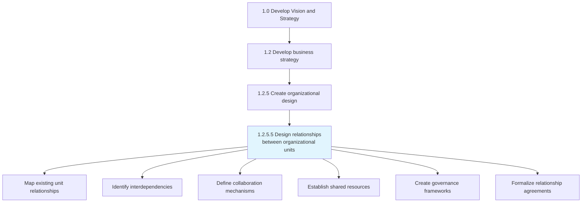

## Key Statistics

| Metric | Value |
|--------|-------|
| APQC Code | 10053 |
| Hierarchy ID | 1.2.5.5 |
| Level | Activity |
| Category | [Develop Vision and Strategy](/processes/01-Strategy) |
| Parent Process | [Create organizational design](./OrgDesign.mdx) |
| Related Units | All organizational units |

## Process Flow

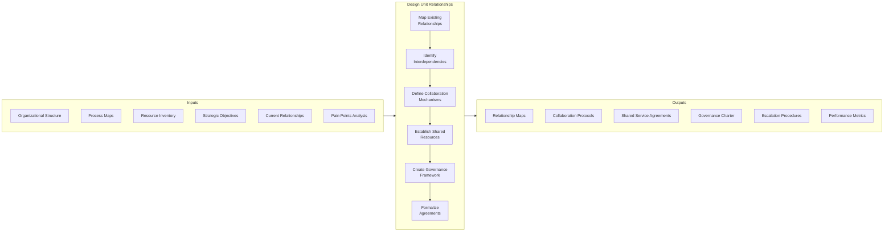

## GraphDL Semantic Structure

```
design.Relationships.between.OrganizationalUnits
```

| Component | Value | Description |
|-----------|-------|-------------|
| Verb | `design` | Primary action of creating and defining |
| Object | `Relationships` | The connections and dependencies |
| Preposition | `between` | Relationship context |
| PrepObject | `OrganizationalUnits` | The units being connected |

## Activities

### Map existing unit relationships

Documenting the current state of interactions, dependencies, and connections among organizational units.

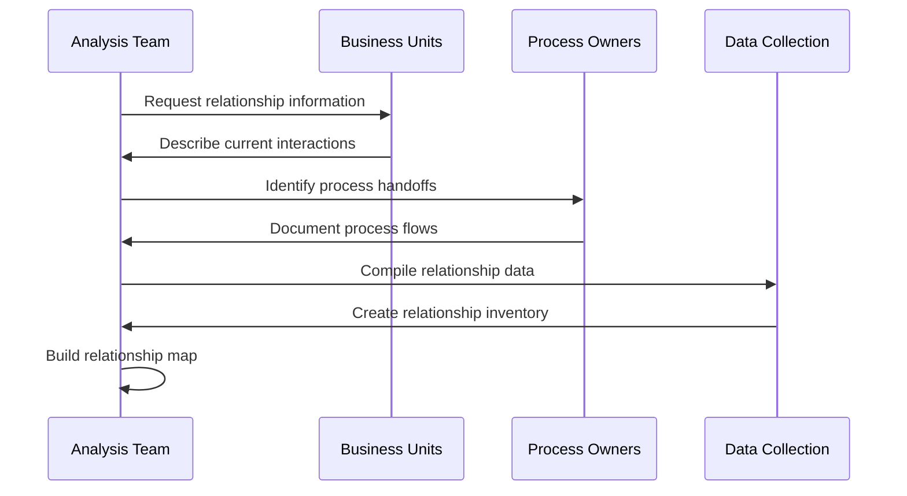

**Tasks:**
- `document.CurrentRelationships` - Record existing unit interactions
- `identify.ProcessHandoffs` - Map work flow between units
- `catalog.SharedResources` - List resources used across units
- `assess.RelationshipEffectiveness` - Evaluate current state quality
- `visualize.RelationshipNetwork` - Create relationship diagrams

### Identify interdependencies

Analyzing the dependencies between organizational units to understand how they rely on each other for inputs, outputs, and support.

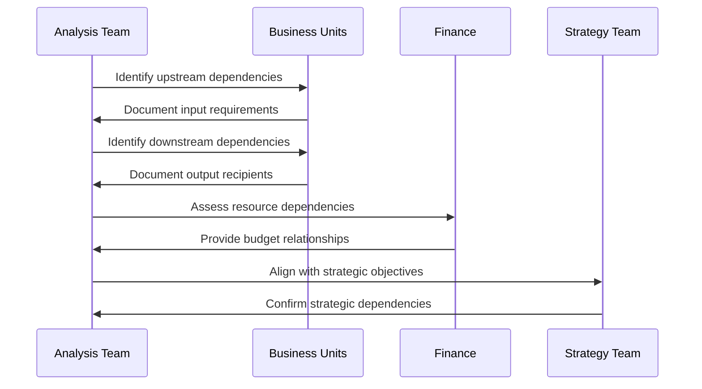

**Tasks:**
- `analyze.InputDependencies` - Identify what each unit needs from others
- `analyze.OutputDependencies` - Identify what each unit provides to others
- `map.ResourceDependencies` - Document shared resource requirements
- `assess.CriticalDependencies` - Identify high-impact relationships
- `document.DependencyMatrix` - Create comprehensive dependency view

### Define collaboration mechanisms

Establishing the structures, processes, and tools that enable organizational units to work together effectively.

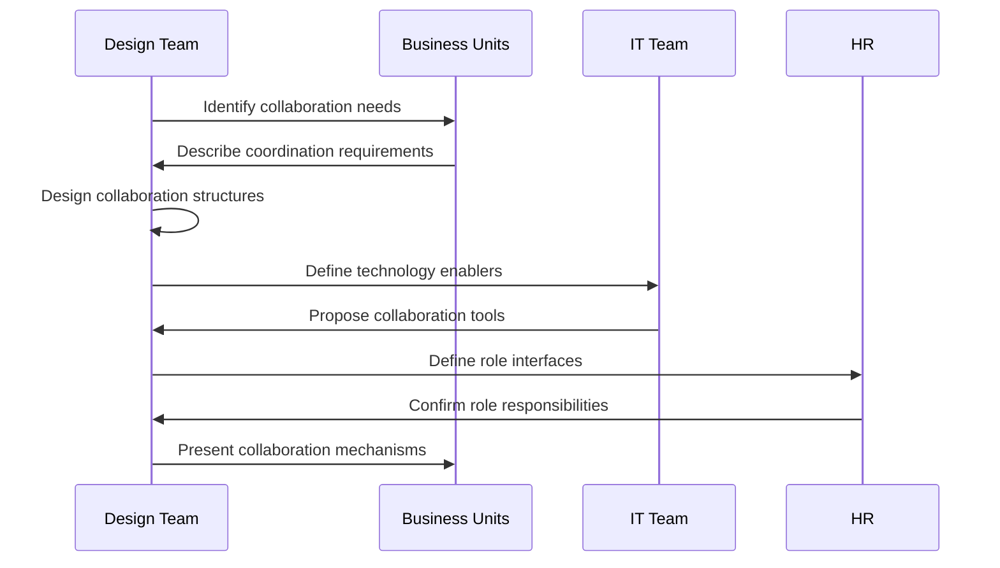

**Tasks:**
- `design.CoordinationStructures` - Create cross-unit coordination bodies
- `establish.CommunicationChannels` - Define how units communicate
- `define.DecisionRights` - Clarify joint decision-making authority
- `create.MeetingCadences` - Establish regular touchpoints
- `implement.CollaborationTools` - Deploy enabling technology

### Establish shared resources

Defining how resources, capabilities, and services are shared across organizational units to maximize efficiency and effectiveness.

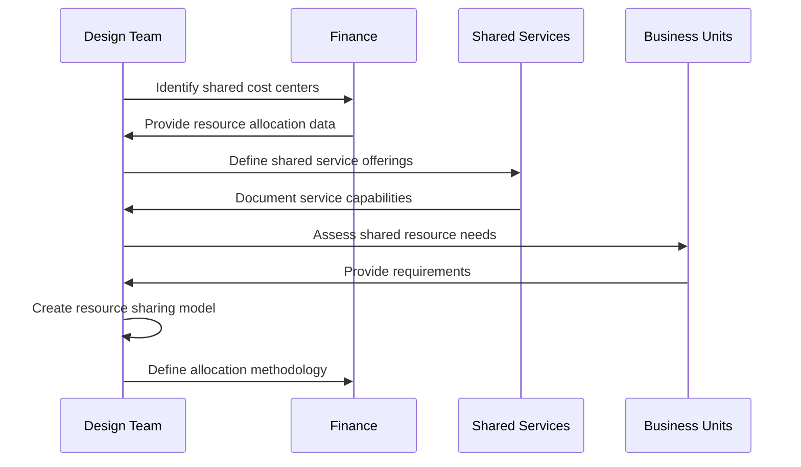

**Tasks:**
- `identify.SharedCapabilities` - Determine shareable resources
- `define.ServiceOfferings` - Document shared service catalog
- `create.AllocationModel` - Establish resource distribution rules
- `establish.CostSharing` - Define financial arrangements
- `document.ServiceLevels` - Create service level expectations

### Create governance frameworks

Establishing the decision-making structures, escalation procedures, and accountability mechanisms that govern inter-unit relationships.

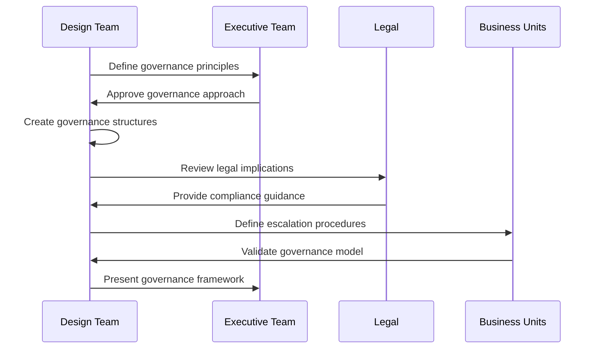

**Tasks:**
- `define.GovernancePrinciples` - Establish guiding principles
- `create.DecisionBoards` - Design cross-unit governance bodies
- `establish.EscalationPaths` - Define issue resolution procedures
- `assign.Accountabilities` - Clarify ownership and responsibility
- `document.GovernanceCharter` - Formalize governance framework

### Formalize relationship agreements

Creating formal documentation of inter-unit relationships, including service level agreements, operating level agreements, and collaboration charters.

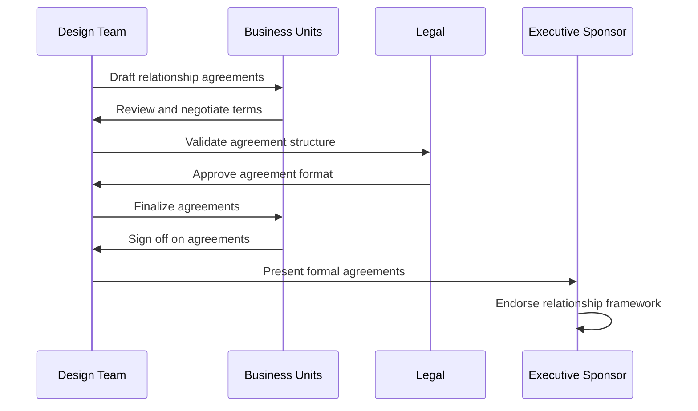

**Tasks:**
- `draft.ServiceAgreements` - Create service level agreements
- `develop.OperatingAgreements` - Define operating level agreements
- `create.CollaborationCharters` - Document collaboration commitments
- `establish.PerformanceMetrics` - Define success measures
- `formalize.Documentation` - Execute and archive agreements

## RACI Matrix

| Activity | Responsible | Accountable | Consulted | Informed |
|----------|-------------|-------------|-----------|----------|
| Map existing relationships | OD Team | CHRO | All Business Units | Executive Team |
| Identify interdependencies | Analysis Team | COO | Process Owners | Finance |
| Define collaboration mechanisms | Design Team | COO | IT, HR | All Units |
| Establish shared resources | Shared Services | CFO | Finance, Units | Executive Team |
| Create governance frameworks | Strategy Team | CEO | Legal, Units | Board |
| Formalize relationship agreements | OD Team | COO | Legal, Units | All Employees |

## Relationship Types

### Hierarchical Relationships

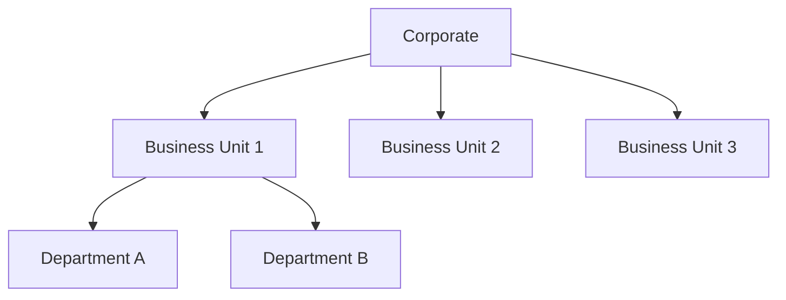

### Lateral Relationships


### Matrix Relationships

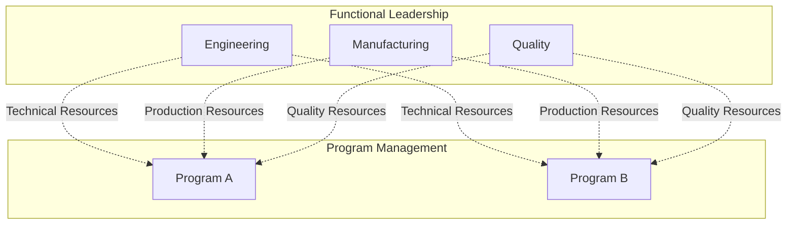

### Shared Services Relationships

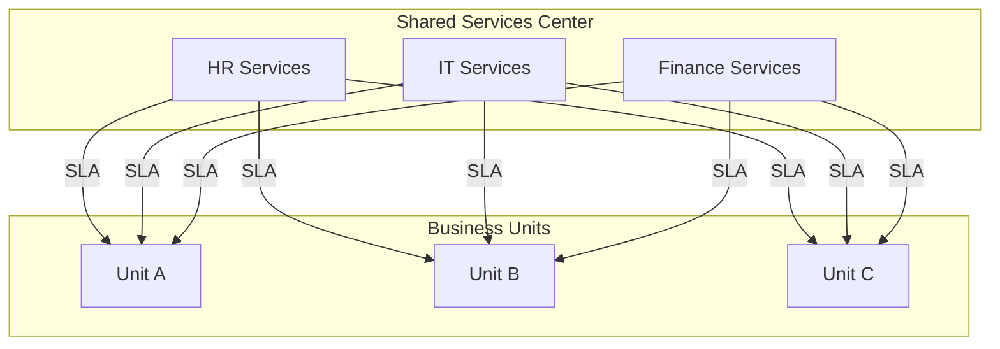

## Related Departments

- [Strategy & Planning](/departments/Strategy/index) - Strategic alignment of relationships
- [Human Resources](/departments/HR/index) - Organizational design ownership
- [Finance](/departments/Finance/index) - Resource allocation and cost sharing
- [Information Technology](/departments/Technology) - Collaboration technology
- [Legal](/departments/Legal/index) - Agreement formalization
- [All Business Units](/departments) - Relationship participants

## Related Occupations

- [Organizational Development Specialists](/occupations/OrgDevelopment) - Relationship design
- [Business Analysts](/occupations/BusinessAnalysts) - Dependency analysis
- [Project Managers](/occupations/ProjectManagers) - Cross-functional coordination
- [Management Analysts](/occupations/Business/Operations/ManagementAnalysts) - Governance consulting
- [Operations Managers](/occupations/Management/OperationsManagers) - Process integration

## Industry Variations

### Banking

Banking unit relationships must address regulatory boundaries, risk management coordination, and the three lines of defense model. Relationships between front office, middle office, and back office are particularly critical.

**Industry-Specific Activities:**
- Define relationships across lines of defense
- Establish risk committee coordination
- Create compliance reporting relationships
- Design audit committee interfaces

### Healthcare Provider

Healthcare unit relationships focus on clinical service integration, care coordination, and quality governance. Relationships between clinical and administrative units require special attention.

**Industry-Specific Activities:**
- Design clinical service line coordination
- Establish care team relationships
- Create quality committee governance
- Define medical staff-administration interface

### Aerospace and Defense

Aerospace unit relationships balance functional excellence with program execution. Matrix relationships between engineering disciplines and program management are fundamental.

**Industry-Specific Activities:**
- Design program-functional matrix relationships
- Establish engineering discipline coordination
- Create integrated product team structures
- Define supplier relationship governance

### Retail

Retail unit relationships connect headquarters functions with field operations. Relationships between merchandising, marketing, and store operations drive customer experience.

**Industry-Specific Activities:**
- Design headquarters-field relationships
- Establish merchandising-store coordination
- Create omnichannel integration governance
- Define vendor relationship structures

## Sub-Tasks

| Task | Description |
|------|-------------|
| Dependency Mapping | Document unit dependencies and interactions |
| Collaboration Design | Create mechanisms for cross-unit work |
| Resource Sharing | Define shared resource arrangements |
| Governance Creation | Establish decision-making structures |
| Agreement Formalization | Document formal relationship agreements |
| Performance Monitoring | Define relationship success metrics |

## Related Processes

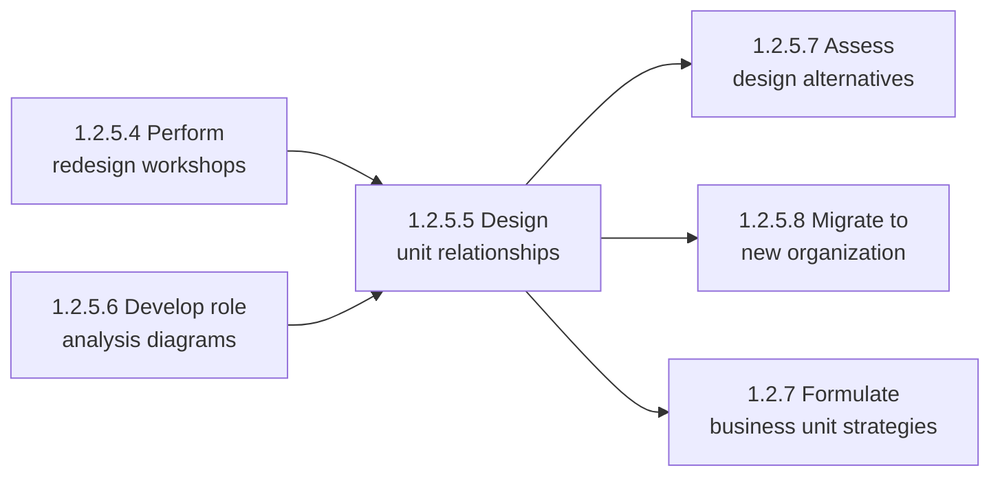

## Metrics & KPIs

| Metric | Description | Target |
|--------|-------------|--------|
| Cross-unit Collaboration Score | Effectiveness of inter-unit work | >4.0/5.0 |
| Dependency Resolution Time | Time to resolve cross-unit issues | <24 hours |
| Shared Resource Utilization | Efficiency of shared resources | >80% |
| Governance Effectiveness | Decision-making quality and speed | >85% satisfaction |
| Agreement Compliance | Adherence to relationship agreements | >95% |
| Escalation Frequency | Number of escalations required | Decreasing trend |

---

*Source: APQC PCF 10053 (1.2.5.5) - Cross-Industry*
